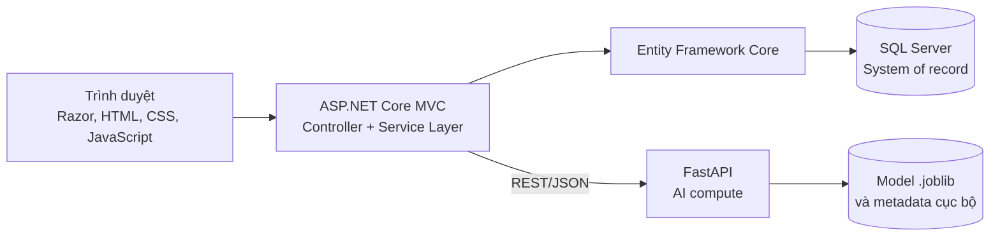

# Hệ thống quản lý dự án tích hợp AI phân tích nguyên nhân trễ

Hệ thống hỗ trợ quản lý nhân sự, team, dự án, công việc, tiến độ, ngân sách, đánh giá và trao đổi nội bộ. Thành phần AI dùng dữ liệu nghiệp vụ đã được xác nhận để **gợi ý nguyên nhân khiến dự án bị trễ**; AI không tự quyết định nguyên nhân thực tế và không thay thế người quản lý. Quyết định cuối cùng được người quản lý xem xét, xác nhận và lưu tại ứng dụng MVC.

## Mục lục

- [Chức năng chính](#chức-năng-chính)
- [Vai trò và phạm vi sử dụng](#vai-trò-và-phạm-vi-sử-dụng)
- [Kiến trúc hệ thống](#kiến-trúc-hệ-thống)
- [Cấu trúc repository](#cấu-trúc-repository)
- [Công nghệ](#công-nghệ)
- [Workflow nghiệp vụ](#workflow-nghiệp-vụ)
- [AI phân tích nguyên nhân trễ](#ai-phân-tích-nguyên-nhân-trễ)
- [REST API của FastAPI](#rest-api-của-fastapi)
- [Cài đặt và chạy](#cài-đặt-và-chạy)
- [Cấu hình](#cấu-hình)
- [Kiểm tra hoạt động](#kiểm-tra-hoạt-động)
- [Lưu ý triển khai](#lưu-ý-triển-khai)
- [Tài liệu liên quan](#tài-liệu-liên-quan)
- [Hạn chế hiện tại](#hạn-chế-hiện-tại)

## Chức năng chính

Source hiện tại triển khai các nhóm chức năng sau:

- Đăng nhập bằng cookie, đăng xuất, quên/đặt lại mật khẩu, kích hoạt và gửi lại email kích hoạt tài khoản.
- Quản lý nhân sự, chức danh, trạng thái tài khoản và hồ sơ cá nhân.
- Quản lý ba role hệ thống, permission claim và các ràng buộc phụ thuộc giữa quyền.
- Quản lý team, thành viên team, team tham gia dự án và thành viên dự án.
- Quản lý dự án, tệp dự án, trạng thái và yêu cầu đổi người quản lý.
- Quản lý danh mục công việc, công việc, chi tiết công việc và phân công ở cả hai cấp.
- Gửi, duyệt, yêu cầu bổ sung hoặc từ chối báo cáo tiến độ; quản lý tệp minh chứng.
- Đề xuất, hủy, duyệt hoặc từ chối công việc và ngân sách.
- Theo dõi ngân sách, phiên bản ngân sách, chi phí và nhật ký liên quan.
- Đánh giá dự án và đánh giá nhân viên theo quy trình nháp–duyệt.
- Phòng chat theo dự án, đồng bộ thành viên và lưu lịch sử tin nhắn.
- Dashboard, thống kê, phân trang và xuất PDF/CSV/Excel.
- Tổng hợp và kiểm tra chất lượng `AI_DATASET`.
- Huấn luyện, kiểm tra, so sánh, kích hoạt, reload và quản lý model cục bộ.
- Phân tích nguyên nhân trễ, lưu gợi ý vào `AI_KET_QUA` và để người quản lý xác nhận nguyên nhân thực tế trong `AI_NGUYEN_NHAN`.

## Vai trò và phạm vi sử dụng

| Vai trò | Phạm vi khái quát |
|---|---|
| `Admin` | Quản trị tài khoản, role/claim, danh mục hệ thống và các chức năng quản trị được cấp. Một số thao tác nghiệp vụ như gửi tiến độ hoặc gửi đề xuất bị chặn theo rule. |
| `Manager` | Quản lý dự án trong phạm vi phụ trách; duyệt nghiệp vụ, đánh giá và xem xét/xác nhận kết quả AI khi có quyền tương ứng. |
| `Employee` | Tham gia team/dự án, thực hiện công việc được phân công, báo cáo tiến độ, gửi đề xuất và trao đổi trong phạm vi được phép. |

`Leader` không phải role hệ thống độc lập. Đây là vai trò theo dữ liệu team hoặc dự án (`IsLeader`, vai trò `Leader`) và được service dùng để giới hạn phạm vi tác nghiệp.

Một thao tác có thể đồng thời chịu kiểm soát bởi:

- role đăng nhập;
- claim dạng `permission`;
- phạm vi dự án người dùng được xem hoặc quản lý;
- team phụ trách và trạng thái leader;
- quan hệ quản lý dự án, thành viên dự án hoặc người được phân công;
- trạng thái hiện tại của đối tượng trong workflow.

Danh mục quyền chuẩn nằm tại [`QuanLyDuAn/QuanLyDuAn/Constants/Permissions.cs`](QuanLyDuAn/QuanLyDuAn/Constants/Permissions.cs). Các nhóm chính bao phủ nhân sự/phân quyền, team/dự án, công việc/phân công/tiến độ, đề xuất/ngân sách, đánh giá, chat, thống kê và AI.

## Kiến trúc hệ thống



- Razor Views và tài nguyên trong `wwwroot` cung cấp giao diện.
- Controller điều phối request; Service Layer thực thi business rule, scope, workflow và transaction.
- Entity Framework Core truy cập SQL Server trực tiếp; dự án không có repository layer riêng.
- MVC là **system-of-record**: kiểm soát xác thực, phân quyền, workflow, transaction, tổng hợp dữ liệu và toàn bộ ghi dữ liệu nghiệp vụ/AI vào SQL Server.
- FastAPI là tiến trình độc lập chỉ thực hiện validate dataset, train/test, quản lý file model cục bộ và phân tích AI.
- FastAPI không kết nối và không ghi trực tiếp vào các bảng nghiệp vụ SQL Server. Kết quả REST chỉ được lưu sau khi MVC kiểm tra.

## Cấu trúc repository

```text
repository/
├── QuanLyDuAn/
│   ├── QuanLyDuAn.sln
│   └── QuanLyDuAn/
│       ├── Controllers/
│       ├── Services/
│       │   ├── Interfaces/
│       │   └── Implementations/
│       ├── Models/Entities/
│       ├── ViewModels/
│       ├── Data/
│       ├── Constants/
│       ├── Migrations/
│       ├── Views/
│       └── wwwroot/
├── QuanLyDuAnAIService/
│   ├── app/
│   │   ├── ml/
│   │   ├── routers/
│   │   └── services/
│   ├── models/
│   ├── sample_data/
│   ├── requirements.txt
│   └── run.py
├── docs/
├── uml/
├── QuanLyDuAn6.sql
├── quanlyduan.sql
├── các script dữ liệu SQL khác
└── README.md
```

Các thư mục `bin`, `obj`, `__pycache__`, log, model và upload hiện có là artifact runtime/dữ liệu cục bộ, không phải lớp kiến trúc mới.

## Công nghệ

| Thành phần | Công nghệ/phiên bản xác nhận từ source |
|---|---|
| Web | .NET 8, ASP.NET Core MVC, Razor Views |
| ORM/Identity | Entity Framework Core 8.0.11, ASP.NET Core Identity EF Core 8.0.11 |
| CSDL | Microsoft SQL Server |
| Frontend | Bootstrap 5.1.0, jQuery, JavaScript, CSS |
| AI API | Python, FastAPI, Uvicorn, Pydantic |
| Xử lý dữ liệu/ML | pandas, NumPy, scikit-learn, joblib |
| Thuật toán | `DecisionTreeClassifier` cho phân loại nguyên nhân trễ |
| Tích hợp | REST API/JSON qua typed `HttpClient` |
| Xuất dữ liệu | ClosedXML 0.105.0, QuestPDF 2024.12.1, CSV |
| Email | SMTP qua `System.Net.Mail`, cấu hình hiện tại hướng tới Gmail SMTP |

`requirements.txt` không khóa phiên bản Python hoặc phiên bản package Python; vì vậy README không giả định các phiên bản này.

## Workflow nghiệp vụ

Mã trạng thái chuẩn được tập trung tại [`TrangThai.cs`](QuanLyDuAn/QuanLyDuAn/Constants/TrangThai.cs); logic đồng bộ nằm chủ yếu trong `TrangThaiWorkflowService`.

### Dự án

Luồng chính:

```text
Khởi tạo → Đang thực hiện → Chờ xác nhận hoàn thành → Hoàn thành
```

- Dự án tự chuyển `KhoiTao → DangThucHien` khi đã có thành viên, danh mục công việc và công việc.
- Yêu cầu hoàn thành chỉ hợp lệ khi các điều kiện hoàn thành được service kiểm tra đạt.
- Xác nhận hoàn thành kiểm tra lại điều kiện trước khi chuyển sang `HoanThanh`.
- Dự án đang thực hiện có thể chuyển sang `TamDung`; dự án hoàn thành không được tạm dừng.
- Dự án hoàn thành có thể mở lại về `DangThucHien`, bắt buộc có lý do và ghi nhật ký.
- Source có các trạng thái khóa `DaHuy` và lưu trữ `Archived`; các module dùng chúng để chặn thao tác không phù hợp.

### Công việc và chi tiết công việc

- Trạng thái công việc được tính từ các chi tiết: không có chi tiết → `ChuaBatDau`; có chi tiết bị cản → `BiCanCan`; còn công việc đang làm → `DangThucHien`; tất cả chi tiết hoàn tất → `ChoXacNhanHoanThanh`.
- Công việc không tự chuyển thẳng sang `HoanThanh`. Người có thẩm quyền phải xác nhận từ `ChoXacNhanHoanThanh`.
- Công việc hoàn thành có thể mở lại về `DangThucHien` khi đúng quyền và có lý do.
- Thay đổi chi tiết công việc hoặc duyệt tiến độ sẽ đồng bộ chuỗi `CT_CONG_VIEC → CONG_VIEC → DU_AN`.

### Tiến độ

1. Nhân viên gửi báo cáo; bản ghi mới luôn ở `ChoDuyet` và chưa thay đổi trạng thái thật của chi tiết.
2. Người có quyền/scope chọn `DaDuyet`, `YeuCauBoSung` hoặc `TuChoi`.
3. Chỉ nhánh `DaDuyet` mới cập nhật `CT_CONG_VIEC.TrangThaiCTCV`.
4. Service đồng bộ lại công việc và dự án trong chuỗi workflow.

Tệp minh chứng tiến độ chấp nhận PDF, Word, Excel, PNG/JPEG hoặc ZIP, tối đa 10 MB mỗi tệp. Đề xuất hoàn thành phải đáp ứng rule tệp minh chứng của service.

### Đề xuất công việc và ngân sách

- Người dùng phù hợp với phạm vi thành viên/team/leader gửi đề xuất ở `ChoDuyet`; người tạo có thể hủy khi còn chờ.
- Người quản lý có quyền duyệt chuyển đề xuất sang `DaDuyet`, hoặc từ chối sang `TuChoi`.
- Duyệt đề xuất công việc tạo công việc thật và chi phí liên quan; service kiểm tra ngân sách khả dụng và chống đề xuất chờ bị trùng.
- Duyệt đề xuất ngân sách tạo phiên bản ngân sách mới đang hoạt động, chuyển ngân sách cũ sang `DaThayThe`; số đề xuất không được thấp hơn chi phí đã sử dụng.
- Các nhánh duyệt quan trọng chạy trong transaction mức `Serializable`.

### Đánh giá

Cả đánh giá dự án và đánh giá nhân viên dùng luồng:

```text
Nháp → Chờ duyệt → Đã duyệt hoặc Từ chối
```

Quyền tạo/sửa/gửi/duyệt còn phụ thuộc phạm vi dự án và trạng thái đối tượng. Màn hình đánh giá dự án có thể hiển thị dữ liệu AI hỗ trợ, nhưng gợi ý AI không tự trở thành kết luận đánh giá.

## AI phân tích nguyên nhân trễ

Luồng AI hiện tại tập trung vào **phân loại nguyên nhân của dự án đã được MVC xác định là trễ**, không phải tự động dự báo một dự án tương lai có trễ hay không.

1. MVC tổng hợp dữ liệu nghiệp vụ thành snapshot `AI_DATASET`.
2. MVC xác định `LaDuAnTre` bằng business rule và mốc thời gian thực tế.
3. Người quản lý xác nhận nguyên nhân thực tế; MVC lưu vào `AI_NGUYEN_NHAN`.
4. Nhãn xác nhận được đồng bộ về `AI_DATASET.MaDMNguyenNhan`.
5. MVC lọc dữ liệu đủ điều kiện rồi gửi payload sang FastAPI để validate/huấn luyện.
6. Khi phân tích dự án trễ, MVC lấy snapshot mới nhất và gửi vector 22 đặc trưng cùng danh mục nguyên nhân.
7. FastAPI trả nguyên nhân gợi ý, độ tin cậy, nguồn kết quả và thông tin giải thích.
8. MVC hậu kiểm kết quả và lưu gợi ý vào `AI_KET_QUA`.
9. Người quản lý xem xét rồi xác nhận nguyên nhân cuối cùng.

`AI_KET_QUA` là output dự đoán và **không được dùng làm ground truth**. Ground truth huấn luyện chỉ đến từ nguyên nhân do người quản lý xác nhận trong `AI_NGUYEN_NHAN`.

Model hiện tại là `DecisionTreeClassifier`. Nếu model chưa sẵn sàng, gặp lỗi, có độ tin cậy dưới ngưỡng hoặc trả nguyên nhân mâu thuẫn với dữ liệu, hệ thống chuyển sang `RuleFallback`. Đây vẫn chỉ là gợi ý.

### Contract 22 đặc trưng

Các nhóm đặc trưng:

- Tiến độ, chi phí và nhân sự: 10 đặc trưng nền tảng.
- Đề xuất công việc: 3 đặc trưng.
- Đề xuất ngân sách: 3 đặc trưng.
- Báo cáo tiến độ: 6 đặc trưng.

<details>
<summary>Danh sách đầy đủ 22 đặc trưng</summary>

**Tiến độ, chi phí và nhân sự**

1. `SoNhanVienDuAn`
2. `TongSoCongViec`
3. `SoCongViecTre`
4. `TyLeCongViecTre`
5. `ChiPhiDuKien`
6. `ChiPhiThucTe`
7. `ChenhLechChiPhi`
8. `SoLanThayDoiNhanSu`
9. `SoLanThayDoiQuanLy`
10. `SoNgayTreTienDo`

**Đề xuất công việc**

11. `SoDeXuatCongViecChoDuyet`
12. `SoDeXuatCongViecBiTuChoi`
13. `ThoiGianDuyetCongViecTrungBinh`

**Đề xuất ngân sách**

14. `SoDeXuatNganSachChoDuyet`
15. `SoDeXuatNganSachBiTuChoi`
16. `ThoiGianDuyetNganSachTrungBinh`

**Báo cáo tiến độ**

17. `SoBaoCaoTienDoChoDuyet`
18. `SoBaoCaoTienDoBiTuChoi`
19. `SoBaoCaoTienDoYeuCauBoSung`
20. `TyLeBaoCaoTienDoBiTuChoi`
21. `SoLanCapNhatTienDo`
22. `SoNgayChamCapNhatTienDo`

</details>

### Điều kiện huấn luyện

MVC và FastAPI cùng áp dụng:

- chỉ dùng dòng `LaDuAnTre = 1`;
- `MaDMNguyenNhan` phải là mã dương hợp lệ;
- đủ cả 22 đặc trưng bắt buộc;
- mỗi lớp nguyên nhân cần ít nhất 5 mẫu; lớp chưa đủ tiếp tục được tích lũy và không tham gia lần train đó;
- sau lọc cần ít nhất 30 dòng và ít nhất 2 lớp đủ điều kiện.

Các ngưỡng mặc định tương ứng là `MIN_REASON_TRAIN_ROWS=30`, `MIN_REASON_CLASS_COUNT=2`, `MIN_REASON_ROWS_PER_CLASS=5`.

## REST API của FastAPI

Các endpoint dưới đây tồn tại trong router và được `AiApiService` của MVC sử dụng:

| Nhóm | Endpoint | Mục đích |
|---|---|---|
| Health | `GET /health` | Trạng thái service và model nguyên nhân đang nạp |
| Dataset | `POST /dataset/validate` | Kiểm tra schema và điều kiện dataset |
| Dataset | `POST /admin/dataset/quality-report` | Báo cáo chất lượng dataset |
| Dataset | `POST /admin/model/train-recommendation` | Khuyến nghị khả năng huấn luyện |
| Model | `POST /model/train` | Huấn luyện model nguyên nhân |
| Model | `GET /model/list` | Liệt kê model |
| Model | `GET /admin/model/{modelFile}` | Xem metadata/chi tiết model |
| Model | `POST /admin/model/validate` | Kiểm tra file model |
| Model | `POST /admin/model/compare` | So sánh model |
| Model | `POST /admin/model/set-active` | Kích hoạt model |
| Model | `POST /admin/model/reload` | Nạp lại model đang hoạt động |
| Model | `DELETE /admin/model/{modelFile}` | Xóa model cục bộ |
| Model | `GET /admin/model/export-metadata/{modelFile}` | Xuất metadata |
| Phân tích | `POST /analyze/delay-reason` | Phân tích nguyên nhân trễ |
| Kiểm thử | `POST /admin/model/test-reason` | Kiểm thử dự đoán mà không ghi nghiệp vụ |

Các endpoint `GET /admin/ai-status`, `GET /admin/system-info` và `GET /admin/logs/summary` phục vụ trang quản trị AI.

Alias tương thích cũ:

- `POST /predict/project` → `/analyze/delay-reason`;
- `POST /admin/model/test-predict` → `/admin/model/test-reason`.

Swagger/OpenAPI mặc định của FastAPI có tại `/docs` khi service đang chạy.

## Cài đặt và chạy

### Yêu cầu môi trường

- Windows, Linux hoặc macOS có thể chạy .NET 8, Python và SQL Server có thể truy cập; repository hiện được phát triển với đường dẫn/lệnh PowerShell trên Windows.
- .NET SDK 8.
- Microsoft SQL Server.
- Python có hỗ trợ các package trong `requirements.txt`; repository không khóa phiên bản Python.
- `pip` và trình duyệt web.
- Visual Studio, VS Code hoặc SQL Server Management Studio chỉ là công cụ tùy chọn.

### 1. Clone repository

```bash
git clone <repository-url>
cd QuanLyDuAnAI
```

### 2. Chuẩn bị cơ sở dữ liệu

Chọn **một** cách phù hợp với môi trường:

- Chạy [`QuanLyDuAn6.sql`](QuanLyDuAn6.sql) trên SQL Server để khôi phục snapshot schema/dữ liệu mới nhất đang có trong repository. Script chứa `USE [QuanLyDuAnAI6]`; hãy tạo database tương ứng hoặc điều chỉnh tên database khi triển khai sang môi trường khác.
- Hoặc tạo database trống, cấu hình connection string rồi áp dụng migration hiện có:

```powershell
dotnet tool install --global dotnet-ef
dotnet ef database update --project .\QuanLyDuAn\QuanLyDuAn\QuanLyDuAn.csproj
```

Không chạy chồng các script seed/demo lớn nếu chưa kiểm tra nội dung và mục đích của chúng.

### 3. Cấu hình MVC

Đặt connection string, SMTP và URL ứng dụng bằng `appsettings.Development.json`, biến môi trường hoặc .NET User Secrets. Không commit secret.

```powershell
dotnet user-secrets set "ConnectionStrings:DefaultConnection" "Server=localhost;Database=QuanLyDuAnAI6;Trusted_Connection=True;TrustServerCertificate=True" --project .\QuanLyDuAn\QuanLyDuAn\QuanLyDuAn.csproj
dotnet user-secrets set "EmailSettings:SenderEmail" "no-reply@example.com" --project .\QuanLyDuAn\QuanLyDuAn\QuanLyDuAn.csproj
dotnet user-secrets set "EmailSettings:Username" "smtp-user" --project .\QuanLyDuAn\QuanLyDuAn\QuanLyDuAn.csproj
dotnet user-secrets set "EmailSettings:AppPassword" "<smtp-app-password>" --project .\QuanLyDuAn\QuanLyDuAn\QuanLyDuAn.csproj
```

`AccountActivation:AppBaseUrl` phải là URL HTTP/HTTPS tuyệt đối và không được là localhost/loopback; ứng dụng validate điều kiện này ngay khi khởi động.

### 4. Khôi phục và build MVC

```powershell
dotnet restore .\QuanLyDuAn\QuanLyDuAn.sln
dotnet build .\QuanLyDuAn\QuanLyDuAn.sln
```

### 5. Tạo môi trường Python

```powershell
cd .\QuanLyDuAnAIService
python -m venv .venv
.\.venv\Scripts\Activate.ps1
python -m pip install --upgrade pip
pip install -r requirements.txt
```

Trên Linux/macOS, kích hoạt bằng `source .venv/bin/activate`.

### 6. Chạy FastAPI

Từ thư mục `QuanLyDuAnAIService`:

```powershell
python run.py
```

Lệnh tương đương:

```powershell
uvicorn app.main:app --host 0.0.0.0 --port 8001 --reload
```

### 7. Chạy MVC

Mở terminal khác tại thư mục gốc:

```powershell
dotnet run --project .\QuanLyDuAn\QuanLyDuAn\QuanLyDuAn.csproj --launch-profile http
```

Profile hiện tại lắng nghe tại `http://0.0.0.0:5037`; trên máy cục bộ truy cập `http://localhost:5037`.

Khi khởi động, MVC bảo đảm danh mục bắt buộc, ba role và tài khoản quản trị phát triển tồn tại. Xem lưu ý tài khoản mặc định bên dưới.

## Cấu hình

### MVC

Ví dụ chỉ chứa giá trị mẫu và đúng tên key source đang đọc:

```json
{
  "ConnectionStrings": {
    "DefaultConnection": "Server=localhost;Database=QuanLyDuAnAI6;Trusted_Connection=True;TrustServerCertificate=True"
  },
  "AiApi": {
    "BaseUrl": "http://127.0.0.1:8001",
    "TimeoutSeconds": 10,
    "RetryCount": 1,
    "RetryDelayMilliseconds": 300
  },
  "EmailSettings": {
    "SmtpServer": "smtp.example.com",
    "Port": 587,
    "SenderEmail": "no-reply@example.com",
    "SenderName": "QuanLyDuAn AI",
    "Username": "smtp-user",
    "AppPassword": "<secret>"
  },
  "AccountActivation": {
    "TokenLifetimeHours": 24,
    "ResendCooldownSeconds": 60,
    "AppBaseUrl": "https://project.example.com"
  }
}
```

Tệp dự án, tệp tiến độ và avatar được lưu dưới `wwwroot/uploads`. Đây là đường dẫn do service xây dựng, không có key cấu hình riêng trong `appsettings`.

### FastAPI

FastAPI đọc `.env` hoặc biến môi trường:

```dotenv
MODEL_DIR=models
DEFAULT_REASON_MODEL_ALIAS=reason_active.joblib
ALLOW_ORIGINS=http://localhost:5037
MIN_REASON_TRAIN_ROWS=30
MIN_REASON_CLASS_COUNT=2
MIN_REASON_ROWS_PER_CLASS=5
REASON_CONFIDENCE_THRESHOLD=0.6
HIGH_DELAY_RATIO_THRESHOLD=0.2
HIGH_COST_OVERRUN_THRESHOLD=0.15
HIGH_STAFF_CHANGE_THRESHOLD=2
HIGH_MANAGER_CHANGE_THRESHOLD=1
```

`MODEL_DIR` tương đối được tính từ thư mục `QuanLyDuAnAIService`.

### Tài khoản mặc định

Runtime seed có tạo tài khoản quản trị phát triển và đánh dấu email đã xác nhận. README cố ý không công khai mật khẩu seed. Hãy đặt lại mật khẩu bằng quy trình quản trị/quên mật khẩu và thay mọi thông tin phát triển trước khi triển khai. Tài khoản nhân sự tạo qua giao diện sử dụng token kích hoạt email theo thời hạn và thời gian chờ gửi lại đã cấu hình.

## Kiểm tra hoạt động

1. Kiểm tra FastAPI:

   ```powershell
   Invoke-RestMethod http://127.0.0.1:8001/health
   ```

   Response thành công phải có trạng thái `healthy`; trường model có thể rỗng nếu chưa có model hợp lệ.

2. Mở `http://localhost:5037`. Nếu ứng dụng khởi động qua bước seed và hiển thị trang đăng nhập/dashboard sau xác thực, MVC đã kết nối được SQL Server.
3. Trong module quản trị AI, kiểm tra health/status để xác nhận MVC gọi được `AiApi:BaseUrl`.
4. Kiểm tra danh sách model hoặc metadata `reason_active.joblib`. Có file model chưa đủ để kết luận đang dùng; `/health` phải cho biết model nguyên nhân đã nạp.
5. Nếu nút train bị khóa hoặc API từ chối, xem quality report: cần tối thiểu 30 dòng sau lọc, 2 lớp và 5 mẫu/lớp, đủ 22 đặc trưng, `LaDuAnTre=1` và nhãn xác nhận hợp lệ.
6. Phân tích thử chỉ hợp lệ cho dự án được MVC xác định là trễ; thao tác test không ghi `AI_KET_QUA`.

## Lưu ý triển khai

- Không để connection string có mật khẩu, SMTP password, token hoặc secret trong repository; dùng secret store/biến môi trường.
- Chạy MVC và FastAPI thành hai tiến trình/service riêng; đặt HTTPS hoặc reverse proxy phía trước khi triển khai thật.
- Cấu hình `ALLOW_ORIGINS` của FastAPI đúng origin MVC. CORS hiện cho phép credentials, mọi method và header cho danh sách origin đã cấu hình.
- Bảo đảm tài khoản chạy FastAPI có quyền đọc/ghi `MODEL_DIR`; sao lưu model và metadata theo chính sách vận hành.
- Sao lưu SQL Server định kỳ và kiểm thử quy trình phục hồi.
- Không phục vụ upload như nội dung thực thi. Giới hạn hiện có: avatar JPG/JPEG/PNG/WEBP tối đa 2 MB; tệp minh chứng tiến độ thuộc danh sách cho phép, tối đa 10 MB. `FileDuAnService` hiện không áp dụng cùng whitelist/dung lượng, vì vậy reverse proxy và hạ tầng triển khai cần bổ sung giới hạn/bảo vệ thư mục upload.
- FastAPI không có quyền ghi SQL Server; không đưa connection string nghiệp vụ vào service AI.
- `AccountActivation:AppBaseUrl` phải là địa chỉ người nhận email truy cập được và không phải loopback.

## Tài liệu liên quan

- [Workflow hệ thống](docs/workflow-he-thong.md)
- [Quy tắc tích hợp MVC và FastAPI](docs/mvc-ai-integration-rules.md)
- [Phân tích hệ thống AI](docs/ai-he-thong-phan-tich.md)
- [Review luồng AI dataset](docs/ai-dataset-flow-review.md)
- [Phân tích huấn luyện model nguyên nhân trễ](docs/huanluyenmodelnguyennhantre.md)
- [Phân tích chức năng nguyên nhân trễ](docs/phantichnguyennhantre.md)
- [Phân quyền](docs/phanquyen.md)
- [Hướng dẫn cài đặt](docs/HuongDanCaiDat.md)
- [Mô tả cơ sở dữ liệu](docs/motacsdl.md)

Source và contract hiện tại luôn được ưu tiên nếu tài liệu lịch sử chưa kịp đồng bộ.

## Hạn chế hiện tại

- Chất lượng gợi ý phụ thuộc số lượng, độ đầy đủ và độ cân bằng của nhãn nguyên nhân đã được người quản lý xác nhận.
- Chỉ các dự án đáp ứng business rule trễ mới đi vào luồng phân tích nguyên nhân; lớp nguyên nhân chưa đủ 5 mẫu chỉ được tích lũy.
- Kết quả AI và `RuleFallback` đều là gợi ý, không phải quyết định tự động.
- Chat lưu và tải tin nhắn qua MVC/SQL Server; source chưa cấu hình SignalR nên không phải chat thời gian thực dạng push.
- Package Python chưa được khóa phiên bản, do đó môi trường production cần kiểm thử và cố định dependency riêng.
- Vận hành email, SQL Server, thư mục upload và model cần cấu hình hạ tầng bên ngoài repository.
