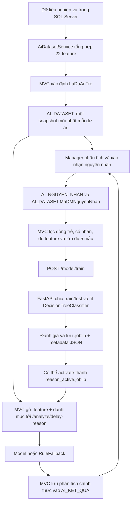

# Giải thích AI phân tích nguyên nhân trễ dự án

> Tài liệu phục vụ bảo vệ khóa luận, được kiểm chứng theo source hiện hành ngày 02/07/2026. Khi tài liệu cũ và source mâu thuẫn, tài liệu này dùng source runtime làm chuẩn. AI ở đây là công cụ **gợi ý**, không phải chủ thể ra quyết định.

## Mục lục

1. [Tổng quan](#1-tổng-quan-ai-của-đề-tài)
2. [Luồng dữ liệu đầu cuối](#2-luồng-dữ-liệu-ai-đầu-cuối)
3. [Cách tạo AI_DATASET](#3-dữ-liệu-được-đưa-vào-ai_dataset)
4. [22 đặc trưng](#4-toàn-bộ-22-đặc-trưng-đầu-vào)
5. [Nhãn và danh mục nguyên nhân](#5-nhãn-đầu-ra-và-danh-mục-nguyên-nhân)
6. [Điều kiện train](#6-điều-kiện-một-dòng-được-phép-train)
7. [Chia train/test](#7-cách-chia-train-và-test)
8. [Decision Tree](#8-cây-quyết-định-đang-dùng)
9. [Các chỉ số đánh giá](#9-accuracy-precision-recall-f1-và-confusion-matrix)
10. [Model active hiện hành](#10-model-active-hiện-hành)
11. [Accuracy và confidence](#11-phân-biệt-accuracy-và-confidence)
12. [Threshold và RuleFallback](#12-ngưỡng-tin-cậy-và-rulefallback)
13. [Contract MVC–FastAPI](#13-requestresponse-giữa-mvc-và-fastapi)
14. [Ví dụ một dự án](#14-cách-phân-tích-một-dự-án-cụ-thể)
15. [Feature importance](#15-feature-importance-và-khả-năng-giải-thích)
16. [Vòng đời model](#16-model-lifecycle)
17. [Những điều không được nói sai](#17-những-điều-không-được-nói-sai)
18. [Câu hỏi bảo vệ](#18-bộ-câu-hỏi-và-trả-lời-bảo-vệ)
19. [Hạn chế](#19-hạn-chế-hiện-tại)
20. [Đối chiếu tài liệu cũ](#20-đối-chiếu-source-và-tài-liệu-cũ)
21. [Truy vết nguồn](#21-bảng-truy-vết-nguồn)

## 1. Tổng quan AI của đề tài

Hệ thống giải bài toán **phân loại nhiều lớp, một nhãn cho mỗi mẫu**: với một dự án đã được nghiệp vụ xác định là trễ, model chọn một mã nguyên nhân chính trong danh mục. Đầu vào là 22 số tổng hợp về công việc, tiến độ, chi phí, nhân sự, đề xuất và báo cáo; đầu ra là mã/tên nguyên nhân gợi ý, confidence, nguồn kết quả, cảnh báo và giải thích.

AI **không dự đoán dự án có trễ hay không**. `LaDuAnTre` do `AiDatasetService.XacDinhDuAnTre` của MVC xác định bằng quy tắc thời hạn và trạng thái. AI chỉ phân tích nguyên nhân khi ngữ cảnh MVC cho phép và, với phân tích chính thức, dataset mới nhất có `LaDuAnTre=true`.

- MVC là **system-of-record**: kiểm tra quyền và nghiệp vụ, tổng hợp feature, quyết định trễ, đọc/ghi SQL Server.
- FastAPI là **compute-only**: kiểm tra payload, train, lưu artifact `.joblib`/JSON cục bộ và suy luận. Source FastAPI không dùng `DbContext` và không tự ghi bảng nghiệp vụ.
- `AI_KET_QUA` lưu gợi ý của model hoặc luật; nó không phải sự thật dùng để train.
- `AI_NGUYEN_NHAN` lưu nguyên nhân do Manager hiện tại của dự án xác nhận; đây mới là ground truth. `AiService.XacNhanNguyenNhanAsync` đồng thời cập nhật nhãn của snapshot `AI_DATASET` mới nhất.
- Việc xác nhận không tự động retrain. Train là thao tác riêng, có quyền riêng.

Ví dụ đời thường: AI giống trợ lý đọc hồ sơ và đưa nhận định; Manager là người ký kết luận. Nhận định của trợ lý không tự biến thành sự thật.

> **Cách hiểu ngắn gọn:** MVC quyết định “có trễ”; Decision Tree gợi ý “trễ chủ yếu vì gì”; Manager quyết định kết luận cuối.

> **Câu trả lời có thể dùng khi bảo vệ:** “Mô hình của em hỗ trợ quyết định, không thay người quản lý. Ground truth chỉ phát sinh khi Manager xác nhận, nên hệ thống tránh tự học từ dự đoán cũ của chính nó.”

## 2. Luồng dữ liệu AI đầu cuối



| Bước | Thành phần, đầu vào và kiểm tra | Đầu ra/nơi lưu | Thất bại chính |
|---|---|---|---|
| Tổng hợp | `AiDatasetService`; dự án và dữ liệu liên quan; lọc trạng thái/soft-delete | tạo hoặc cập nhật `AI_DATASET` | dự án không tồn tại/không đúng trạng thái bị bỏ qua |
| Xác định trễ | `XacDinhDuAnTre`; trạng thái, mốc hạn, mốc thực tế, công việc | `LaDuAnTre` | thiếu bằng chứng theo rule thì không gắn trễ |
| Xác nhận | `AiService.XacNhanNguyenNhanAsync`; chỉ Manager hiện tại, có quyền, có kết quả chính thức | `AI_NGUYEN_NHAN`, nhãn snapshot mới nhất | sai quyền, danh mục không tồn tại, dự án không trễ |
| Lọc train | MVC rồi FastAPI; đủ 22 feature, nhãn dương, lớp đủ mẫu | danh sách dòng dùng train | dưới 30 dòng hoặc dưới 2 lớp đủ điều kiện |
| Train | `ModelService` và `train_decision_tree` | model phiên bản + metadata | split stratified không khả thi, dữ liệu/schema lỗi |
| Activate | `set_active_model` | alias `reason_active.joblib` + metadata | model không load được/schema sai |
| Analyze | MVC kiểm tra nghiệp vụ; FastAPI kiểm tra strict schema | response gợi ý | model thiếu/lỗi, map lỗi hoặc confidence thấp thì dùng luật |
| Lưu kết quả | `LuuKetQuaPhanTichAsync`; chỉ phân tích chính thức | `AI_KET_QUA` | mã nguyên nhân không hợp lệ thì không lưu |

Phân tích tạm thời có thể dùng snapshot tính tại chỗ nhưng không được lưu `AI_KET_QUA`; phân tích chính thức mới lưu. Chức năng thử model cũng không ghi lịch sử AI.

## 3. Dữ liệu được đưa vào `AI_DATASET`

### 3.1 Phạm vi dự án và snapshot

`TongHopDatasetAsync` lấy dự án không soft-delete và chỉ nhận trạng thái chuẩn tương đương `HoanThanh` hoặc `LuuTru`. Các trạng thái như khởi tạo, đang thực hiện, tạm dừng, chờ xác nhận hoàn thành, đã hủy không thuộc lần tổng hợp chính thức này.

Mỗi lần tổng hợp, service đọc tất cả row của dự án, sắp `NgayTongHop` giảm dần rồi `MaData` giảm dần, chọn row đầu để cập nhật. Nếu chưa có thì tạo mới. Vì vậy thiết kế có thể chứa dữ liệu cũ, nhưng logic tổng hợp vận hành **cập nhật snapshot mới nhất**, không chủ động thêm snapshot mới mỗi lần. Mọi nơi cần “mới nhất” cũng dùng cùng thứ tự trên.

### 3.2 Soft-delete, thiếu dữ liệu và mặc định

- `DU_AN`, `CONG_VIEC`, `DANH_MUC_CONG_VIEC`, `NGAN_SACH`, `CHI_PHI`, `YEU_CAU_DOI_QUAN_LY`, `DE_XUAT_CONG_VIEC`, `DE_XUAT_NGAN_SACH`, `CT_CONG_VIEC`, `AI_NGUYEN_NHAN` đều lọc `IsDeleted != true` tại truy vấn liên quan.
- `TIEN_DO_CONG_VIEC` không có điều kiện soft-delete riêng trong query này; nó được giới hạn qua các bảng cha chưa xóa.
- Nhóm/count/tổng không có dữ liệu nhận `0`. Ngân sách và chi phí null được cộng như `0`.
- Tỷ lệ và thời gian trung bình tránh chia tập rỗng bằng `DefaultIfEmpty(0)`; tỷ lệ tránh chia 0 bằng nhánh điều kiện.
- Hai tỷ lệ và hai thời gian duyệt trung bình được làm tròn 2 chữ số. Tiền không làm tròn ở service; số ngày trễ dùng `Ceiling(TotalDays)` và tối thiểu 1 nếu dương.

### 3.3 Quy tắc `LaDuAnTre`

Với dự án hoàn thành/lưu trữ có đủ ngày kế hoạch và ngày thực tế, phải đồng thời:

1. ngày hoàn thành thực tế lớn hơn ngày kết thúc dự án;
2. có công việc hoàn thành sau hạn riêng của công việc;
3. có công việc hoàn thành sau cả hạn của dự án.

Nhánh còn lại trong helper nhận dự án quá hạn hiện tại nếu đã qua `NgayKetThucDuAn`, chưa ở trạng thái kết thúc, chưa đạt 100% và không bị hủy. Tuy nhiên tổng hợp **chính thức** hiện chỉ gọi cho hoàn thành/lưu trữ; nhánh này chủ yếu có ý nghĩa khi dựng snapshot ngữ cảnh khác.

> **Cách hiểu ngắn gọn:** không phải chỉ nhìn tên trạng thái hoặc một ngày; source yêu cầu bằng chứng thời gian và công việc.

## 4. Toàn bộ 22 đặc trưng đầu vào

`FEATURE_COLUMNS` hiện có đúng **22** phần tử.

| Đặc trưng | Ý nghĩa/nguồn | Cách tính, đơn vị, mặc định | Liên hệ có thể có với trễ |
|---|---|---|---|
| `SoNhanVienDuAn` | nhân viên dự án; `NHAN_VIEN_DU_AN` | đếm `MaNguoiDung` phân biệt; người; 0 | nguồn lực thấp/biến động có thể gây nghẽn |
| `TongSoCongViec` | công việc chưa xóa qua danh mục chưa xóa | đếm; việc; 0 | quy mô/khối lượng |
| `SoCongViecTre` | cùng nguồn công việc | hoàn thành: thực tế > dự kiến; chưa hoàn thành: thời điểm tổng hợp > dự kiến; việc; 0 | bằng chứng trực tiếp về nghẽn tiến độ |
| `TyLeCongViecTre` | từ hai cột trên | `SoCongViecTre/TongSoCongViec*100`; %, 2 số; mẫu số 0 → 0 | mức lan rộng của trễ |
| `ChiPhiDuKien` | ngân sách active, đã duyệt, chưa xóa | tổng `SoTienNganSach ?? 0`; tiền; 0 | quy mô ngân sách |
| `ChiPhiThucTe` | chi phí chưa xóa nối ngân sách chưa xóa | tổng `SoTienDaChi ?? 0`; tiền; 0 | chi tiêu thực tế |
| `ChenhLechChiPhi` | hai cột chi phí | thực tế − dự kiến; tiền; có thể âm | dương lớn là tín hiệu vượt ngân sách |
| `SoLanThayDoiNhanSu` | `NHAT_KY_PHU_TRACH_DU_AN` | đếm hành động có từ khóa thêm/xóa/gỡ/điều chuyển/gán/thay phụ trách; lần; 0 | đứt gãy bàn giao |
| `SoLanThayDoiQuanLy` | yêu cầu đổi quản lý chưa xóa | đã duyệt, có ngày duyệt, người cũ khác người đề xuất; lần; 0 | thay đổi đầu mối/quyết định |
| `SoNgayTreTienDo` | dự án/công việc | dự án kết thúc trễ: `ceil(thực tế-hạn)`; nếu không, **max** số ngày trễ của các công việc; ngày; 0 | độ nghiêm trọng thời gian |
| `SoDeXuatCongViecChoDuyet` | đề xuất công việc chưa xóa | đếm trạng thái chờ duyệt; lần; 0 | tồn đọng quyết định |
| `SoDeXuatCongViecBiTuChoi` | như trên | đếm từ chối; lần; 0 | yêu cầu làm lại |
| `ThoiGianDuyetCongViecTrungBinh` | ngày đề xuất/ngày duyệt | trung bình `max(0, NgayDuyet-NgayDeXuat)` của row có đủ hai ngày; ngày, 2 số; chưa duyệt không tính; rỗng → 0 | độ chậm quy trình |
| `SoDeXuatNganSachChoDuyet` | đề xuất ngân sách chưa xóa | đếm chờ duyệt; lần; 0 | thiếu quyết định tài chính |
| `SoDeXuatNganSachBiTuChoi` | như trên | đếm từ chối; lần; 0 | vòng sửa ngân sách |
| `ThoiGianDuyetNganSachTrungBinh` | ngày đề xuất/ngày duyệt | cùng công thức, loại âm bằng `max(0,...)`; ngày, 2 số; chưa duyệt không tính | độ chậm cấp ngân sách |
| `SoBaoCaoTienDoChoDuyet` | tiến độ nối CT công việc → công việc → danh mục | đếm chờ duyệt; báo cáo; 0 | tồn đọng kiểm tra |
| `SoBaoCaoTienDoBiTuChoi` | như trên | đếm từ chối; báo cáo; 0 | chất lượng báo cáo/vòng làm lại |
| `SoBaoCaoTienDoYeuCauBoSung` | như trên | đếm yêu cầu bổ sung; báo cáo; 0 | thiếu thông tin đầu vào |
| `TyLeBaoCaoTienDoBiTuChoi` | từ báo cáo | `SoBaoCaoTienDoBiTuChoi/SoLanCapNhatTienDo*100`; %, 2 số; mẫu số 0 → 0 | mức độ lỗi cập nhật |
| `SoLanCapNhatTienDo` | toàn bộ báo cáo tiến độ thuộc dự án | đếm; lần; 0 | cường độ theo dõi |
| `SoNgayChamCapNhatTienDo` | mốc cập nhật gần nhất | `ceil(max(0, mốc kết thúc − cập nhật gần nhất))`; nếu không báo cáo, mặc định cập nhật=mốc kết thúc nên 0; ngày | khoảng trống cập nhật |

Lưu ý quan trọng: tên `SoNgayTreTienDo` không được suy đoán là “tổng ngày trễ”. Source dùng số ngày dự án hoàn thành trễ; nếu không đủ điều kiện đó thì dùng **giá trị lớn nhất** của độ trễ công việc.

## 5. Nhãn đầu ra và danh mục nguyên nhân

Nhãn là `AI_DATASET.MaDMNguyenNhan`; tên hiển thị nối từ `DM_NGUYEN_NHAN`. Khi Manager xác nhận, `XacNhanNguyenNhanAsync` tạo/cập nhật row `AI_NGUYEN_NHAN` mới nhất và cập nhật trực tiếp snapshot dataset mới nhất. Khi tổng hợp lại, `BuildFeatureSnapshotsAsync` cũng lấy xác nhận chưa xóa mới nhất theo `NgayXacNhan`, rồi `MaAINguyenNhan`.

Danh mục trong SQL snapshot `_fixver3` có 10 lớp:

| Mã | Tên |
|---:|---|
| 1 | Thiếu nhân sự |
| 2 | Thay đổi yêu cầu liên tục |
| 3 | Quy trình xử lý chậm |
| 4 | Vượt ngân sách |
| 5 | Rủi ro kỹ thuật |
| 6 | Phối hợp công việc chưa tốt |
| 7 | Thông tin đầu vào chưa đầy đủ |
| 8 | Ước lượng thời gian chưa chính xác |
| 9 | Tiến độ cập nhật không đầy đủ |
| 10 | Khác |

Model active chỉ có `classes_`/metadata cho mã **1–9**; lớp 10 không có mẫu trong lần train đó. Prediction map theo giá trị thật của `model.classes_`, không giả định mã liên tục. Nếu model dự đoán mã không có trong danh mục request thì analyze không dùng được kết quả model và chuyển luật; MVC còn hậu kiểm mã phải tồn tại trước khi lưu. Đổi tên không đổi mã vẫn map được theo mã; xóa mã khiến model không map. `Khác` gom các tình huống thiếu tín hiệu, nên quá rộng sẽ làm giảm tính nhất quán của nhãn.

## 6. Điều kiện một dòng được phép train

MVC lọc trước:

1. `LaDuAnTre == true`;
2. có `MaDMNguyenNhan`;
3. cả 22 feature đều `HasValue`;
4. sắp theo snapshot mới nhất; không có bước loại trùng theo vector hoặc `MaDuAn`;
5. lớp có ít nhất 5 dòng mới vào `TapDuocDungTrain`.

FastAPI lọc lại: delay flag được phép thiếu vì MVC không gửi cột này trong `TrainRequest`; nếu có thì phải là `1/True`; đủ feature; nhãn parse được thành số nguyên dương; rồi tiếp tục bỏ lớp dưới 5 dòng. Pydantic yêu cầu kiểu số, `extra="forbid"` từ chối field thừa. Source không có rule tổng quát loại mọi số âm/outlier/NaN ngoài validation kiểu và null; ví dụ `ChenhLechChiPhi` âm là hợp lệ. Không có deduplication.

Ngưỡng nằm ở MVC `AiDatasetService` và FastAPI `config.py`:

- tối thiểu 30 dòng sau lọc lớp;
- tối thiểu 2 lớp đủ điều kiện;
- mỗi lớp tối thiểu 5 dòng.

Lớp dưới 5 dòng được đánh dấu “đang tích lũy”, không chặn các lớp khác nếu tập còn lại đạt 30/2. Sau đó `train_decision_tree` còn yêu cầu ít nhất 2 mẫu mỗi lớp để stratified split.

> **Cách hiểu ngắn gọn:** một lớp một mẫu khiến cây dễ học thuộc; 5 là gate nghiệp vụ, còn 2 là điều kiện kỹ thuật tối thiểu để chia cả train và test.

## 7. Cách chia train và test

### 7.1 Trả lời thẳng

**Không lấy 80% dự án đầu làm train và 20% dự án cuối làm test.** Source gọi:

```python
train_test_split(
    x,
    y,
    test_size=0.2,
    random_state=42,
    stratify=y,
)
```

`shuffle` không truyền nên dùng mặc định của scikit-learn là `True`. Như vậy các **dòng** được xáo trộn giả-ngẫu nhiên, đồng thời cố giữ tỷ lệ từng lớp nhờ `stratify=y`. MVC có sắp row theo `NgayTongHop DESC, MaData DESC` trước khi gửi, nhưng shuffle khiến đây không phải “80% đầu”.

- Chia theo dòng, không group theo `MaDuAn`.
- Source không loại nhiều snapshot cùng dự án trước split. Nếu DB có nhiều row hợp lệ của một dự án, dự án đó có thể lọt cả hai tập: đây là nguy cơ leakage.
- Dataset hiện được tổng hợp theo hướng cập nhật một row mới nhất/dự án, nên SQL snapshot 520 row có 520 dự án; nhưng code không cưỡng chế uniqueness.
- Cùng **nội dung và thứ tự** input, cùng phiên bản thư viện và `random_state=42` cho split tái lập. Thêm/bớt/đổi thứ tự dòng có thể đổi membership.
- Test không đi vào `fit()`.
- Sau đánh giá, model lưu chính là model chỉ fit trên `x_train`; source không refit trên toàn bộ 520 dòng.
- Chỉ có một hold-out split, không có cross-validation.
- Nếu `ceil(n*0.2)` nhỏ hơn số lớp, code tăng số mẫu test thành số lớp nếu train vẫn còn ít nhất một mẫu mỗi lớp.

### 7.2 Số liệu model active

Metadata `reason_active.metadata.json` ghi:

- tổng dùng: 520;
- train: 416;
- test: 104;
- tỷ lệ thực tế: 80%/20%;
- phân bố toàn bộ: lớp 1,2,3,5,6,7,8 mỗi lớp 58; lớp 4 và 9 mỗi lớp 57;
- phân bố test đọc từ `support`: `1:12, 2:11, 3:12, 4:11, 5:12, 6:12, 7:11, 8:12, 9:11`;
- suy ra train: `1:46, 2:47, 3:46, 4:46, 5:46, 6:46, 7:47, 8:46, 9:46`.

### 7.3 Vì sao chưa thể liệt kê chính xác từng `MaDuAn`

Không thể chứng minh danh sách dự án train/test của lần train active chỉ từ artifact hiện có:

- payload do `BuildReasonTrainDataset` gửi **không chứa `MaDuAn`**;
- `.joblib` chỉ lưu cây, không lưu index train/test;
- metadata lưu counts/distribution nhưng không lưu row index hay `MaDuAn`;
- file SQL `_fixver3` có 520 row và phân bố khớp metadata, nhưng là snapshot file, không chứng minh tuyệt đối nội dung/thứ tự DB tại đúng thời điểm 28/06/2026 14:00:40 UTC;
- tái chạy split trên SQL chỉ cho danh sách tái hiện theo giả định, không phải bằng chứng lịch sử.

Script chỉ đọc để tái hiện **khi có đúng payload trước train và giữ kèm `MaDuAn`**:

```python
from sklearn.model_selection import train_test_split
indices = list(range(len(rows)))  # rows phải đúng thứ tự MVC đã gửi
y = [r["MaDMNguyenNhan"] for r in rows]
train_idx, test_idx = train_test_split(
    indices, test_size=0.2, random_state=42, stratify=y
)
```

> **Câu trả lời có thể dùng khi bảo vệ:** “Em xác minh chắc chắn cơ chế split và số lượng 416/104. Bản build hiện tại chưa audit membership theo dự án vì request bỏ `MaDuAn` và metadata không lưu index; em không bịa danh sách.”

## 8. Cây quyết định đang dùng

`DecisionTreeClassifier(random_state=42)` là cấu hình thực tế. Source không truyền các tham số khác, nên scikit-learn 1.7.2 của metadata dùng mặc định đáng chú ý:

- `criterion="gini"`;
- `splitter="best"`;
- `max_depth=None`;
- `min_samples_split=2`;
- `min_samples_leaf=1`;
- `max_features=None`;
- `class_weight=None`;
- `ccp_alpha=0.0`.

Vì vậy cây hiện dùng **Gini, không dùng Entropy/Information Gain**.

Với node có tỷ lệ lớp \(p_k\):

\[
Gini = 1-\sum_{k=1}^{K}p_k^2
\]

Mỗi split ứng viên được đánh giá bằng mức giảm impurity có trọng số:

\[
\Delta I=I(parent)-\frac{N_L}{N}I(left)-\frac{N_R}{N}I(right)
\]

Cây chọn split tốt nhất theo cơ chế mặc định. Lá dự đoán lớp có trọng số/mẫu lớn nhất. Không giới hạn độ sâu và leaf có thể chỉ một mẫu, nên nguy cơ overfit đáng kể. `class_weight=None` nghĩa là confidence tại lá không được cân lại theo lớp.

Model active có root trong `decision_tree_text`: `SoNgayTreTienDo <= 2.50`; sau đó có các nhánh về thời gian duyệt công việc, chênh lệch chi phí, chậm cập nhật, yêu cầu bổ sung… Đây là cấu trúc của đúng phiên bản active, không phải quy luật nhân quả.

## 9. Accuracy, Precision, Recall, F1 và confusion matrix

Với lớp \(k\):

\[
Accuracy=\frac{\text{số dự đoán đúng}}{\text{tổng mẫu test}}
\]

\[
Precision_k=\frac{TP_k}{TP_k+FP_k},\quad
Recall_k=\frac{TP_k}{TP_k+FN_k}
\]

\[
F1_k=2\frac{Precision_k\cdot Recall_k}{Precision_k+Recall_k}
\]

Macro trung bình đều các lớp:

\[
F1_{macro}=\frac{1}{K}\sum_kF1_k
\]

Weighted trung bình theo support \(n_k\):

\[
F1_{weighted}=\frac{\sum_kn_kF1_k}{\sum_kn_k}
\]

`classification_report(..., zero_division=0)` dùng zero khi mẫu số không xác định. Confusion matrix dùng thứ tự nhãn `[1,2,...,9]`: **hàng là nhãn thật, cột là nhãn dự đoán**; đường chéo là đúng.

Model active: Accuracy `0.9230769`; Precision/Recall/F1 macro lần lượt `0.9241345 / 0.9225589 / 0.9221212`; weighted `0.9231591 / 0.9230769 / 0.9219231`. Lớp 5 có F1 thấp nhất `0.75`, lớp 7 là `0.80`; vì vậy Accuracy cao không đồng nghĩa mọi nguyên nhân đều tốt.

## 10. Model active hiện hành

Artifact checked-in hiện hành:

- alias: `models/reason_active.joblib`;
- metadata alias trỏ `decision_tree_reason_20260628_140040.joblib`;
- tạo lúc `2026-06-28T14:00:40Z`;
- 520 dòng, 416 train, 104 test;
- Accuracy 92,31%, F1 macro 92,21%, F1 weighted 92,19%;
- 9 lớp (1–9), 22 feature;
- scikit-learn 1.7.2, Python 3.10.11.

Đây là số liệu nên dùng khi nói về artifact hiện tại. Không đồng nhất nó với số trong báo cáo cũ hoặc với một lần train tương lai.

## 11. Phân biệt Accuracy và confidence

Accuracy là thống kê trên **104 mẫu test**. Confidence là mức model nghiêng về một lớp cho **một dự án cụ thể**.

`PredictionService` gọi `predict_proba`; lấy xác suất lớn nhất theo đúng `model.classes_`. Với Decision Tree, một dự án đi qua các điều kiện đến một lá; xác suất phản ánh phân bố mẫu train tại lá (có tính trọng số nếu có, nhưng model này `class_weight=None`). Nó chưa qua calibration.

- Confidence 90% không có nghĩa Accuracy 90%.
- Accuracy 92,31% không có nghĩa mọi dự đoán đều confidence 92,31%.
- Lá ít mẫu có thể trả 100% nhưng vẫn kém tin cậy ngoài dữ liệu train.

> **Cách hiểu ngắn gọn:** Accuracy chấm cả kỳ thi; confidence là độ chắc của một câu trả lời.

## 12. Ngưỡng tin cậy và `RuleFallback`

Threshold mặc định ở FastAPI `REASON_CONFIDENCE_THRESHOLD=0.6`; request analyze có thể truyền `reasonConfidenceThreshold` khác. Điều kiện dùng model là `reason_conf >= threshold`; bằng đúng 0,6 vẫn dùng model. MVC hiện tạo request với threshold từ input/contract tương ứng; FastAPI là nơi áp dụng so sánh.

Fallback được kích hoạt khi:

- chưa có model active/không load được;
- model predict lỗi;
- lớp model không map được danh mục;
- confidence **thấp hơn** threshold;
- hậu kiểm “Vượt ngân sách” mâu thuẫn: chi thực tế không vượt dự kiến, chênh lệch không dương hoặc tỷ lệ vượt dưới 15%;
- ở MVC, lỗi FastAPI còn có nhánh fallback cục bộ để trả gợi ý an toàn.

Luật FastAPI xét theo thứ tự: vượt ngân sách hợp lệ; thay đổi nhân sự ≥2; tồn đọng/từ chối/thời gian duyệt; đổi quản lý ≥1; báo cáo bị từ chối/bổ sung/chậm; tỷ lệ/khối lượng công việc trễ; trễ ≥14 ngày; rồi các tín hiệu nhẹ hơn; cuối cùng `Khác`.

`RuleFallback` là tập luật thủ công, **không phải Machine Learning**. Nó trả mã/tên nếu map được danh mục, giải thích, cảnh báo và confidence cuối: nếu model đã chạy thì giữ confidence model dù fallback; nếu không có confidence model thì dùng `0.5`. Kết quả fallback của phân tích chính thức vẫn có thể lưu vào `AI_KET_QUA` với `ReasonSource=RuleFallback`; nhưng không tự trở thành nhãn train. Chỉ xác nhận Manager mới vào `AI_NGUYEN_NHAN`/dataset.

## 13. Request/response giữa MVC và FastAPI

### 13.1 Train

`POST /model/train`.

```json
{
  "dataset": [{
    "SoNhanVienDuAn": 6,
    "TongSoCongViec": 6,
    "SoCongViecTre": 6,
    "TyLeCongViecTre": 100,
    "ChiPhiDuKien": 85000000,
    "ChiPhiThucTe": 44000000,
    "ChenhLechChiPhi": -41000000,
    "SoLanThayDoiNhanSu": 6,
    "SoLanThayDoiQuanLy": 0,
    "SoNgayTreTienDo": 2,
    "SoDeXuatCongViecChoDuyet": 0,
    "SoDeXuatCongViecBiTuChoi": 1,
    "ThoiGianDuyetCongViecTrungBinh": 0.01,
    "SoDeXuatNganSachChoDuyet": 0,
    "SoDeXuatNganSachBiTuChoi": 0,
    "ThoiGianDuyetNganSachTrungBinh": 0,
    "SoBaoCaoTienDoChoDuyet": 0,
    "SoBaoCaoTienDoBiTuChoi": 6,
    "SoBaoCaoTienDoYeuCauBoSung": 8,
    "TyLeBaoCaoTienDoBiTuChoi": 10.34,
    "SoLanCapNhatTienDo": 58,
    "SoNgayChamCapNhatTienDo": 0,
    "MaDMNguyenNhan": 2
  }],
  "requestedByUserId": "id",
  "requestedByUserName": "admin",
  "trainNote": "ghi chú",
  "activateAfterTrain": false,
  "modelType": "NguyenNhan"
}
```

Response có tên/file/path model và metadata, số dữ liệu/train/test, Accuracy, model type, 22 feature, label, importance, confusion matrix + labels, classification report, macro/weighted metrics, phân bố lớp, thông tin lớp bị lọc, cây dạng text, warning và gợi ý active.

### 13.2 Analyze

`POST /analyze/delay-reason` (`/predict/project` là alias legacy).

```json
{
  "maDuAn": 137,
  "feature": {
    "SoNhanVienDuAn": 9, "TongSoCongViec": 4, "SoCongViecTre": 4,
    "TyLeCongViecTre": 100, "ChiPhiDuKien": 112500000,
    "ChiPhiThucTe": 60750000, "ChenhLechChiPhi": -51750000,
    "SoLanThayDoiNhanSu": 9, "SoLanThayDoiQuanLy": 1,
    "SoNgayTreTienDo": 1, "SoDeXuatCongViecChoDuyet": 0,
    "SoDeXuatCongViecBiTuChoi": 0, "ThoiGianDuyetCongViecTrungBinh": 0.23,
    "SoDeXuatNganSachChoDuyet": 0, "SoDeXuatNganSachBiTuChoi": 0,
    "ThoiGianDuyetNganSachTrungBinh": 0.08,
    "SoBaoCaoTienDoChoDuyet": 0, "SoBaoCaoTienDoBiTuChoi": 0,
    "SoBaoCaoTienDoYeuCauBoSung": 3, "TyLeBaoCaoTienDoBiTuChoi": 0,
    "SoLanCapNhatTienDo": 21, "SoNgayChamCapNhatTienDo": 0
  },
  "danhMucNguyenNhan": [
    {"maDMNguyenNhan": 1, "tenNguyenNhan": "Thiếu nhân sự"}
  ],
  "reasonConfidenceThreshold": 0.6
}
```

Response thực có: `maDMNguyenNhanDuDoan`, `tenNguyenNhanDuDoan`, `doTinCayKetQua`, `mucPhuHop`, tối đa ba `danhSachNguyenNhanLienQuan`, `reasonSource`, `modelNguyenNhanUsed`, `canhBaoNguyenNhan`, `noiDungPhanTich`.

Mọi schema kế thừa `StrictBaseModel(extra="forbid")`; gửi field cũ/thừa có thể nhận HTTP 422. MVC gọi BaseUrl `http://127.0.0.1:8001`, timeout 10 giây, retry 1 theo cấu hình checked-in.

## 14. Cách phân tích một dự án cụ thể

Ví dụ dưới đây dùng **dữ liệu thật trong file SQL snapshot**, không khẳng định là request runtime đã thực sự được gửi.

Dự án 137 là “DATA10-007 - ứng dụng theo dõi đơn hàng đa kênh - giai đoạn chuẩn hóa quy trình”, hoàn thành 12/04/2026 09:00 sau hạn 06:00. Row dataset có 22 giá trị đúng như JSON mục 13.2 và nhãn xác nhận 6 trong snapshot. MVC còn phải kiểm tra bằng chứng công việc trễ/vượt hạn dự án trước khi xác định trễ.

Từ `decision_tree_text`, vector có `SoNgayTreTienDo=1` đi nhánh `<=2.5`; `ThoiGianDuyetCongViecTrungBinh=0.23` đi `<=0.48`; `ChenhLechChiPhi=-51.75 triệu` đi `<=1.35 triệu`; rồi tiếp tục qua các node cập nhật/bổ sung/quản lý. Muốn công bố đầy đủ đường đi và mọi probability cần nạp artifact và gọi `decision_path/predict_proba`; tài liệu không tự tạo số chưa chạy. Sau threshold và hậu kiểm, phân tích chính thức mới lưu `AI_KET_QUA`; Manager có thể chọn mã khác và xác nhận đó mới là nhãn.

## 15. Feature importance và khả năng giải thích

Importance của cây là tổng mức giảm impurity chuẩn hóa do feature tạo ra; thường tổng xấp xỉ 1. Nó là giải thích **toàn cục**, khác đường đi của một dự án.

| Feature | Importance active |
|---|---:|
| `ChenhLechChiPhi` | 0,138544 |
| `SoNgayChamCapNhatTienDo` | 0,133329 |
| `ThoiGianDuyetCongViecTrungBinh` | 0,127202 |
| `SoNgayTreTienDo` | 0,124476 |
| `SoDeXuatCongViecBiTuChoi` | 0,104321 |
| `SoBaoCaoTienDoYeuCauBoSung` | 0,089676 |
| `SoLanThayDoiQuanLy` | 0,089369 |
| `SoBaoCaoTienDoBiTuChoi` | 0,054748 |
| `ThoiGianDuyetNganSachTrungBinh` | 0,051286 |
| các feature còn lại | 0–0,023447 |

Importance lớn không chứng minh quan hệ nhân quả. Feature tương quan có thể chia sẻ/che importance; bằng 0 chỉ nghĩa phiên bản cây này không dùng để split, không chứng minh vô dụng.

## 16. Model lifecycle

- Tên phiên bản: `decision_tree_reason_yyyyMMdd_HHmmss.joblib`; JSON cùng stem.
- Thư mục mặc định: `QuanLyDuAnAIService/models`.
- Train luôn lưu phiên bản mới. Chỉ active nếu request `activateAfterTrain=true`; `suggestedIsActive` chỉ là gợi ý, không tự active.
- Activate validate/copy model và metadata sang alias `reason_active.joblib`/`.metadata.json`, rồi load cache.
- Startup `main.py` gọi `startup_load_default_models`; reload đọc lại alias.
- List/detail/validate/compare/activate/reload/delete/export metadata có router admin tương ứng. Delete xóa file model và metadata; model phiên bản cũ còn tồn tại cho đến khi bị xóa.
- MVC lưu `AI_MODEL`: tên file, số dữ liệu, Accuracy, train/test size, ngày tạo, mô tả, loại, active/deleted. FastAPI giữ metrics/cây/importance chi tiết trong JSON.
- Test model không ghi `AI_KET_QUA`; phân tích thật chỉ ghi khi là phân tích chính thức.

## 17. Những điều không được nói sai

1. Không nói AI tự phát hiện dự án trễ; MVC xác định `LaDuAnTre`.
2. Không nói AI ra kết luận cuối; Manager xác nhận.
3. Không gọi `AI_KET_QUA` là ground truth.
4. Không đồng nhất confidence và Accuracy.
5. Không nói lấy 80% dự án đầu; split xáo trộn theo dòng.
6. Không nói dùng Entropy; runtime dùng Gini mặc định.
7. Không nói Decision Tree chứng minh nhân quả.
8. Không lấy Accuracy cao để kết luận mọi lớp đều tốt.
9. Không nói model học mọi dự án; chỉ dòng trễ, có nhãn, đủ feature, thuộc lớp đủ mẫu.
10. Không gọi RuleFallback là kết quả học của cây.
11. Không nói xác nhận xong model tự retrain.
12. Không nói model có 10 feature; contract hiện có 22.

> Mô hình nhận diện mẫu liên hệ trong dữ liệu lịch sử để gợi ý nguyên nhân. Nó không chứng minh một yếu tố chắc chắn là nguyên nhân nhân quả gây trễ.

## 18. Bộ câu hỏi và trả lời bảo vệ

| # | Câu hỏi | Trả lời ngắn khi bảo vệ | Giải thích sâu hơn |
|---:|---|---|---|
| 1 | AI giải quyết gì? | Phân loại nguyên nhân chính của dự án đã trễ. | 22 feature → một mã `MaDMNguyenNhan`. |
| 2 | Vì sao không dự đoán trễ? | Trễ là rule nghiệp vụ có bằng chứng thời hạn. | `XacDinhDuAnTre` thuộc MVC, không thuộc cây. |
| 3 | Nhãn từ đâu? | Từ Manager xác nhận trong `AI_NGUYEN_NHAN`. | Đồng bộ sang `AI_DATASET.MaDMNguyenNhan`. |
| 4 | Điều gì chứng minh nhãn đúng? | Trách nhiệm xác nhận của Manager. | Đây là ground truth vận hành, vẫn phụ thuộc chất lượng con người. |
| 5 | Vì sao Human-in-the-Loop? | Tránh AI tự hợp thức hóa dự đoán. | `AI_KET_QUA` không được dùng làm label. |
| 6 | Vì sao Decision Tree? | Hợp dữ liệu bảng và giải thích được nhánh. | Đổi lại dễ overfit nếu cây không bị giới hạn. |
| 7 | Gini hay Entropy? | Gini. | `criterion` không truyền, mặc định sklearn là `gini`. |
| 8 | Cây chọn node thế nào? | Chọn split giảm Gini tốt nhất. | So sánh impurity có trọng số hai node con. |
| 9 | Train/test chia sao? | 80/20 theo dòng, shuffle, stratify, seed 42. | Không chia theo thứ tự hay theo nhóm dự án. |
| 10 | 80% dự án đầu để train? | Không. | `shuffle=True` mặc định. |
| 11 | Dự án nào thuộc hai tập? | Artifact hiện không lưu membership. | Chỉ xác minh được 416/104; không bịa danh sách. |
| 12 | `random_state` làm gì? | Giúp tái lập phép chia và cây. | Cần cùng input/thứ tự/version để tái hiện. |
| 13 | `stratify` làm gì? | Giữ tỷ lệ lớp gần tập gốc. | Mỗi lớp cần đủ mẫu cho cả hai tập. |
| 14 | Vì sao test không dùng fit? | Để đo trên dữ liệu cây chưa học. | Source fit chỉ `x_train`. |
| 15 | Accuracy tính sao? | Số dự đoán đúng chia số mẫu test. | Active: 96/104 = 92,31%. |
| 16 | Precision khác Recall? | Precision đo dự đoán lớp đó đúng bao nhiêu; Recall đo bắt được bao nhiêu mẫu thật. | Dùng TP/FP/FN theo từng lớp. |
| 17 | F1 dùng làm gì? | Cân bằng Precision và Recall. | Là trung bình điều hòa. |
| 18 | Macro và Weighted? | Macro coi các lớp ngang nhau; weighted theo số mẫu. | Active F1 macro 92,21%, weighted 92,19%. |
| 19 | Đọc confusion matrix? | Hàng thật, cột dự đoán. | Đường chéo là đúng. |
| 20 | Confidence 90% nghĩa gì? | Model nghiêng 90% về một lớp cho mẫu này. | Là `predict_proba` tại lá, chưa calibration. |
| 21 | Confidence là Accuracy? | Không. | Một mẫu và toàn tập test là hai cấp đo khác nhau. |
| 22 | Vì sao threshold 0,6? | Là ngưỡng cấu hình để không dùng gợi ý model quá yếu. | Bằng ngưỡng vẫn dùng model vì so sánh `>=`. |
| 23 | Confidence thấp thì sao? | Chuyển sang luật gợi ý. | `ReasonSource=RuleFallback` và có cảnh báo. |
| 24 | RuleFallback là ML? | Không. | Là chuỗi luật viết tay theo thứ tự. |
| 25 | 22 feature từ đâu? | Từ dữ liệu tiến độ, công việc, chi phí, nhân sự, đề xuất, báo cáo. | MVC tổng hợp; FastAPI không tự truy vấn DB. |
| 26 | Feature ảnh hưởng nhất? | Với active hiện tại là `ChenhLechChiPhi`. | Importance 0,138544, không chứng minh nhân quả. |
| 27 | Tránh tự học lỗi thế nào? | Không dùng `AI_KET_QUA` làm nhãn. | Chỉ Manager-confirmed label đi vào train. |
| 28 | Kiểm tra overfit thế nào? | So sánh train/test và dùng validation tốt hơn. | Hiện metadata không lưu train accuracy/cross-validation. |
| 29 | Ít/mất cân bằng ảnh hưởng gì? | Cây dễ học thuộc hoặc thiên lớp đông. | Gate 30/2/5 và stratify chỉ giảm một phần rủi ro. |
| 30 | Cây chứng minh nguyên nhân thật? | Không. | Nó học association trong dữ liệu lịch sử. |
| 31 | Vì sao không Random Forest/XGBoost? | Phạm vi hiện chọn cây để minh bạch và đơn giản. | Source chưa benchmark để kết luận cây tốt hơn. |
| 32 | Thêm dữ liệu cải thiện sao? | Có thể tăng độ bao phủ và ổn định nếu nhãn tốt. | Phải retrain/đánh giá; không tự động tốt lên. |
| 33 | Model active quản lý sao? | Alias `reason_active.joblib` và cờ MVC. | Activate copy artifact, cập nhật cache; startup load alias. |
| 34 | FastAPI ghi SQL không? | Không. | MVC mới ghi các bảng nghiệp vụ AI. |
| 35 | FastAPI ngừng thì mất dữ liệu dự án? | Không mất dữ liệu nghiệp vụ đã lưu. | Train/analyze gián đoạn; MVC có thông báo/fallback tùy luồng. |

## 19. Hạn chế hiện tại

- 520 mẫu active phần lớn xuất phát từ bộ SQL dựng/điều chỉnh phục vụ thử nghiệm; không nên trình bày như 520 quan sát sản xuất độc lập.
- Phân bố active gần cân bằng do dữ liệu được xây dựng; không chứng minh phân bố thực tế.
- Một mẫu chỉ có một nhãn chính, trong khi dự án có thể đồng thời nhiều nguyên nhân.
- Không giới hạn độ sâu, leaf tối thiểu 1: nguy cơ học thuộc cao.
- Chỉ hold-out một lần; chưa cross-validation, chưa hyperparameter tuning.
- Confidence chưa calibration.
- Feature là aggregate tabular; chưa mô hình hóa chuỗi thời gian hay đồ thị phụ thuộc công việc.
- Không chứng minh quan hệ nhân quả.
- Chất lượng label phụ thuộc Manager.
- `Khác` quá rộng và model active chưa có lớp 10.
- Không deduplicate và không group split theo dự án; nếu có nhiều snapshot/dự án sẽ có nguy cơ leakage.
- Model lưu sau fit chỉ học 416 dòng, không refit toàn bộ 520.

## 20. Đối chiếu source và tài liệu cũ

| Nội dung | Source/artifact hiện tại | Tài liệu cũ | Kết luận dùng khi bảo vệ |
|---|---|---|---|
| Feature | 22 trong `FEATURE_COLUMNS` | `ai-train-error-diagnosis.md` còn nói 10 | dùng 22; tài liệu 10 đã lỗi thời |
| Tiêu chí cây | Gini mặc định | mô tả Entropy nếu có trong báo cáo | nói Gini; Entropy chỉ là lý thuyết khác |
| Danh mục | tên chuẩn hóa, 10 mã | tên cũ như “Chậm phê duyệt” | dùng tên trong `DM_NGUYEN_NHAN` hiện hành |
| Loại model | reason-only `NguyenNhan` | luồng delay legacy | AI nghiệp vụ hiện phân tích nguyên nhân |
| Threshold | 0,6, có thể override request | có thể ghi cố định khác | mặc định 0,6; so sánh `>=` |
| Số mẫu | active 520/416/104 | số cũ khác | dùng metadata active, ghi ngày/version |
| Metrics | Accuracy 92,31%; F1 macro 92,21% | số báo cáo có thể khác | không trộn version/dataset |
| Active | alias trỏ model 28/06/2026 | tên model cũ | dùng artifact checked-in hiện tại |
| Endpoint | `/analyze/delay-reason` | `/predict/project` | endpoint đầu là chính; endpoint sau legacy alias |

## 21. Bảng truy vết nguồn

| Kết luận | File source | Class/function/constant |
|---|---|---|
| 22 feature | `QuanLyDuAnAIService/app/constants.py` | `FEATURE_COLUMNS` |
| Tổng hợp và công thức | `QuanLyDuAn/QuanLyDuAn/Services/Implementations/AiDatasetService.cs` | `BuildFeatureSnapshotsAsync`, `TinhSoNgayTre` |
| Xác định trễ | cùng file | `XacDinhDuAnTre` |
| Snapshot mới nhất | cùng file | `TongHopNoiBoAsync`, `LayDatasetNguyenNhanHopLeDeTrainAsync` |
| Lọc/gate MVC | cùng file | `HasDuFeature`, `PhanLoaiDatasetNguyenNhanDeTrain` |
| Ground truth | `Services/Implementations/AiService.cs` | `XacNhanNguyenNhanAsync` |
| Train request | cùng file | `TrainAsync`, `BuildReasonTrainDataset` |
| Lưu kết quả | cùng file | `LuuKetQuaPhanTichAsync` |
| Contract API | `QuanLyDuAnAIService/app/schemas.py` | `StrictBaseModel`, `TrainRequest`, `PredictProjectRequest/Response` |
| Gate FastAPI | `app/services/reason_dataset_policy.py` | `classify_reason_dataset`, `build_blocking_errors` |
| Chia train/test và Gini | `app/ml/decision_tree_model.py` | `train_decision_tree` |
| Train/lưu metadata | `app/services/model_service.py` | `train_model` |
| Confidence/fallback | `app/services/prediction_service.py` | `predict_project`, `_predict_label_with_confidence`, `suggest_reason` |
| Model filesystem | `app/ml/model_storage.py` | save/load/copy/delete model |
| Startup active model | `app/main.py` | `startup_event` |
| Endpoint | `app/routers/model_router.py`, `prediction_router.py`, `admin_router.py` | router handlers |
| MVC HTTP client | `Services/Implementations/AiApiService.cs` | `TrainModelAsync`, `DuDoanDuAnAsync`, `SendForDataAsync` |
| Entity/bảng | `Models/Entities/AiDataset.cs`, `AiModel.cs`, `AiKetQua.cs`, `AiNguyenNhan.cs`, `DmNguyenNhan.cs` | entity properties |
| Mapping EF | `Data/QuanLyDuAnDbContext.cs` | `OnModelCreating` |
| Model active/metrics | `QuanLyDuAnAIService/models/reason_active.metadata.json` | metadata checked-in |
| Danh mục và dữ liệu đối chiếu | `520duanhoanthanhtrecodatasetvanguyennhan_fixver3.sql` | `DM_NGUYEN_NHAN`, `AI_DATASET`, `DU_AN` |

