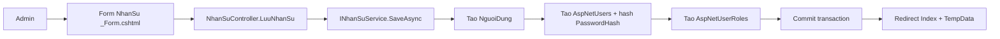

# PHÂN TÍCH CHỨC NĂNG QUẢN LÝ NHÂN SỰ HIỆN TẠI

## 1. Phạm vi source đã đọc

### Controller
- `QuanLyDuAn/QuanLyDuAn/Controllers/NhanSuController.cs`
- `QuanLyDuAn/QuanLyDuAn/Controllers/AccountController.cs`
- `QuanLyDuAn/QuanLyDuAn/Controllers/TaiKhoanCaNhanController.cs`
- `QuanLyDuAn/QuanLyDuAn/Controllers/ChucDanhController.cs`
- `QuanLyDuAn/QuanLyDuAn/Controllers/PhanQuyenController.cs`
- `QuanLyDuAn/QuanLyDuAn/Controllers/ThanhVienTeamController.cs`
- `QuanLyDuAn/QuanLyDuAn/Controllers/NhanVienDuAnController.cs`

### Service và interface
- `QuanLyDuAn/QuanLyDuAn/Services/Interfaces/INhanSuService.cs`
- `QuanLyDuAn/QuanLyDuAn/Services/Implementations/NhanSuService.cs`
- `QuanLyDuAn/QuanLyDuAn/Services/Interfaces/IAccountService.cs`
- `QuanLyDuAn/QuanLyDuAn/Services/Implementations/AccountService.cs`
- `QuanLyDuAn/QuanLyDuAn/Services/Interfaces/ITaiKhoanCaNhanService.cs`
- `QuanLyDuAn/QuanLyDuAn/Services/Implementations/TaiKhoanCaNhanService.cs`
- `QuanLyDuAn/QuanLyDuAn/Services/Interfaces/IEmailService.cs`
- `QuanLyDuAn/QuanLyDuAn/Services/Implementations/GmailEmailService.cs`
- `QuanLyDuAn/QuanLyDuAn/Services/Interfaces/IPermissionHelper.cs`
- `QuanLyDuAn/QuanLyDuAn/Services/Implementations/PermissionHelper.cs`
- `QuanLyDuAn/QuanLyDuAn/Services/Interfaces/IPhanQuyenService.cs`
- `QuanLyDuAn/QuanLyDuAn/Services/Implementations/PhanQuyenService.cs`
- `QuanLyDuAn/QuanLyDuAn/Services/Implementations/PermissionDependencyProvider.cs`
- `QuanLyDuAn/QuanLyDuAn/Services/Implementations/ChucDanhService.cs`
- `QuanLyDuAn/QuanLyDuAn/Services/CauHinhDichVu.cs`
- `QuanLyDuAn/QuanLyDuAn/Services/Implementations/ThanhVienTeamService.cs`
- `QuanLyDuAn/QuanLyDuAn/Services/Implementations/NhanVienDuAnService.cs`
- `QuanLyDuAn/QuanLyDuAn/Services/Implementations/DuAnService.cs`
- `QuanLyDuAn/QuanLyDuAn/Services/Implementations/PhanCongCongViecService.cs`
- `QuanLyDuAn/QuanLyDuAn/Services/Implementations/ChatDuAnService.cs`

### ViewModel/DTO
- `QuanLyDuAn/QuanLyDuAn/ViewModels/NhanSu/NhanSuCreateUpdateViewModel.cs`
- `QuanLyDuAn/QuanLyDuAn/ViewModels/NhanSu/NhanSuViewModel.cs`
- `QuanLyDuAn/QuanLyDuAn/ViewModels/NhanSu/NhanSuPageViewModel.cs`
- `QuanLyDuAn/QuanLyDuAn/ViewModels/NhanSu/ChucDanhOptionViewModel.cs`
- `QuanLyDuAn/QuanLyDuAn/ViewModels/NhanSu/VaiTroHeThongOptionViewModel.cs`
- `QuanLyDuAn/QuanLyDuAn/ViewModels/Auth/DangNhapViewModel.cs`
- `QuanLyDuAn/QuanLyDuAn/ViewModels/Account/ForgotPasswordViewModel.cs`
- `QuanLyDuAn/QuanLyDuAn/ViewModels/Account/VerifyOtpViewModel.cs`
- `QuanLyDuAn/QuanLyDuAn/ViewModels/Account/ResetPasswordViewModel.cs`
- `QuanLyDuAn/QuanLyDuAn/ViewModels/TaiKhoanCaNhan/DoiMatKhauViewModel.cs`

### Entity/DbContext
- `QuanLyDuAn/QuanLyDuAn/Data/QuanLyDuAnDbContext.cs`
- `QuanLyDuAn/QuanLyDuAn/Models/Entities/NguoiDung.cs`
- `QuanLyDuAn/QuanLyDuAn/Models/Entities/Aspnetusers.cs`
- `QuanLyDuAn/QuanLyDuAn/Models/Entities/Aspnetroles.cs`
- `QuanLyDuAn/QuanLyDuAn/Models/Entities/Aspnetuserroles.cs`
- `QuanLyDuAn/QuanLyDuAn/Models/Entities/Aspnetroleclaims.cs`
- `QuanLyDuAn/QuanLyDuAn/Models/Entities/Aspnetusertokens.cs`
- `QuanLyDuAn/QuanLyDuAn/Models/Entities/ChucDanh.cs`
- Các entity tham chiếu nhân sự qua FK/khóa nghiệp vụ trong `QuanLyDuAnDbContext` như: `DuAn`, `NhanVienTeam`, `NhanVienDuAn`, `PhanCongCongViec`, `PhanCongCtCongViec`, `DanhGiaNhanVien`, `DanhGiaDuAn`, `YeuCauDoiQuanLy`, `TinNhan`, `ThanhVienPhongChat`, `NhatKy*`.

### Razor View
- `QuanLyDuAn/QuanLyDuAn/Views/NhanSu/Index.cshtml`
- `QuanLyDuAn/QuanLyDuAn/Views/NhanSu/_Form.cshtml`
- `QuanLyDuAn/QuanLyDuAn/Views/NhanSu/_Filter.cshtml`
- `QuanLyDuAn/QuanLyDuAn/Views/NhanSu/_Table.cshtml`
- `QuanLyDuAn/QuanLyDuAn/Views/Account/Login.cshtml`
- `QuanLyDuAn/QuanLyDuAn/Views/Account/ForgotPassword.cshtml`
- `QuanLyDuAn/QuanLyDuAn/Views/Account/VerifyOtp.cshtml`
- `QuanLyDuAn/QuanLyDuAn/Views/Account/ResetPassword.cshtml`
- `QuanLyDuAn/QuanLyDuAn/Views/Shared/_ValidationScriptsPartial.cshtml`

### CSS/JavaScript
- `QuanLyDuAn/QuanLyDuAn/wwwroot/css/NhanSu/index.css`
- `QuanLyDuAn/QuanLyDuAn/wwwroot/css/Account/login.css` (được dùng ở luồng login/forgot/reset)
- `QuanLyDuAn/QuanLyDuAn/wwwroot/lib/jquery-validation/dist/jquery.validate.min.js`
- `QuanLyDuAn/QuanLyDuAn/wwwroot/lib/jquery-validation-unobtrusive/jquery.validate.unobtrusive.min.js`

### Constants/Permission
- `QuanLyDuAn/QuanLyDuAn/Constants/Permissions.cs`
- `QuanLyDuAn/QuanLyDuAn/Constants/TrangThai.cs`

### Authentication
- `QuanLyDuAn/QuanLyDuAn/Program.cs`
- `QuanLyDuAn/QuanLyDuAn/Data/KhoiTaoTaiKhoanMacDinh.cs`

### Email/configuration
- `QuanLyDuAn/QuanLyDuAn/appsettings.json`
- `QuanLyDuAn/QuanLyDuAn/Services/Implementations/GmailEmailService.cs`
- `QuanLyDuAn/QuanLyDuAn/Services/Interfaces/IEmailService.cs`

### SQL/migration nếu có
- `QuanLyDuAn/QuanLyDuAn/Migrations/20260527125053_Init.cs`
- `QuanLyDuAn/QuanLyDuAn/Migrations/20260527125053_Init.Designer.cs`
- `QuanLyDuAn/QuanLyDuAn/Migrations/QuanLyDuAnDbContextModelSnapshot.cs`

## 2. Kiến trúc chức năng Nhân sự hiện tại

Luồng hiện tại bám theo mô hình MVC + service:

`Razor View -> Controller -> Service -> EF Core (QuanLyDuAnDbContext) -> SQL Server`

- `NhanSuController` xử lý request màn hình nhân sự, gọi `INhanSuService`.
- `NhanSuService` xử lý nghiệp vụ tạo/sửa/xóa mềm nhân sự, tạo tài khoản, gán role, khóa/mở khóa.
- `AccountController` + `AccountService` xử lý đăng nhập và quên mật khẩu OTP.
- `Program.cs` cấu hình cookie authentication, authorization toàn cục.
- Kiểm tra quyền thao tác chủ yếu ở Controller qua `IPermissionHelper.HasPermissionAsync`.

## 3. Các bảng và entity liên quan

| Entity/Bảng | Vai trò | Trường quan trọng | Quan hệ |
| ----------- | ------- | ----------------- | ------- |
| `NguoiDung` / `NGUOI_DUNG` | Hồ sơ nhân sự nghiệp vụ | `MaNguoiDung`, `MaChucDanh`, `Id`, `HoTenNguoiDung`, `SdtNguoiDung`, `NgaySinh`, `IsDeleted`, `DeletedAt`, `DeletedBy` | FK `MaChucDanh -> CHUC_DANH`; FK `Id -> AspNetUsers.Id`; được nhiều bảng nghiệp vụ tham chiếu bằng `MaNguoiDung` |
| `Aspnetusers` / `AspNetUsers` | Tài khoản đăng nhập | `Id`, `MaNguoiDung`, `UserName`, `NormalizedUserName`, `Email`, `NormalizedEmail`, `PasswordHash`, `EmailConfirmed`, `LockoutEnd`, `LockoutEnabled`, `AccessFailedCount` | FK `MaNguoiDung -> NGUOI_DUNG.MaNguoiDung` |
| `Aspnetroles` / `AspNetRoles` | Vai trò hệ thống | `Id`, `Name`, `NormalizedName` | Liên kết qua `AspNetUserRoles` và `AspNetRoleClaims` |
| `Aspnetuserroles` / `AspNetUserRoles` | Bảng gán user-role | `Asp_Id`, `Id` (role id) | FK `Asp_Id -> AspNetUsers.Id`, FK `Id -> AspNetRoles.Id` |
| `Aspnetroleclaims` / `AspNetRoleClaims` | Gán permission cho role | `Asp_Id` (role id), `MaDanhMucQuyen`, `ClaimType`, `ClaimValue` | FK `Asp_Id -> AspNetRoles.Id`, FK `MaDanhMucQuyen -> DANH_MUC_QUYEN` |
| `Aspnetusertokens` / `AspNetUserTokens` | Lưu token OTP/phiên reset mật khẩu | `Id`, `LoginProvider`, `Name`, `Value` | FK `Id -> AspNetUsers.Id`; dùng cho forgot/reset password |
| `ChucDanh` / `CHUC_DANH` | Danh mục chức danh nhân sự | `MaChucDanh`, `TenChucDanh`, `MoTaChucDanh` | FK từ `NGUOI_DUNG.MaChucDanh` |

Khác biệt rõ:
- **Hồ sơ nhân sự** nằm ở `NGUOI_DUNG`.
- **Tài khoản đăng nhập** nằm ở `AspNetUsers`.
- Hai bảng nối bằng 2 chiều: `NguoiDung.Id` (string) và `Aspnetusers.MaNguoiDung` (int), tạo ràng buộc liên kết profile-account.

## 4. Form thêm nhân sự hiện tại

| Trường giao diện | ViewModel property | Entity/Bảng lưu | Bắt buộc | Validation | Ghi chú |
| ---------------- | ------------------ | --------------- | -------- | ---------- | ------- |
| Họ tên | `HoTenNguoiDung` | `NGUOI_DUNG.HoTenNguoiDung` | Có | `[Required]`, `[MaxLength(255)]` | Nhập trực tiếp |
| Chức danh | `MaChucDanh` | `NGUOI_DUNG.MaChucDanh` | Có | `[Required]` | Chọn từ `DanhSachChucDanh` |
| Số điện thoại | `SdtNguoiDung` | `NGUOI_DUNG.SdtNguoiDung`, `AspNetUsers.PhoneNumber` | Có | `[Required]`, `[MaxLength(20)]`, regex số | Service kiểm tra trùng số |
| Ngày sinh | `NgaySinh` | `NGUOI_DUNG.NgaySinh` | Có | `[Required]` | Không có annotation chặn ngày tương lai ở form Nhân sự |
| Địa chỉ | `DiaChiNguoiDung` | `NGUOI_DUNG.DiaChiNguoiDung` | Có | `[Required]`, `[MaxLength(255)]` | Textarea |
| Tên đăng nhập | `UserName` | `AspNetUsers.UserName`, `NormalizedUserName` | Có | `[Required]`, `[MaxLength(256)]` | Khi sửa: readonly |
| Email | `Email` | `AspNetUsers.Email`, `NormalizedEmail` | Có | `[Required]`, `[MaxLength(256)]`, `[EmailAddress]` | Khi sửa: readonly, service cấm đổi |
| Vai trò hệ thống | `RoleId` | `AspNetUserRoles.Id` | Có | `[Required]` | Chọn từ role hệ thống |
| Mật khẩu (thêm mới) | `Password` | `AspNetUsers.PasswordHash` | Có khi tạo mới | `[MinLength(6)]`, `[MaxLength(100)]` + `IValidatableObject` buộc nhập khi tạo | Không có trường xác nhận mật khẩu ở form Nhân sự |
| Reset mật khẩu (khi sửa) | `ResetPassword` | `AspNetUsers.PasswordHash` | Không | `[MinLength(6)]`, `[MaxLength(100)]` | Nếu nhập thì hash lại và gửi email thông báo reset |

## 5. Luồng thêm nhân sự hiện tại

1. Admin bấm **Lưu** trên `Views/NhanSu/_Form.cshtml`, submit POST đến `NhanSuController.LuuNhanSu`.
2. Controller (`Controllers/NhanSuController.cs`) kiểm tra `ModelState`. Nếu lỗi thì nạp lại danh sách + dropdown và trả lại view `Index`.
3. Controller xác định thêm mới khi `Form.MaNguoiDung == null`, kiểm tra quyền `Permissions.NhanSu.Them`.
4. Controller gọi `NhanSuService.SaveAsync(model, laAdminDangThaoTac)`.
5. Service (`Services/Implementations/NhanSuService.cs`) validate:
   - `MaChucDanh` tồn tại.
   - `UserName` chưa tồn tại theo `NormalizedUserName`.
   - `Email` chưa tồn tại theo `NormalizedEmail`.
   - `SdtNguoiDung` chưa trùng trong `NGUOI_DUNG` chưa xóa.
   - `RoleId` tồn tại.
   - Nếu role mới là admin: chỉ admin mới tạo được + không vượt `MaxAdminCount = 3`.
6. Service mở transaction `BeginTransactionAsync`.
7. Tạo bản ghi `NguoiDung` trước, `SaveChangesAsync` để lấy `MaNguoiDung`.
8. Tạo `Aspnetusers` sau:
   - Gán `EmailConfirmed = true`.
   - Gán `LockoutEnabled = true`.
   - Hash mật khẩu bằng `PasswordHasher<Aspnetusers>.HashPassword(account, model.Password!)`.
9. Tạo bản ghi `Aspnetuserroles` để gán role.
10. Gán ngược `NguoiDung.Id = userId` rồi `SaveChangesAsync`, `CommitAsync`.
11. Controller set `TempData["Success"]`, redirect về `Index`.

Transaction/rollback:
- Có transaction explicit cho luồng tạo mới nhân sự + tài khoản + role.
- Nếu lỗi trước commit: transaction rollback (do exception).
- Không thấy create hồ sơ và account tách rời ngoài transaction trong `SaveAsync` nhánh thêm mới.

## 6. Luồng sửa nhân sự

- Action: `NhanSuController.Sua(int id)` lấy form; lưu bằng `NhanSuController.LuuNhanSu` với `MaNguoiDung != null`.
- Quyền: cần `Permissions.NhanSu.Sua`.
- Trường được sửa:
  - Được: họ tên, địa chỉ, SĐT, ngày sinh, chức danh, role (`RoleId`), reset mật khẩu (tùy chọn).
  - Không được: username (readonly ở view), email (readonly ở view + service chặn bằng exception nếu khác).
- Validation trùng:
  - SĐT: kiểm tra trùng trong `NguoiDung` (trừ chính mình).
  - Không có luồng đổi username/email nên không có check trùng cho 2 trường khi sửa.
- Đổi role:
  - Kiểm tra role tồn tại.
  - Kiểm tra quyền gán admin và giới hạn tối đa admin.
  - Kiểm tra ràng buộc nghiệp vụ qua `KiemTraRangBuocDoiRoleAsync` (đang quản lý dự án, leader team, thuộc dự án/team, còn công việc chưa hoàn thành -> chặn đổi role).
- Reset mật khẩu khi sửa:
  - Nếu `ResetPassword` có giá trị: hash lại `PasswordHash`, đổi `SecurityStamp`, sau đó thử gửi email thông báo.
- Cập nhật đồng thời nhiều bảng:
  - `NGUOI_DUNG` (thông tin profile)
  - `AspNetUsers` (phone + password hash nếu reset)
  - `AspNetUserRoles` (nếu đổi role)
- Ảnh hưởng cookie/claim:
  - Không thấy logic buộc đăng nhập lại khi role đổi hoặc khi username/email thay đổi (username/email thực tế không cho đổi ở màn này).
  - Claim chỉ được tạo khi đăng nhập; phiên hiện có của user bị sửa role không thấy refresh cưỡng bức.

## 7. Luồng khóa, mở khóa và xóa nhân sự

### Khóa tài khoản
- Action: `NhanSuController.KhoaTaiKhoan` -> `NhanSuService.LockAccountAsync`.
- Cập nhật: `AspNetUsers.LockoutEnabled = true`, `LockoutEnd = UtcNow + 100 năm`.
- Không đổi `NguoiDung.IsDeleted`.
- Chặn khóa nếu:
  - Nhân sự không tồn tại.
  - Đang quản lý dự án.
  - Đang là leader team.
- Còn công việc chưa hoàn thành: chỉ ghi log warning, không chặn khóa.
- Người bị khóa: đăng nhập bị chặn tại `AccountService.AuthenticateAsync` (kiểm tra `LockoutEnd`).
- Cookie hiện có: không thấy logic revoke ngay sau khi admin khóa; source không chủ động sign-out user đang online.

### Mở khóa
- Action: `NhanSuController.MoKhoaTaiKhoan` -> `NhanSuService.UnlockAccountAsync`.
- Cập nhật: `LockoutEnd = null`, `AccessFailedCount = 0`.

### Xóa nhân sự
- Action: `NhanSuController.XoaNhanSu` -> `NhanSuService.DeleteAsync`.
- Kiểu xóa: **xóa mềm** profile (`NguoiDung.IsDeleted = true`, `DeletedAt = UtcNow`).
- Không xóa thật account ở `AspNetUsers`.
- Ràng buộc chặn xóa (`KiemTraRangBuocXoaAsync`):
  - Đang quản lý dự án.
  - Đang là leader team.
  - Còn thuộc team/dự án.
  - Thuộc team đang tham gia dự án.
  - Còn công việc chưa hoàn thành.

Rule đặc biệt:
- Chưa thấy rule chặn khóa chính mình/chặn khóa admin cuối cùng ở `NhanSuService`.

## 8. Luồng đăng nhập của tài khoản nhân sự

- Form: `Views/Account/Login.cshtml`.
- Action: `AccountController.Login` (POST, có `[ValidateAntiForgeryToken]`).
- Dịch vụ: `AccountService.AuthenticateAsync`.
- Dữ liệu đăng nhập:
  - View ghi "Tên đăng nhập".
  - Service tìm theo `NormalizedUserName` hoặc `UserName` (không kiểm tra email tại login).
- Kiểm tra mật khẩu:
  - `PasswordHasher<Aspnetusers>.VerifyHashedPassword`.
- Kiểm tra khóa:
  - Nếu `LockoutEnabled` và `LockoutEnd > UtcNow` => từ chối đăng nhập.
- Tạo claim/cookie:
  - Claim cơ bản: `NameIdentifier`, `Name`, `MaNguoiDung`.
  - Claim role từ `AspNetUserRoles` + `AspNetRoles`.
  - Claim permission từ `AspNetRoleClaims` (và fallback `DanhMucQuyen`).
  - Claim user riêng từ `AspNetUserClaims`.
  - Tạo cookie auth qua `HttpContext.SignInAsync` (thời hạn 8h hoặc 7 ngày nếu nhớ đăng nhập).
- Email confirmed:
  - Không thấy kiểm tra `EmailConfirmed` khi login.
- Đổi mật khẩu lần đầu:
  - Chưa thấy cờ/luồng bắt buộc đổi lần đầu.
- Quên/reset mật khẩu:
  - Có: forgot password OTP (`KhoiTaoQuenMatKhauAsync`, `XacNhanOtpDatLaiMatKhauAsync`, `DatLaiMatKhauBangOtpAsync`).

## 9. Phân tích email hiện tại

- Email hiện vừa là thông tin tài khoản vừa dùng cho quên mật khẩu OTP.
- Ở form tạo nhân sự, email là bắt buộc.
- Tính unique email:
  - Có check nghiệp vụ trong `NhanSuService.SaveAsync` theo `NormalizedEmail`.
  - Chưa thấy unique index DB cho `Email`/`NormalizedEmail` trong migration đã đọc.
- Xác minh email:
  - Tạo tài khoản mới set cứng `EmailConfirmed = true`.
  - Không thấy luồng gửi email xác minh.
- Gửi email khi tạo nhân sự:
  - Không thấy gửi email ở nhánh tạo mới.
- Có hạ tầng SMTP/email service:
  - Có `IEmailService` + `GmailEmailService` dùng `System.Net.Mail.SmtpClient`.
- Khả năng tái sử dụng:
  - Đang được dùng cho forgot password OTP và email thông báo reset mật khẩu từ admin.
- Chức năng kích hoạt tài khoản:
  - Chưa thấy.
- Token kích hoạt/reset:
  - Có token reset OTP trong `AspNetUserTokens` cho quên mật khẩu.
  - Chưa thấy token kích hoạt tài khoản nhân sự mới.

## 10. Phân tích mật khẩu hiện tại

- Ai nhập mật khẩu:
  - Admin nhập mật khẩu khi tạo nhân sự mới (`NhanSu` form).
  - Admin có thể nhập mật khẩu mới để reset trong màn sửa nhân sự.
  - Người dùng tự nhập mật khẩu mới ở luồng quên mật khẩu OTP và đổi mật khẩu cá nhân.
- Mật khẩu có hash:
  - Có, dùng `PasswordHasher<Aspnetusers>`.
- Method/thư viện:
  - `HashPassword` và `VerifyHashedPassword` từ `Microsoft.AspNetCore.Identity`.
- Yêu cầu độ mạnh:
  - Chỉ thấy min/max length (6-100), chưa thấy policy phức tạp (hoa/thường/số/ký tự đặc biệt).
- Xác nhận mật khẩu:
  - Có ở `ResetPasswordViewModel` và `DoiMatKhauViewModel`.
  - Không có ở form tạo/sửa nhân sự (`NhanSu`).
- Bắt buộc đổi mật khẩu lần đầu:
  - Chưa thấy triển khai.
- Admin có thể biết mật khẩu nhân viên:
  - Về quy trình, admin là người nhập khi tạo/reset nên biết mật khẩu plaintext tại thời điểm nhập.
- Nguy cơ lộ mật khẩu:
  - Không thấy ghi log mật khẩu trong source đã đọc.
  - Form dùng input password.
  - Không thấy trả `PasswordHash` ra UI.
  - `TempData/ModelState` có thể chứa message lỗi chung, không thấy nhét mật khẩu vào message.
- Chức năng đổi/reset mật khẩu:
  - Có đổi mật khẩu cá nhân.
  - Có reset bằng OTP qua email.
  - Có reset bởi admin tại màn sửa nhân sự.

## 11. Phân quyền của chức năng Nhân sự

| Hành động | Controller/Action | Permission | Kiểm tra scope/rule bổ sung |
| --------- | ----------------- | ---------- | --------------------------- |
| Xem nhân sự | `NhanSuController.Index` | `NhanSu.Xem` | Không có scope theo phòng ban/team |
| Thêm nhân sự | `NhanSuController.LuuNhanSu` (nhánh create) | `NhanSu.Them` | Service chặn tạo role Admin nếu người thao tác không phải admin; giới hạn tối đa 3 admin |
| Sửa nhân sự | `NhanSuController.Sua`, `LuuNhanSu` (nhánh update) | `NhanSu.Sua` | Service chặn đổi email, ràng buộc đổi role theo dự án/team/công việc |
| Xóa nhân sự | `NhanSuController.XoaNhanSu` | `NhanSu.Xoa` | Service xóa mềm + chặn nếu còn liên kết nghiệp vụ |
| Khóa tài khoản | `NhanSuController.KhoaTaiKhoan` | `NhanSu.Khoa` | Service chặn nếu đang quản lý dự án/leader team |
| Mở khóa tài khoản | `NhanSuController.MoKhoaTaiKhoan` | `NhanSu.MoKhoa` | Không có rule bổ sung ngoài tồn tại account |
| Đổi vai trò | `NhanSuController.LuuNhanSu` (update `RoleId`) | `NhanSu.Sua` | Service `KiemTraRangBuocDoiRoleAsync`, giới hạn admin, chỉ admin mới gán admin |

Ghi chú:
- Service không tự kiểm tra permission claim; kiểm tra chủ yếu ở controller.
- Admin **không tự bypass mặc định** trong `PermissionHelper` (chỉ đọc claim permission), trừ các rule nghiệp vụ trong `NhanSuService` có kiểm tra `User.IsInRole("ADMIN"/"Admin")`.

## 12. Quan hệ với các module khác

| Module | Cách tham chiếu nhân sự | Ảnh hưởng khi khóa/xóa/đổi tài khoản |
| ------ | ----------------------- | ------------------------------------ |
| Team và thành viên team | `NHAN_VIEN_TEAM.MaNguoiDung`, `ThanhVienTeamService` | Khóa: không thêm/gán leader cho tài khoản lock; Xóa mềm bị chặn nếu còn trong team |
| Thành viên dự án | `NHAN_VIEN_DU_AN.MaNguoiDung`, `NhanVienDuAnService` | Khóa: không thêm nhân viên lock vào dự án; Xóa mềm bị chặn nếu còn trong dự án |
| Quản lý dự án | `DU_AN.MaNguoiDung` | Đổi role/khóa/xóa bị chặn nếu đang quản lý dự án |
| Phân công công việc | `PHAN_CONG_CONG_VIEC.MaNguoiDung`, `PhanCongCongViecService` | Tài khoản lock không được phân công; xóa nhân sự bị chặn nếu còn việc chưa hoàn thành |
| Phân công chi tiết công việc | `PHAN_CONG_CT_CONG_VIEC.MaNguoiDung` | Tham chiếu FK nhân sự; rủi ro nếu xóa cứng (hiện tại xóa mềm profile nên giảm rủi ro FK) |
| Đánh giá nhân viên/dự án | `DANH_GIA_*` có nhiều cột `MaNguoiDung*` | Xóa mềm không xóa dữ liệu đánh giá lịch sử |
| Đề xuất công việc/ngân sách | `DE_XUAT_*` cột `MaNguoiDung*` | Đổi role có thể bị chặn nếu còn dữ liệu liên quan |
| Chat dự án | `TIN_NHAN.MaNguoiDung`, `THANH_VIEN_PHONG_CHAT.MaNguoiDung` | `ChatDuAnService` lọc nhân sự `IsDeleted != true`; admin không tham gia chat dự án |
| Nhật ký | nhiều bảng `NHAT_KY_*` lưu `MaNguoiDung` | Lịch sử vẫn giữ khi profile bị soft delete |
| AI dataset/kết quả | qua `DU_AN` và module dự án | Ảnh hưởng gián tiếp khi đổi quản lý/nhân sự dự án |

## 13. Các quy tắc nghiệp vụ hiện tại

- Giới hạn tối đa tài khoản admin: **có** (`NhanSuService.MaxAdminCount = 3`).
- Chỉ admin được tạo/gán vai trò admin: **có**.
- Không cho trùng username/email khi tạo: **có** (service check normalized).
- Không cho trùng số điện thoại: **có** (service check `NguoiDung.SdtNguoiDung`).
- Không cho đổi email khi sửa nhân sự: **có**.
- Không cho đổi role trong nhiều trường hợp đang dính nghiệp vụ (quản lý dự án, leader team, còn phân công...): **có**.
- Không cho xóa nhân sự đang được sử dụng: **có**.
- Xóa nhân sự là soft delete: **có** (`IsDeleted`, `DeletedAt`).
- Chặn thao tác dựa trên permission: **có** ở controller.
- Không cho khóa chính mình: **Chưa thấy triển khai trong source**.
- Không cho khóa admin cuối cùng: **Chưa thấy triển khai trong source**.
- Giới hạn số lần đăng nhập sai và lockout tự động: **Chưa thấy triển khai rõ** (có trường `AccessFailedCount`, nhưng không thấy tăng sai mật khẩu trong `AuthenticateAsync`).

## 14. Các vấn đề và rủi ro phát hiện

### 14.1 Bảo mật

1) **Mức độ: Cao**  
   - Bằng chứng: `appsettings.json` đang chứa trực tiếp khóa cấu hình email gồm cả trường mật khẩu ứng dụng.  
   - Tác động: lộ credential SMTP nếu source bị truy cập.  
   - Chưa sửa ở bước này.

2) **Mức độ: Trung bình**  
   - Bằng chứng: tạo nhân sự mới bắt admin nhập trực tiếp mật khẩu (`Views/NhanSu/_Form.cshtml`, `NhanSuCreateUpdateViewModel`).  
   - Tác động: quy trình cấp phát mật khẩu thủ công, tăng rủi ro lộ mật khẩu ban đầu.  
   - Chưa sửa ở bước này.

3) **Mức độ: Trung bình**  
   - Bằng chứng: `NhanSuService` set `EmailConfirmed = true` khi tạo account, không có xác thực email thực.  
   - Tác động: email không được verify nhưng được coi đã xác nhận.  
   - Chưa sửa ở bước này.

### 14.2 Toàn vẹn dữ liệu

1) **Mức độ: Trung bình**  
   - Bằng chứng: migration `20260527125053_Init.cs` không thấy unique index cho `AspNetUsers.NormalizedUserName`, `NormalizedEmail`, `NguoiDung.SdtNguoiDung`.  
   - Tác động: nếu race condition hoặc import trực tiếp DB có thể phát sinh bản ghi trùng.  
   - Chưa sửa ở bước này.

2) **Mức độ: Thấp**  
   - Bằng chứng: soft delete chỉ áp dụng profile `NguoiDung`, tài khoản `AspNetUsers` không bị disable tự động khi xóa mềm.  
   - Tác động: cần kiểm tra thêm luồng đăng nhập với user có profile đã soft delete; nguy cơ lệch trạng thái profile-account.  
   - Chưa sửa ở bước này.

### 14.3 Nghiệp vụ

1) **Mức độ: Trung bình**  
   - Bằng chứng: chưa thấy chặn khóa chính mình/chặn khóa admin cuối cùng trong `NhanSuService.LockAccountAsync`.  
   - Tác động: có thể khóa nhầm tài khoản quan trọng vận hành hệ thống.  
   - Chưa sửa ở bước này.

2) **Mức độ: Trung bình**  
   - Bằng chứng: đổi role không có cơ chế thu hồi phiên đăng nhập hiện tại của user bị đổi role.  
   - Tác động: quyền thực thi có thể lệch tạm thời đến lần đăng nhập kế tiếp.  
   - Chưa sửa ở bước này.

### 14.4 Trải nghiệm người dùng

1) **Mức độ: Thấp**  
   - Bằng chứng: form Nhân sự không có trường xác nhận mật khẩu và không có hướng dẫn mạnh mật khẩu.  
   - Tác động: dễ nhập nhầm mật khẩu cấp cho nhân viên.  
   - Chưa sửa ở bước này.

2) **Mức độ: Thấp**  
   - Bằng chứng: action POST của Nhân sự (`LuuNhanSu`, `XoaNhanSu`, `KhoaTaiKhoan`, `MoKhoaTaiKhoan`) không gắn `[ValidateAntiForgeryToken]` rõ ràng.  
   - Tác động: phụ thuộc vào cơ chế mặc định của form tag helper; cần kiểm chuẩn chính sách CSRF toàn hệ thống.  
   - Chưa sửa ở bước này.

## 15. Mức độ sẵn sàng cho quy trình kích hoạt qua email

| Thành phần cần có | Hiện trạng | Có thể tái sử dụng | Cần bổ sung |
| ----------------- | ---------- | ------------------ | ----------- |
| Email bắt buộc và unique | Bắt buộc ở ViewModel; unique bằng check service | Một phần | Unique index DB cứng |
| Email service | Đã có `IEmailService` + `GmailEmailService` | Có | Hardening cấu hình secret |
| SMTP configuration | Có trong `appsettings.json` | Có | Tách secret khỏi source |
| Trạng thái `ChoKichHoat` | Chưa thấy | Không | Thêm trạng thái |
| Token kích hoạt | Chưa thấy | Chưa | Bổ sung luồng token kích hoạt |
| Hash token | Có kỹ thuật hash OTP reset (`SHA256`) | Có thể tham khảo | Cần áp dụng cho activation token |
| Thời hạn token | Có cho OTP reset (3 phút) | Có thể tham khảo | Cần policy riêng cho activation |
| Liên kết chỉ dùng một lần | Có ý tưởng trong `AspNetUserTokens` cho reset | Có thể tái sử dụng pattern | Cần triển khai cho kích hoạt |
| Trang đặt mật khẩu | Có `ResetPassword` cho forgot flow | Có thể tái sử dụng UI/validation | Cần tách context activation |
| Validation mật khẩu | Có min length + compare ở reset | Có | Có thể cần policy mạnh hơn |
| Gửi lại email kích hoạt | Chưa thấy | Không | Bổ sung |
| Thu hồi token cũ | Có `XoaTokenQuenMatKhauAsync` cho reset | Có thể tái sử dụng pattern | Bổ sung cho activation |
| Nhật ký gửi/kích hoạt | Chưa thấy | Không | Bổ sung |
| Chặn đăng nhập trước kích hoạt | Chưa thấy (không check email confirmed) | Không | Bổ sung |
| Quên mật khẩu | Đã có OTP reset | Có | Tối ưu bảo mật/thời hạn |
| Bắt buộc đổi mật khẩu lần đầu | Chưa thấy | Không | Bổ sung |

## 16. Sơ đồ workflow AS-IS

### 16.1 Thêm nhân sự



### 16.2 Đăng nhập

```mermaid
flowchart LR
    A[Nguoi dung] --> B[Account/Login]
    B --> C[AccountController.Login]
    C --> D[AccountService.AuthenticateAsync]
    D --> E[Kiem tra username]
    E --> F[Kiem tra PasswordHash]
    F --> G[Kiem tra LockoutEnd]
    G --> H[Tao claims role/permission]
    H --> I[SignIn cookie]
```



## 17. Các câu hỏi còn chưa xác định được

- DB production thực tế có thêm unique index ngoài migration trong repo hay không.
- Có cơ chế global anti-forgery filter ở nơi khác ngoài các controller đã đọc hay không.
- Không thấy `appsettings.Development.json` trong phạm vi đã đọc nên chưa đối chiếu khác biệt cấu hình môi trường.
- Không có log/audit chuyên biệt cho sự kiện tạo tài khoản nhân sự trong phạm vi source đã đọc.
- Mức độ đồng bộ cookie/claim sau đổi role phụ thuộc middleware/chính sách phiên runtime, source hiện không cưỡng bức sign-out.

## 18. Kết luận AS-IS

- Chức năng Nhân sự hiện tại tạo tài khoản theo mô hình **admin nhập trực tiếp thông tin + mật khẩu**, service tạo `NguoiDung` và `AspNetUsers` trong transaction, rồi gán role.
- Email hiện là dữ liệu tài khoản bắt buộc, có dùng cho forgot password OTP; chưa có kích hoạt email cho tài khoản mới.
- Mật khẩu hiện được hash bằng `PasswordHasher` của ASP.NET Core Identity; có đổi/reset mật khẩu nhưng chưa có bắt buộc đổi lần đầu.
- Mức độ an toàn ở mức trung bình: có hash mật khẩu, có lockout thủ công, có OTP reset; nhưng còn rủi ro về quản trị secret SMTP trong source và quy trình cấp mật khẩu thủ công.
- Thành phần tái sử dụng tốt cho bước kích hoạt email sau này: `IEmailService`, bảng `AspNetUserTokens`, pattern hash/token expiry trong `AccountService`.
- Thành phần còn thiếu để chuyển sang quy trình mời kích hoạt: trạng thái chờ kích hoạt, token activation 1 lần, chặn login trước kích hoạt, resend/thu hồi token, nhật ký kích hoạt.
# TRẠNG THÁI SAU TRIỂN KHAI KÍCH HOẠT TÀI KHOẢN QUA EMAIL

## 1. File đã sửa

- `QuanLyDuAn/QuanLyDuAn/Controllers/NhanSuController.cs`: thêm CSRF cho POST, thêm gửi lại email kích hoạt, điều chỉnh thông báo tạo nhân sự.
- `QuanLyDuAn/QuanLyDuAn/Controllers/AccountController.cs`: thêm GET/POST `Activate`.
- `QuanLyDuAn/QuanLyDuAn/Services/Interfaces/INhanSuService.cs`, `IAccountService.cs`, `IEmailService.cs`: mở rộng hợp đồng nhân sự/account/email.
- `QuanLyDuAn/QuanLyDuAn/Services/Implementations/NhanSuService.cs`: tạo account chưa kích hoạt, tạo token hash, gửi email sau commit, gửi lại email kích hoạt.
- `QuanLyDuAn/QuanLyDuAn/Services/Implementations/AccountService.cs`: chặn login chưa kích hoạt, chặn forgot password cho account chưa kích hoạt, xử lý activation token một lần.
- `QuanLyDuAn/QuanLyDuAn/Services/Implementations/GmailEmailService.cs`: thêm template email kích hoạt.
- `QuanLyDuAn/QuanLyDuAn/Services/AccountActivationOptions.cs`, `AccountActivationTokenHelper.cs`: cấu hình và helper token activation.
- `QuanLyDuAn/QuanLyDuAn/ViewModels/Account/ActivateAccountViewModel.cs`, `Views/Account/Activate.cshtml`: form đặt mật khẩu khi kích hoạt.
- `QuanLyDuAn/QuanLyDuAn/ViewModels/NhanSu/*`, `Views/NhanSu/_Form.cshtml`, `_Table.cshtml`, `_Filter.cshtml`: bỏ nhập password trực tiếp, thêm trạng thái/nút gửi lại.
- `QuanLyDuAn/QuanLyDuAn/Constants/TrangThai.cs`: thêm trạng thái `chokichhoat`.
- `QuanLyDuAn/QuanLyDuAn/Program.cs`, `appsettings.json`, `appsettings.Development.json`: bind `AccountActivation`, bỏ secret SMTP khỏi source.
- `docs/nhansu.md`: cập nhật phần TO-BE này.

## 2. Workflow TO-BE đã triển khai

```text
Admin tạo nhân sự
→ MVC tạo profile + account chưa kích hoạt
→ MVC tạo token hash
→ MVC gửi email
→ Nhân viên mở link
→ MVC xác minh token
→ Nhân viên đặt mật khẩu
→ MVC kích hoạt account
→ Token bị xóa
→ Nhân viên đăng nhập
```

## 3. Trạng thái tài khoản

- `LockoutEnd > DateTime.UtcNow`: `Đã khóa`.
- `EmailConfirmed = false` và không bị khóa: `Chờ kích hoạt`.
- `EmailConfirmed = true` và không bị khóa: `Đang hoạt động`.
- Không dùng `LockoutEnd` để biểu diễn trạng thái chờ kích hoạt.

## 4. Token activation

- Lưu trong `AspNetUserTokens` với `LoginProvider = "QuanLyDuAn"` và `Name = "AccountActivation"`.
- `Value` là JSON payload gồm `TokenHash`, `CreatedAtUtc`, `ExpiresAtUtc`.
- Token raw sinh bằng `RandomNumberGenerator.GetBytes(32)`, mã hóa URL-safe và chỉ gửi qua link email.
- DB chỉ lưu SHA-256 hash của token URL.
- Thời hạn mặc định 24 giờ qua `AccountActivation:TokenLifetimeHours`.
- Kích hoạt thành công sẽ xóa token.
- Gửi lại email sẽ thu hồi token cũ, tạo token mới và chặn gửi liên tục theo `AccountActivation:ResendCooldownSeconds`.

## 5. Email

- Service: `IEmailService` / `GmailEmailService`.
- Method: `SendAccountActivationEmailAsync(...)`.
- Email có tên hệ thống, tên nhân viên, username, link kích hoạt, thời hạn link và cảnh báo bỏ qua nếu không yêu cầu.
- Email không chứa mật khẩu, hash token hoặc secret.
- Cấu hình secret qua User Secrets hoặc environment variables: `EmailSettings__SenderEmail`, `EmailSettings__Username`, `EmailSettings__AppPassword`.
- Có thể cấu hình URL production bằng `AccountActivation__AppBaseUrl`.

## 6. Đăng nhập

- `AccountService.AuthenticateAsync` chặn tài khoản chưa `EmailConfirmed`.
- Tài khoản chưa có `PasswordHash` không được verify password và không phát sinh exception.
- Forgot password OTP không gửi cho tài khoản chưa kích hoạt.

## 7. Database/migration

- Không thay đổi schema database và không tạo migration mới.
- Việc kiểm tra trùng `NormalizedUserName` và `NormalizedEmail` được thực hiện trong `NhanSuService` trước khi tạo tài khoản.
- Luồng tạo tài khoản sử dụng transaction với isolation level `Serializable` để giảm nguy cơ tạo dữ liệu trùng khi có nhiều request đồng thời.
- Database hiện chưa có unique index bắt buộc cho `NormalizedUserName` và `NormalizedEmail`. Đây là giới hạn còn lại; unique index mới là cơ chế bảo đảm cứng ở DB nếu được bổ sung sau này bằng migration chính thức qua lệnh `Add-Migration`.
- Không thêm bảng token mới vì `AspNetUserTokens` đáp ứng được.

## 8. Kiểm thử

```text
dotnet build QuanLyDuAn\QuanLyDuAn.sln --no-restore
Kết quả: Build succeeded, 2 Warning(s), 0 Error(s). Hai warning nằm ở `FileTienDoCongViecService.cs` và là warning async thiếu await có sẵn ngoài phạm vi chỉnh sửa.
```

- Chưa chạy manual SMTP/DB activation end-to-end vì không cập nhật database runtime và không dùng secret email trong source.

## 9. Hạn chế còn lại

- Database chưa có unique index cứng cho `NormalizedUserName` và `NormalizedEmail`; nếu cần bảo đảm ở cấp DB, người phát triển nên tạo migration chính thức sau này.
- Cần cấu hình secret email ngoài source trước khi gửi email thật.
- Cần manual test end-to-end các case SMTP thành công/thất bại, link hết hạn, link đã dùng và resend trên database runtime.

# RÀ SOÁT LỖI SAU TRIỂN KHAI KÍCH HOẠT TÀI KHOẢN QUA EMAIL

## 1. Phạm vi source đã kiểm tra

- Controller: `Controllers/NhanSuController.cs`, `Controllers/AccountController.cs`.
- Service/interface: `Services/Interfaces/INhanSuService.cs`, `Services/Interfaces/IAccountService.cs`, `Services/Interfaces/IEmailService.cs`, `Services/Implementations/NhanSuService.cs`, `Services/Implementations/AccountService.cs`, `Services/Implementations/GmailEmailService.cs`.
- Helper/options: `Services/AccountActivationOptions.cs`, `Services/AccountActivationTokenHelper.cs`, `Services/CauHinhDichVu.cs`.
- Entity/DbContext: `Data/QuanLyDuAnDbContext.cs`, `Models/Entities/Aspnetusers.cs`, `Models/Entities/Aspnetusertokens.cs`, `Models/Entities/NguoiDung.cs`, `Models/Entities/Aspnetuserroles.cs`.
- ViewModel/view: `ViewModels/Account/ActivateAccountViewModel.cs`, `ViewModels/Account/ForgotPasswordViewModel.cs`, `ViewModels/Account/ResetPasswordViewModel.cs`, `ViewModels/NhanSu/NhanSuCreateUpdateViewModel.cs`, `Views/Account/Activate.cshtml`, `Views/NhanSu/_Form.cshtml`, `Views/NhanSu/_Table.cshtml`, `Views/NhanSu/Index.cshtml`, `Views/Shared/_Layout.cshtml`.
- Cấu hình: `Program.cs`, `appsettings.json`, `appsettings.Development.json`, `Properties/launchSettings.json`, `QuanLyDuAn.csproj`.
- Migration để đối chiếu schema: `Migrations/20260527125053_Init.cs`, `Migrations/QuanLyDuAnDbContextModelSnapshot.cs` (chỉ đọc, không sửa).

## 2. Workflow thực tế hiện tại

Luồng tạo nhân sự:

`Admin tạo nhân sự -> NhanSuService.SaveAsync tạo NguoiDung + Aspnetusers(EmailConfirmed=false, chưa PasswordHash) + Aspnetuserroles + Aspnetusertokens activation -> Commit DB -> gửi email kích hoạt -> nhân viên mở link -> AccountController/AccountService xác minh token -> đặt mật khẩu -> EmailConfirmed=true -> xóa token -> đăng nhập`

Luồng gửi lại email kích hoạt:

`Admin bấm gửi lại -> NhanSuService.GuiLaiEmailKichHoatAsync kiểm tra trạng thái/cooldown -> xóa token cũ + tạo token mới -> Commit DB -> gửi email mới -> trả null nếu thành công, trả warning string nếu SMTP lỗi`

## 3. Các vấn đề đã xác nhận

### Controller hiển thị đồng thời thông báo thành công và cảnh báo

- Mức độ: Trung bình
- Trạng thái: Đã xác nhận
- File liên quan: `Controllers/NhanSuController.cs`, `Views/Shared/_Layout.cshtml`
- Method/action liên quan: `NhanSuController.GuiLaiEmailKichHoat`
- Bằng chứng từ source: Controller luôn gán `TempData["Success"] = "Đã gửi lại email kích hoạt.";` ngay sau khi gọi service, kể cả khi service trả warning; layout render cả `Success` và `Warning`.
- Nguyên nhân: Không phân nhánh theo giá trị trả về `warning`.
- Tác động: Quản trị viên hiểu nhầm email đã gửi thành công dù SMTP lỗi.
- Cách tái hiện: Cấu hình SMTP sai -> bấm gửi lại email kích hoạt.
- Hướng xử lý đề xuất: Chỉ set `Success` khi service trả `null`; nếu có chuỗi cảnh báo thì set `Warning`/`Error` và không set `Success`.
- Có cần thay đổi database không: Không

### Resend thu hồi token cũ và commit token mới trước khi gửi email

- Mức độ: Cao
- Trạng thái: Đã xác nhận
- File liên quan: `Services/Implementations/NhanSuService.cs`
- Method/action liên quan: `GuiLaiEmailKichHoatAsync`
- Bằng chứng từ source: `RemoveRange(oldTokens)` + `Add(new token)` + `SaveChangesAsync` + `CommitAsync`, sau đó mới gọi `_emailService.SendAccountActivationEmailAsync(...)`.
- Nguyên nhân: Thiết kế commit DB trước SMTP để tránh transaction mở lâu.
- Tác động: Nếu SMTP fail, link cũ đã mất hiệu lực; người dùng không nhận link mới; admin có thể tưởng đã gửi.
- Cách tái hiện: Cho SMTP fail tại thời điểm resend.
- Hướng xử lý đề xuất: Cân nhắc outbox hoặc cơ chế giữ token cũ đến khi gửi mới thành công; nếu chưa đổi kiến trúc thì UI phải cảnh báo rõ và cho retry sớm.
- Có cần thay đổi database không: Không (nếu xử lý bằng nghiệp vụ); Có (nếu áp dụng outbox)

### Cooldown có thể chặn gửi lại ngay sau lỗi SMTP

- Mức độ: Trung bình
- Trạng thái: Đã xác nhận
- File liên quan: `Services/Implementations/NhanSuService.cs`
- Method/action liên quan: `GuiLaiEmailKichHoatAsync`
- Bằng chứng từ source: Cooldown dựa vào `CreatedAtUtc` của token mới đã commit; sau lỗi SMTP token này vẫn tồn tại và bị tính cooldown.
- Nguyên nhân: Token mới không rollback khi gửi mail thất bại.
- Tác động: Admin không thể resend ngay lập tức sau lỗi kỹ thuật tạm thời.
- Cách tái hiện: SMTP fail -> bấm resend lại trong khoảng < `ResendCooldownSeconds`.
- Hướng xử lý đề xuất: Không áp cooldown cho token chưa gửi thành công hoặc cho phép bypass cooldown với lỗi SMTP xác định.
- Có cần thay đổi database không: Không

### Luồng tạo nhân sự commit dữ liệu trước khi gửi email

- Mức độ: Trung bình
- Trạng thái: Đã xác nhận
- File liên quan: `Services/Implementations/NhanSuService.cs`, `Controllers/NhanSuController.cs`
- Method/action liên quan: `SaveAsync`, `LuuNhanSu`
- Bằng chứng từ source: Trong nhánh create, transaction commit trước khi gửi mail; nếu gửi thất bại thì service trả warning `"Đã tạo nhân sự nhưng chưa gửi được email..."`.
- Nguyên nhân: Không có outbox; SMTP tách khỏi transaction DB.
- Tác động: Có thể tồn tại account chờ kích hoạt nhưng chưa có email đầu tiên.
- Cách tái hiện: Tạo nhân sự khi SMTP lỗi.
- Hướng xử lý đề xuất: Giữ cảnh báo rõ + hướng dẫn thao tác resend; cân nhắc outbox để tăng độ tin cậy.
- Có cần thay đổi database không: Không bắt buộc

### appsettings hiện có AppBaseUrl thiếu scheme

- Mức độ: Cao
- Trạng thái: Đã xác nhận
- File liên quan: `appsettings.json`, `Services/Implementations/NhanSuService.cs`
- Method/action liên quan: `TaoActivationUrl`
- Bằng chứng từ source: `AccountActivation:AppBaseUrl` đang là dạng `192.168.2.27:5037`; method yêu cầu `Uri.TryCreate(...Absolute)` và scheme `http/https`, nếu sai sẽ throw.
- Nguyên nhân: Cấu hình không đúng định dạng URL tuyệt đối.
- Tác động: Không gửi được email kích hoạt/resend vì không tạo được link.
- Cách tái hiện: Dùng nguyên cấu hình hiện tại rồi tạo nhân sự/resend.
- Hướng xử lý đề xuất: Cấu hình `http://192.168.x.x:5037` hoặc `https://...`; thêm validate lúc startup.
- Có cần thay đổi database không: Không

## 4. Các vấn đề có nguy cơ xảy ra

### Không có lock chống race condition khi hai resend chạy đồng thời

- Mức độ: Trung bình
- Trạng thái: Có nguy cơ
- File liên quan: `Services/Implementations/NhanSuService.cs`
- Method/action liên quan: `GuiLaiEmailKichHoatAsync`
- Bằng chứng từ source: Đọc `oldTokens` và cooldown trước transaction; transaction mặc định (không chỉ định isolation level), không có concurrency token/retry.
- Nguyên nhân: Thiếu cơ chế idempotency hoặc lock logic theo user.
- Tác động: Hai request có thể cùng vượt check cooldown và ghi đè token lẫn nhau.
- Cách tái hiện: Gửi song song 2 request POST resend.
- Hướng xử lý đề xuất: Thêm khóa nghiệp vụ theo user hoặc nâng isolation phù hợp + xử lý retry conflict.
- Có cần thay đổi database không: Không bắt buộc

### Không bắt riêng DbUpdateException/concurrency khi resend và activate

- Mức độ: Trung bình
- Trạng thái: Có nguy cơ
- File liên quan: `Services/Implementations/NhanSuService.cs`, `Services/Implementations/AccountService.cs`
- Method/action liên quan: `GuiLaiEmailKichHoatAsync`, `KichHoatTaiKhoanAsync`
- Bằng chứng từ source: Không có catch riêng `DbUpdateException`/`DbUpdateConcurrencyException`.
- Nguyên nhân: Xử lý lỗi gộp `Exception`.
- Tác động: Khó phân loại lỗi vận hành, khó gợi ý thao tác retry chuẩn.
- Cách tái hiện: Gây conflict ghi đồng thời token/account.
- Hướng xử lý đề xuất: Bắt riêng lỗi DB để trả thông điệp phù hợp và log đầy đủ.
- Có cần thay đổi database không: Không

### Không có outbox/retry SMTP có kiểm soát

- Mức độ: Trung bình
- Trạng thái: Có nguy cơ
- File liên quan: `Services/Implementations/NhanSuService.cs`, `Services/Implementations/GmailEmailService.cs`
- Method/action liên quan: `SaveAsync`, `GuiLaiEmailKichHoatAsync`, `SendAsync`
- Bằng chứng từ source: Gửi SMTP trực tiếp, không queue/outbox, không retry policy.
- Nguyên nhân: Kiến trúc gửi mail đồng bộ.
- Tác động: Lỗi mạng thoáng qua gây fail gửi; admin phải thao tác lại.
- Cách tái hiện: Mất mạng ngắn hoặc timeout SMTP.
- Hướng xử lý đề xuất: Outbox + worker retry idempotent.
- Có cần thay đổi database không: Có (nếu triển khai outbox)

### Không validate mạnh cấu hình SMTP trước khi gửi

- Mức độ: Thấp
- Trạng thái: Có nguy cơ
- File liên quan: `Services/Implementations/GmailEmailService.cs`, `Program.cs`
- Method/action liên quan: `SendAsync`
- Bằng chứng từ source: Chỉ check rỗng 3 field (`SenderEmail`, `Username`, `AppPassword`), không validate `SenderEmail` format hoặc `SenderEmail` khớp tài khoản xác thực.
- Nguyên nhân: Dùng `IConfiguration` trực tiếp, không có options validation startup.
- Tác động: Lỗi runtime khi gửi mới phát hiện sai cấu hình.
- Cách tái hiện: Để `SenderEmail` không hợp lệ hoặc lệch account.
- Hướng xử lý đề xuất: Dùng options class + validate startup (`ValidateOnStart`).
- Có cần thay đổi database không: Không

## 5. Phân tích lỗi gửi lại email hiện tại

### Tổng kết theo checklist resend

- Đã kiểm tra tồn tại nhân sự+tài khoản: Có (`join NguoiDung + Aspnetusers`).
- Chặn account đã kích hoạt: Có (`EmailConfirmed`).
- Chặn account bị khóa: Có (`LockoutEnd > UtcNow`).
- Chặn email rỗng: Có.
- Tìm token cũ đúng provider/name: Có (`QuanLyDuAn` + `AccountActivation`).
- Cooldown: Có (`CreatedAtUtc + ResendCooldownSeconds`).
- Thu hồi token cũ: Có (`RemoveRange(oldTokens)`).
- Tạo token mới đúng cấu trúc hash payload: Có.
- Commit trước gửi mail: Có.
- SMTP fail thì token mới vẫn còn hiệu lực: Có.
- Resend lại ngay sau lỗi SMTP bị cooldown: Có thể xảy ra (đã xác nhận về logic).
- Nguy cơ mất token cũ khi token mới chưa gửi được: Có (đã xác nhận).
- Rollback token khi SMTP fail: Không có.
- Giữ token cũ đến khi gửi mới thành công: Chưa có.
- Race condition resend đồng thời: Có nguy cơ.
- Transaction hiện tại chủ yếu bao quanh thao tác DB: Đúng.
- Xử lý DbUpdateException/concurrency: Chưa có bắt riêng.
- Logging: Có log lỗi với `MaNguoiDung`, không log raw token/url/secret trong các message hiện tại.

## 6. Phân tích lỗi link localhost

### Không fallback âm thầm về request hiện tại khi `AppBaseUrl` sai/rỗng

- Mức độ: Thấp
- Trạng thái: Đã xác nhận
- File liên quan: `Services/Implementations/NhanSuService.cs`
- Method/action liên quan: `TaoActivationUrl`
- Bằng chứng từ source: Code mới throw khi `AppBaseUrl` rỗng/sai; block fallback theo `HttpContext` đã bị comment.
- Nguyên nhân: Chủ động ngăn link localhost sai ngữ cảnh.
- Tác động: Tránh gửi nhầm link localhost nhưng yêu cầu cấu hình chuẩn.
- Cách tái hiện: Để `AppBaseUrl` rỗng hoặc sai scheme.
- Hướng xử lý đề xuất: Giữ hành vi fail-fast; thêm kiểm tra ngay startup để phát hiện sớm.
- Có cần thay đổi database không: Không

### Rủi ro truy cập từ điện thoại phụ thuộc cấu hình profile chạy

- Mức độ: Trung bình
- Trạng thái: Có nguy cơ
- File liên quan: `Properties/launchSettings.json`, `appsettings.json`
- Method/action liên quan: chạy profile `http`/`https`
- Bằng chứng từ source: Có profile chạy LAN `http://192.168.2.27:5037`; profile IIS Express và localhost vẫn tồn tại.
- Nguyên nhân: Dễ chạy nhầm profile.
- Tác động: Link hợp lệ về mặt URL nhưng thiết bị khác không truy cập được.
- Cách tái hiện: Chạy bằng IIS Express rồi mở link trên điện thoại.
- Hướng xử lý đề xuất: Chuẩn hóa profile vận hành/dev; kiểm thử LAN + firewall.
- Có cần thay đổi database không: Không

## 7. Phân tích cấu hình SMTP và User Secrets

### Cấu hình SMTP trong code

- `GmailEmailService` dùng key: `EmailSettings:SmtpServer`, `Port`, `SenderEmail`, `SenderName`, `Username`, `AppPassword`.
- Mặc định server/port fallback: `smtp.gmail.com` và `587`.
- `EnableSsl = true`, `UseDefaultCredentials = false`, `Credentials = new NetworkCredential(username, appPassword)`.
- Không hard-code App Password.

### Đánh giá

- `SmtpServer`, `Port`, SSL và credentials hiện đúng pattern Gmail.
- Chưa thấy trim `AppPassword`; nếu secret lưu kèm khoảng trắng đầu/cuối sẽ có thể fail auth SMTP.
- Chưa bắt riêng `SmtpException` để phân biệt lỗi auth/network/recipient.
- Không log secret trong source hiện tại.

### User Secrets/môi trường

- `QuanLyDuAn.csproj` có `UserSecretsId`.
- `Program.cs` dùng `CreateBuilder`, mặc định hỗ trợ đọc user secrets ở Development.
- Service email dùng `IConfiguration` trực tiếp; thay đổi user secrets thường cần restart app để đảm bảo áp dụng ổn định.
- Cần kiểm tra thủ công khi dùng `dotnet user-secrets set` đúng project `.csproj`.

## 8. Phân tích transaction và activation token

### Transaction tạo nhân sự

- `SaveAsync` nhánh create dùng transaction `IsolationLevel.Serializable`.
- Check trùng username/email/sđt nằm trong transaction này.
- Profile (`NguoiDung`), account (`Aspnetusers`), role (`Aspnetuserroles`), token (`Aspnetusertokens`) được lưu nhất quán trước commit.
- Email gửi sau commit.

### Transaction resend

- `GuiLaiEmailKichHoatAsync` mở transaction mặc định, xóa token cũ + thêm token mới + commit trước SMTP.
- Không giữ transaction khi gửi mail, giảm lock DB nhưng tạo khoảng trống consistency DB-vs-email.

### Activation token

- Raw token sinh bằng RNG an toàn (`RandomNumberGenerator.GetBytes(32)`), URL-safe.
- DB lưu hash SHA-256 (`TokenHash`) trong JSON payload (`CreatedAtUtc`, `ExpiresAtUtc`).
- Deserialize lỗi trả `null` (bị bỏ qua trong việc chọn cooldown payload latest).
- So khớp hash dùng `CryptographicOperations.FixedTimeEquals`.
- Sau kích hoạt thành công token bị xóa.
- Token cũ sau resend bị thu hồi do `RemoveRange(oldTokens)`.
- PK `AspNetUserTokens` là `{Id, LoginProvider, Name}`.
- UTC dùng nhất quán.
- `TokenLifetimeHours <= 0` và `ResendCooldownSeconds <= 0` đều bị ép `Math.Max(1, ...)`.

## 9. Phân tích Controller và thông báo giao diện

### Render thông báo

- `Views/Shared/_Layout.cshtml` hiển thị lần lượt `TempData["Success"]`, `TempData["Error"]`, `TempData["Warning"]`.
- `Warning` có style `alert alert-warning` và hiển thị đúng vị trí cùng vùng alert.

### Vấn đề message không loại trừ nhau

- `NhanSuController.GuiLaiEmailKichHoat` set `Success` vô điều kiện rồi mới set `Warning` nếu service trả chuỗi.
- Do đó có thể hiện đồng thời 2 thông điệp trái nghĩa.

### CSRF/nút resend

- Nút resend ở `Views/NhanSu/_Table.cshtml` dùng form POST tới `GuiLaiEmailKichHoat`.
- Action có `[ValidateAntiForgeryToken]` nên có kiểm CSRF server-side.
- UI chưa có chống bấm liên tục phía client, đang dựa kiểm cooldown phía server.

## 10. Rủi ro bảo mật

### Cấu hình nhạy cảm bị lộ qua repo

- Mức độ: Trung bình
- Trạng thái: Có nguy cơ
- File liên quan: `appsettings.json`
- Method/action liên quan: cấu hình `EmailSettings`
- Bằng chứng từ source: Có key nhạy cảm cấu hình email trong file cấu hình dự án (dù đang để trống).
- Nguyên nhân: Quản lý secret chưa tách hoàn toàn khỏi config commit.
- Tác động: Dễ commit nhầm secret thật trong tương lai.
- Cách tái hiện: Điền secret trực tiếp vào file rồi commit.
- Hướng xử lý đề xuất: Bắt buộc secrets qua User Secrets/ENV; thêm guard CI scan secret.
- Có cần thay đổi database không: Không

### Lỗi SMTP chưa được phân loại chi tiết

- Mức độ: Thấp
- Trạng thái: Có nguy cơ
- File liên quan: `Services/Implementations/GmailEmailService.cs`, `Services/Implementations/NhanSuService.cs`
- Method/action liên quan: `SendAsync`, `SaveAsync`, `GuiLaiEmailKichHoatAsync`
- Bằng chứng từ source: Bắt lỗi tổng quát `Exception`.
- Nguyên nhân: Chưa bóc tách lớp lỗi transport/auth/config.
- Tác động: Khó điều tra nhanh nguyên nhân vận hành.
- Cách tái hiện: Gây lần lượt lỗi auth/network/timeout.
- Hướng xử lý đề xuất: Bắt `SmtpException` riêng, log mã lỗi phù hợp, không lộ thông tin nhạy cảm.
- Có cần thay đổi database không: Không

## 11. Kịch bản kiểm thử bắt buộc

| Mã | Điều kiện | Các bước | Kết quả mong đợi | Kết quả hiện tại nếu xác định được |
| --- | --- | --- | --- | --- |
| TC01 | SMTP đúng, AppBaseUrl đúng | Admin tạo nhân sự | Tạo account chờ kích hoạt, nhận email, mở link đặt mật khẩu được | Chưa test thủ công |
| TC02 | App Password sai | Tạo nhân sự | Dữ liệu vẫn lưu, UI báo warning gửi mail thất bại | Đúng theo source |
| TC03 | Thiếu Username SMTP | Tạo nhân sự | Ném lỗi cấu hình, trả warning phù hợp | Đúng theo source |
| TC04 | Thiếu SenderEmail | Tạo nhân sự | Ném lỗi cấu hình, trả warning phù hợp | Đúng theo source |
| TC05 | Sai SmtpServer | Tạo nhân sự | SMTP fail, account vẫn tạo, có warning | Đúng theo source |
| TC06 | Port bị firewall chặn | Tạo nhân sự | Timeout/send fail, có warning và account tồn tại | Chưa test thủ công |
| TC07 | Email người nhận sai | Tạo/resend | SMTP báo lỗi recipient, hiển thị warning/error | Chưa test thủ công |
| TC08 | Bấm resend trong cooldown | Bấm resend liên tiếp | Bị chặn với thông báo chờ X giây | Đúng theo source |
| TC09 | Bấm resend sau cooldown | Chờ > cooldown rồi resend | Tạo token mới, gửi email mới | Chưa test thủ công |
| TC10 | Resend khi SMTP lỗi | Cấu hình SMTP sai rồi resend | Token mới đã commit, warning trả về | Đúng theo source |
| TC11 | Resend khi account đã kích hoạt | Kích hoạt xong rồi resend | Bị chặn "Tài khoản đã được kích hoạt" | Đúng theo source |
| TC12 | Resend khi account bị khóa | Khóa account rồi resend | Bị chặn "Tài khoản đang bị khóa" | Đúng theo source |
| TC13 | Link chứa localhost | Cấu hình base URL localhost, gửi mail | Link chỉ dùng được trên máy đó | Chưa test thủ công |
| TC14 | `AppBaseUrl` thiếu scheme | Đặt `192.168.x.x:5037` | Throw lỗi cấu hình URL, không gửi mail | Đúng theo source |
| TC15 | `AppBaseUrl` thiếu port cần thiết | Đặt URL thiếu port thực chạy | Link không truy cập đúng endpoint | Chưa test thủ công |
| TC16 | User Secrets ghi đè AppBaseUrl | Set secret AppBaseUrl localhost | Link theo giá trị secret override | Chưa test thủ công |
| TC17 | Mở link trên cùng máy | Nhấn link từ email trên máy host | Vào form activate | Chưa test thủ công |
| TC18 | Mở link trên điện thoại cùng Wi-Fi | Nhấn link trên điện thoại | Truy cập được nếu host/profile/firewall đúng | Chưa test thủ công |
| TC19 | Link hết hạn | Chờ quá hạn token rồi mở | Báo link không hợp lệ/hết hạn | Đúng theo source |
| TC20 | Link đã sử dụng | Kích hoạt thành công rồi mở lại | Báo đã kích hoạt hoặc link hết hạn | Đúng theo source |
| TC21 | Link cũ sau resend | Resend thành công rồi mở link cũ | Link cũ không dùng được | Đúng theo source |
| TC22 | Hai request resend đồng thời | Gửi 2 POST song song | Chỉ một token cuối cùng hợp lệ, không trạng thái sai | Có nguy cơ race |
| TC23 | Hai request activate đồng thời | Gửi 2 POST activate song song | Chỉ 1 request thành công, request còn lại fail an toàn | Có nguy cơ cần test |
| TC24 | Profile bị soft delete trước kích hoạt | Xóa mềm nhân sự rồi activate | Không cho kích hoạt hoặc xử lý nhất quán | Chưa đủ bằng chứng |
| TC25 | Đổi user secrets rồi restart app | Cập nhật secrets + restart | Cấu hình mới có hiệu lực | Chưa test thủ công |
| TC26 | Chạy IIS Express | Start profile IIS Express, gửi mail | Link phải phù hợp môi trường truy cập | Chưa test thủ công |
| TC27 | Chạy profile Project Kestrel | Start profile `http`/`https` project | Link theo base URL cấu hình, truy cập LAN được | Chưa test thủ công |
| TC28 | Email vào Spam | Gửi email thật | Người dùng vẫn tìm được email (Spam/Inbox) | Chưa test thủ công |
| TC29 | DB commit thành công nhưng SMTP lỗi | Cố tình SMTP fail sau commit | Account/token tồn tại, UI cảnh báo đúng | Đúng theo source |
| TC30 | SMTP gửi thành công nhưng app lỗi sau đó | Inject lỗi sau SendAsync | Không gửi trùng/mất trạng thái | Chưa test thủ công |

## 12. Danh sách file cần sửa ở bước triển khai tiếp theo

- `Controllers/NhanSuController.cs` (logic set `TempData` theo kết quả resend).
- `Services/Implementations/NhanSuService.cs` (chiến lược resend khi SMTP fail, idempotency/race handling, bắt lỗi DB chi tiết).
- `Services/Implementations/GmailEmailService.cs` (bắt riêng `SmtpException`, validate config tốt hơn, trim app password).
- `Program.cs` + thêm options class email (validate cấu hình tại startup).
- `appsettings*.json`/user secrets usage guide (chuẩn hóa `AccountActivation:AppBaseUrl`, tránh commit secret).
- (Đề xuất kiến trúc) thêm outbox email nếu cần độ tin cậy cao.

## 13. Thứ tự ưu tiên sửa lỗi

### Ưu tiên 1 – phải sửa ngay

- Sửa controller không set `Success` vô điều kiện ở resend.
- Chuẩn hóa `AccountActivation:AppBaseUrl` đúng absolute URL có scheme.
- Cải thiện thông báo và thao tác retry khi SMTP lỗi sau khi token mới đã commit.
- Rà soát lại policy resend để tránh chặn retry ngay sau lỗi kỹ thuật.

### Ưu tiên 2 – nên sửa trước khi demo

- Bắt riêng `SmtpException`/`DbUpdateException` để thông báo và log chuẩn hơn.
- Thêm validate cấu hình SMTP/AppBaseUrl ở startup.
- Kiểm thử LAN thật với profile chạy đúng và firewall.
- Kiểm thử race condition cho resend/activate đồng thời.

### Ưu tiên 3 – cải tiến sau

- Áp dụng outbox pattern cho email activation.
- Retry có kiểm soát, tránh gửi trùng.
- Bổ sung audit log gửi activation theo `MaNguoiDung`.
- Tăng idempotency cho resend.

## 14. Kết luận

- Luồng kích hoạt qua email đã được triển khai đầy đủ ở mức chức năng chính: tạo account chưa kích hoạt, tạo token hash, gửi email, kích hoạt và đặt mật khẩu, chặn login khi chưa kích hoạt.
- Có 2 lỗi trọng tâm cần xử lý sớm: sai thông điệp UI resend và rủi ro consistency khi commit token mới trước SMTP fail.
- Cấu hình `AppBaseUrl` hiện tại trong `appsettings.json` chưa hợp lệ (thiếu scheme) là nguyên nhân trực tiếp gây lỗi tạo link.
- Kiến trúc hiện chưa có outbox/retry mạnh cho email; cần chấp nhận hạn chế này hoặc nâng cấp ở bước tiếp theo.

# TRẠNG THÁI SAU KHI KHẮC PHỤC LỖI EMAIL KÍCH HOẠT

## 1) Kết quả đã khắc phục

1. Controller resend không còn hiển thị đồng thời success và warning.
2. `AccountActivation:AppBaseUrl` được dùng từ cấu hình ứng dụng (`appsettings.json` / `appsettings.Development.json`), không hard-code trong C#.
3. Gmail credentials (`SenderEmail`, `Username`, `AppPassword`) vẫn lấy từ User Secrets hoặc biến môi trường.
4. `AccountActivation:AppBaseUrl` được validate bắt buộc là URL tuyệt đối HTTP/HTTPS và không cho `localhost`/loopback.
5. Luồng tạo activation URL không còn fallback sang `Request.Host` hoặc `localhost`.
6. SMTP lỗi đã được phân loại rõ hơn theo nhóm xác thực, kết nối, timeout, recipient, lỗi SMTP chung.
7. Khi resend thất bại lúc gửi email, token mới được hoàn tác; token cũ còn hạn sẽ được khôi phục.
8. Cooldown không bị áp sai bởi token của lần gửi SMTP thất bại (do đã hoàn tác token mới).
9. Race condition resend được giảm bằng transaction `Serializable` và bắt lỗi `DbUpdateException`/`DbUpdateConcurrencyException`.

## 2) Chi tiết từng điểm sửa

### Controller không còn 2 thông báo trái nghĩa

- File: `QuanLyDuAn/QuanLyDuAn/Controllers/NhanSuController.cs`
- Action `GuiLaiEmailKichHoat` đã đổi sang:
  - Chỉ set `TempData["Success"]` khi service trả `null` hoặc chuỗi rỗng.
  - Nếu có chuỗi cảnh báo thì set `TempData["Warning"]` và không set success.

### Chuẩn hóa AppBaseUrl và validate lúc startup

- File: `QuanLyDuAn/QuanLyDuAn/Services/AccountActivationOptions.cs`
  - `AppBaseUrl` mặc định `string.Empty`, không nullable.
- File: `QuanLyDuAn/QuanLyDuAn/Program.cs`
  - Validate `TokenLifetimeHours > 0`.
  - Validate `ResendCooldownSeconds > 0`.
  - Validate `AppBaseUrl` là absolute HTTP/HTTPS và không phải localhost/loopback.
  - Dùng `ValidateOnStart()` để fail-fast khi cấu hình sai.
- File: `QuanLyDuAn/QuanLyDuAn/appsettings.json`
  - `AccountActivation:AppBaseUrl` dùng dạng chuẩn: `http://192.168.2.27:5037`.
- File: `QuanLyDuAn/QuanLyDuAn/appsettings.Development.json`
  - Đồng bộ `AppBaseUrl` dạng absolute để tránh ghi đè rỗng trong môi trường Development.

### Không còn fallback tạo link localhost

- File: `QuanLyDuAn/QuanLyDuAn/Services/Implementations/NhanSuService.cs`
- Method `TaoActivationUrl(...)`:
  - Lấy path từ `LinkGenerator.GetPathByAction`.
  - Lấy base URL từ `_activationOptions.AppBaseUrl`.
  - Throw lỗi cấu hình nếu rỗng/sai định dạng/scheme không hợp lệ.
  - Throw lỗi nếu host là localhost/loopback.
  - Ghép URL bằng `new Uri(base, path)` an toàn.

### Phân loại SMTP lỗi rõ hơn và không lộ secret

- File: `QuanLyDuAn/QuanLyDuAn/Services/Implementations/GmailEmailService.cs`
- Đã chuẩn hóa input:
  - `senderEmail`, `username` được trim.
  - `appPassword` được bỏ khoảng trắng và trim (hỗ trợ trường hợp lưu kiểu `abcd efgh ...`).
- Đã validate trước khi gửi:
  - `SmtpServer`, `Port`, `SenderEmail`, `Username`, `AppPassword`, email người nhận, `subject`, `body`, `activationUrl`.
- Cấu hình SMTP dùng chuẩn Gmail:
  - `smtp.gmail.com`, port `587`, `EnableSsl = true`, `UseDefaultCredentials = false`, `NetworkCredential(username, appPassword)`.
- Có bắt riêng `SmtpException` để ghi log theo `StatusCode` + operation + loại exception.
- Không log app password, token raw, full activation URL chứa token.

### Token resend khi SMTP fail

- File: `QuanLyDuAn/QuanLyDuAn/Services/Implementations/NhanSuService.cs`
- Luồng resend hiện tại:
  1. Đọc token cũ + kiểm cooldown.
  2. Tạo token mới.
  3. Ghi DB token mới trong transaction ngắn (`Serializable`), không gửi SMTP trong transaction.
  4. Gửi email.
  5. Nếu SMTP fail:
     - Mở transaction bù.
     - Xóa token mới vừa tạo.
     - Khôi phục token cũ còn hạn (nếu có snapshot hợp lệ).
     - Commit transaction bù.
  6. Trả warning đúng ngữ cảnh.

### Cooldown sau SMTP failure

- Vì token mới được hoàn tác khi gửi mail lỗi, lần resend tiếp theo không bị block bởi cooldown của token lỗi đó.
- Admin có thể gửi lại ngay sau lỗi SMTP (nếu token cũ đã khôi phục hoặc hệ thống không còn token resend lỗi).

### Giảm race condition resend

- Dùng transaction `IsolationLevel.Serializable` cho đoạn thao tác DB resend.
- Re-check cooldown trong transaction trước khi thay token.
- Bắt riêng `DbUpdateException` và `DbUpdateConcurrencyException`:
  - Trả thông báo: `Yêu cầu gửi lại email đang được xử lý. Vui lòng thử lại sau.`

## 3) Lưu ý cấu hình bắt buộc

- Cấu hình Gmail credentials đặt trong User Secrets:
  - `EmailSettings:SenderEmail`
  - `EmailSettings:Username`
  - `EmailSettings:AppPassword`
- Không đưa các giá trị thật này vào source.

- Cấu hình base URL hệ thống đặt trong `appsettings.json`:
  - `AccountActivation:AppBaseUrl` ví dụ: `http://192.168.x.x:5037`
- Không chuyển `AccountActivation:AppBaseUrl` sang User Secrets.

## 4) Cảnh báo về User Secrets override

Nếu trước đây từng cấu hình:

```powershell
dotnet user-secrets set "AccountActivation:AppBaseUrl" "https://localhost:7298"
```

thì giá trị User Secrets sẽ ghi đè `appsettings.json`, làm link quay về localhost.

Khi gặp tình huống này, developer tự chạy:

```powershell
dotnet user-secrets remove "AccountActivation:AppBaseUrl"
```

Ghi chú: tài liệu chỉ hướng dẫn thao tác, không tự động chạy lệnh.

## 5) File đã sửa trong đợt fix này

- `QuanLyDuAn/QuanLyDuAn/Controllers/NhanSuController.cs`
- `QuanLyDuAn/QuanLyDuAn/Services/AccountActivationOptions.cs`
- `QuanLyDuAn/QuanLyDuAn/Services/Implementations/NhanSuService.cs`
- `QuanLyDuAn/QuanLyDuAn/Services/Implementations/GmailEmailService.cs`
- `QuanLyDuAn/QuanLyDuAn/Program.cs`
- `QuanLyDuAn/QuanLyDuAn/appsettings.json`
- `QuanLyDuAn/QuanLyDuAn/appsettings.Development.json`
- `docs/nhansu.md`

## 6) Build result

- Đã chạy `dotnet build` sau khi sửa.
- Kết quả được tổng hợp ở báo cáo cuối cùng của phiên làm việc.

## 7) Hạn chế còn lại

1. Chưa triển khai outbox/queue email (theo ràng buộc không đổi schema).
2. Nếu gửi email thành công nhưng transaction bù/DB gặp sự cố hiếm, cần admin theo dõi log để xử lý thủ công.
3. Chưa có trạng thái gửi email riêng trong DB (theo ràng buộc không thêm cột/bảng), nên chủ yếu dựa vào xử lý bù và log ứng dụng.

# RÀ SOÁT TRUY CẬP LINK KÍCH HOẠT TRÊN THIẾT BỊ KHÁC TRONG MẠNG LAN

## 1. Hiện tượng thực tế

- Truy cập `http://192.168.2.27:5037` trên máy tính host có thể hoạt động.
- Truy cập cùng địa chỉ từ điện thoại trong LAN có thể gặp màn hình trắng hoặc tải liên tục.
- Cần phân biệt rõ: lỗi truy cập host/cổng, lỗi giao thức HTTP-HTTPS, lỗi redirect, lỗi action `Account/Activate`, lỗi tài nguyên client, hoặc lỗi môi trường mạng.
- Kết luận trong mục này chỉ dựa trên source/cấu hình đã đọc, không thay đổi source, không thay đổi database/migration.

## 2. Cấu hình hosting hiện tại

- `Properties/launchSettings.json` có 3 profile:
  - `http` (`Project`): `applicationUrl = "http://192.168.2.27:5037"`.
  - `https` (`Project`): `applicationUrl = "https://localhost:7298;http://192.168.2.27:5037"`.
  - `IIS Express`: dùng `iisSettings.iisExpress.applicationUrl = "http://localhost:11893"` và `sslPort = 44302`.
- `Program.cs` middleware thực tế theo thứ tự:
  1. `UseExceptionHandler("/Home/Error")` + `UseHsts()` chỉ khi `!app.Environment.IsDevelopment()`.
  2. `UseHttpsRedirection()`.
  3. `UseStaticFiles()`.
  4. `UseRouting()`.
  5. `UseAuthentication()`.
  6. `UseAuthorization()`.
  7. `MapControllerRoute(...)`.
- Có global authorization filter trong `AddControllersWithViews(...)`; controller `AccountController` có `[AllowAnonymous]` ở cấp class.

## 3. Ý nghĩa các endpoint HTTP và HTTPS

- `https://localhost:7298`: endpoint HTTPS cục bộ trên host (chỉ bind localhost theo `launchSettings` profile `https`).
- `http://192.168.2.27:5037`: endpoint HTTP LAN (bind theo IP LAN khi chạy profile phù hợp).
- `https://192.168.2.27:5037`: không được cấu hình trong `applicationUrl`; gửi HTTPS vào cổng chỉ khai báo HTTP sẽ gây lỗi SSL protocol.
- `https://192.168.2.27:7298`: không được đảm bảo hoạt động vì HTTPS hiện bind vào `localhost:7298`, không phải IP LAN.
- Log kiểu:
  - `Now listening on: https://localhost:7298`
  - `Now listening on: http://192.168.2.27:5037`
  chỉ chứng minh đúng 2 endpoint trên, không chứng minh endpoint `https://192.168.2.27:5037` hoặc `https://192.168.2.27:7298`.

## 4. Phân tích lỗi ERR_CONNECTION_REFUSED

### Không có process lắng nghe đúng IP/cổng/giao thức

- Mức độ: Cao
- Trạng thái: Có nguy cơ
- File hoặc cấu hình liên quan: `Properties/launchSettings.json`, profile đang chạy thực tế
- Bằng chứng: Chỉ profile `Project` mới khai báo endpoint Kestrel theo `applicationUrl`; `IIS Express` khai báo localhost.
- Nguyên nhân: Chạy sai profile, process cũ giữ cổng, hoặc endpoint bind không khớp IP LAN hiện tại.
- Tác động: Điện thoại báo `ERR_CONNECTION_REFUSED` dù host có thể mở trang khác.
- Cách kiểm tra: `netstat -ano | findstr :5037`, kiểm tra log `Now listening on`.
- Hướng xử lý đề xuất: Chạy đúng profile `Project`, xác nhận endpoint listen đúng IP LAN/cổng.
- Có cần sửa source không: Không
- Có cần thay đổi database không: Không

### IP LAN thay đổi sau khi đổi mạng Wi-Fi

- Mức độ: Trung bình
- Trạng thái: Có nguy cơ
- File hoặc cấu hình liên quan: `Properties/launchSettings.json`, `appsettings.json`, `appsettings.Development.json`
- Bằng chứng: Các cấu hình đang hard-code `192.168.2.27`.
- Nguyên nhân: DHCP cấp IP mới; endpoint/profile và `AppBaseUrl` không còn khớp.
- Tác động: Link email cũ trỏ sai host; thiết bị khác không truy cập được.
- Cách kiểm tra: `ipconfig`, đối chiếu IP thật với cấu hình.
- Hướng xử lý đề xuất: Cập nhật IP thật, restart app, gửi lại email mới.
- Có cần sửa source không: Không bắt buộc (chỉ cập nhật config theo môi trường)
- Có cần thay đổi database không: Không

## 5. Phân tích lỗi ERR_SSL_PROTOCOL_ERROR

### Gửi HTTPS vào cổng chỉ phục vụ HTTP

- Mức độ: Trung bình
- Trạng thái: Đã xác nhận
- File hoặc cấu hình liên quan: `Properties/launchSettings.json`
- Bằng chứng: `http://192.168.2.27:5037` là endpoint HTTP; không có cấu hình `https://192.168.2.27:5037`.
- Nguyên nhân: Trình duyệt mở `https://192.168.2.27:5037`.
- Tác động: Trình duyệt báo `ERR_SSL_PROTOCOL_ERROR`.
- Cách kiểm tra: Mở đúng `http://192.168.2.27:5037` và so sánh với `https://192.168.2.27:5037`.
- Hướng xử lý đề xuất: Dùng đúng giao thức HTTP cho endpoint 5037, hoặc cấu hình HTTPS LAN đúng chuẩn certificate/IP.
- Có cần sửa source không: Không bắt buộc
- Có cần thay đổi database không: Không

### Truy cập HTTPS IP LAN khi chỉ bind HTTPS localhost

- Mức độ: Trung bình
- Trạng thái: Đã xác nhận
- File hoặc cấu hình liên quan: `Properties/launchSettings.json` profile `https`
- Bằng chứng: HTTPS khai báo `https://localhost:7298`; không có HTTPS bind `192.168.2.27`.
- Nguyên nhân: Thiết bị ngoài host gọi `https://192.168.2.27:7298`.
- Tác động: Có thể `ERR_CONNECTION_REFUSED` hoặc lỗi TLS tùy trạng thái listen/chứng chỉ.
- Cách kiểm tra: Đối chiếu log `Now listening on`, thử URL HTTPS LAN.
- Hướng xử lý đề xuất: Nếu test LAN, ưu tiên HTTP LAN hoặc cấu hình HTTPS bind IP LAN + certificate phù hợp.
- Có cần sửa source không: Không bắt buộc
- Có cần thay đổi database không: Không

## 6. Nguy cơ HTTPS redirection

### `UseHttpsRedirection()` có thể chuyển hướng request HTTP LAN

- Mức độ: Cao
- Trạng thái: Có nguy cơ
- File hoặc cấu hình liên quan: `Program.cs`
- Bằng chứng: `app.UseHttpsRedirection();` được bật không điều kiện môi trường.
- Nguyên nhân: Request `http://192.168.2.27:5037` có thể bị redirect sang endpoint HTTPS.
- Tác động: Nếu redirect sang HTTPS không truy cập được trên điện thoại thì trang sẽ tải mãi/trắng hoặc lỗi.
- Cách kiểm tra: `curl.exe -v http://192.168.2.27:5037` và xem có `HTTP/1.1 30x` + `Location: https://...` không.
- Hướng xử lý đề xuất: Trong giai đoạn test LAN Development, cân nhắc cấu hình không cưỡng bức HTTPS hoặc bảo đảm HTTPS LAN hoạt động đầy đủ trước khi redirect.
- Có cần sửa source không: Chưa xác định
- Có cần thay đổi database không: Không

Ghi chú bằng chứng:
- Trạng thái hiện tại chỉ xác nhận middleware có tồn tại.
- Chưa có log/response thực nghiệm trong tài liệu để kết luận redirect đã thực sự xảy ra.

## 7. Phân tích màn hình trắng và tải liên tục

### Redirect sang HTTPS endpoint không sẵn sàng trên LAN

- Mức độ: Cao
- Trạng thái: Có nguy cơ
- File hoặc cấu hình liên quan: `Program.cs`, `Properties/launchSettings.json`
- Bằng chứng: Có `UseHttpsRedirection`; HTTPS profile chỉ bind `localhost:7298`.
- Nguyên nhân: Điện thoại đi theo redirect tới HTTPS không truy cập được hoặc cert không tin cậy.
- Tác động: Trình duyệt thể hiện loading liên tục/màn hình trắng.
- Cách kiểm tra: Bắt response đầu bằng `curl.exe -v` và theo dõi chain redirect.
- Hướng xử lý đề xuất: Tách rõ mode test LAN HTTP và mode HTTPS chuẩn hóa certificate.
- Có cần sửa source không: Chưa xác định
- Có cần thay đổi database không: Không

### Action trả HTML nhưng resource client lỗi tải

- Mức độ: Trung bình
- Trạng thái: Chưa đủ bằng chứng
- File hoặc cấu hình liên quan: `Views/Account/Activate.cshtml`, `Views/Shared/_Layout.cshtml`
- Bằng chứng: Các resource chủ yếu dùng `~/...` hoặc CDN (`fonts.googleapis.com`, `cdn.jsdelivr.net`), không thấy hard-code `localhost`.
- Nguyên nhân: Có thể lỗi mạng ngoài (CDN bị chặn), JS runtime, hoặc asset pipeline; chưa thấy bằng chứng lỗi cụ thể.
- Tác động: Giao diện hiển thị trắng/thiếu style/script.
- Cách kiểm tra: DevTools network/console trên thiết bị, kiểm tra status tải CSS/JS.
- Hướng xử lý đề xuất: Ưu tiên kiểm tra network request thực tế trước khi kết luận lỗi view/js.
- Có cần sửa source không: Chưa xác định
- Có cần thay đổi database không: Không

## 8. Kiểm tra Account/Activate

### Endpoint `Account/Activate` cho phép anonymous đúng thiết kế

- Mức độ: Trung bình
- Trạng thái: Đã xác nhận
- File hoặc cấu hình liên quan: `Controllers/AccountController.cs`, `Program.cs`
- Bằng chứng: `AccountController` có `[AllowAnonymous]` ở cấp class; global auth filter yêu cầu đăng nhập cho các controller khác.
- Nguyên nhân: Thiết kế cho phép người chưa đăng nhập mở link kích hoạt.
- Tác động: Không bị chặn bởi authorization toàn cục.
- Cách kiểm tra: Truy cập `/Account/Activate?userId=[REDACTED]&token=[REDACTED]` khi chưa login.
- Hướng xử lý đề xuất: Giữ nguyên.
- Có cần sửa source không: Không
- Có cần thay đổi database không: Không

### Không thấy `.Result`/`.Wait()` gây treo đồng bộ

- Mức độ: Thấp
- Trạng thái: Đã xác nhận
- File hoặc cấu hình liên quan: `Controllers/AccountController.cs`, `Services/Implementations/NhanSuService.cs`
- Bằng chứng: Các luồng chính dùng `await` async.
- Nguyên nhân: Không có bằng chứng deadlock kiểu sync-over-async trong các file đã đọc.
- Tác động: Giảm khả năng treo do chặn thread đồng bộ.
- Cách kiểm tra: Đọc source action/service liên quan.
- Hướng xử lý đề xuất: Duy trì async end-to-end.
- Có cần sửa source không: Không
- Có cần thay đổi database không: Không

### Redirect vòng lặp trong Activate

- Mức độ: Trung bình
- Trạng thái: Chưa đủ bằng chứng
- File hoặc cấu hình liên quan: `Controllers/AccountController.cs`
- Bằng chứng: Action GET `Activate` có thể redirect về `Login` khi token/userId thiếu hoặc lỗi service; không thấy vòng lặp trực tiếp trong code này.
- Nguyên nhân: Chỉ có thể kết luận khi có trace request chain thực tế.
- Tác động: Có thể gây cảm giác tải lại liên tục nếu cấu hình bên ngoài can thiệp.
- Cách kiểm tra: Ghi log request bắt đầu/kết thúc, kiểm tra Location chain.
- Hướng xử lý đề xuất: Thu thập log middleware/request trước khi sửa.
- Có cần sửa source không: Chưa xác định
- Có cần thay đổi database không: Không

## 9. Kiểm tra firewall và mạng LAN

### Thiết bị không cùng điều kiện mạng hoặc bị chặn cổng

- Mức độ: Cao
- Trạng thái: Có nguy cơ
- File hoặc cấu hình liên quan: Yếu tố môi trường ngoài source
- Bằng chứng: Không thể xác minh từ source; đây là nhóm nguyên nhân hạ tầng phổ biến khi host truy cập được nhưng thiết bị khác không truy cập được.
- Nguyên nhân: Firewall Windows/antivirus chặn TCP 5037, profile mạng Public/Private không khớp rule, phone dùng 4G/5G, VPN/proxy, guest Wi-Fi, AP/client isolation.
- Tác động: Điện thoại không kết nối được tới host dù URL đúng.
- Cách kiểm tra: `Test-NetConnection`, rule firewall, subnet/IP thiết bị, tắt dữ liệu di động và VPN.
- Hướng xử lý đề xuất: Kiểm tra tuần tự hạ tầng trước khi quy lỗi nghiệp vụ.
- Có cần sửa source không: Không
- Có cần thay đổi database không: Không

## 10. Quy trình chẩn đoán từng bước

1. Chạy project bằng profile `Project` (không phải `IIS Express`).
2. Đọc log `Now listening on`.
3. Trên host mở `http://localhost:5037` (nếu profile có bind localhost) hoặc URL host tương ứng.
4. Trên host mở `http://192.168.2.27:5037`.
5. Trên host chạy `curl.exe -v http://192.168.2.27:5037`.
6. Kiểm tra có redirect HTTPS (`Location: https://...`) hay không.
7. Chạy `netstat -ano | findstr :5037` để xác nhận cổng listen.
8. Kiểm tra firewall Windows và phần mềm bảo mật.
9. Xác nhận điện thoại và host cùng Wi-Fi/subnet.
10. Tắt 4G/5G và VPN trên điện thoại.
11. Mở trang chủ từ điện thoại bằng HTTP LAN.
12. Nếu trang chủ mở được, mở `/Account/Activate`.
13. Nếu chỉ `Activate` lỗi, kiểm tra action/service/database query.
14. Xem log request bắt đầu/kết thúc cho route `Account/Activate`.
15. Xác nhận `[AllowAnonymous]` không bị cấu hình khác ghi đè.
16. Kiểm tra redirect loop nếu có nhiều 30x liên tiếp.
17. Kiểm tra resource View/JS/CSS có lỗi tải.
18. Sau mọi thay đổi cấu hình: restart ứng dụng và gửi lại email kích hoạt mới.

Lệnh kiểm tra tham chiếu:

```powershell
ipconfig
netstat -ano | findstr :5037
curl.exe -v http://192.168.2.27:5037
Test-NetConnection 192.168.2.27 -Port 5037
```

Hướng dẫn mở firewall (không tự chạy ở bước này):

```powershell
netsh advfirewall firewall add rule name="QuanLyDuAnAI HTTP 5037" dir=in action=allow protocol=TCP localport=5037 profile=private
```

## 11. Cấu hình khuyến nghị khi test nội bộ

- Khuyến nghị profile LAN Development:

```json
"http": {
  "commandName": "Project",
  "dotnetRunMessages": true,
  "launchBrowser": true,
  "applicationUrl": "http://0.0.0.0:5037",
  "environmentVariables": {
    "ASPNETCORE_ENVIRONMENT": "Development"
  }
}
```

- Hoặc bind theo IP cụ thể:

```json
"applicationUrl": "http://192.168.2.27:5037"
```

So sánh:
- `0.0.0.0:5037`
  - Ưu điểm: lắng nghe trên mọi network interface, ít phải đổi cấu hình khi đổi adapter.
  - Nhược điểm: link gửi email không thể dùng `0.0.0.0`; cần biết IP thực để chia sẻ.
- `192.168.2.27:5037`
  - Ưu điểm: rõ ràng host LAN cần truy cập.
  - Nhược điểm: đổi Wi-Fi/IP là phải cập nhật lại.

`AccountActivation:AppBaseUrl` nên giữ URL thực của host:

```json
"AccountActivation": {
  "TokenLifetimeHours": 24,
  "ResendCooldownSeconds": 60,
  "AppBaseUrl": "http://192.168.2.27:5037"
}
```

Lưu ý:
- `0.0.0.0` chỉ dùng để bind server, không dùng trong link email.
- Link email phải là IP/hostname thực mà thiết bị khác truy cập được.
- Khi IP đổi: cập nhật `AppBaseUrl`, restart app, gửi email mới.
- Không ghi token thật vào tài liệu; dùng dạng:
  - `http://192.168.x.x:5037/Account/Activate?userId=[REDACTED]&token=[REDACTED]`

## 12. Các vấn đề đã xác nhận

### Ý nghĩa endpoint từ cấu hình profile hiện tại

- Mức độ: Cao
- Trạng thái: Đã xác nhận
- File hoặc cấu hình liên quan: `Properties/launchSettings.json`
- Bằng chứng: Profile `https` khai báo `https://localhost:7298;http://192.168.2.27:5037`; profile `http` khai báo `http://192.168.2.27:5037`; `IIS Express` dùng localhost.
- Nguyên nhân: Cách bind endpoint theo từng profile.
- Tác động: URL dùng trên điện thoại phụ thuộc profile chạy thực tế.
- Cách kiểm tra: Xem profile start + log `Now listening on`.
- Hướng xử lý đề xuất: Chuẩn hóa profile khi test LAN.
- Có cần sửa source không: Không
- Có cần thay đổi database không: Không

### Middleware `UseHttpsRedirection` đang bật trong Development

- Mức độ: Trung bình
- Trạng thái: Đã xác nhận
- File hoặc cấu hình liên quan: `Program.cs`
- Bằng chứng: `app.UseHttpsRedirection();` được gọi ngoài khối `if (!app.Environment.IsDevelopment())`.
- Nguyên nhân: Thiết kế middleware pipeline hiện tại.
- Tác động: Có thể ảnh hưởng request HTTP LAN nếu endpoint HTTPS không dùng được trên điện thoại.
- Cách kiểm tra: Kiểm tra response 30x với `curl.exe -v`.
- Hướng xử lý đề xuất: Đánh giá theo mục tiêu test LAN trước khi chỉnh.
- Có cần sửa source không: Chưa xác định
- Có cần thay đổi database không: Không

### `Account/Activate` không thiếu `[AllowAnonymous]`

- Mức độ: Trung bình
- Trạng thái: Đã xác nhận
- File hoặc cấu hình liên quan: `Controllers/AccountController.cs`
- Bằng chứng: `[AllowAnonymous]` áp dụng toàn bộ `AccountController`.
- Nguyên nhân: Thiết kế cho phép truy cập link kích hoạt trước đăng nhập.
- Tác động: Không bị chặn bởi auth policy toàn cục.
- Cách kiểm tra: Đọc annotation controller/action.
- Hướng xử lý đề xuất: Giữ nguyên.
- Có cần sửa source không: Không
- Có cần thay đổi database không: Không

### View Activate không hard-code `localhost` cho resource nội bộ

- Mức độ: Thấp
- Trạng thái: Đã xác nhận
- File hoặc cấu hình liên quan: `Views/Account/Activate.cshtml`, `Views/Shared/_Layout.cshtml`
- Bằng chứng: Dùng `~/...` và CDN; không thấy URL tuyệt đối `http://localhost...`.
- Nguyên nhân: Resource nội bộ resolve theo host hiện tại.
- Tác động: Giảm khả năng trắng trang do hard-code localhost.
- Cách kiểm tra: Đọc markup view/layout.
- Hướng xử lý đề xuất: Tiếp tục tránh URL tuyệt đối localhost trong view/script.
- Có cần sửa source không: Không
- Có cần thay đổi database không: Không

## 13. Các vấn đề cần kiểm tra thủ công

### Redirect HTTP sang HTTPS có thực sự xảy ra trên runtime hiện tại

- Mức độ: Cao
- Trạng thái: Chưa đủ bằng chứng
- File hoặc cấu hình liên quan: `Program.cs`, runtime profile đang chạy
- Bằng chứng: Source cho thấy khả năng redirect; chưa có bản ghi response 302 thực tế trong tài liệu.
- Nguyên nhân: Cần chứng cứ runtime/log.
- Tác động: Nếu có redirect sai endpoint HTTPS thì điện thoại dễ lỗi tải vô hạn.
- Cách kiểm tra: `curl.exe -v http://192.168.2.27:5037` và xem `Location`.
- Hướng xử lý đề xuất: Chốt bằng chứng runtime trước khi kết luận nguyên nhân chính.
- Có cần sửa source không: Chưa xác định
- Có cần thay đổi database không: Không

### Firewall/rule mạng LAN/adapter có chặn truy cập từ điện thoại hay không

- Mức độ: Cao
- Trạng thái: Chưa đủ bằng chứng
- File hoặc cấu hình liên quan: Môi trường hệ điều hành/mạng
- Bằng chứng: Không thể suy ra từ source.
- Nguyên nhân: Rule firewall, network profile, AP isolation, VPN/4G, subnet khác.
- Tác động: Truy cập từ host được nhưng thiết bị khác thất bại.
- Cách kiểm tra: `Test-NetConnection`, cấu hình mạng Windows/router, kiểm tra Wi-Fi điện thoại.
- Hướng xử lý đề xuất: Kiểm tra hạ tầng theo checklist mục 10.
- Có cần sửa source không: Không
- Có cần thay đổi database không: Không

### Process cũ giữ cổng hoặc chạy nhầm profile

- Mức độ: Trung bình
- Trạng thái: Có nguy cơ
- File hoặc cấu hình liên quan: `Properties/launchSettings.json`, tiến trình runtime
- Bằng chứng: Có nhiều profile (`http`, `https`, `IIS Express`) dễ gây nhầm; chưa có netstat/log phiên chạy cụ thể trong tài liệu.
- Nguyên nhân: IDE start nhầm profile hoặc process cũ chưa tắt.
- Tác động: Endpoint thực tế khác endpoint kỳ vọng.
- Cách kiểm tra: Kiểm tra profile active + PID listen theo `netstat`.
- Hướng xử lý đề xuất: Dọn process cũ và chuẩn hóa profile chạy thử.
- Có cần sửa source không: Không
- Có cần thay đổi database không: Không

## 14. Kết luận

- Theo source/config hiện tại, endpoint LAN chính xác là HTTP `http://192.168.2.27:5037`; endpoint HTTPS hiện khai báo cho `localhost:7298`.
- Khác biệt URL cần ghi nhớ:
  - `https://localhost:7298`: dùng tại host.
  - `http://192.168.2.27:5037`: dùng cho LAN.
  - `https://192.168.2.27:5037`: sai giao thức đối với cổng HTTP.
  - `https://192.168.2.27:7298`: không được đảm bảo vì HTTPS không bind IP LAN trong cấu hình hiện tại.
- Đã xác nhận từ source:
  - Có `UseHttpsRedirection`.
  - `Account/Activate` có `[AllowAnonymous]`.
  - View `Activate` không dùng URL localhost hard-code cho tài nguyên nội bộ.
- Chưa đủ bằng chứng để kết luận nguyên nhân duy nhất của màn hình trắng là `UseHttpsRedirection`; cần kiểm chứng runtime theo checklist mục 10.
- Các yếu tố firewall/LAN/VPN/AP isolation là nguyên nhân môi trường thường gặp và không phải lỗi nghiệp vụ kích hoạt tài khoản.
