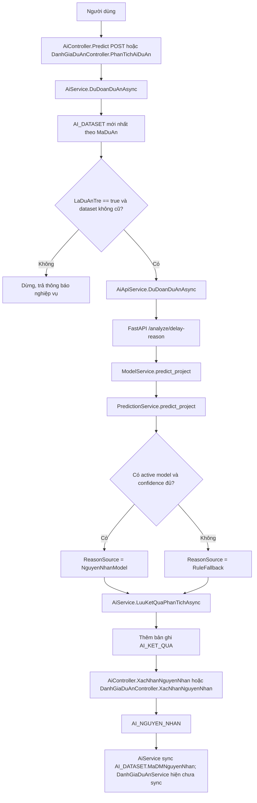

# PHÂN TÍCH CHỨC NĂNG AI PHÂN TÍCH NGUYÊN NHÂN TRỄ

## 1. Phạm vi source đã đọc

### MVC Controller

- `QuanLyDuAn/QuanLyDuAn/Controllers/AiController.cs`
- `QuanLyDuAn/QuanLyDuAn/Controllers/AiDatasetController.cs`
- `QuanLyDuAn/QuanLyDuAn/Controllers/DanhGiaDuAnController.cs`
- `QuanLyDuAn/QuanLyDuAn/Controllers/DuAnController.cs`
- `QuanLyDuAn/QuanLyDuAn/Controllers/DashboardController.cs`

### MVC Service

- `QuanLyDuAn/QuanLyDuAn/Services/Implementations/AiService.cs`
- `QuanLyDuAn/QuanLyDuAn/Services/Implementations/AiDatasetService.cs`
- `QuanLyDuAn/QuanLyDuAn/Services/Implementations/AiApiService.cs`
- `QuanLyDuAn/QuanLyDuAn/Services/Implementations/DuAnService.cs`
- `QuanLyDuAn/QuanLyDuAn/Services/Implementations/TrangThaiWorkflowService.cs`
- `QuanLyDuAn/QuanLyDuAn/Services/Implementations/DanhGiaDuAnService.cs`
- `QuanLyDuAn/QuanLyDuAn/Services/Implementations/DashboardService.cs`
- `QuanLyDuAn/QuanLyDuAn/Services/Implementations/PermissionHelper.cs`
- `QuanLyDuAn/QuanLyDuAn/Services/Implementations/PhanQuyenService.cs`
- `QuanLyDuAn/QuanLyDuAn/Services/Implementations/PermissionDependencyProvider.cs`
- `QuanLyDuAn/QuanLyDuAn/Services/AiApiOptions.cs`

### Interface

- `QuanLyDuAn/QuanLyDuAn/Services/Interfaces/IAiService.cs`
- `QuanLyDuAn/QuanLyDuAn/Services/Interfaces/IAiDatasetService.cs`
- `QuanLyDuAn/QuanLyDuAn/Services/Interfaces/IAiApiService.cs`
- `QuanLyDuAn/QuanLyDuAn/Services/Interfaces/IPermissionHelper.cs`

### ViewModel

- `QuanLyDuAn/QuanLyDuAn/ViewModels/Ai/AiPredictPageViewModel.cs`
- `QuanLyDuAn/QuanLyDuAn/ViewModels/Ai/AiPredictApiViewModels.cs`
- `QuanLyDuAn/QuanLyDuAn/ViewModels/Ai/AiDatasetApiViewModels.cs`
- `QuanLyDuAn/QuanLyDuAn/ViewModels/Ai/AiDatasetPageViewModel.cs`
- `QuanLyDuAn/QuanLyDuAn/ViewModels/Ai/AiStatusApiViewModels.cs`
- `QuanLyDuAn/QuanLyDuAn/ViewModels/DanhGiaDuAn/DanhGiaDuAnAiInsightViewModel.cs`
- `QuanLyDuAn/QuanLyDuAn/ViewModels/DanhGiaDuAn/DanhGiaDuAnThongKeViewModel.cs`

### Razor View

- `QuanLyDuAn/QuanLyDuAn/Views/Shared/_Layout.cshtml`
- `QuanLyDuAn/QuanLyDuAn/Views/Ai/Predict.cshtml`
- `QuanLyDuAn/QuanLyDuAn/Views/Ai/Dashboard.cshtml`
- `QuanLyDuAn/QuanLyDuAn/Views/Ai/Train.cshtml`
- `QuanLyDuAn/QuanLyDuAn/Views/Ai/Models.cshtml`
- `QuanLyDuAn/QuanLyDuAn/Views/AiDataset/Index.cshtml`
- `QuanLyDuAn/QuanLyDuAn/Views/DanhGiaDuAn/_AiInsightCard.cshtml`
- `QuanLyDuAn/QuanLyDuAn/Views/DanhGiaDuAn/_ProjectStats.cshtml`
- `QuanLyDuAn/QuanLyDuAn/Views/DanhGiaDuAn/_Form.cshtml`
- `QuanLyDuAn/QuanLyDuAn/Views/DanhGiaDuAn/ChiTiet.cshtml`
- `QuanLyDuAn/QuanLyDuAn/Views/DanhGiaDuAn/Index.cshtml`
- `QuanLyDuAn/QuanLyDuAn/Views/DuAn/Details.cshtml`
- `QuanLyDuAn/QuanLyDuAn/Views/DuAn/Index.cshtml`
- `QuanLyDuAn/QuanLyDuAn/Views/Dashboard/Index.cshtml`

### Entity

- `QuanLyDuAn/QuanLyDuAn/Models/Entities/AiDataset.cs`
- `QuanLyDuAn/QuanLyDuAn/Models/Entities/AiKetQua.cs`
- `QuanLyDuAn/QuanLyDuAn/Models/Entities/AiNguyenNhan.cs`
- `QuanLyDuAn/QuanLyDuAn/Models/Entities/AiModel.cs`
- `QuanLyDuAn/QuanLyDuAn/Models/Entities/DmNguyenNhan.cs`
- `QuanLyDuAn/QuanLyDuAn/Models/Entities/DuAn.cs`
- `QuanLyDuAn/QuanLyDuAn/Models/Entities/CongViec.cs`
- `QuanLyDuAn/QuanLyDuAn/Models/Entities/CtCongViec.cs`
- `QuanLyDuAn/QuanLyDuAn/Models/Entities/TienDoCongViec.cs`
- `QuanLyDuAn/QuanLyDuAn/Models/Entities/NganSach.cs`
- `QuanLyDuAn/QuanLyDuAn/Models/Entities/ChiPhi.cs`
- `QuanLyDuAn/QuanLyDuAn/Models/Entities/DeXuatCongViec.cs`
- `QuanLyDuAn/QuanLyDuAn/Models/Entities/DeXuatNganSach.cs`
- `QuanLyDuAn/QuanLyDuAn/Models/Entities/NhanVienDuAn.cs`
- `QuanLyDuAn/QuanLyDuAn/Models/Entities/NhatKyQuanLyDuAn.cs`
- `QuanLyDuAn/QuanLyDuAn/Models/Entities/NhatKyPhuTrachDuAn.cs`
- `QuanLyDuAn/QuanLyDuAn/Models/Entities/NhatKyDuAn.cs`

### DbContext và mapping

- `QuanLyDuAn/QuanLyDuAn/Data/QuanLyDuAnDbContext.cs`
- `QuanLyDuAn/QuanLyDuAn/Data/KhoiTaoTaiKhoanMacDinh.cs`

### Permission

- `QuanLyDuAn/QuanLyDuAn/Constants/Permissions.cs`
- `QuanLyDuAn/QuanLyDuAn/Constants/TrangThai.cs`
- `QuanLyDuAn/QuanLyDuAn/Constants/AiReasonHeuristic.cs`
- `QuanLyDuAn/QuanLyDuAn/Services/Implementations/PermissionHelper.cs`
- `QuanLyDuAn/QuanLyDuAn/Services/Implementations/PhanQuyenService.cs`
- `QuanLyDuAn/QuanLyDuAn/Services/Implementations/PermissionDependencyProvider.cs`

### FastAPI

- `QuanLyDuAnAIService/app/main.py`
- `QuanLyDuAnAIService/app/routers/prediction_router.py`
- `QuanLyDuAnAIService/app/routers/model_router.py`
- `QuanLyDuAnAIService/app/routers/admin_router.py`
- `QuanLyDuAnAIService/app/routers/health_router.py`
- `QuanLyDuAnAIService/app/services/prediction_service.py`
- `QuanLyDuAnAIService/app/services/model_service.py`
- `QuanLyDuAnAIService/app/services/validation_service.py`
- `QuanLyDuAnAIService/app/ml/feature_builder.py`
- `QuanLyDuAnAIService/app/ml/decision_tree_model.py`
- `QuanLyDuAnAIService/app/ml/model_storage.py`
- `QuanLyDuAnAIService/app/schemas.py`
- `QuanLyDuAnAIService/app/constants.py`
- `QuanLyDuAnAIService/app/config.py`

### SQL hoặc migration nếu có

- Không đọc migration cụ thể vì yêu cầu hiện tại là phân tích source hiện hành. Mapping và quan hệ được kiểm tra qua `QuanLyDuAnDbContext.cs` và entity.

## 2. Tổng quan chức năng hiện tại

Chức năng hiện tại là phân tích nguyên nhân trễ dự án, không dự đoán dự án có trễ hay không. MVC là nơi xác định `LaDuAnTre`, tổng hợp feature vào `AI_DATASET`, gọi FastAPI để nhận gợi ý nguyên nhân, lưu gợi ý vào `AI_KET_QUA`, sau đó cho người có quyền xác nhận nguyên nhân vào `AI_NGUYEN_NHAN`.

Actor chính trong source là Manager. Admin có quyền dataset, train, model, dashboard theo seed quyền, nhưng không được xem là actor tác nghiệp phân tích/xác nhận trong các flow đánh giá dự án. FastAPI không kết nối DB, không ghi nhãn nghiệp vụ và chỉ xử lý validate, train, model local, phân tích nguyên nhân.

Vị trí giao diện hiện tại gồm menu AI riêng, trang `Ai/Predict`, trang `Ai/Dashboard`, trang dataset/train/model và một thẻ AI trong màn hình đánh giá dự án. Trang chi tiết dự án chỉ có đường dẫn sang đánh giá dự án, chưa có tab hoặc vùng phân tích nguyên nhân trễ chính thức.

Bảng dữ liệu liên quan chính:

- `AI_DATASET`: feature và nhãn confirmed được đồng bộ.
- `AI_KET_QUA`: kết quả gợi ý AI hoặc fallback.
- `AI_NGUYEN_NHAN`: nguyên nhân do người dùng xác nhận, được xem là ground truth.
- `AI_MODEL`: metadata model phía MVC.
- `DM_NGUYEN_NHAN`: danh mục nguyên nhân.
- `DU_AN`, `CONG_VIEC`, `CT_CONG_VIEC`, `TIEN_DO_CONG_VIEC`, `NGAN_SACH`, `CHI_PHI`, `DE_XUAT_CONG_VIEC`, `DE_XUAT_NGAN_SACH`, `NHAN_VIEN_DU_AN`, các bảng nhật ký quản lý/phụ trách/dự án.

## 3. Sơ đồ luồng AS-IS



Điểm cần chú ý: `AiDatasetService.TongHopDatasetChoDuAnAsync` chỉ cho trạng thái `HoanThanh` và `LuuTru`, nên nhánh phân tích dự án `DangThucHien` nhưng quá hạn hiện không đi qua đủ pipeline chuẩn.

## 4. Vị trí hiện tại của chức năng trong giao diện

Menu AI riêng nằm trong `Views/Shared/_Layout.cshtml`. Các entry hiện có:

- `AiDataset/Index`: dataset.
- `Ai/Train`: huấn luyện model.
- `Ai/Models`: quản lý model.
- `Ai/Predict`: phân tích nguyên nhân trễ dự án.
- `Ai/Dashboard`: dashboard AI.

Trang `Views/Ai/Predict.cshtml` là màn hình phân tích AI cấp hệ thống. Trang này cho chọn dự án từ dataset, hiển thị 22 feature, gọi `AiController.Predict` và có form xác nhận nguyên nhân.

Màn hình đánh giá dự án dùng `Views/DanhGiaDuAn/_AiInsightCard.cshtml` trong `Views/DanhGiaDuAn/_Form.cshtml`. Nút `Phân tích AI` hoặc `Phân tích lại AI` gọi `DanhGiaDuAnController.PhanTichAiDuAn`. Đây là vị trí vận hành gần nghiệp vụ đánh giá, nhưng source hiện tại vẫn phụ thuộc `AI_DATASET`.

Trang chi tiết dự án `Views/DuAn/Details.cshtml` chưa có tab phân tích nguyên nhân trễ. Source chỉ thể hiện đường dẫn sang đánh giá dự án khi có quyền xem đánh giá.

Dashboard tổng `Views/Dashboard/Index.cshtml` chỉ có link tới `Ai/Dashboard` khi có `AI.Dashboard`. `Views/Ai/Dashboard.cshtml` hiển thị thống kê, cảnh báo và model/dataset, không phải nơi thao tác chính.

Đánh giá hiện trạng: chức năng đang nằm ở nhiều vị trí. Vị trí menu AI phù hợp cho quản trị AI, dataset, train, model, dashboard; nhưng không nên là vị trí chính của thao tác phân tích theo từng dự án. Màn hình đánh giá dự án phù hợp để xem tham khảo, nhưng thao tác chính nên đặt ở chi tiết dự án vì chi tiết dự án là nơi người quản lý nhìn tổng trạng thái, timeline, công việc, chi phí, nhân sự và quyết định vận hành.

## 5. Quyền và data scope hiện tại

| Thao tác | Permission | Role thường dùng | Scope dự án | File kiểm tra |
| -------- | ---------- | ---------------- | ----------- | ------------- |
| Xem dashboard AI | `AI.Dashboard` | Admin, Manager | Không thấy scope dự án trong controller; dashboard service có các query thống kê chung | `AiController.Dashboard`, `Views/Ai/Dashboard.cshtml`, `DashboardService` |
| Xem/chạy phân tích ở menu AI | `AI.PhanTichNguyenNhan` | Manager theo seed; Admin không được seed quyền này | GET lọc dropdown theo scope nếu không phải Admin; POST `AiService.DuDoanDuAnAsync` chưa thấy re-check scope theo project | `AiController.Predict`, `AiService.KhoiTaoTrangPredictAsync`, `AiService.DuDoanDuAnAsync` |
| Xác nhận ở menu AI | `AI.XacNhan` ở controller; service cho Manager role hoặc claim `AI.XacNhan` | Manager | `AiService.XacNhanNguyenNhanAsync` kiểm tra dự án do user quản lý hoặc là thành viên `NhanVienDuAn` | `AiController.XacNhanNguyenNhan`, `AiService.XacNhanNguyenNhanAsync` |
| Phân tích trong đánh giá dự án | `DanhGiaDuAn.DanhGia` hoặc `DanhGiaDuAn.Sua` theo controller/service | Manager | `DanhGiaDuAnService.PhanTichAiDuAnAsync` yêu cầu Manager và thuộc scope dự án; Admin bị chặn tác nghiệp | `DanhGiaDuAnController.PhanTichAiDuAn`, `DanhGiaDuAnService.PhanTichAiDuAnAsync` |
| Xác nhận trong đánh giá dự án | `AI.XacNhan` hoặc `DanhGiaDuAn.DanhGia` do `PermissionHelper.HasPermissionAsync` dùng OR; service cũng dùng OR | Manager hoặc user có claim phù hợp | Service yêu cầu Manager hoặc claim `AI.XacNhan`, và thuộc scope dự án | `DanhGiaDuAnController.XacNhanNguyenNhan`, `DanhGiaDuAnService.XacNhanNguyenNhanAsync`, `PermissionHelper.HasPermissionAsync` |
| Tổng hợp dataset | `AI.Dataset` | Admin theo seed | Không thấy kiểm tra scope dự án | `AiDatasetController`, `AiDatasetService` |
| Export dataset | `ThongKe.XuatFile` | User có quyền export | Không yêu cầu thêm `AI.Dataset` trong controller | `AiDatasetController.XuatFile` |
| Train model | `AI.Train` | Admin theo seed | Không áp dụng scope dự án | `AiController.Train`, `AiService.TrainModelAsync` |
| Quản lý model | `AI.Train` | Admin theo seed | Không áp dụng scope dự án | `AiController.Models`, `AiController.SetActiveModel`, `AiController.DeleteModel` |

Admin: seed quyền cho Admin có `AI.Xem`, `AI.Dataset`, `AI.Train`, `AI.Dashboard`, không thấy seed `AI.PhanTichNguyenNhan` hoặc `AI.XacNhan`. Trong `DanhGiaDuAnService`, Admin còn bị chặn tác nghiệp đánh giá bởi `KiemTraKhongPhaiAdmin`.

Leader/Employee: chưa thấy seed quyền AI phân tích/xác nhận cho Employee; `PermissionDependencyProvider` deny `AI.Dataset`, `AI.Train`, `AI.XacNhan` cho Employee. Chưa đủ bằng chứng trong source để kết luận Leader được chạy phân tích AI.

Người quản lý cũ: scope xác nhận trong `AiService.XacNhanNguyenNhanAsync` dựa trên `DU_AN.MaNguoiDung` hiện tại hoặc thành viên `NhanVienDuAn`. Nếu người quản lý cũ không còn là `MaNguoiDung` và không còn là thành viên dự án thì không còn scope; nếu vẫn còn trong `NhanVienDuAn` và có quyền thì vẫn có khả năng qua scope.

## 6. Quy tắc xác định dự án trễ hiện tại

### Trong `AiDatasetService`

Method chính: `AiDatasetService.XacDinhDuAnTre`.

Điều kiện:

```text
Nếu trạng thái là hoàn thành và có NgayKetThucDuAn + NgayHoanThanhThucTeDuAn:
    LaDuAnTre = NgayHoanThanhThucTeDuAn.Date > NgayKetThucDuAn.Date
Ngược lại:
    quaHanDuAn = NgayKetThucDuAn.HasValue && homNay > NgayKetThucDuAn.Value.Date && !daHoanThanh
    LaDuAnTre = quaHanDuAn || soCongViecTre > 0 || tyLeCongViecTre >= 0.2 || soNgayTreTienDo > 0
```

Ngày dùng: `DateTime.Today` truyền vào biến `homNay`. So sánh theo `.Date`, không tính giờ. Trong chính ngày kết thúc dự kiến chưa bị coi là trễ vì dùng toán tử `>`, không dùng `>=`.

Điểm hợp lý: với dự án hoàn thành có `NgayHoanThanhThucTeDuAn`, rule hoàn thành trễ ổn định hơn vì không phụ thuộc ngày hiện tại.

Điểm chưa hợp lý: `AiDatasetService` chỉ tổng hợp trạng thái `HoanThanh` và `LuuTru`, nên nhánh `quaHanDuAn` cho dự án đang thực hiện quá hạn gần như không được dùng trong pipeline dataset chuẩn.

### Trong `AiDatasetService.TinhSoCongViecTreAsync`

Đếm công việc trễ khi:

```text
NgayKetThucCVDuKien.Date < homNay
và trạng thái công việc chưa hoàn thành.
```

Hoặc công việc đã hoàn thành nhưng `NgayKetThucCVThucTe.Date > NgayKetThucCVDuKien.Date`.

### Trong `AiDatasetService.TinhSoNgayTreTienDoAsync`

Nếu dự án có `NgayKetThucDuAn` và `NgayHoanThanhThucTeDuAn`, số ngày trễ dự án là:

```text
max(0, NgayHoanThanhThucTeDuAn.Date - NgayKetThucDuAn.Date)
```

Nếu không có ngày hoàn thành thực tế, service lấy max số ngày trễ từ công việc: với công việc chưa hoàn thành dùng `homNay`, với công việc đã hoàn thành dùng `NgayKetThucCVThucTe`.

### Trong `DuAnService`

- `DuAnService.GetDetailsAsync` tính cảnh báo deadline bằng `DateTime.Today`.
- Cùng method này lại tính công việc trễ bằng `NgayKetThucCVDuKien.Value < DateTime.Now`, tức có so sánh cả giờ. Đây là điểm không đồng nhất với dataset và đánh giá dự án.
- `DuAnService.ConfirmCompletionAsync` đặt `DU_AN.NgayHoanThanhThucTeDuAn = DateTime.Now`.
- `DuAnService.SaveAsync` khi trạng thái được lưu là `HoanThanh` cũng set `NgayHoanThanhThucTeDuAn ??= DateTime.Now`.
- `DuAnService.MoLaiDuAnAsync` chuyển từ `HoanThanh` sang `DangThucHien` và xóa `NgayHoanThanhThucTeDuAn = null`.
- `DuAnService.DuAnHoanThanhDungHan` dùng `NgayHoanThanhThucTeDuAn.Value.Date <= NgayKetThucDuAn.Value.Date`.

### Trong `DanhGiaDuAnService`

- `BuildTimelineInsightAsync` dùng `DateTime.Now.Date`, so sánh ngày.
- `LoadThongTinHoTroDanhGiaAsync` lấy ngày hoàn thành thực tế theo ưu tiên `DU_AN.NgayHoanThanhThucTeDuAn`, fallback về ngày hoàn thành công việc cuối cùng nếu thiếu.
- `XacDinhTrangThaiThucTeTienDo` phân loại `HoanThanhTreHan`, `DangThucHienQuaHan`, `HoanThanhDungHan`, v.v.

### Kết luận rule trễ

Hệ thống có trường ngày hoàn thành thực tế: `DU_AN.NgayHoanThanhThucTeDuAn`.

Nếu thiếu trường này, một số phần hỗ trợ đánh giá dùng ngày hoàn thành công việc cuối cùng; dataset dùng max trễ từ công việc nếu không có ngày hoàn thành dự án. Vì vậy có nguy cơ rule sau hoàn thành không hoàn toàn ổn định nếu dữ liệu thiếu `NgayHoanThanhThucTeDuAn`.

LaDuAnTre trong `AI_DATASET` được lưu cố định tại thời điểm tổng hợp dataset, không chỉ tính runtime. Tuy nhiên nếu tổng hợp lại ngày hôm sau, dự án chưa hoàn thành có thể đổi từ không trễ sang trễ theo `DateTime.Today`. Trong pipeline hiện tại, do chỉ tổng hợp `HoanThanh`/`LuuTru`, rủi ro này chủ yếu xuất hiện nếu sau này mở rộng dataset cho `DangThucHien`.

## 7. Điều kiện được phép phân tích hiện tại

| Trạng thái dự án | Chưa đến hạn | Đã quá hạn | Hoàn thành đúng hạn | Hoàn thành trễ | Hiện có được phân tích không | Source |
| ---------------- | -----------: | ---------: | ------------------: | -------------: | ---------------------------- | ------ |
| `KhoiTao` | Không | Không | Không áp dụng | Không áp dụng | Không có dataset vì không nằm trong trạng thái tổng hợp | `AiDatasetService.LayTrangThaiChoPhepTongHopAi`, `TongHopDatasetChoDuAnAsync` |
| `DangThucHien` | Không | Không trong flow chuẩn | Không áp dụng | Không áp dụng | Bị chặn do không tổng hợp `AI_DATASET`; đánh giá dự án có nút nhưng gọi dataset cho dự án sẽ fail nếu chưa có dataset | `AiDatasetService.TongHopDatasetChoDuAnAsync`, `AiService.DuDoanDuAnAsync`, `DanhGiaDuAnService.PhanTichAiDuAnAsync` |
| `TamDung` | Không | Không | Không áp dụng | Không áp dụng | Không có dataset vì không nằm trong trạng thái tổng hợp | `AiDatasetService.LayTrangThaiChoPhepTongHopAi` |
| `ChoXacNhanHoanThanh` | Không | Không | Chưa hoàn thành chính thức | Chưa hoàn thành chính thức | Không có dataset vì không nằm trong trạng thái tổng hợp | `TrangThaiWorkflowService.DongBoTrangThaiDuAnTheoCongViecAsync`, `AiDatasetService` |
| `HoanThanh` | Không áp dụng | Không áp dụng | Không, vì `LaDuAnTre != true` bị chặn | Có | Có nếu dataset tồn tại, đủ feature, không cũ | `AiDatasetService`, `AiService.DuDoanDuAnAsync` |
| `DaHuy` | Không | Không | Không áp dụng | Không áp dụng | Không có dataset vì không nằm trong trạng thái tổng hợp | `AiDatasetService.LayTrangThaiChoPhepTongHopAi` |
| `LuuTru` | Không áp dụng | Không áp dụng | Thường chỉ lưu trữ khi hoàn thành đúng hạn theo `DuAnService`; nếu không trễ thì bị chặn | Nếu tồn tại dữ liệu trễ thì có thể phân tích vì dataset cho phép `LuuTru` | `DuAnService.DuAnHoanThanhDungHan`, `AiDatasetService.LayTrangThaiChoPhepTongHopAi` |

Kết luận: source hiện tại chỉ hỗ trợ chắc chắn phân tích dự án đã có `AI_DATASET` và `LaDuAnTre == true`. Với trạng thái đang thực hiện nhưng quá hạn, source đánh giá dự án có ý định hiển thị trạng thái trễ, nhưng pipeline phân tích bị chặn bởi dataset.

## 8. Pipeline AI Dataset hiện tại

Pipeline hiện tại:

```text
Dữ liệu nghiệp vụ
-> AiDatasetService.TongHopDatasetAsync/TongHopDatasetChoDuAnAsync
-> AI_DATASET gồm 22 feature, LaDuAnTre, MaDMNguyenNhan nếu đã có xác nhận
-> AiService.KiemTraChatLuongDatasetAsync hoặc FastAPI /dataset/validate
-> AiService.TrainModelAsync gửi dataset hợp lệ sang FastAPI /model/train
-> AiService.DuDoanDuAnAsync gửi feature sang FastAPI /analyze/delay-reason
-> AiService.LuuKetQuaPhanTichAsync thêm AI_KET_QUA
-> AiService.XacNhanNguyenNhanAsync hoặc DanhGiaDuAnService.XacNhanNguyenNhanAsync ghi AI_NGUYEN_NHAN
-> AiService.XacNhanNguyenNhanAsync sync AI_DATASET.MaDMNguyenNhan
```

22 feature trong `AI_DATASET` và FastAPI `FEATURE_COLUMNS`:

1. `SoNhanVienDuAn`
2. `TongSoCongViec`
3. `SoCongViecTre`
4. `TyLeCongViecTre`
5. `ChiPhiDuKien`
6. `ChiPhiThucTe`
7. `ChenhLechChiPhi`
8. `SoLanThayDoiNhanSu`
9. `SoLanThayDoiQuanLy`
10. `SoNgayTreTienDo`
11. `SoDeXuatCongViecChoDuyet`
12. `SoDeXuatCongViecBiTuChoi`
13. `ThoiGianDuyetCongViecTrungBinh`
14. `SoDeXuatNganSachChoDuyet`
15. `SoDeXuatNganSachBiTuChoi`
16. `ThoiGianDuyetNganSachTrungBinh`
17. `SoBaoCaoTienDoChoDuyet`
18. `SoBaoCaoTienDoBiTuChoi`
19. `SoBaoCaoTienDoYeuCauBoSung`
20. `TyLeBaoCaoTienDoBiTuChoi`
21. `SoLanCapNhatTienDo`
22. `SoNgayChamCapNhatTienDo`

Hiện tại `AiDatasetService.LayTrangThaiChoPhepTongHopAi` chỉ cho `HoanThanh` và `LuuTru`. Không có `DangThucHien`.

Điều kiện đủ feature:

- MVC: `AiDatasetService.HasDuFeature` kiểm tra đủ 22 feature và `MaDMNguyenNhan` khi lấy dataset train.
- FastAPI: `feature_builder.get_missing_features` và Pydantic `PredictFeatureInput` yêu cầu đủ 22 feature cho analyze.

Điều kiện train:

- `AiDatasetService.LayDatasetNguyenNhanHopLeDeTrainAsync`: chỉ lấy `LaDuAnTre == true` và `MaDMNguyenNhan.HasValue`.
- FastAPI `ModelService._validate_reason_dataset`: bỏ dòng không `LaDuAnTre=1`, thiếu feature, thiếu hoặc sai `MaDMNguyenNhan`; yêu cầu min rows, min class count, min rows per class theo `config.py`.

Chống dùng prediction làm label:

- Source train dùng `AI_DATASET.MaDMNguyenNhan`.
- `AI_DATASET.MaDMNguyenNhan` được sync từ `AI_NGUYEN_NHAN` trong `AiDatasetService` và `AiService.XacNhanNguyenNhanAsync`.
- Không thấy `AI_KET_QUA` được dùng trực tiếp làm label train.

Khoảng cách hiện tại:

- Chưa có cơ chế phân biệt dataset vận hành tạm thời và dataset lịch sử chính thức.
- `AI_DATASET.NgayTongHop` vừa là thời điểm tổng hợp feature, vừa bị `AiService.XacNhanNguyenNhanAsync` cập nhật khi xác nhận label; điều này có thể làm mờ nghĩa timestamp.
- Chưa có flag loại phân tích tạm thời/chính thức.

## 9. Luồng gọi FastAPI

| Thành phần | File/method | Dữ liệu vào | Dữ liệu ra | Xử lý lỗi |
| ---------- | ----------- | ----------- | ---------- | --------- |
| MVC API client | `AiApiService.DuDoanDuAnAsync` | `AiAnalyzeDelayReasonRequestViewModel`: `maDuAn`, 22 feature, `danhMucNguyenNhan`, `reasonConfidenceThreshold` | `AiAnalyzeDelayReasonResponseViewModel` | Retry theo `AiApiOptions.RetryCount`; timeout trả `LaDuLieuFallback`, `LaLoiTimeout`; lỗi mạng trả thông báo không kết nối |
| FastAPI route | `prediction_router.analyze_delay_reason` | `PredictProjectRequest` | Envelope success chứa `PredictProjectResponse` | Exception trả HTTP 400 với message `Lỗi phân tích nguyên nhân trễ` |
| Model chọn active | `ModelService.predict_project` | `PredictProjectRequest` | Truyền model active nếu cache có `NguyenNhan` | Nếu không lấy được model thì gọi prediction với model `None` |
| Prediction | `PredictionService.predict_project` | Feature đã build DataFrame, danh mục nguyên nhân, threshold | Reason code/name, confidence, source, warning, explanation | Nếu model lỗi, confidence thấp hoặc không map danh mục thì fallback rule |
| Validate feature | `feature_builder.build_feature_frame(strict=True)` | 22 feature | Pandas DataFrame | Thiếu feature raise `ValueError` |

Endpoint chính: `/analyze/delay-reason`.

Endpoint alias cũ: `/predict/project` gọi lại `analyze_delay_reason`.

FastAPI không kiểm tra dự án trễ. Schema `PredictProjectRequest` không nhận `LaDuAnTre`; `DatasetRow` có `LaDuAnTre` cho validate/train, nhưng `PredictFeatureInput` không có trường này. MVC cũng có xử lý lỗi 422 nhắc không gửi `LaDuAnTre` trong payload phân tích nguyên nhân.

Confidence threshold:

- MVC gửi `ReasonConfidenceThreshold = 0.6` trong `AiService.DuDoanDuAnAsync`.
- FastAPI fallback mặc định `REASON_CONFIDENCE_THRESHOLD=0.6` trong `config.py` nếu request không truyền.
- Nếu model confidence thấp hơn threshold, `PredictionService.predict_project` chuyển sang `RuleFallback` và gắn cảnh báo.

Model active:

- `main.startup_event` gọi `model_service.startup_load_default_models`.
- Active alias mặc định là `reason_active.joblib`.
- Nếu chưa có active model hoặc không load được, `ModelService.predict_project` truyền model `None`, `PredictionService` dùng fallback rule và cảnh báo.

Khi nguyên nhân model trả về không có trong danh mục:

- `PredictionService._map_reason_code_to_catalog` trả `None`.
- `_predict_reason_by_model` trả `None` nếu có danh mục nhưng không map được.
- `predict_project` chuyển sang fallback rule với cảnh báo `Model nguyên nhân không map được danh mục nguyên nhân`.
- Ở MVC, nếu kết quả vẫn thiếu `MaDMNguyenNhanDuDoan`, `AiService.LuuKetQuaPhanTichAsync` fallback sang bản ghi đầu tiên của `DM_NGUYEN_NHAN`.

Kết quả fallback được lưu giống kết quả model: `AiService.LuuKetQuaPhanTichAsync` luôn thêm `AI_KET_QUA` nếu response hợp lệ, lưu `ReasonSource` là `RuleFallback` hoặc `NguyenNhanModel`.

UI có phân biệt source: `Views/Ai/Predict.cshtml` và `Views/DanhGiaDuAn/_AiInsightCard.cshtml` hiển thị source/badge dạng model hoặc rule fallback, nhưng chưa phân biệt tạm thời/chính thức.

## 10. Luồng lưu kết quả và xác nhận nguyên nhân

### `AI_KET_QUA`

Entity `AiKetQua` lưu:

- `MaDuAn`
- `MaData`
- `MaModel`
- `MaDMNguyenNhan`
- `DoTinCayKetQua`
- `ThoiGianDuDoanKetQua`
- `ReasonSource`
- `CanhBaoNguyenNhan`
- `NoiDungPhanTich`

`AiService.LuuKetQuaPhanTichAsync` luôn tạo bản ghi mới. Không thấy unique constraint hoặc cơ chế chống tạo trùng/ghi đè. Một dự án có thể có nhiều `AI_KET_QUA`. Bản mới nhất được lấy bằng `ThoiGianDuDoanKetQua desc, MaAiKetQua desc`.

`AI_KET_QUA` không phải ground truth.

### `AI_NGUYEN_NHAN`

Entity `AiNguyenNhan` lưu:

- `MaDuAn`
- `MaDMNguyenNhan`
- `DoTinCay`
- `NgayXacNhan`
- `MaNguoiDungXacNhan`
- `GhiChuXacNhan`
- Soft delete fields.

Một dự án về mặt DB có thể có nhiều `AI_NGUYEN_NHAN`. Tuy nhiên `AiService.XacNhanNguyenNhanAsync` lấy bản mới nhất chưa xóa rồi update bản đó; nếu chưa có thì tạo mới. Như vậy flow này không tạo lịch sử xác nhận đầy đủ sau lần đầu.

`DanhGiaDuAnService.XacNhanNguyenNhanAsync` cũng lấy bản mới nhất rồi update hoặc tạo, nhưng có điểm lệch nghiêm trọng: khi tạo mới không thấy set `NgayXacNhan` và `MaNguoiDungXacNhan`; khi update không thấy cập nhật hai trường này; đồng thời không sync lại `AI_DATASET.MaDMNguyenNhan`.

### `AI_DATASET.MaDMNguyenNhan`

`AiDatasetService.TongHopNoiBoAsync` lấy nguyên nhân đã xác nhận gần nhất từ `AI_NGUYEN_NHAN` và gán vào dataset.

`AiService.XacNhanNguyenNhanAsync` sync trực tiếp:

```text
dataset.MaDMNguyenNhan = MaDMNguyenNhan xác nhận
dataset.NgayTongHop = DateTime.Now
dataset.GhiChuDataset = "Đã đồng bộ nguyên nhân Manager xác nhận..."
```

Không thấy `AI_KET_QUA` được dùng để ghi label train. Đây là đúng nguyên tắc.

## 11. Khả năng phân tích dự án đang thực hiện nhưng đã quá hạn

Source hiện tại chưa hỗ trợ trọn vẹn.

Bị chặn ở dataset:

- `AiDatasetService.TongHopDatasetChoDuAnAsync` chỉ cho trạng thái thuộc `LayTrangThaiChoPhepTongHopAi`.
- `LayTrangThaiChoPhepTongHopAi` chỉ trả `HoanThanh` và `LuuTru`.
- `AiService.DuDoanDuAnAsync` bắt buộc có dataset mới nhất, không cũ, và `LaDuAnTre == true`.

Bị chặn ở UI/flow:

- `DanhGiaDuAnService.PhanTichAiDuAnAsync` có thể được gọi từ đánh giá dự án khi Manager có quyền đánh giá, nhưng nếu không có dataset thì service gọi `_aiDatasetService.TongHopDatasetChoDuAnAsync(maDuAn)`. Với `DangThucHien`, lời gọi này bị chặn do trạng thái.
- `Ai/Predict` chỉ load dropdown từ các dự án có dataset. Dự án đang thực hiện quá hạn không có dataset thì không xuất hiện.

Có thể tận dụng:

- Feature builder trong `AiDatasetService.TongHopNoiBoAsync` đã có nhiều logic tính số công việc trễ, chi phí, đề xuất, tiến độ.
- FastAPI không cần biết trạng thái dự án và có thể phân tích nếu MVC gửi đủ 22 feature.
- `AiService.DuDoanDuAnAsync` đã có cơ chế gọi FastAPI và lưu kết quả.

Cần thay đổi nếu triển khai sau này:

- Tách feature snapshot vận hành khỏi dataset train, hoặc thêm phân loại tạm thời/chính thức.
- Cho phép build feature trực tiếp cho dự án `DangThucHien` quá hạn mà không đưa vào tập train.
- Chặn xác nhận ground truth cho phân tích tạm thời.
- Gắn trạng thái dữ liệu, thời điểm snapshot, model used, và stale indicator rõ ràng.

Nguy cơ ảnh hưởng dữ liệu train: cao nếu mở rộng `AI_DATASET` cho dự án đang thực hiện mà không có cờ phân biệt, vì `LayDatasetNguyenNhanHopLeDeTrainAsync` train theo `LaDuAnTre == true && MaDMNguyenNhan.HasValue`.

## 12. Khả năng tách phân tích tạm thời và phân tích chính thức

| Tiêu chí | Phân tích tạm thời | Phân tích chính thức |
| -------- | ------------------ | -------------------- |
| Trạng thái dự án | `DangThucHien` nhưng đã quá hạn | `HoanThanh` sau thời hạn dự kiến |
| Mục đích | Hỗ trợ Manager can thiệp khi dự án còn vận hành | Tổng kết nguyên nhân cuối cùng sau khi dự án kết thúc |
| Có lưu `AI_KET_QUA` | Có thể lưu nếu có cờ `TamThoi` hoặc snapshot riêng | Có, là kết quả phân tích chính thức |
| Có xác nhận `AI_NGUYEN_NHAN` | Không | Có, Manager xác nhận |
| Có dùng để train | Không | Có, sau khi đã xác nhận |
| Có được chạy lại | Có, khi dữ liệu thay đổi hoặc model đổi | Có thể cho chạy lại trước khi xác nhận; sau xác nhận cần rule kiểm soát |
| Có bị khóa sau xác nhận | Không áp dụng | Nên khóa hoặc yêu cầu quyền/chú thích khi thay đổi |

Source hiện tại chưa đáp ứng tách bạch này:

- `AI_KET_QUA` không có cờ tạm thời/chính thức.
- `AI_DATASET` không có cờ dataset vận hành/lịch sử.
- `AI_NGUYEN_NHAN` không có trạng thái hiệu lực khi mở lại dự án.
- UI chỉ phân biệt `ReasonSource` model/fallback, chưa phân biệt loại kết quả.
- Train đang dựa vào `AI_DATASET` và label, chưa có bộ lọc loại dataset.

## 13. Đề xuất vị trí chức năng phù hợp

### Chi tiết dự án

Nên là vị trí chính. Lý do: đây là màn hình tự nhiên nhất để Manager nhìn tình trạng dự án, công việc, chi phí, nhân sự, deadline, trạng thái và quyết định có phân tích nguyên nhân trễ hay không. Nên có tab riêng tên `Phân tích nguyên nhân trễ` vì tên này bám sát bài toán hiện tại và tránh hiểu nhầm AI dự đoán mọi thứ.

### Đánh giá dự án

Nên là vị trí phụ. Màn hình đánh giá dự án nên hiển thị kết quả phân tích chính thức hoặc link đến tab phân tích trong chi tiết dự án. Có thể cho thao tác xác nhận nếu nghiệp vụ đánh giá là nơi chốt kết quả cuối cùng, nhưng nên dùng chung service/rule với tab chính.

### Menu AI

Nên dành cho dataset, train, model, dashboard, audit và công cụ quản trị. Không nên là nơi chính để Manager thao tác từng dự án, vì người dùng nghiệp vụ thường đi từ dự án cụ thể.

### Dashboard

Nên hiển thị cảnh báo, badge dự án quá hạn, kết quả AI mới/chưa xác nhận, và link về chi tiết dự án. Không nên chạy phân tích trực tiếp ở dashboard.

### Danh sách dự án

Nên hiển thị badge `Đang trễ`, `Đã hoàn thành trễ`, `Đã có AI`, `Chưa xác nhận`, và link nhanh. Không nên đặt nút phân tích chính tại danh sách vì thiếu ngữ cảnh.

Kết luận: vị trí chính nên là tab `Phân tích nguyên nhân trễ` trong chi tiết dự án; đánh giá, dashboard, danh sách và menu AI chỉ là vị trí phụ hoặc điều hướng.

## 14. Đề xuất rule nghiệp vụ TO-BE

```text
Dự án chưa quá hạn:
Không phân tích nguyên nhân trễ.
Chỉ hiển thị trạng thái "Dự án chưa trễ" hoặc cảnh báo nguy cơ nếu có công việc trễ cục bộ.

Dự án đang thực hiện nhưng đã quá hạn:
Cho phép phân tích tạm thời.
Không xác nhận ground truth.
Không đưa vào train.
Cho phép chạy lại khi dữ liệu thay đổi.
Lưu rõ snapshot dữ liệu, thời điểm phân tích, model/fallback, và trạng thái "tạm thời".

Dự án hoàn thành trễ:
Cho phép phân tích chính thức.
Manager hiện tại xác nhận nguyên nhân.
Đồng bộ label đã xác nhận về dataset chính thức.
Được đưa vào train sau khi xác nhận.

Dự án hoàn thành đúng hạn:
Không phân tích nguyên nhân trễ.
Không tạo `AI_NGUYEN_NHAN`.
Có thể hiển thị thông báo "Dự án không trễ".
```

Bổ sung:

- `TamDung`: không xác nhận ground truth. Nếu đã quá hạn, có thể hiển thị cảnh báo tạm dừng ảnh hưởng tiến độ, nhưng phân tích nguyên nhân trễ chỉ nên là tạm thời hoặc chờ tiếp tục/hoàn thành.
- `DaHuy`: không đưa vào train nguyên nhân trễ nếu bản chất là hủy dự án, trừ khi có nghiệp vụ riêng phân tích nguyên nhân hủy. Không gom chung với trễ.
- `LuuTru`: nếu là dự án hoàn thành đúng hạn được lưu trữ thì không phân tích trễ. Nếu sau này cho lưu trữ dự án hoàn thành trễ, chỉ dùng dữ liệu đã xác nhận trước khi lưu trữ hoặc cho xem read-only.
- Mở lại dự án: kết quả chính thức cũ phải chuyển trạng thái `Không còn hiệu lực` hoặc cảnh báo `Dự án đã mở lại sau xác nhận`; không dùng label cũ để train cho đến khi hoàn thành lại và xác nhận lại.
- Đổi Manager: chỉ Manager hiện tại hoặc role được ủy quyền mới xác nhận/chỉnh sửa; cần audit nếu thay đổi xác nhận cũ.
- Dữ liệu AI bị cũ: nếu có tiến độ, công việc, chi phí, ngân sách, nhân sự, manager hoặc trạng thái mới hơn snapshot thì bắt buộc tổng hợp/chạy lại trước phân tích chính thức.
- Model thay đổi: kết quả cũ vẫn giữ lịch sử model đã dùng; UI báo `Model hiện hành đã khác model phân tích`.

## 15. Đề xuất UI TO-BE

| Trạng thái UI | Badge | Nút | Thông báo |
| ------------- | ----- | --- | --------- |
| Dự án chưa đến hạn | `Đúng tiến độ` hoặc `Chưa quá hạn` | Ẩn/disabled `Phân tích nguyên nhân trễ` | `Dự án chưa quá hạn, chưa phát sinh nghiệp vụ phân tích nguyên nhân trễ.` |
| Dự án đang trễ chưa hoàn thành | `Đang quá hạn` + `Phân tích tạm thời` | Hiện `Phân tích tạm thời`; ẩn `Xác nhận nguyên nhân cuối cùng` | `Kết quả chỉ hỗ trợ can thiệp, không phải ground truth.` |
| Dự án hoàn thành trễ | `Hoàn thành trễ` | Hiện `Phân tích chính thức`; hiện `Xác nhận nguyên nhân` nếu có quyền và scope | Cần confirm trước khi ghi `AI_NGUYEN_NHAN`. |
| Dự án hoàn thành đúng hạn | `Hoàn thành đúng hạn` | Ẩn/disabled phân tích | `Dự án không trễ.` |
| Thiếu dữ liệu AI | `Thiếu dữ liệu` | Hiện `Tổng hợp dữ liệu` nếu có quyền; phân tích disabled | `Cần đủ 22 feature trước khi phân tích.` |
| Chưa có model active | `Chưa có model` | Cho phân tích bằng fallback hoặc disabled tùy rule | Nếu cho chạy: `Hệ thống dùng rule fallback, không phải kết quả model.` |
| FastAPI không hoạt động | `AI service lỗi` | Disabled hoặc cho retry | `Không kết nối được AI service.` |
| Confidence thấp và fallback | `Fallback rule` | Cho xem kết quả, cho chạy lại khi có model mới | `Độ tin cậy mô hình thấp, hệ thống chuyển sang luật gợi ý.` |
| Có kết quả AI chưa xác nhận | `Chưa xác nhận` | Hiện `Xác nhận nguyên nhân` với dự án hoàn thành trễ | `AI chỉ là gợi ý.` |
| Đã xác nhận | `Nguyên nhân chính thức` | Ẩn hoặc hiện `Chỉnh sửa xác nhận` có audit | `Đã được Manager xác nhận.` |
| Dataset đã cũ | `Dữ liệu đã cũ` | Disabled phân tích chính thức cho đến khi tổng hợp lại | `Dữ liệu nguồn đã thay đổi sau lần tổng hợp.` |
| Mở lại sau xác nhận | `Xác nhận cũ không còn hiệu lực` | Chỉ cho phân tích tạm thời nếu đang quá hạn | `Dự án đã mở lại sau khi từng xác nhận nguyên nhân.` |
| Có permission AI nhưng ngoài scope | `Không thuộc phạm vi` | Ẩn nút tác nghiệp | `Bạn không thuộc phạm vi dự án này.` |
| Thuộc dự án nhưng không có permission AI | `Chỉ xem` | Ẩn nút phân tích/xác nhận | `Bạn không có quyền phân tích AI.` |

Tên hành động đề xuất:

- `Phân tích tạm thời`
- `Phân tích chính thức`
- `Chạy lại phân tích`
- `Xác nhận nguyên nhân cuối cùng`
- `Cập nhật dữ liệu AI`

## 16. Danh sách file dự kiến phải sửa sau này

| STT | File | Thành phần cần sửa | Lý do | Mức độ ảnh hưởng |
| --: | ---- | ------------------ | ----- | ---------------- |
| 1 | `Views/DuAn/Details.cshtml` | Thêm tab/link `Phân tích nguyên nhân trễ` | Đưa thao tác chính về chi tiết dự án | Trung bình |
| 2 | `DuAnController.cs` | Route tab/phân tích theo dự án nếu chọn đặt trong chi tiết | Cần endpoint dự án cụ thể | Trung bình |
| 3 | `AiService.cs` | Tách rule phân tích tạm thời/chính thức, re-check scope trên POST | Tránh phân tích ngoài scope và tránh lẫn ground truth | Cao |
| 4 | `AiDatasetService.cs` | Build feature tạm thời cho `DangThucHien` quá hạn mà không đưa train | Hỗ trợ use case B | Cao |
| 5 | `DanhGiaDuAnService.cs` | Đồng nhất xác nhận với `AiService`, set người/thời gian xác nhận, sync dataset hoặc gọi chung service | Tránh lệch ground truth | Cao |
| 6 | `DanhGiaDuAnController.cs` | Đồng nhất permission AI với flow chính | Tránh OR permission ngoài ý muốn | Trung bình |
| 7 | `AiController.cs` | Kiểm tra scope khi POST phân tích | GET đã lọc nhưng POST cần chặn trực tiếp | Trung bình |
| 8 | `Views/Ai/Predict.cshtml` | Hiển thị rõ tạm thời/chính thức, stale, fallback, scope | Tránh hiểu nhầm confidence/accuracy | Trung bình |
| 9 | `Views/DanhGiaDuAn/_AiInsightCard.cshtml` | Chuyển thành card hiển thị/link phụ hoặc dùng chung partial với tab chính | Giảm trùng UI | Trung bình |
| 10 | `Models/Entities/AiKetQua.cs` | Cân nhắc field loại kết quả, snapshot, hiệu lực, model version | Cần nếu tách tạm thời/chính thức bền vững | Cao |
| 11 | `Models/Entities/AiNguyenNhan.cs` | Cân nhắc audit lịch sử, hiệu lực sau mở lại, lý do override | Cần quản trị ground truth | Cao |
| 12 | `Data/QuanLyDuAnDbContext.cs` | Mapping field/index mới nếu có thay đổi schema | Chỉ làm khi quyết định sửa DB | Cao |
| 13 | `Constants/Permissions.cs` và seed quyền | Rà lại role nào được phân tích/xác nhận | Quyền hiện phân tán giữa AI và Đánh giá dự án | Trung bình |
| 14 | `AiDatasetController.cs` | Export dataset nên yêu cầu thêm `AI.Dataset` nếu đúng nghiệp vụ | Tránh lộ dataset AI qua quyền export chung | Thấp/Trung bình |
| 15 | `FastAPI prediction_service.py` | Không bắt buộc sửa cho tạm thời; chỉ bổ sung metadata nếu MVC cần | FastAPI hiện đủ compute | Thấp |

## 17. Rủi ro và lỗi phát hiện

| STT | Mức độ | Vấn đề | File/method | Hậu quả | Hướng xử lý |
| --: | ------ | ------ | ----------- | ------- | ----------- |
| 1 | Cao | Dự án `DangThucHien` quá hạn chưa phân tích được trong pipeline chuẩn | `AiDatasetService.TongHopDatasetChoDuAnAsync`, `LayTrangThaiChoPhepTongHopAi`, `AiService.DuDoanDuAnAsync` | Không đáp ứng use case can thiệp sớm | Tạo flow phân tích tạm thời hoặc feature snapshot không đưa train |
| 2 | Cao | Luồng xác nhận trong đánh giá dự án không đồng bộ với luồng AI chính | `DanhGiaDuAnService.XacNhanNguyenNhanAsync` | Có thể thiếu `NgayXacNhan`, `MaNguoiDungXacNhan`, không sync `AI_DATASET.MaDMNguyenNhan` | Dùng chung `AiService.XacNhanNguyenNhanAsync` hoặc refactor một service xác nhận duy nhất |
| 3 | Cao | Chưa có phân biệt kết quả tạm thời/chính thức | `AiKetQua`, `AiDataset`, `AiService` | Nếu mở rộng tùy tiện có thể làm nhiễm train và ground truth | Thêm rule nghiệp vụ và/hoặc field loại kết quả trước khi mở rộng |
| 4 | Trung bình | POST phân tích ở `AiService.DuDoanDuAnAsync` chưa thấy re-check scope dự án | `AiController.Predict`, `AiService.DuDoanDuAnAsync` | User có permission có thể thử POST `MaDuAn` ngoài dropdown | Re-check scope trong service/controller POST |
| 5 | Trung bình | Permission nhiều tham số là OR, không phải AND | `PermissionHelper.HasPermissionAsync`, `DanhGiaDuAnController.XacNhanNguyenNhan` | Kiểm tra `AI.XacNhan` + `DanhGiaDuAn.DanhGia` có thể không chặt như tên gọi | Tách helper hoặc gọi kiểm tra từng quyền khi cần AND |
| 6 | Trung bình | `AiDatasetController.XuatFile` chỉ kiểm tra `ThongKe.XuatFile` | `AiDatasetController.XuatFile` | User có export chung có thể export dataset AI nếu route truy cập được | Yêu cầu đồng thời `AI.Dataset` và `ThongKe.XuatFile` |
| 7 | Trung bình | Rule ngày trễ không đồng nhất giữa các service | `AiDatasetService`, `DanhGiaDuAnService`, `DuAnService.GetDetailsAsync` | UI có thể báo công việc trễ khác dataset | Gom rule ngày trễ vào helper/domain service dùng `.Date` rõ ràng |
| 8 | Trung bình | `AI_KET_QUA` luôn append, không chống trùng hoặc version dữ liệu | `AiService.LuuKetQuaPhanTichAsync`, `AiKetQua` | Lịch sử nhiều bản nhưng thiếu snapshot/source hash để biết bản nào còn hiệu lực | Lưu snapshot/version, hiển thị lịch sử và bản hiện hành |
| 9 | Trung bình | Xác nhận mới update bản mới nhất, không tạo lịch sử đầy đủ | `AiService.XacNhanNguyenNhanAsync` | Mất lịch sử thay đổi nguyên nhân | Dùng append-only hoặc soft-close bản cũ |
| 10 | Trung bình | Xác nhận cập nhật `AI_DATASET.NgayTongHop` dù không tổng hợp lại feature | `AiService.XacNhanNguyenNhanAsync` | Timestamp dataset có thể hiểu sai, stale detection yếu đi | Tách `NgayTongHopFeature` và `NgayDongBoNhan`, hoặc không đổi `NgayTongHop` khi chỉ sync label |
| 11 | Trung bình | Mở lại dự án không xử lý kết quả/nhãn AI cũ | `DuAnService.MoLaiDuAnAsync` | Ground truth cũ có thể còn hiệu lực giả | Đánh dấu kết quả/xác nhận cũ không còn hiệu lực khi mở lại |
| 12 | Trung bình | Fallback sang nguyên nhân đầu tiên nếu FastAPI không trả mã hợp lệ | `AiService.LuuKetQuaPhanTichAsync` | Có thể lưu nguyên nhân không đúng ý nghĩa | Không lưu hoặc yêu cầu Manager chọn rõ nếu không map được |
| 13 | Thấp | Comment trong `AiReasonHeuristic.cs` bị mojibake | `Constants/AiReasonHeuristic.cs` | Rủi ro encoding/comment khó đọc | Sửa comment UTF-8 ở lượt chỉnh code riêng |
| 14 | Thấp | Confidence có thể bị hiểu nhầm thành accuracy | `Views/Ai/Predict.cshtml`, `Views/DanhGiaDuAn/_AiInsightCard.cshtml`, FastAPI response | Người dùng tin quá mức vào gợi ý | UI ghi rõ confidence là độ phù hợp/gợi ý, không phải độ đúng tuyệt đối |
| 15 | Trung bình | Active model thay đổi nhưng `AI_KET_QUA` không có field version rõ ngoài link `MaModel`/metadata | `AiService.LuuKetQuaPhanTichAsync`, `AiModel` | Khó giải thích kết quả cũ khi model đã đổi | Lưu tên file model/version/source rõ trong kết quả |

## 18. Điểm cần giữ nguyên

- MVC là system-of-record.
- FastAPI compute-only, không kết nối hoặc ghi trực tiếp DB nghiệp vụ.
- Không dùng `AI_KET_QUA` làm ground truth.
- `AI_NGUYEN_NHAN` mới là nguồn ground truth sau xác nhận của Manager.
- Manager xác nhận nguyên nhân cuối cùng.
- Không để AI tự đổi trạng thái dự án.
- Không cho kết quả tạm thời đi vào train.
- Không phá permission và data scope hiện tại.
- Không thay đổi CSDL nếu chưa thật sự cần thiết.
- Giữ UTF-8 và tiếng Việt có dấu.
- Không gọi AI tự động khi mở form nếu không có hành động rõ của người dùng.

## 19. Kết luận cuối cùng

1. Chức năng phân tích nguyên nhân trễ hiện tại đang đặt ở đâu?

   Đang đặt ở menu AI riêng qua `AiController.Predict` và `Views/Ai/Predict.cshtml`; đồng thời có nhánh phụ trong màn hình đánh giá dự án qua `DanhGiaDuAnController.PhanTichAiDuAn` và `Views/DanhGiaDuAn/_AiInsightCard.cshtml`.

2. Vị trí đó có phù hợp không?

   Phù hợp một phần. Menu AI phù hợp cho quản trị dataset/train/model/dashboard, nhưng chưa phù hợp làm nơi thao tác chính theo từng dự án. Màn hình đánh giá dự án phù hợp để tham khảo/xác nhận, nhưng vẫn chưa phải điểm vào tự nhiên nhất.

3. Vị trí chính nên đặt ở đâu?

   Nên đặt trong chi tiết dự án, dưới tab `Phân tích nguyên nhân trễ`. Menu AI, dashboard, danh sách dự án và đánh giá dự án nên là đường dẫn phụ hoặc nơi hiển thị kết quả.

4. Hiện tại có phân tích được dự án đang thực hiện nhưng đã quá hạn không?

   Chưa hỗ trợ trọn vẹn. FastAPI có thể phân tích nếu có đủ feature, nhưng MVC pipeline hiện tại yêu cầu `AI_DATASET`, còn dataset service không tổng hợp `DangThucHien`.

5. Nếu chưa thì đang bị chặn ở đâu?

   Bị chặn chính tại `AiDatasetService.TongHopDatasetChoDuAnAsync` và `LayTrangThaiChoPhepTongHopAi`, vì chỉ cho `HoanThanh` và `LuuTru`. Sau đó `AiService.DuDoanDuAnAsync` tiếp tục yêu cầu dataset tồn tại, không cũ và `LaDuAnTre == true`.

6. Có nên cho phân tích dự án đang trễ không?

   Có, nhưng chỉ nên là phân tích tạm thời cho `DangThucHien` đã quá hạn. Không xác nhận ground truth, không đưa vào train, và phải cho chạy lại khi dữ liệu thay đổi.

7. Khi nào mới được xác nhận nguyên nhân cuối cùng?

   Khi dự án đã hoàn thành trễ và dữ liệu chính thức đã được tổng hợp. Manager hiện tại hoặc người được ủy quyền hợp lệ mới xác nhận.

8. Khi nào dữ liệu được phép dùng để train?

   Chỉ khi `LaDuAnTre == true`, đủ 22 feature, và `MaDMNguyenNhan` đến từ xác nhận Manager trong `AI_NGUYEN_NHAN`, đã sync về `AI_DATASET`. Không dùng `AI_KET_QUA` làm label.

9. Có cần sửa database không?

   Nếu chỉ di chuyển vị trí UI và chặn rule nghiệp vụ cơ bản thì có thể chưa cần sửa DB. Nếu muốn tách bền vững phân tích tạm thời/chính thức, giữ hiệu lực sau mở lại, chống stale và audit lịch sử xác nhận thì nên cân nhắc thay đổi schema có kiểm soát.

10. Hướng chỉnh sửa tối ưu, ít rủi ro nhất là gì?

   Trước hết thống nhất service xác nhận và permission/scope; đưa entry chính về chi tiết dự án; giữ menu AI cho quản trị. Sau đó thêm flow phân tích tạm thời không đi vào train, dùng feature snapshot riêng hoặc cờ phân loại rõ. Chỉ khi rule nghiệp vụ ổn định mới quyết định thay đổi DB để lưu trạng thái tạm thời/chính thức, hiệu lực xác nhận và snapshot dữ liệu.

## 20. Kết quả triển khai

Ngày triển khai: 20/06/2026.

### File đã sửa

- `QuanLyDuAn/QuanLyDuAn/Controllers/AiController.cs`
- `QuanLyDuAn/QuanLyDuAn/Controllers/DanhGiaDuAnController.cs`
- `QuanLyDuAn/QuanLyDuAn/Controllers/DuAnController.cs`
- `QuanLyDuAn/QuanLyDuAn/Services/Interfaces/IAiService.cs`
- `QuanLyDuAn/QuanLyDuAn/Services/Interfaces/IAiDatasetService.cs`
- `QuanLyDuAn/QuanLyDuAn/Services/Implementations/AiService.cs`
- `QuanLyDuAn/QuanLyDuAn/Services/Implementations/AiDatasetService.cs`
- `QuanLyDuAn/QuanLyDuAn/Services/Implementations/DanhGiaDuAnService.cs`
- `QuanLyDuAn/QuanLyDuAn/Services/Implementations/DuAnService.cs`
- `QuanLyDuAn/QuanLyDuAn/ViewModels/Ai/AiDelayAnalysisViewModels.cs`
- `QuanLyDuAn/QuanLyDuAn/ViewModels/Ai/AiPredictApiViewModels.cs`
- `QuanLyDuAn/QuanLyDuAn/ViewModels/DuAn/DuAnChiTietViewModel.cs`
- `QuanLyDuAn/QuanLyDuAn/Views/DuAn/Details.cshtml`
- `QuanLyDuAn/QuanLyDuAn/Views/Ai/Predict.cshtml`
- `QuanLyDuAn/QuanLyDuAn/wwwroot/css/DuAn/details.css`
- `docs/phantichnguyennhantre.md`

### Business rule đã áp dụng

- `DangThucHien` và `ChoXacNhanHoanThanh` chỉ được phân tích tạm thời khi `DateTime.Today > NgayKetThucDuAn.Value.Date`.
- `HoanThanh` hoặc `LuuTru` chỉ được phân tích chính thức khi có `NgayHoanThanhThucTeDuAn` và `NgayHoanThanhThucTeDuAn.Value.Date > NgayKetThucDuAn.Value.Date`.
- `KhoiTao`, `TamDung`, `DaHuy`, dự án chưa quá hạn và dự án hoàn thành đúng hạn không được phân tích nguyên nhân trễ.
- Phân tích và xác nhận đều kiểm tra ở `AiService`, không chỉ dựa vào nút hoặc dropdown.

### Phân tích tạm thời

- `AiDatasetService.BuildFeatureSnapshotAsync` tổng hợp đủ 22 feature trực tiếp từ dữ liệu nghiệp vụ hiện tại.
- `AiService.PhanTichNguyenNhanDuAnAsync` gọi FastAPI bằng snapshot này.
- Không tạo `AI_DATASET`.
- Không lưu `AI_KET_QUA`.
- Không tạo hoặc cập nhật `AI_NGUYEN_NHAN`.
- Không cập nhật `AI_DATASET.MaDMNguyenNhan`.
- Kết quả tạm thời chỉ được đưa vào ViewModel/response của lượt phân tích hiện tại.

### Phân tích chính thức

- `AiService.PhanTichNguyenNhanDuAnAsync` dùng `AI_DATASET` chính thức của dự án hoàn thành trễ.
- Nếu dataset chính thức thiếu hoặc cũ, service gọi lại `AiDatasetService.TongHopDatasetChoDuAnAsync` để làm mới trên cấu trúc hiện có.
- Kết quả chính thức hợp lệ được lưu vào `AI_KET_QUA`.
- Nếu FastAPI không trả mã nguyên nhân hợp lệ trong `DM_NGUYEN_NHAN`, service trả thông báo `Không xác định được nguyên nhân phù hợp` và không tự chọn nguyên nhân đầu tiên.

### Luồng xác nhận

- `AiService.XacNhanNguyenNhanAsync` là nguồn business rule xác nhận chính.
- `DanhGiaDuAnService.XacNhanNguyenNhanAsync` gọi lại `AiService.XacNhanNguyenNhanAsync`.
- Xác nhận yêu cầu permission `AI.XacNhan`, role Manager, là Manager hiện tại của dự án, dự án hoàn thành trễ, có kết quả phân tích chính thức hợp lệ và nguyên nhân tồn tại trong `DM_NGUYEN_NHAN`.
- Khi xác nhận, hệ thống ghi/cập nhật `AI_NGUYEN_NHAN`, cập nhật `NgayXacNhan`, `MaNguoiDungXacNhan`, và đồng bộ `AI_DATASET.MaDMNguyenNhan`.
- Không dùng `AI_KET_QUA` làm ground truth tự động.

### Quyền và scope

- Phân tích yêu cầu permission `AI.PhanTichNguyenNhan`, role Manager, và `DU_AN.MaNguoiDung` là người dùng hiện tại.
- Xác nhận yêu cầu permission `AI.XacNhan`, role Manager, và `DU_AN.MaNguoiDung` là người dùng hiện tại.
- Admin, Leader, Employee, Manager cũ, hoặc người có permission nhưng không phải Manager hiện tại đều bị chặn ở service.
- `DuAnController`, `AiController`, `DanhGiaDuAnController` vẫn có kiểm tra permission ở controller, nhưng rule quyết định cuối nằm trong `AiService`.

### Giao diện

- `Views/DuAn/Details.cshtml` có khu vực `Phân tích nguyên nhân trễ`.
- Khu vực này chỉ hiển thị badge, nguyên nhân gợi ý, độ tin cậy, nguồn, thời gian phân tích và nút phù hợp.
- Không hiển thị 22 feature trong chi tiết dự án.
- `Views/Ai/Predict.cshtml` vẫn tồn tại để tương thích, nhưng không cho xác nhận kết quả tạm thời.

### Mở lại dự án

- `DuAnService.MoLaiDuAnAsync` giữ lịch sử `AI_KET_QUA`.
- Các bản `AI_NGUYEN_NHAN` còn hiệu lực của dự án được soft delete bằng `IsDeleted`, `DeletedAt`, `DeletedBy`.
- Các bản `AI_DATASET` liên quan được clear `MaDMNguyenNhan` để nhãn cũ không tiếp tục đi vào train.
- Không xóa vật lý dữ liệu.

### Kết quả build

- Đã chạy `dotnet build QuanLyDuAn/QuanLyDuAn.sln`.
- Build thành công.
- Còn 2 warning CS1998 sẵn có ở `FileTienDoCongViecService.cs`, không phát sinh từ phần chỉnh sửa này.

### Giới hạn còn lại do không thay đổi database

- Chưa có cột riêng để lưu loại kết quả tạm thời/chính thức.
- Chưa có trạng thái hiệu lực riêng cho `AI_KET_QUA`; lịch sử kết quả vẫn được giữ theo các cột hiện có.
- Chưa có snapshot/hash dữ liệu nguồn để so sánh stale thật chi tiết.
- Luồng tạm thời không lưu lịch sử phân tích vì không có nơi lưu an toàn mà không làm lẫn dữ liệu train.
