```plantuml
@startuml
title sd Dang nhap

actor ":NguoiDung" as NguoiDung
participant ":HeThongQuanLyDuAn" as HeThong
database ":Database" as DB

NguoiDung -> HeThong: dangNhap()
activate HeThong

HeThong -> DB: timTaiKhoanTheoTenDangNhap()
activate DB
DB --> HeThong: thongTinTaiKhoan
deactivate DB

alt tai khoan khong ton tai hoac sai mat khau
    HeThong --> NguoiDung: thongBaoDangNhapThatBai()
else tai khoan bi khoa
    HeThong --> NguoiDung: thongBaoTaiKhoanBiKhoa()
else hop le
    HeThong -> DB: layVaiTroVaQuyen()
    activate DB
    DB --> HeThong: danhSachVaiTroVaDanhSachQuyen
    deactivate DB
    HeThong --> NguoiDung: dangNhapThanhCongVaMoDashboard()
end

deactivate HeThong
@enduml
```

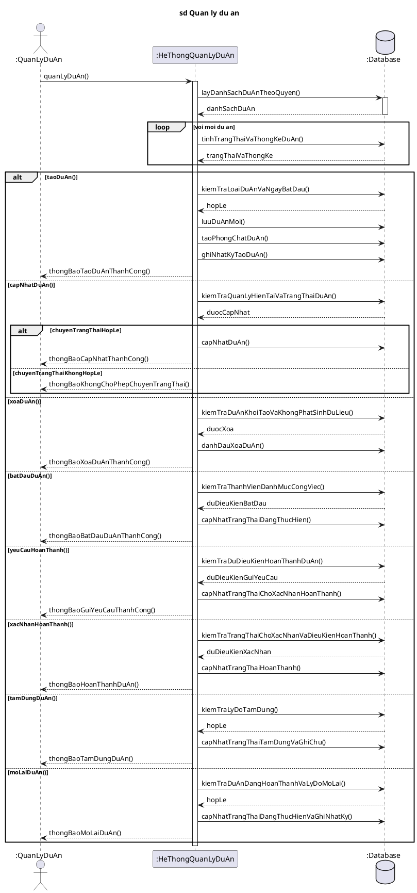

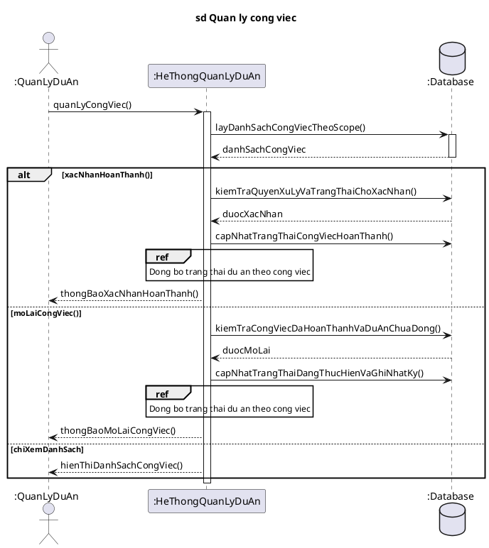

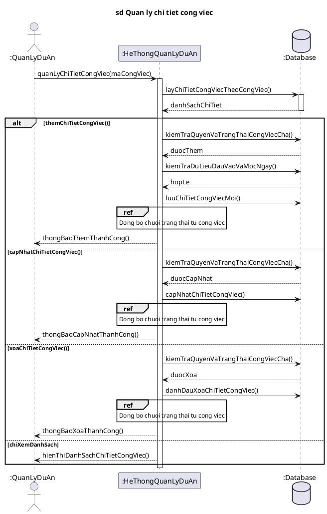

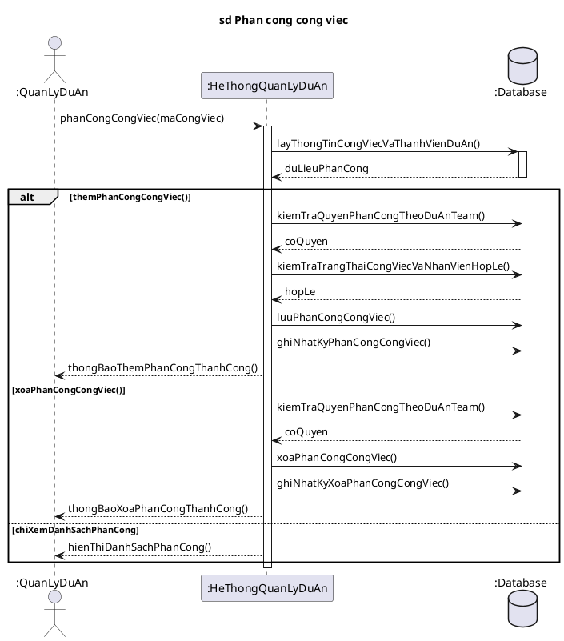

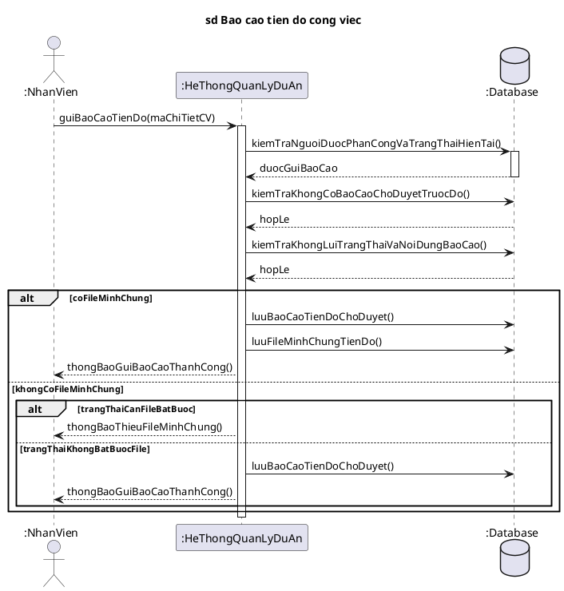

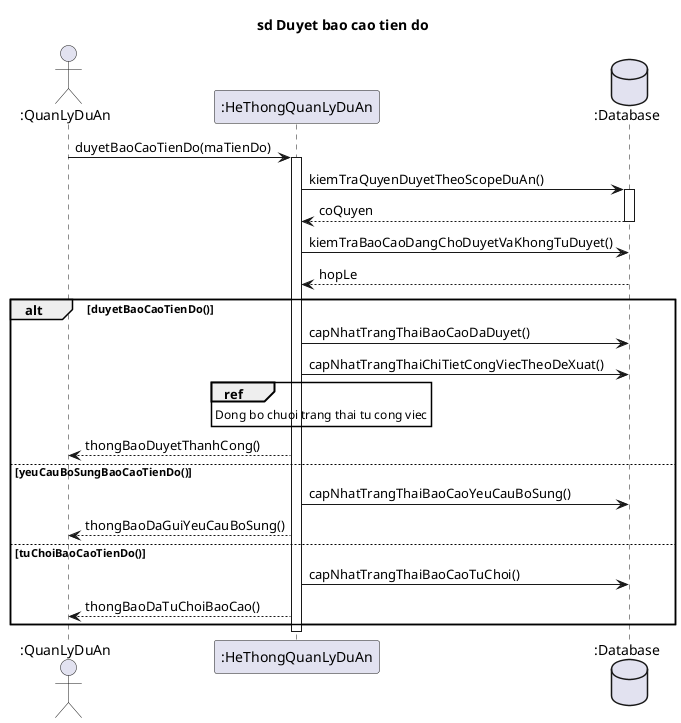

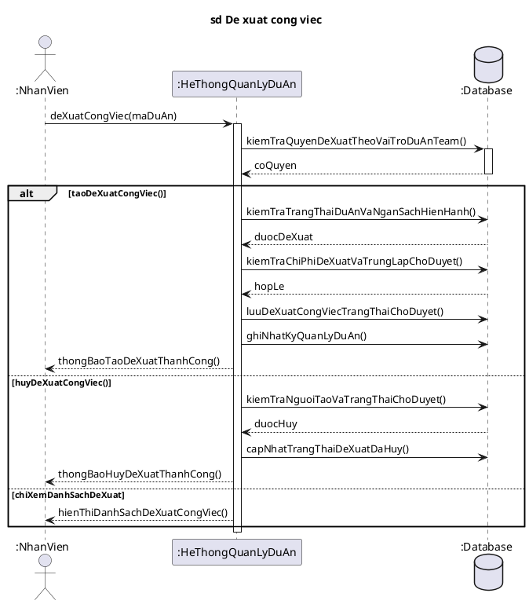

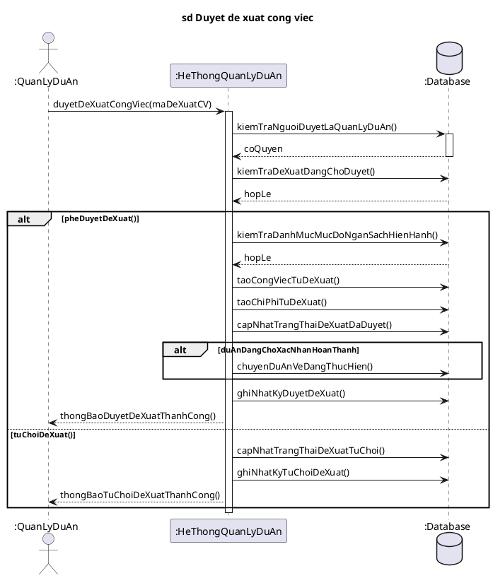

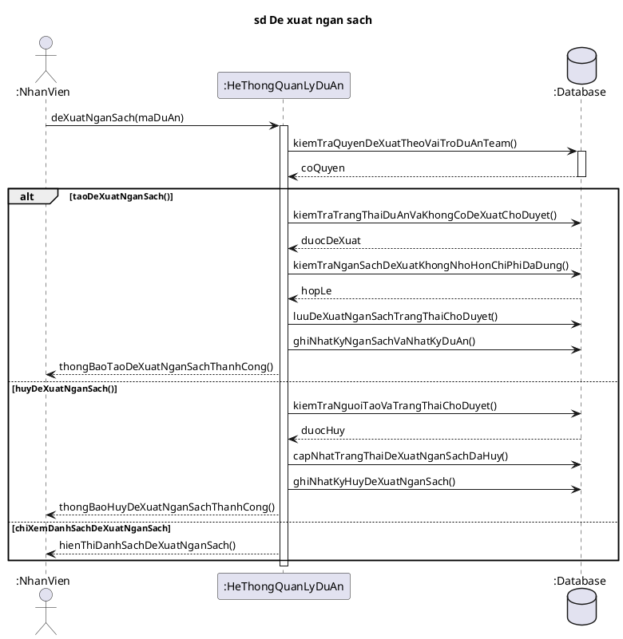

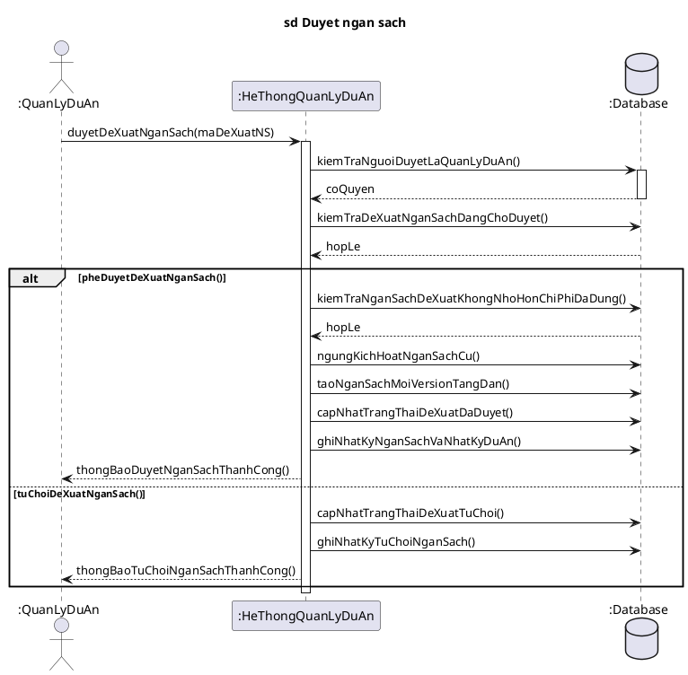

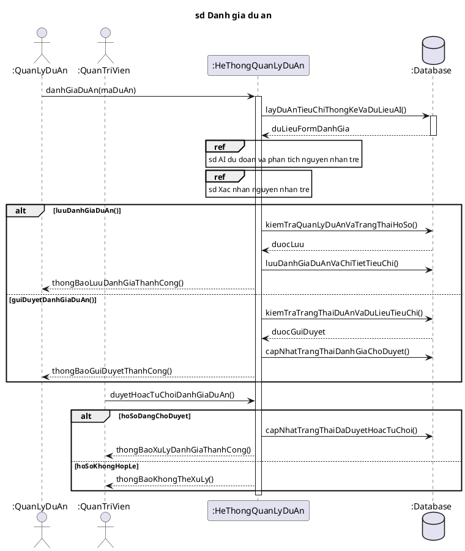

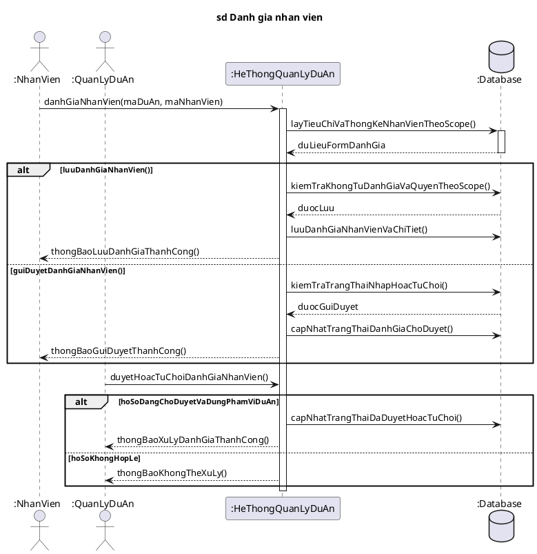

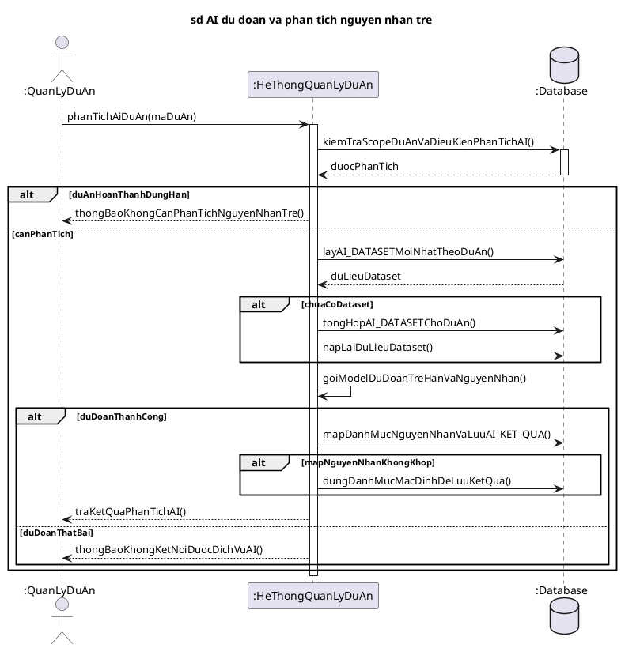

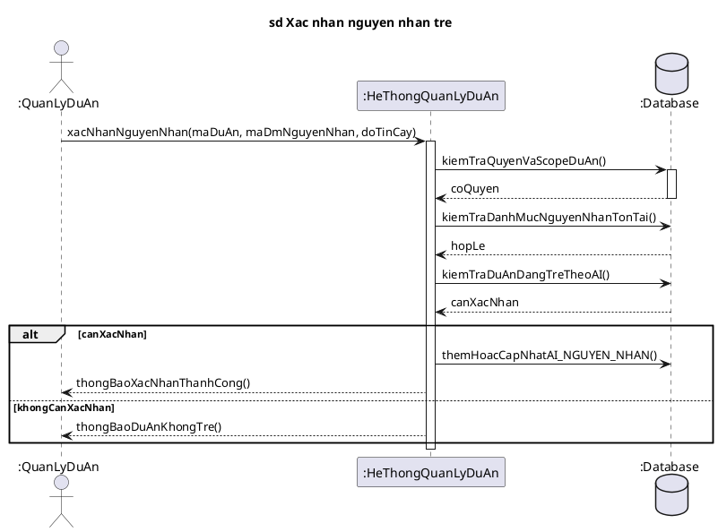

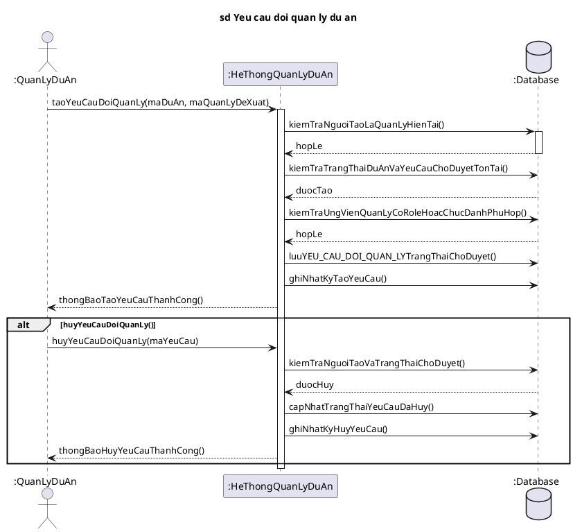

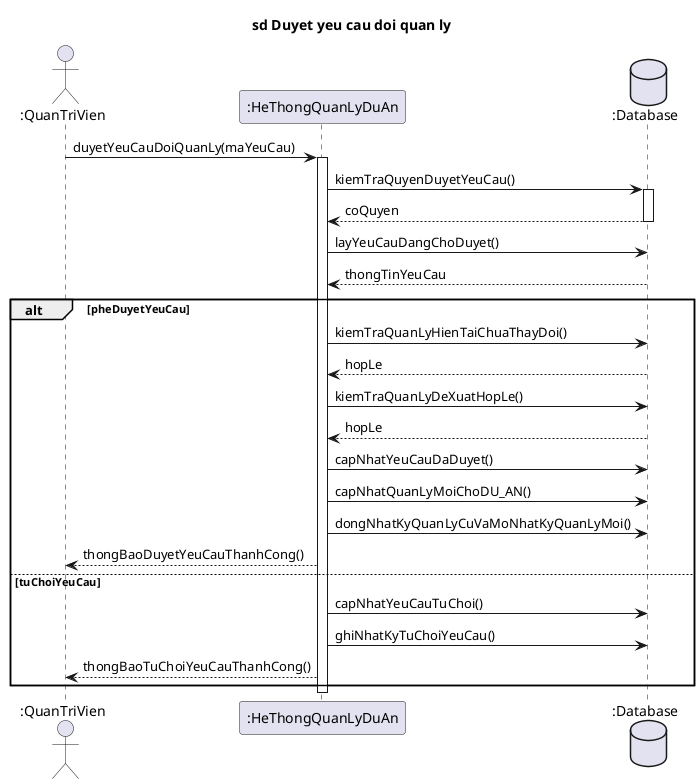

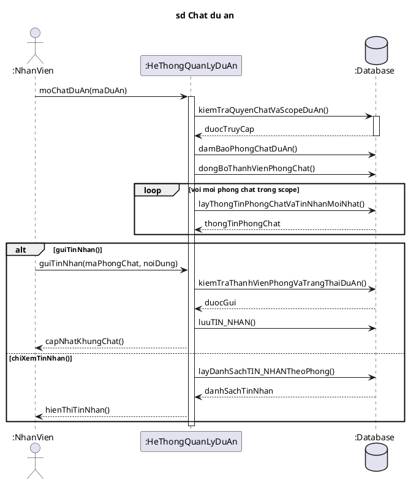

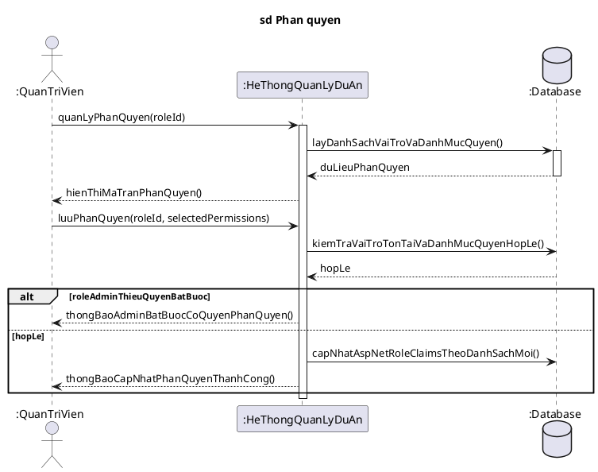
