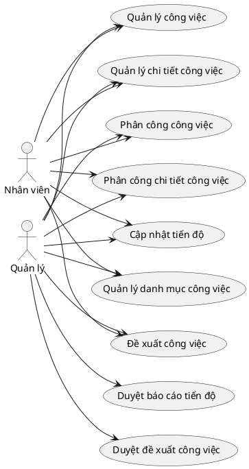
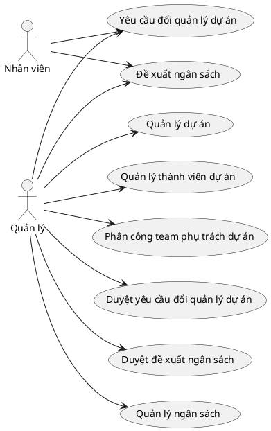
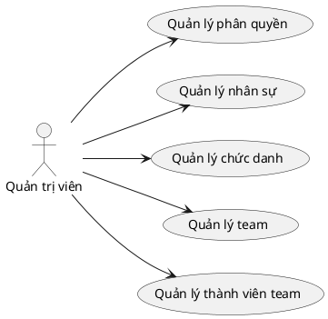
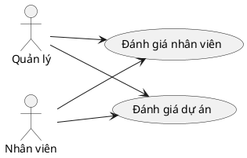
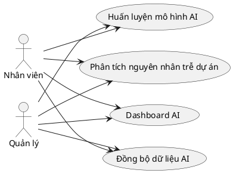
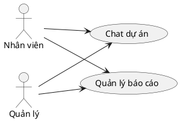

# CHƯƠNG 2: USE CASE DIAGRAM

## 2.1 Sơ đồ Use Case tổng quát

```plantuml
@startuml
left to right direction
skinparam packageStyle rectangle

actor "Quản trị viên" as Admin
actor "Nhân viên" as Employee
actor "Quản lý" as Manager

rectangle "Hệ thống quản lý dự án" {
  usecase "Đăng nhập" as UC_Login
  usecase "Quản lý phân quyền" as UC_PhanQuyen
  usecase "Quản lý nhân sự" as UC_NhanSu
  usecase "Quản lý chức danh" as UC_ChucDanh
  usecase "Quản lý team" as UC_Team
  usecase "Quản lý thành viên team" as UC_ThanhVienTeam
  usecase "Quản lý dự án" as UC_DuAn
  usecase "Quản lý thành viên dự án" as UC_ThanhVienDuAn
  usecase "Phân công team phụ trách dự án" as UC_TeamDuAn
  usecase "Yêu cầu đổi quản lý dự án" as UC_YCDoiQL
  usecase "Duyệt yêu cầu đổi quản lý dự án" as UC_DuyetYCDoiQL
  usecase "Quản lý danh mục công việc" as UC_DMCV
  usecase "Đề xuất công việc" as UC_DXCV
  usecase "Duyệt đề xuất công việc" as UC_DuyetDXCV
  usecase "Quản lý công việc" as UC_CV
  usecase "Quản lý chi tiết công việc" as UC_CTCV
  usecase "Phân công công việc" as UC_PCCV
  usecase "Phân công chi tiết công việc" as UC_PCCTCV
  usecase "Cập nhật tiến độ công việc" as UC_TienDo
  usecase "Duyệt báo cáo tiến độ" as UC_DuyetTienDo
  usecase "Đề xuất ngân sách dự án" as UC_DXNS
  usecase "Duyệt đề xuất ngân sách dự án" as UC_DuyetDXNS
  usecase "Quản lý ngân sách" as UC_NS
  usecase "Đánh giá nhân viên" as UC_DGNV
  usecase "Đánh giá dự án" as UC_DGDA
  usecase "Chat dự án" as UC_Chat
  usecase "Quản lý báo cáo" as UC_BaoCao
  usecase "Dashboard AI" as UC_AIDashboard
  usecase "Đồng bộ dữ liệu AI" as UC_AIDataset
  usecase "Huấn luyện mô hình AI" as UC_AITrain
  usecase "Phân tích nguyên nhân trễ dự án" as UC_AIReason
}

Admin --> UC_Login
Admin --> UC_PhanQuyen
Admin --> UC_NhanSu
Admin --> UC_ChucDanh
Admin --> UC_Team
Admin --> UC_ThanhVienTeam

Manager --> UC_Login
Manager --> UC_DuAn
Manager --> UC_ThanhVienDuAn
Manager --> UC_TeamDuAn
Manager --> UC_YCDoiQL
Manager --> UC_DuyetYCDoiQL
Manager --> UC_DMCV
Manager --> UC_DXCV
Manager --> UC_DuyetDXCV
Manager --> UC_CV
Manager --> UC_CTCV
Manager --> UC_PCCV
Manager --> UC_PCCTCV
Manager --> UC_TienDo
Manager --> UC_DuyetTienDo
Manager --> UC_DXNS
Manager --> UC_DuyetDXNS
Manager --> UC_NS
Manager --> UC_DGNV
Manager --> UC_DGDA
Manager --> UC_Chat
Manager --> UC_BaoCao
Manager --> UC_AIDashboard
Manager --> UC_AIDataset
Manager --> UC_AITrain
Manager --> UC_AIReason

Employee --> UC_Login
Employee --> UC_YCDoiQL
Employee --> UC_DMCV
Employee --> UC_DXCV
Employee --> UC_CV
Employee --> UC_CTCV
Employee --> UC_PCCV
Employee --> UC_PCCTCV
Employee --> UC_TienDo
Employee --> UC_DXNS
Employee --> UC_DGNV
Employee --> UC_DGDA
Employee --> UC_Chat
Employee --> UC_BaoCao
Employee --> UC_AIDashboard
Employee --> UC_AIDataset
Employee --> UC_AITrain
Employee --> UC_AIReason

UC_PhanQuyen .> UC_Login : <<include>>
UC_NhanSu .> UC_Login : <<include>>
UC_ChucDanh .> UC_Login : <<include>>
UC_Team .> UC_Login : <<include>>
UC_ThanhVienTeam .> UC_Login : <<include>>
UC_DuAn .> UC_Login : <<include>>
UC_ThanhVienDuAn .> UC_Login : <<include>>
UC_TeamDuAn .> UC_Login : <<include>>
UC_YCDoiQL .> UC_Login : <<include>>
UC_DuyetYCDoiQL .> UC_Login : <<include>>
UC_DMCV .> UC_Login : <<include>>
UC_DXCV .> UC_Login : <<include>>
UC_DuyetDXCV .> UC_Login : <<include>>
UC_CV .> UC_Login : <<include>>
UC_CTCV .> UC_Login : <<include>>
UC_PCCV .> UC_Login : <<include>>
UC_PCCTCV .> UC_Login : <<include>>
UC_TienDo .> UC_Login : <<include>>
UC_DuyetTienDo .> UC_Login : <<include>>
UC_DXNS .> UC_Login : <<include>>
UC_DuyetDXNS .> UC_Login : <<include>>
UC_NS .> UC_Login : <<include>>
UC_DGNV .> UC_Login : <<include>>
UC_DGDA .> UC_Login : <<include>>
UC_Chat .> UC_Login : <<include>>
UC_BaoCao .> UC_Login : <<include>>
UC_AIDashboard .> UC_Login : <<include>>
UC_AIDataset .> UC_Login : <<include>>
UC_AITrain .> UC_Login : <<include>>
UC_AIReason .> UC_Login : <<include>>
@enduml
```

## 2.2 Phân rã Use Case
### a) Nhóm quản lý công việc

### b) Nhóm quản lý dự án và ngân sách

### c) Nhóm quản lý phân quyền

### d) Nhóm đánh giá

### e) Nhóm AI

### f) Nhóm chat và báo cáo

## 2.3 Mô tả Use Case
### 1) Đăng nhập
| Mục | Nội dung |
| --- | --- |
| Tên | Đăng nhập |
| Mô tả ngắn gọn | Người dùng sử dụng tài khoản hệ thống để tạo phiên làm việc và truy cập các chức năng theo vai trò, quyền được cấp. |
| Điều kiện tiên quyết | Tài khoản tồn tại trong `AspNetUsers`, liên kết hồ sơ `NGUOI_DUNG`, chưa bị khóa và người dùng chưa có phiên đăng nhập hợp lệ. |
| Điều kiện hậu | Hệ thống tạo cookie xác thực, nạp role và claim quyền từ `AspNetRoles`, `AspNetUserRoles`, `AspNetRoleClaims`; không ghi dữ liệu nghiệp vụ. |
| Tình huống lỗi | Tài khoản hoặc mật khẩu không hợp lệ, tài khoản bị khóa, dữ liệu người dùng không còn đồng bộ với hồ sơ nhân sự. |
| Trạng thái hệ thống khi lỗi | Không tạo phiên đăng nhập, không cấp quyền truy cập và giữ người dùng tại màn hình đăng nhập hoặc chuyển về trang báo lỗi truy cập. |
| Các Actor giao tiếp | Quản trị viên, Quản lý, Nhân viên |
| Trigger | Người dùng truy cập `/Account/Login` và nhấn nút đăng nhập. |
| Quy trình chuẩn | 1. Người dùng truy cập chức năng đăng nhập. 2. Hệ thống hiển thị biểu mẫu nhập tài khoản và mật khẩu. 3. Người dùng nhập thông tin đăng nhập. 4. Người dùng nhấn nút Đăng nhập. 5. Hệ thống kiểm tra tính hợp lệ của dữ liệu nhập. 6. Hệ thống xác thực tài khoản bằng Identity. 7. Hệ thống nạp vai trò và quyền của người dùng. 8. Hệ thống tạo cookie xác thực cho phiên làm việc. 9. Hệ thống chuyển người dùng về trang được yêu cầu trước đó hoặc Dashboard. |
| Quy trình thay thế | 5'. (Thay thế bước 5) Dữ liệu nhập thiếu hoặc sai định dạng, hệ thống hiển thị lỗi và giữ nguyên biểu mẫu. 6'. (Thay thế bước 6) Tài khoản không tồn tại, sai mật khẩu hoặc bị khóa, hệ thống từ chối đăng nhập và không tạo cookie xác thực. Kết thúc Use Case. |

### 2) Quản lý phân quyền
| Mục | Nội dung |
| --- | --- |
| Tên | Quản lý phân quyền |
| Mô tả ngắn gọn | Quản trị viên cấu hình danh sách quyền cho từng vai trò bằng màn hình phân quyền, trong đó hệ thống kiểm tra quan hệ quyền cha, quyền con và ràng buộc theo vai trò trước khi lưu. |
| Điều kiện tiên quyết | Quản trị viên đã đăng nhập, có `PhanQuyen.Xem` để xem trang và `PhanQuyen.Luu` để lưu thay đổi; danh mục màn hình và danh mục quyền đã được khởi tạo. |
| Điều kiện hậu | Bảng `AspNetRoleClaims` được cập nhật theo quyền đã chọn; bảng `DANH_MUC_MAN_HINH` và `DANH_MUC_QUYEN` được sử dụng làm dữ liệu tham chiếu nhưng không bị thay đổi trong thao tác lưu quyền. |
| Tình huống lỗi | Vai trò không hợp lệ, thiếu quyền cha bắt buộc, chọn quyền bị cấm với vai trò hoặc người dùng không đủ quyền lưu. |
| Trạng thái hệ thống khi lỗi | Không cập nhật claim của vai trò; các quyền cũ trong `AspNetRoleClaims` được giữ nguyên. |
| Các Actor giao tiếp | Quản trị viên |
| Trigger | Quản trị viên mở trang phân quyền, chọn vai trò và nhấn Lưu. |
| Quy trình chuẩn | 1. Quản trị viên truy cập chức năng quản lý phân quyền. 2. Hệ thống kiểm tra `PhanQuyen.Xem` và hiển thị danh sách vai trò. 3. Quản trị viên chọn vai trò cần cấu hình. 4. Hệ thống nạp các nhóm màn hình, quyền hiện có và trạng thái quyền đang được gán cho vai trò. 5. Quản trị viên chọn hoặc bỏ chọn các quyền cần cấp. 6. Quản trị viên nhấn nút Lưu. 7. Hệ thống kiểm tra `PhanQuyen.Luu`, kiểm tra quyền cha con và ràng buộc quyền theo vai trò. 8. Hệ thống mở giao dịch, xóa claim quyền cũ của vai trò và ghi claim quyền mới hợp lệ. 9. Hệ thống commit giao dịch và hiển thị thông báo lưu thành công. |
| Quy trình thay thế | 7'. (Thay thế bước 7) Danh sách quyền vi phạm ràng buộc, hệ thống hiển thị lý do và không mở giao dịch ghi dữ liệu. 8'. (Thay thế bước 8) Có lỗi trong quá trình lưu, hệ thống rollback giao dịch và giữ nguyên quyền cũ. Kết thúc Use Case. |

### 3) Quản lý nhân sự
| Mục | Nội dung |
| --- | --- |
| Tên | Quản lý nhân sự |
| Mô tả ngắn gọn | Quản trị viên tạo, cập nhật, khóa, mở khóa và xóa mềm hồ sơ nhân sự gắn với tài khoản đăng nhập của hệ thống. |
| Điều kiện tiên quyết | Quản trị viên đã đăng nhập và có quyền `NhanSu.Xem`, `NhanSu.Them`, `NhanSu.Sua`, `NhanSu.Xoa`, `NhanSu.Khoa` hoặc `NhanSu.MoKhoa` tương ứng với thao tác; danh mục chức danh đã tồn tại. |
| Điều kiện hậu | Bảng `NGUOI_DUNG` và `AspNetUsers` được tạo hoặc cập nhật; khi đổi trạng thái tài khoản, trường khóa trong `AspNetUsers` được thay đổi; thao tác xóa là xóa mềm trên hồ sơ nhân sự. |
| Tình huống lỗi | Thiếu dữ liệu bắt buộc, email hoặc tài khoản trùng, chức danh không hợp lệ, tài khoản đang bị ràng buộc nghiệp vụ hoặc người thao tác thiếu quyền. |
| Trạng thái hệ thống khi lỗi | Không ghi hoặc không thay đổi hồ sơ nhân sự và tài khoản liên quan; dữ liệu nhập được trả lại biểu mẫu để chỉnh sửa. |
| Các Actor giao tiếp | Quản trị viên |
| Trigger | Quản trị viên mở màn hình Nhân sự và chọn thêm, sửa, khóa, mở khóa hoặc xóa. |
| Quy trình chuẩn | 1. Quản trị viên truy cập chức năng quản lý nhân sự. 2. Hệ thống kiểm tra quyền xem và hiển thị danh sách nhân sự kèm bộ lọc. 3. Quản trị viên chọn thêm mới hoặc chỉnh sửa hồ sơ. 4. Hệ thống hiển thị biểu mẫu nhân sự và danh sách chức danh. 5. Quản trị viên nhập thông tin nhân sự và tài khoản liên quan. 6. Quản trị viên nhấn nút Lưu. 7. Hệ thống kiểm tra quyền thao tác, kiểm tra dữ liệu bắt buộc và kiểm tra trùng tài khoản. 8. Hệ thống ghi hoặc cập nhật `NGUOI_DUNG`, đồng bộ `AspNetUsers` và trạng thái tài khoản. 9. Hệ thống hiển thị danh sách nhân sự cùng thông báo thành công. |
| Quy trình thay thế | 3'. (Thay thế bước 3) Quản trị viên chọn khóa hoặc mở khóa tài khoản, hệ thống kiểm tra quyền tương ứng rồi cập nhật trạng thái khóa trong `AspNetUsers`. 7'. (Thay thế bước 7) Dữ liệu không hợp lệ hoặc thiếu quyền, hệ thống từ chối thao tác và không ghi thay đổi. 8'. (Thay thế bước 8) Quản trị viên chọn xóa hồ sơ hợp lệ, hệ thống đánh dấu xóa mềm thay vì xóa vật lý. Kết thúc Use Case. |

### 4) Quản lý chức danh
| Mục | Nội dung |
| --- | --- |
| Tên | Quản lý chức danh |
| Mô tả ngắn gọn | Quản trị viên quản lý danh mục chức danh dùng để phân loại hồ sơ nhân sự. |
| Điều kiện tiên quyết | Quản trị viên đã đăng nhập và có quyền `ChucDanh.Xem`, `ChucDanh.Them`, `ChucDanh.Sua` hoặc `ChucDanh.Xoa` theo thao tác. |
| Điều kiện hậu | Bảng `CHUC_DANH` được thêm, cập nhật hoặc xóa theo thao tác hợp lệ. |
| Tình huống lỗi | Tên chức danh thiếu, dữ liệu trùng, chức danh không tồn tại hoặc đang được hồ sơ nhân sự tham chiếu. |
| Trạng thái hệ thống khi lỗi | Dữ liệu trong `CHUC_DANH` không thay đổi. |
| Các Actor giao tiếp | Quản trị viên |
| Trigger | Quản trị viên chọn chức năng thêm, sửa hoặc xóa chức danh. |
| Quy trình chuẩn | 1. Quản trị viên truy cập màn hình quản lý chức danh. 2. Hệ thống kiểm tra quyền xem và hiển thị danh sách chức danh hiện có. 3. Quản trị viên chọn thêm mới hoặc chỉnh sửa. 4. Hệ thống hiển thị biểu mẫu chức danh. 5. Quản trị viên nhập tên và thông tin mô tả chức danh. 6. Quản trị viên nhấn nút Lưu. 7. Hệ thống kiểm tra quyền thao tác và tính hợp lệ dữ liệu. 8. Hệ thống ghi dữ liệu vào `CHUC_DANH`. 9. Hệ thống hiển thị thông báo thành công và tải lại danh sách. |
| Quy trình thay thế | 7'. (Thay thế bước 7) Dữ liệu không hợp lệ hoặc thiếu quyền, hệ thống hiển thị lỗi và giữ nguyên biểu mẫu. 8'. (Thay thế bước 8) Nếu xóa chức danh đang được sử dụng, hệ thống từ chối xóa để bảo toàn ràng buộc nhân sự. Kết thúc Use Case. |

### 5) Quản lý team
| Mục | Nội dung |
| --- | --- |
| Tên | Quản lý team |
| Mô tả ngắn gọn | Quản trị viên tạo, cập nhật và xóa mềm team để phục vụ phân nhóm nhân sự và phân công phụ trách dự án. |
| Điều kiện tiên quyết | Quản trị viên đã đăng nhập và có quyền `Nhom.Xem`, `Nhom.Them`, `Nhom.Sua` hoặc `Nhom.Xoa` theo thao tác. |
| Điều kiện hậu | Bảng `TEAM` được thêm, cập nhật trạng thái hoặc đánh dấu xóa mềm. |
| Tình huống lỗi | Tên team trống, dữ liệu trùng, team không tồn tại, team đang được phân công hoặc người dùng thiếu quyền. |
| Trạng thái hệ thống khi lỗi | Không thay đổi dữ liệu trong `TEAM`. |
| Các Actor giao tiếp | Quản trị viên |
| Trigger | Quản trị viên mở màn hình Team và thực hiện thêm, sửa hoặc xóa. |
| Quy trình chuẩn | 1. Quản trị viên truy cập chức năng quản lý team. 2. Hệ thống kiểm tra quyền xem và hiển thị danh sách team kèm trạng thái. 3. Quản trị viên chọn thêm mới hoặc chỉnh sửa team. 4. Hệ thống hiển thị biểu mẫu nhập thông tin team. 5. Quản trị viên nhập tên, mô tả và trạng thái team. 6. Quản trị viên nhấn nút Lưu. 7. Hệ thống kiểm tra quyền thao tác và tính hợp lệ dữ liệu. 8. Hệ thống ghi dữ liệu vào `TEAM`. 9. Hệ thống hiển thị thông báo thành công. |
| Quy trình thay thế | 7'. (Thay thế bước 7) Dữ liệu không hợp lệ hoặc thiếu quyền, hệ thống báo lỗi và không ghi dữ liệu. 8'. (Thay thế bước 8) Khi xóa, hệ thống đánh dấu xóa mềm nếu team đủ điều kiện xóa. Kết thúc Use Case. |

### 6) Quản lý thành viên team
| Mục | Nội dung |
| --- | --- |
| Tên | Quản lý thành viên team |
| Mô tả ngắn gọn | Quản trị viên gán nhân sự vào team, cập nhật vai trò trong team và chỉ định trưởng nhóm phục vụ quy trình phân công dự án. |
| Điều kiện tiên quyết | Quản trị viên đã đăng nhập, có `ThanhVienNhom.Xem`, `ThanhVienNhom.Them` hoặc `ThanhVienNhom.Xoa`; team và nhân sự còn hiệu lực. |
| Điều kiện hậu | Bảng `NHAN_VIEN_TEAM` được thêm, cập nhật vai trò lãnh đạo hoặc xóa quan hệ thành viên. |
| Tình huống lỗi | Nhân sự đã thuộc team, team hoặc nhân sự không hợp lệ, thao tác gán trưởng nhóm vi phạm quy tắc hoặc thiếu quyền. |
| Trạng thái hệ thống khi lỗi | Quan hệ thành viên team trong `NHAN_VIEN_TEAM` không thay đổi. |
| Các Actor giao tiếp | Quản trị viên |
| Trigger | Quản trị viên chọn thêm thành viên, sửa vai trò, xóa thành viên hoặc gán trưởng nhóm. |
| Quy trình chuẩn | 1. Quản trị viên truy cập màn hình quản lý thành viên team. 2. Hệ thống kiểm tra quyền xem và hiển thị danh sách thành viên theo team. 3. Quản trị viên chọn team và nhân sự cần gán. 4. Hệ thống hiển thị thông tin nhân sự khả dụng và vai trò trong team. 5. Quản trị viên nhập hoặc cập nhật vai trò thành viên. 6. Quản trị viên nhấn nút Lưu. 7. Hệ thống kiểm tra quyền, kiểm tra trùng thành viên và trạng thái team. 8. Hệ thống ghi quan hệ vào `NHAN_VIEN_TEAM`. 9. Hệ thống tải lại danh sách thành viên team. |
| Quy trình thay thế | 7'. (Thay thế bước 7) Nhân sự đã được gán hoặc dữ liệu không hợp lệ, hệ thống báo lỗi và không ghi thay đổi. 8'. (Thay thế bước 8) Nếu thao tác là gán trưởng nhóm, hệ thống cập nhật vai trò lãnh đạo trong `NHAN_VIEN_TEAM` theo quy tắc hiện hành. Kết thúc Use Case. |

### 7) Quản lý dự án
| Mục | Nội dung |
| --- | --- |
| Tên | Quản lý dự án |
| Mô tả ngắn gọn | Quản lý tạo, cập nhật thông tin, đính kèm tài liệu và điều chuyển trạng thái dự án theo workflow hiện tại. |
| Điều kiện tiên quyết | Quản lý đã đăng nhập và có `DuAn.Xem`, `DuAn.Them`, `DuAn.Sua` hoặc `DuAn.Xoa`; loại dự án và người quản lý dự án hợp lệ. |
| Điều kiện hậu | Bảng `DU_AN` được thêm hoặc cập nhật; file dự án được ghi vào `FILE_DU_AN`; nhật ký trạng thái được ghi vào `NHAT_KY_DU_AN` hoặc `NHAT_KY_QUAN_LY_DU_AN` khi có thay đổi phù hợp. |
| Tình huống lỗi | Dữ liệu dự án không hợp lệ, ngày bắt đầu kết thúc sai, trạng thái không cho phép chuyển, dự án đã có ràng buộc không thể xóa hoặc thiếu quyền. |
| Trạng thái hệ thống khi lỗi | Dự án, file và nhật ký liên quan không thay đổi; hệ thống hiển thị lỗi nghiệp vụ. |
| Các Actor giao tiếp | Quản lý |
| Trigger | Quản lý mở màn hình Dự án và chọn thêm, sửa, xem chi tiết, cập nhật trạng thái hoặc quản lý file. |
| Quy trình chuẩn | 1. Quản lý truy cập chức năng quản lý dự án. 2. Hệ thống kiểm tra quyền xem và hiển thị danh sách dự án theo bộ lọc. 3. Quản lý chọn thêm mới hoặc chỉnh sửa dự án. 4. Hệ thống hiển thị biểu mẫu dự án, danh mục loại dự án và danh sách người quản lý. 5. Quản lý nhập thông tin dự án, thời gian, trạng thái và người quản lý phụ trách. 6. Quản lý nhấn nút Lưu. 7. Hệ thống kiểm tra quyền, kiểm tra dữ liệu và kiểm tra workflow trạng thái. 8. Hệ thống ghi dữ liệu vào `DU_AN` và ghi nhật ký nếu có thay đổi quản lý hoặc trạng thái. 9. Hệ thống hiển thị thông báo thành công và danh sách dự án mới nhất. |
| Quy trình thay thế | 7'. (Thay thế bước 7) Trạng thái mới không hợp lệ theo workflow, hệ thống từ chối chuyển trạng thái và giữ trạng thái cũ. 8'. (Thay thế bước 8) Nếu người dùng tải file dự án, hệ thống kiểm tra quyền sửa và ghi metadata vào `FILE_DU_AN`. 8'. (Thay thế bước 8) Nếu người dùng xóa dự án đủ điều kiện, hệ thống đánh dấu xóa mềm thay vì xóa vật lý. Kết thúc Use Case. |

### 8) Quản lý thành viên dự án
| Mục | Nội dung |
| --- | --- |
| Tên | Quản lý thành viên dự án |
| Mô tả ngắn gọn | Quản lý bổ sung, cập nhật vai trò hoặc loại bỏ nhân sự khỏi phạm vi dự án. |
| Điều kiện tiên quyết | Quản lý đã đăng nhập, có `ThanhVienDuAn.Xem`, `ThanhVienDuAn.Them` hoặc `ThanhVienDuAn.Xoa`; dự án còn cho phép chỉnh sửa thành viên. |
| Điều kiện hậu | Bảng `NHAN_VIEN_DU_AN` được thêm, cập nhật vai trò hoặc xóa quan hệ thành viên dự án. |
| Tình huống lỗi | Dự án không tồn tại, dự án ở trạng thái không cho phép chỉnh sửa, nhân sự đã được gán hoặc thiếu quyền thao tác. |
| Trạng thái hệ thống khi lỗi | Danh sách thành viên dự án không thay đổi. |
| Các Actor giao tiếp | Quản lý |
| Trigger | Quản lý mở màn hình thành viên dự án từ chi tiết dự án và thực hiện thao tác thành viên. |
| Quy trình chuẩn | 1. Quản lý truy cập chức năng quản lý thành viên dự án. 2. Hệ thống kiểm tra quyền xem và hiển thị danh sách nhân sự đang tham gia dự án. 3. Quản lý chọn thêm thành viên hoặc cập nhật vai trò. 4. Hệ thống hiển thị danh sách nhân sự có thể thêm và vai trò hiện tại. 5. Quản lý chọn nhân sự và nhập vai trò phụ trách. 6. Quản lý nhấn nút Lưu. 7. Hệ thống kiểm tra quyền, trạng thái dự án và trùng quan hệ thành viên. 8. Hệ thống ghi dữ liệu vào `NHAN_VIEN_DU_AN`. 9. Hệ thống hiển thị lại danh sách thành viên dự án. |
| Quy trình thay thế | 7'. (Thay thế bước 7) Dự án không cho phép chỉnh sửa hoặc nhân sự không hợp lệ, hệ thống báo lỗi và không ghi dữ liệu. 8'. (Thay thế bước 8) Nếu quản lý chọn xóa thành viên, hệ thống kiểm tra quyền xóa rồi loại bỏ quan hệ trong `NHAN_VIEN_DU_AN`. Kết thúc Use Case. |

### 9) Phân công team phụ trách dự án
| Mục | Nội dung |
| --- | --- |
| Tên | Phân công team phụ trách dự án |
| Mô tả ngắn gọn | Quản lý gán team vào dự án để xác định nhóm phụ trách và sử dụng danh sách thành viên team cho các bước phân công tiếp theo. |
| Điều kiện tiên quyết | Quản lý đã đăng nhập, có `TeamDuAn.Xem`, `TeamDuAn.Them` hoặc `TeamDuAn.Xoa`; dự án và team đang ở trạng thái hợp lệ. |
| Điều kiện hậu | Bảng `TEAM_DU_AN` được thêm hoặc xóa quan hệ phụ trách; nhật ký phân công team được ghi vào `NHAT_KY_DU_AN` khi nghiệp vụ yêu cầu. |
| Tình huống lỗi | Team đã được gán cho dự án, team bị khóa, dự án không còn cho chỉnh sửa hoặc thiếu quyền. |
| Trạng thái hệ thống khi lỗi | Quan hệ `TEAM_DU_AN` không thay đổi. |
| Các Actor giao tiếp | Quản lý |
| Trigger | Quản lý chọn chức năng phân công team trong phạm vi một dự án. |
| Quy trình chuẩn | 1. Quản lý truy cập màn hình phân công team phụ trách dự án. 2. Hệ thống kiểm tra quyền xem và hiển thị danh sách team đang phụ trách dự án. 3. Quản lý chọn team cần gán thêm. 4. Hệ thống hiển thị thông tin team và thành viên liên quan. 5. Quản lý xác nhận gán team vào dự án. 6. Quản lý nhấn nút Lưu. 7. Hệ thống kiểm tra quyền thêm, trạng thái dự án, trạng thái team và trùng quan hệ. 8. Hệ thống ghi quan hệ vào `TEAM_DU_AN`. 9. Hệ thống tải lại danh sách team phụ trách. |
| Quy trình thay thế | 7'. (Thay thế bước 7) Team không hợp lệ hoặc đã được gán, hệ thống báo lỗi và không ghi dữ liệu. 8'. (Thay thế bước 8) Nếu quản lý chọn xóa team khỏi dự án, hệ thống kiểm tra quyền xóa rồi loại bỏ quan hệ `TEAM_DU_AN`. Kết thúc Use Case. |

### 10) Yêu cầu đổi quản lý dự án
| Mục | Nội dung |
| --- | --- |
| Tên | Yêu cầu đổi quản lý dự án |
| Mô tả ngắn gọn | Người dùng trong phạm vi dự án tạo yêu cầu đề xuất thay đổi quản lý phụ trách dự án, chờ cấp có quyền duyệt xử lý. |
| Điều kiện tiên quyết | Người dùng đã đăng nhập, có `YeuCauDoiQuanLy.Xem` hoặc `YeuCauDoiQuanLy.Them`; dự án còn hoạt động và còn cho tạo yêu cầu mới. |
| Điều kiện hậu | Bảng `YEU_CAU_DOI_QUAN_LY` được thêm mới ở trạng thái chờ duyệt hoặc cập nhật trạng thái hủy nếu người tạo hủy yêu cầu. |
| Tình huống lỗi | Dự án không hợp lệ, quản lý đề xuất không hợp lệ, đã có yêu cầu chờ duyệt, người dùng không thuộc phạm vi cho phép hoặc thiếu quyền. |
| Trạng thái hệ thống khi lỗi | Không tạo yêu cầu mới và không thay đổi quản lý hiện tại của dự án. |
| Các Actor giao tiếp | Quản lý, Nhân viên |
| Trigger | Người dùng mở chức năng yêu cầu đổi quản lý dự án và gửi yêu cầu. |
| Quy trình chuẩn | 1. Người dùng truy cập chức năng yêu cầu đổi quản lý dự án. 2. Hệ thống kiểm tra quyền xem và hiển thị dự án cùng lịch sử yêu cầu. 3. Người dùng chọn tạo yêu cầu mới. 4. Hệ thống hiển thị biểu mẫu gồm quản lý hiện tại và danh sách quản lý có thể đề xuất. 5. Người dùng chọn quản lý đề xuất và nhập lý do thay đổi. 6. Người dùng nhấn nút Gửi yêu cầu. 7. Hệ thống kiểm tra quyền tạo, trạng thái dự án, yêu cầu đang chờ và tính hợp lệ của quản lý đề xuất. 8. Hệ thống ghi yêu cầu vào `YEU_CAU_DOI_QUAN_LY` với trạng thái chờ duyệt. 9. Hệ thống hiển thị thông báo gửi yêu cầu thành công. |
| Quy trình thay thế | 7'. (Thay thế bước 7) Dự án đã có yêu cầu chờ duyệt hoặc quản lý đề xuất không hợp lệ, hệ thống báo lỗi và không tạo yêu cầu. 8'. (Thay thế bước 8) Nếu người tạo hủy yêu cầu còn chờ duyệt, hệ thống cập nhật trạng thái hủy trong `YEU_CAU_DOI_QUAN_LY`. Kết thúc Use Case. |

### 11) Duyệt yêu cầu đổi quản lý dự án
| Mục | Nội dung |
| --- | --- |
| Tên | Duyệt yêu cầu đổi quản lý dự án |
| Mô tả ngắn gọn | Quản lý có quyền xem xét yêu cầu đổi quản lý, phê duyệt để cập nhật quản lý phụ trách dự án hoặc từ chối kèm lý do. |
| Điều kiện tiên quyết | Quản lý đã đăng nhập, có `DuyetYeuCauDoiQuanLy.Xem` hoặc `DuyetYeuCauDoiQuanLy.Duyet`; yêu cầu đang ở trạng thái chờ duyệt. |
| Điều kiện hậu | Khi duyệt, bảng `YEU_CAU_DOI_QUAN_LY` được cập nhật trạng thái, bảng `DU_AN` được cập nhật quản lý phụ trách và `NHAT_KY_QUAN_LY_DU_AN`, `NHAT_KY_PHU_TRACH_DU_AN` ghi nhận thay đổi; khi từ chối chỉ cập nhật trạng thái và lý do trong `YEU_CAU_DOI_QUAN_LY`. |
| Tình huống lỗi | Yêu cầu không tồn tại, không còn ở trạng thái chờ duyệt, người duyệt không đủ quyền hoặc quản lý đề xuất không còn hợp lệ. |
| Trạng thái hệ thống khi lỗi | Không thay đổi quản lý của dự án và không cập nhật trạng thái yêu cầu. |
| Các Actor giao tiếp | Quản lý |
| Trigger | Quản lý nhấn Duyệt hoặc Từ chối trên màn hình duyệt yêu cầu đổi quản lý. |
| Quy trình chuẩn | 1. Quản lý truy cập danh sách yêu cầu đổi quản lý dự án. 2. Hệ thống kiểm tra quyền xem và hiển thị các yêu cầu theo bộ lọc. 3. Quản lý mở chi tiết yêu cầu cần xử lý. 4. Hệ thống hiển thị quản lý hiện tại, quản lý đề xuất, lý do và trạng thái yêu cầu. 5. Quản lý chọn Duyệt. 6. Hệ thống yêu cầu xác nhận thao tác duyệt. 7. Hệ thống kiểm tra quyền duyệt, trạng thái yêu cầu và tính hợp lệ của quản lý đề xuất. 8. Hệ thống cập nhật `DU_AN`, cập nhật `YEU_CAU_DOI_QUAN_LY` và ghi nhật ký thay đổi quản lý. 9. Hệ thống hiển thị thông báo duyệt thành công. |
| Quy trình thay thế | 5'. (Thay thế bước 5) Quản lý chọn Từ chối và nhập lý do từ chối. 7'. (Thay thế bước 7) Yêu cầu đã được xử lý hoặc không đủ quyền, hệ thống báo lỗi và không thay đổi dữ liệu. 8'. (Thay thế bước 8) Khi từ chối hợp lệ, hệ thống chỉ cập nhật trạng thái từ chối và lý do trong `YEU_CAU_DOI_QUAN_LY`. Kết thúc Use Case. |

### 12) Quản lý danh mục công việc
| Mục | Nội dung |
| --- | --- |
| Tên | Quản lý danh mục công việc |
| Mô tả ngắn gọn | Người dùng có quyền quản lý danh mục công việc mẫu trong từng dự án để làm cơ sở tạo đề xuất và công việc thực tế. |
| Điều kiện tiên quyết | Người dùng đã đăng nhập, có `DanhMucCongViec.Xem`, `DanhMucCongViec.Them`, `DanhMucCongViec.Sua` hoặc `DanhMucCongViec.Xoa`; dự án tham chiếu tồn tại. |
| Điều kiện hậu | Bảng `DANH_MUC_CONG_VIEC` được thêm, cập nhật hoặc xóa mềm. |
| Tình huống lỗi | Dự án không hợp lệ, tên danh mục trống, danh mục đang được đề xuất công việc tham chiếu hoặc thiếu quyền. |
| Trạng thái hệ thống khi lỗi | Dữ liệu `DANH_MUC_CONG_VIEC` không thay đổi. |
| Các Actor giao tiếp | Quản lý, Nhân viên |
| Trigger | Người dùng mở màn hình danh mục công việc và thực hiện thêm, sửa hoặc xóa. |
| Quy trình chuẩn | 1. Người dùng truy cập chức năng quản lý danh mục công việc. 2. Hệ thống kiểm tra quyền xem và hiển thị danh sách danh mục theo dự án. 3. Người dùng chọn thêm mới hoặc chỉnh sửa danh mục. 4. Hệ thống hiển thị biểu mẫu nhập thông tin danh mục và danh sách dự án. 5. Người dùng nhập tên, mô tả và dự án áp dụng. 6. Người dùng nhấn nút Lưu. 7. Hệ thống kiểm tra quyền thao tác, dữ liệu bắt buộc và dự án tham chiếu. 8. Hệ thống ghi dữ liệu vào `DANH_MUC_CONG_VIEC`. 9. Hệ thống hiển thị thông báo thành công và danh sách đã cập nhật. |
| Quy trình thay thế | 7'. (Thay thế bước 7) Dữ liệu không hợp lệ hoặc thiếu quyền, hệ thống hiển thị lỗi và không ghi dữ liệu. 8'. (Thay thế bước 8) Khi xóa danh mục đang bị ràng buộc, hệ thống từ chối xóa để bảo toàn dữ liệu đề xuất và công việc. Kết thúc Use Case. |

### 13) Đề xuất công việc
| Mục | Nội dung |
| --- | --- |
| Tên | Đề xuất công việc |
| Mô tả ngắn gọn | Người dùng tạo đề xuất công việc mới từ danh mục công việc, kèm thời gian, mức độ ưu tiên và chi phí dự kiến để chờ quản lý duyệt. |
| Điều kiện tiên quyết | Người dùng đã đăng nhập, có `DeXuatCongViec.Xem` hoặc `DeXuatCongViec.Them`; dự án có ngân sách active nếu đề xuất có chi phí; danh mục công việc và mức độ ưu tiên hợp lệ. |
| Điều kiện hậu | Bảng `DE_XUAT_CONG_VIEC` được thêm mới hoặc cập nhật trạng thái hủy; chưa tạo `CONG_VIEC` cho đến khi đề xuất được duyệt. |
| Tình huống lỗi | Thiếu danh mục, chi phí đề xuất không hợp lệ, vượt ngân sách còn lại, dự án không cho đề xuất hoặc thiếu quyền. |
| Trạng thái hệ thống khi lỗi | Không tạo đề xuất mới và không ảnh hưởng ngân sách, công việc thực tế. |
| Các Actor giao tiếp | Quản lý, Nhân viên |
| Trigger | Người dùng nhập đề xuất công việc và nhấn Gửi đề xuất. |
| Quy trình chuẩn | 1. Người dùng truy cập chức năng đề xuất công việc. 2. Hệ thống kiểm tra quyền xem và hiển thị danh sách đề xuất, dự án, danh mục công việc và mức độ ưu tiên. 3. Người dùng chọn dự án và danh mục công việc cần đề xuất. 4. Hệ thống hiển thị biểu mẫu đề xuất và thông tin ngân sách còn lại. 5. Người dùng nhập nội dung, thời gian, mức độ ưu tiên và chi phí đề xuất. 6. Người dùng nhấn nút Gửi đề xuất. 7. Hệ thống kiểm tra quyền thêm, trạng thái dự án, danh mục, thời gian và ngân sách còn lại. 8. Hệ thống ghi đề xuất vào `DE_XUAT_CONG_VIEC` với trạng thái chờ duyệt. 9. Hệ thống hiển thị thông báo gửi đề xuất thành công. |
| Quy trình thay thế | 7'. (Thay thế bước 7) Chi phí vượt ngân sách còn lại hoặc dữ liệu không hợp lệ, hệ thống báo lỗi và không tạo đề xuất. 8'. (Thay thế bước 8) Nếu người tạo hủy đề xuất còn chờ duyệt, hệ thống cập nhật trạng thái hủy trong `DE_XUAT_CONG_VIEC`. Kết thúc Use Case. |

### 14) Duyệt đề xuất công việc
| Mục | Nội dung |
| --- | --- |
| Tên | Duyệt đề xuất công việc |
| Mô tả ngắn gọn | Quản lý phê duyệt đề xuất công việc để sinh công việc thực tế và ghi nhận chi phí đề xuất, hoặc từ chối kèm lý do. |
| Điều kiện tiên quyết | Quản lý đã đăng nhập, có `DuyetDeXuatCongViec.Xem` hoặc `DuyetDeXuatCongViec.Duyet`; đề xuất đang ở trạng thái chờ duyệt. |
| Điều kiện hậu | Khi duyệt, `DE_XUAT_CONG_VIEC` được cập nhật, `CONG_VIEC` được tạo, `CHI_PHI` và `NHAT_KY_CHI_PHI` được ghi nếu đề xuất có chi phí; khi từ chối chỉ cập nhật trạng thái và lý do trong `DE_XUAT_CONG_VIEC`. |
| Tình huống lỗi | Đề xuất không tồn tại, đã được xử lý, thiếu ngân sách hợp lệ, dữ liệu đề xuất không đủ để tạo công việc hoặc thiếu quyền. |
| Trạng thái hệ thống khi lỗi | Không tạo công việc, không ghi chi phí và không thay đổi trạng thái đề xuất. |
| Các Actor giao tiếp | Quản lý |
| Trigger | Quản lý nhấn Duyệt hoặc Từ chối trên danh sách duyệt đề xuất công việc. |
| Quy trình chuẩn | 1. Quản lý truy cập màn hình duyệt đề xuất công việc. 2. Hệ thống kiểm tra quyền xem và hiển thị các đề xuất theo dự án, trạng thái. 3. Quản lý chọn đề xuất cần xử lý. 4. Hệ thống hiển thị thông tin đề xuất, chi phí và người đề xuất. 5. Quản lý chọn Duyệt. 6. Hệ thống yêu cầu xác nhận thao tác. 7. Hệ thống kiểm tra quyền duyệt, trạng thái đề xuất và dữ liệu ngân sách liên quan. 8. Hệ thống tạo `CONG_VIEC`, cập nhật `DE_XUAT_CONG_VIEC`, ghi `CHI_PHI` và `NHAT_KY_CHI_PHI` khi có chi phí. 9. Hệ thống hiển thị thông báo duyệt thành công. |
| Quy trình thay thế | 5'. (Thay thế bước 5) Quản lý chọn Từ chối và nhập lý do. 7'. (Thay thế bước 7) Đề xuất không còn chờ duyệt hoặc thiếu quyền, hệ thống báo lỗi và không ghi dữ liệu. 8'. (Thay thế bước 8) Khi từ chối hợp lệ, hệ thống cập nhật trạng thái từ chối và lý do trong `DE_XUAT_CONG_VIEC`. Kết thúc Use Case. |

### 15) Quản lý công việc
| Mục | Nội dung |
| --- | --- |
| Tên | Quản lý công việc |
| Mô tả ngắn gọn | Người dùng theo dõi danh sách công việc đã được tạo từ quy trình duyệt đề xuất và thực hiện các chuyển trạng thái như xác nhận hoàn thành hoặc mở lại khi đủ điều kiện. |
| Điều kiện tiên quyết | Người dùng đã đăng nhập, có `CongViec.Xem`; các thao tác trạng thái cần thêm quyền xử lý tương ứng như `DuyetDeXuatCongViec.Duyet` hoặc `TienDo.Duyet` theo controller. |
| Điều kiện hậu | Bảng `CONG_VIEC` được cập nhật trạng thái khi thao tác hợp lệ; dữ liệu chi phí liên quan chỉ được đọc để hiển thị. |
| Tình huống lỗi | Công việc không tồn tại, trạng thái hiện tại không cho chuyển, người dùng thiếu quyền hoặc công việc đã bị xóa mềm. |
| Trạng thái hệ thống khi lỗi | Trạng thái `CONG_VIEC` không thay đổi. |
| Các Actor giao tiếp | Quản lý, Nhân viên |
| Trigger | Người dùng mở danh sách công việc hoặc chọn xác nhận hoàn thành, mở lại công việc. |
| Quy trình chuẩn | 1. Người dùng truy cập chức năng quản lý công việc. 2. Hệ thống kiểm tra quyền xem và hiển thị danh sách công việc theo dự án, trạng thái. 3. Người dùng xem thông tin công việc, chi phí đã ghi và trạng thái xử lý. 4. Người dùng chọn công việc cần xử lý. 5. Hệ thống hiển thị các thao tác trạng thái được phép theo dữ liệu hiện tại. 6. Người dùng chọn xác nhận hoàn thành hoặc mở lại công việc. 7. Hệ thống kiểm tra quyền và điều kiện chuyển trạng thái. 8. Hệ thống cập nhật trạng thái trong `CONG_VIEC`. 9. Hệ thống hiển thị thông báo thành công và tải lại danh sách. |
| Quy trình thay thế | 7'. (Thay thế bước 7) Công việc không đủ điều kiện chuyển trạng thái, hệ thống báo lỗi và giữ trạng thái cũ. 8'. (Thay thế bước 8) Nếu người dùng chỉ xuất file, hệ thống kiểm tra `ThongKe.XuatFile` và sinh file từ dữ liệu hiện có mà không thay đổi cơ sở dữ liệu. Kết thúc Use Case. |

### 16) Quản lý chi tiết công việc
| Mục | Nội dung |
| --- | --- |
| Tên | Quản lý chi tiết công việc |
| Mô tả ngắn gọn | Người dùng tạo, cập nhật hoặc xóa các đầu việc chi tiết thuộc một công việc chính để phục vụ phân công và báo cáo tiến độ. |
| Điều kiện tiên quyết | Người dùng đã đăng nhập, có `ChiTietCongViec.Xem`, `ChiTietCongViec.Them`, `ChiTietCongViec.Sua` hoặc `ChiTietCongViec.Xoa`; công việc chính tồn tại. |
| Điều kiện hậu | Bảng `CT_CONG_VIEC` được thêm, cập nhật hoặc xóa; file chi tiết công việc có thể được tham chiếu qua `FILE_CT_CONG_VIEC` nếu nghiệp vụ sử dụng tệp liên quan. |
| Tình huống lỗi | Công việc chính không tồn tại, ngày chi tiết không hợp lệ, trạng thái không cho chỉnh sửa, chi tiết công việc đang có ràng buộc tiến độ hoặc thiếu quyền. |
| Trạng thái hệ thống khi lỗi | Dữ liệu `CT_CONG_VIEC` không thay đổi. |
| Các Actor giao tiếp | Quản lý, Nhân viên |
| Trigger | Người dùng mở chi tiết của một công việc và chọn thêm, sửa hoặc xóa đầu việc. |
| Quy trình chuẩn | 1. Người dùng truy cập chức năng quản lý chi tiết công việc từ một công việc cụ thể. 2. Hệ thống kiểm tra quyền xem và hiển thị danh sách chi tiết công việc. 3. Người dùng chọn thêm mới hoặc chỉnh sửa chi tiết. 4. Hệ thống hiển thị biểu mẫu nhập nội dung, thời hạn và trạng thái chi tiết. 5. Người dùng nhập thông tin chi tiết công việc. 6. Người dùng nhấn nút Lưu. 7. Hệ thống kiểm tra quyền thao tác, công việc cha và tính hợp lệ dữ liệu. 8. Hệ thống ghi dữ liệu vào `CT_CONG_VIEC`. 9. Hệ thống hiển thị thông báo thành công. |
| Quy trình thay thế | 7'. (Thay thế bước 7) Dữ liệu không hợp lệ hoặc thiếu quyền, hệ thống báo lỗi và không ghi dữ liệu. 8'. (Thay thế bước 8) Nếu người dùng chọn xóa chi tiết đang bị ràng buộc, hệ thống từ chối xóa để bảo toàn dữ liệu tiến độ và phân công. Kết thúc Use Case. |

### 17) Phân công công việc
| Mục | Nội dung |
| --- | --- |
| Tên | Phân công công việc |
| Mô tả ngắn gọn | Người dùng có quyền gán nhân sự phụ trách công việc chính và ghi nhận lịch sử phân công. |
| Điều kiện tiên quyết | Người dùng đã đăng nhập, có `PhanCongCongViec.Xem` hoặc `PhanCongCongViec.ThucHien`; công việc và nhân sự được phân công hợp lệ. |
| Điều kiện hậu | Bảng `PHAN_CONG_CONG_VIEC` được thêm hoặc xóa quan hệ phân công; bảng `NHAT_KY_PHAN_CONG_CONG_VIEC` ghi lịch sử thao tác. |
| Tình huống lỗi | Công việc không tồn tại, nhân sự không thuộc phạm vi dự án, phân công bị trùng, trạng thái công việc không cho phân công hoặc thiếu quyền. |
| Trạng thái hệ thống khi lỗi | Quan hệ phân công công việc và nhật ký phân công không thay đổi. |
| Các Actor giao tiếp | Quản lý, Nhân viên |
| Trigger | Người dùng mở màn hình phân công của một công việc và chọn thêm hoặc xóa người phụ trách. |
| Quy trình chuẩn | 1. Người dùng truy cập chức năng phân công công việc. 2. Hệ thống kiểm tra quyền xem và hiển thị danh sách người đang được phân công. 3. Người dùng chọn nhân sự cần phân công thêm. 4. Hệ thống hiển thị thông tin công việc và danh sách nhân sự khả dụng. 5. Người dùng xác nhận nhân sự phụ trách. 6. Người dùng nhấn nút Lưu phân công. 7. Hệ thống kiểm tra quyền thực hiện, trạng thái công việc và phạm vi nhân sự. 8. Hệ thống ghi `PHAN_CONG_CONG_VIEC` và `NHAT_KY_PHAN_CONG_CONG_VIEC`. 9. Hệ thống hiển thị thông báo phân công thành công. |
| Quy trình thay thế | 7'. (Thay thế bước 7) Nhân sự không thuộc dự án hoặc đã được phân công, hệ thống báo lỗi và không ghi dữ liệu. 8'. (Thay thế bước 8) Nếu người dùng xóa phân công, hệ thống xóa quan hệ và ghi nhật ký gỡ phân công. Kết thúc Use Case. |

### 18) Phân công chi tiết công việc
| Mục | Nội dung |
| --- | --- |
| Tên | Phân công chi tiết công việc |
| Mô tả ngắn gọn | Người dùng có quyền gán nhân sự thực hiện từng chi tiết công việc và ghi nhận lịch sử phân công chi tiết. |
| Điều kiện tiên quyết | Người dùng đã đăng nhập, có `PhanCongChiTietCongViec.Xem` hoặc `PhanCongChiTietCongViec.ThucHien`; chi tiết công việc và nhân sự hợp lệ. |
| Điều kiện hậu | Bảng `PHAN_CONG_CT_CONG_VIEC` được thêm hoặc xóa quan hệ phân công; bảng `NHAT_KY_PHAN_CONG_CT_CONG_VIEC` ghi lịch sử thao tác. |
| Tình huống lỗi | Chi tiết công việc không tồn tại, nhân sự không thuộc phạm vi dự án, phân công trùng, trạng thái không cho phân công hoặc thiếu quyền. |
| Trạng thái hệ thống khi lỗi | Dữ liệu phân công chi tiết và nhật ký liên quan không thay đổi. |
| Các Actor giao tiếp | Quản lý, Nhân viên |
| Trigger | Người dùng mở phân công chi tiết công việc và chọn thêm hoặc xóa người thực hiện. |
| Quy trình chuẩn | 1. Người dùng truy cập chức năng phân công chi tiết công việc. 2. Hệ thống kiểm tra quyền xem và hiển thị danh sách nhân sự đang phụ trách chi tiết. 3. Người dùng chọn nhân sự cần gán cho chi tiết công việc. 4. Hệ thống hiển thị thông tin chi tiết công việc và danh sách nhân sự khả dụng. 5. Người dùng xác nhận phân công. 6. Người dùng nhấn nút Lưu phân công. 7. Hệ thống kiểm tra quyền thực hiện, trạng thái chi tiết và phạm vi nhân sự. 8. Hệ thống ghi `PHAN_CONG_CT_CONG_VIEC` và `NHAT_KY_PHAN_CONG_CT_CONG_VIEC`. 9. Hệ thống hiển thị thông báo thành công. |
| Quy trình thay thế | 7'. (Thay thế bước 7) Nhân sự không hợp lệ hoặc phân công bị trùng, hệ thống báo lỗi và không ghi dữ liệu. 8'. (Thay thế bước 8) Nếu người dùng xóa phân công, hệ thống xóa quan hệ và ghi nhật ký gỡ phân công chi tiết. Kết thúc Use Case. |

### 19) Cập nhật tiến độ công việc
| Mục | Nội dung |
| --- | --- |
| Tên | Cập nhật tiến độ công việc |
| Mô tả ngắn gọn | Nhân sự được phân công gửi báo cáo tiến độ cho chi tiết công việc, có thể kèm tệp minh chứng và trạng thái đề xuất. |
| Điều kiện tiên quyết | Người dùng đã đăng nhập, có `TienDo.Xem` và `TienDo.CapNhat`; chi tiết công việc thuộc phạm vi người dùng được phép cập nhật. |
| Điều kiện hậu | Bảng `TIEN_DO_CONG_VIEC` được thêm hoặc cập nhật báo cáo; bảng `FILE_TIEN_DO_CONG_VIEC` được thêm hoặc xóa metadata tệp minh chứng khi thao tác file. |
| Tình huống lỗi | Chi tiết công việc không thuộc phạm vi người dùng, trạng thái không cho báo cáo, dữ liệu tiến độ không hợp lệ, file không hợp lệ hoặc thiếu quyền. |
| Trạng thái hệ thống khi lỗi | Không lưu báo cáo tiến độ mới và không thay đổi file tiến độ. |
| Các Actor giao tiếp | Quản lý, Nhân viên |
| Trigger | Người dùng nhập báo cáo tiến độ và nhấn Cập nhật. |
| Quy trình chuẩn | 1. Người dùng truy cập chức năng cập nhật tiến độ công việc. 2. Hệ thống kiểm tra quyền xem và hiển thị danh sách chi tiết công việc được phép báo cáo. 3. Người dùng chọn chi tiết công việc cần cập nhật. 4. Hệ thống hiển thị biểu mẫu cập nhật tiến độ, trạng thái đề xuất và lịch sử báo cáo. 5. Người dùng nhập nội dung báo cáo, phần trăm tiến độ, trạng thái đề xuất và tệp minh chứng nếu có. 6. Người dùng nhấn nút Cập nhật. 7. Hệ thống kiểm tra `TienDo.CapNhat`, phạm vi phân công, dữ liệu báo cáo và tệp đính kèm. 8. Hệ thống ghi báo cáo vào `TIEN_DO_CONG_VIEC` và ghi metadata file vào `FILE_TIEN_DO_CONG_VIEC` nếu có. 9. Hệ thống hiển thị thông báo gửi báo cáo thành công. |
| Quy trình thay thế | 7'. (Thay thế bước 7) Người dùng không thuộc phạm vi cập nhật hoặc dữ liệu không hợp lệ, hệ thống báo lỗi và không ghi báo cáo. 8'. (Thay thế bước 8) Nếu người dùng xóa tệp minh chứng hợp lệ, hệ thống xóa metadata trong `FILE_TIEN_DO_CONG_VIEC` và cập nhật danh sách file. Kết thúc Use Case. |

### 20) Duyệt báo cáo tiến độ
| Mục | Nội dung |
| --- | --- |
| Tên | Duyệt báo cáo tiến độ |
| Mô tả ngắn gọn | Quản lý xem xét báo cáo tiến độ, duyệt, yêu cầu bổ sung hoặc từ chối để điều chỉnh trạng thái chi tiết công việc. |
| Điều kiện tiên quyết | Quản lý đã đăng nhập, có `TienDo.Duyet`; báo cáo tiến độ đang ở trạng thái chờ xử lý. |
| Điều kiện hậu | Bảng `TIEN_DO_CONG_VIEC` được cập nhật trạng thái duyệt, người duyệt và thời điểm xử lý; bảng `CT_CONG_VIEC` có thể được cập nhật trạng thái theo trạng thái đề xuất được duyệt. |
| Tình huống lỗi | Báo cáo không tồn tại, đã được xử lý, người dùng thiếu quyền, trạng thái đề xuất không hợp lệ hoặc chi tiết công việc không còn phù hợp. |
| Trạng thái hệ thống khi lỗi | Trạng thái báo cáo tiến độ và chi tiết công việc không thay đổi. |
| Các Actor giao tiếp | Quản lý |
| Trigger | Quản lý nhấn Duyệt, Yêu cầu bổ sung hoặc Từ chối trên báo cáo tiến độ. |
| Quy trình chuẩn | 1. Quản lý truy cập màn hình duyệt báo cáo tiến độ. 2. Hệ thống kiểm tra quyền xem và hiển thị danh sách báo cáo cần xử lý. 3. Quản lý xem nội dung báo cáo, file minh chứng và trạng thái đề xuất. 4. Quản lý chọn Duyệt báo cáo. 5. Hệ thống yêu cầu xác nhận thao tác duyệt. 6. Quản lý xác nhận duyệt. 7. Hệ thống kiểm tra `TienDo.Duyet`, trạng thái báo cáo và trạng thái chi tiết công việc. 8. Hệ thống cập nhật `TIEN_DO_CONG_VIEC` và cập nhật `CT_CONG_VIEC` theo trạng thái được duyệt. 9. Hệ thống hiển thị thông báo xử lý thành công. |
| Quy trình thay thế | 4'. (Thay thế bước 4) Quản lý chọn Yêu cầu bổ sung và nhập nội dung cần bổ sung. 4'. (Thay thế bước 4) Quản lý chọn Từ chối và nhập lý do từ chối. 7'. (Thay thế bước 7) Báo cáo đã được xử lý hoặc thiếu quyền, hệ thống báo lỗi và không ghi dữ liệu. 8'. (Thay thế bước 8) Với yêu cầu bổ sung hoặc từ chối, hệ thống chỉ cập nhật trạng thái xử lý và lý do trong `TIEN_DO_CONG_VIEC`, không cập nhật trạng thái chi tiết công việc. Kết thúc Use Case. |

### 21) Đề xuất ngân sách dự án
| Mục | Nội dung |
| --- | --- |
| Tên | Đề xuất ngân sách dự án |
| Mô tả ngắn gọn | Người dùng tạo đề xuất ngân sách mới hoặc điều chỉnh ngân sách dự án để chờ cấp có quyền phê duyệt. |
| Điều kiện tiên quyết | Người dùng đã đăng nhập, có `DeXuatNganSach.Xem` hoặc `DeXuatNganSach.Them`; dự án hợp lệ và số tiền đề xuất không nhỏ hơn chi phí đã sử dụng. |
| Điều kiện hậu | Bảng `DE_XUAT_NGAN_SACH` được thêm mới ở trạng thái chờ duyệt hoặc cập nhật trạng thái hủy. |
| Tình huống lỗi | Dự án không hợp lệ, số tiền đề xuất không hợp lệ, ngân sách đề xuất nhỏ hơn chi phí đã dùng, đã có đề xuất chờ duyệt hoặc thiếu quyền. |
| Trạng thái hệ thống khi lỗi | Không tạo đề xuất ngân sách mới và không thay đổi `NGAN_SACH` active. |
| Các Actor giao tiếp | Quản lý, Nhân viên |
| Trigger | Người dùng nhập đề xuất ngân sách và nhấn Gửi đề xuất. |
| Quy trình chuẩn | 1. Người dùng truy cập chức năng đề xuất ngân sách dự án. 2. Hệ thống kiểm tra quyền xem và hiển thị danh sách đề xuất cùng thông tin ngân sách hiện tại. 3. Người dùng chọn dự án cần đề xuất ngân sách. 4. Hệ thống hiển thị biểu mẫu đề xuất và tổng chi phí đã sử dụng của dự án. 5. Người dùng nhập số tiền ngân sách đề xuất và lý do. 6. Người dùng nhấn nút Gửi đề xuất. 7. Hệ thống kiểm tra quyền thêm, trạng thái dự án, số tiền đề xuất và chi phí đã sử dụng. 8. Hệ thống ghi đề xuất vào `DE_XUAT_NGAN_SACH` với trạng thái chờ duyệt. 9. Hệ thống hiển thị thông báo gửi đề xuất thành công. |
| Quy trình thay thế | 7'. (Thay thế bước 7) Số tiền đề xuất nhỏ hơn chi phí đã dùng hoặc dự án không hợp lệ, hệ thống báo lỗi và không tạo đề xuất. 8'. (Thay thế bước 8) Nếu người tạo hủy đề xuất còn chờ duyệt, hệ thống cập nhật trạng thái hủy trong `DE_XUAT_NGAN_SACH`. Kết thúc Use Case. |

### 22) Duyệt đề xuất ngân sách dự án
| Mục | Nội dung |
| --- | --- |
| Tên | Duyệt đề xuất ngân sách dự án |
| Mô tả ngắn gọn | Quản lý duyệt đề xuất ngân sách để tạo phiên bản ngân sách active mới hoặc từ chối đề xuất kèm lý do. |
| Điều kiện tiên quyết | Quản lý đã đăng nhập, có `DuyetNganSach.Xem` hoặc `DuyetNganSach.Duyet`; đề xuất ngân sách đang chờ duyệt. |
| Điều kiện hậu | Khi duyệt, bảng `DE_XUAT_NGAN_SACH` được cập nhật, bảng `NGAN_SACH` có phiên bản ngân sách mới active và `NHAT_KY_NGAN_SACH` ghi lịch sử; khi từ chối chỉ cập nhật đề xuất. |
| Tình huống lỗi | Đề xuất đã được xử lý, số tiền đề xuất nhỏ hơn chi phí đã dùng, dự án không hợp lệ hoặc người dùng thiếu quyền duyệt. |
| Trạng thái hệ thống khi lỗi | Không tạo ngân sách active mới và không thay đổi đề xuất. |
| Các Actor giao tiếp | Quản lý |
| Trigger | Quản lý chọn Duyệt hoặc Từ chối trên màn hình duyệt đề xuất ngân sách. |
| Quy trình chuẩn | 1. Quản lý truy cập màn hình duyệt đề xuất ngân sách. 2. Hệ thống kiểm tra quyền xem và hiển thị danh sách đề xuất theo dự án, trạng thái. 3. Quản lý chọn đề xuất cần xử lý. 4. Hệ thống hiển thị thông tin ngân sách cũ, ngân sách đề xuất và chi phí đã sử dụng. 5. Quản lý chọn Duyệt. 6. Hệ thống yêu cầu xác nhận thao tác. 7. Hệ thống kiểm tra quyền duyệt, trạng thái đề xuất và số tiền ngân sách so với chi phí đã dùng. 8. Hệ thống đóng ngân sách active cũ nếu có, tạo `NGAN_SACH` active mới, cập nhật `DE_XUAT_NGAN_SACH` và ghi `NHAT_KY_NGAN_SACH`. 9. Hệ thống hiển thị thông báo duyệt thành công. |
| Quy trình thay thế | 5'. (Thay thế bước 5) Quản lý chọn Từ chối và nhập lý do. 7'. (Thay thế bước 7) Đề xuất không còn chờ duyệt hoặc số tiền không hợp lệ, hệ thống báo lỗi và không tạo ngân sách mới. 8'. (Thay thế bước 8) Khi từ chối hợp lệ, hệ thống cập nhật trạng thái từ chối và lý do trong `DE_XUAT_NGAN_SACH`. Kết thúc Use Case. |

### 23) Quản lý ngân sách
| Mục | Nội dung |
| --- | --- |
| Tên | Quản lý ngân sách |
| Mô tả ngắn gọn | Người dùng có quyền xem ngân sách theo dự án, theo dõi phiên bản ngân sách active, trạng thái duyệt và mức sử dụng ngân sách. |
| Điều kiện tiên quyết | Người dùng đã đăng nhập, có `NganSach.Xem`; dữ liệu ngân sách được tạo từ quy trình duyệt đề xuất ngân sách. |
| Điều kiện hậu | Không bắt buộc ghi dữ liệu mới; hệ thống truy vấn `NGAN_SACH`, `DE_XUAT_NGAN_SACH`, `CHI_PHI` để hiển thị và có thể xuất file khi có `ThongKe.XuatFile`. |
| Tình huống lỗi | Không có ngân sách phù hợp, dự án không tồn tại, dữ liệu nguồn thiếu hoặc người dùng thiếu quyền. |
| Trạng thái hệ thống khi lỗi | Không thay đổi dữ liệu ngân sách; hệ thống hiển thị trạng thái rỗng hoặc thông báo lỗi quyền. |
| Các Actor giao tiếp | Quản lý, Nhân viên |
| Trigger | Người dùng mở màn hình Ngân sách hoặc xuất báo cáo ngân sách. |
| Quy trình chuẩn | 1. Người dùng truy cập chức năng quản lý ngân sách. 2. Hệ thống kiểm tra `NganSach.Xem`. 3. Hệ thống hiển thị bộ lọc dự án và trạng thái ngân sách. 4. Người dùng chọn điều kiện lọc cần xem. 5. Hệ thống truy vấn ngân sách active, lịch sử ngân sách và chi phí đã dùng. 6. Hệ thống tính toán số tiền đã duyệt, số tiền đã sử dụng và phần còn lại. 7. Hệ thống hiển thị danh sách ngân sách theo điều kiện lọc. 8. Người dùng xem chi tiết hoặc chọn xuất file nếu cần. 9. Hệ thống trả dữ liệu hiển thị hoặc file báo cáo theo quyền được cấp. |
| Quy trình thay thế | 5'. (Thay thế bước 5) Không có dữ liệu ngân sách, hệ thống hiển thị trạng thái rỗng và không ghi dữ liệu mới. 8'. (Thay thế bước 8) Người dùng xuất file nhưng thiếu `ThongKe.XuatFile`, hệ thống từ chối xuất và giữ nguyên màn hình. Kết thúc Use Case. |

### 24) Đánh giá nhân viên
| Mục | Nội dung |
| --- | --- |
| Tên | Đánh giá nhân viên |
| Mô tả ngắn gọn | Người dùng lập phiếu đánh giá nhân viên theo dự án, lưu bản nháp, gửi duyệt và để quản lý duyệt hoặc từ chối. |
| Điều kiện tiên quyết | Người dùng đã đăng nhập, có `DanhGiaNhanVien.Xem`, `DanhGiaNhanVien.DanhGia`, `DanhGiaNhanVien.Sua` hoặc `DanhGiaNhanVien.Duyet`; dự án, nhân viên và tiêu chí đánh giá hợp lệ. |
| Điều kiện hậu | Bảng `DANH_GIA_NHAN_VIEN` và `CT_DANH_GIA_NHAN_VIEN` được thêm hoặc cập nhật; trạng thái phiếu, người duyệt và lý do từ chối được cập nhật theo workflow. |
| Tình huống lỗi | Dự án hoặc nhân viên không hợp lệ, thiếu tiêu chí, điểm ngoài phạm vi, phiếu không ở trạng thái cho phép thao tác hoặc thiếu quyền. |
| Trạng thái hệ thống khi lỗi | Phiếu đánh giá và chi tiết tiêu chí không thay đổi. |
| Các Actor giao tiếp | Quản lý, Nhân viên |
| Trigger | Người dùng mở màn hình Đánh giá nhân viên và chọn tạo, lưu, gửi duyệt, duyệt hoặc từ chối. |
| Quy trình chuẩn | 1. Người dùng truy cập chức năng đánh giá nhân viên. 2. Hệ thống kiểm tra quyền xem và hiển thị danh sách phiếu đánh giá theo bộ lọc. 3. Người dùng chọn tạo mới hoặc chỉnh sửa phiếu đánh giá. 4. Hệ thống hiển thị biểu mẫu gồm dự án, nhân viên, tiêu chí và điểm đánh giá. 5. Người dùng nhập điểm, nhận xét và thông tin đánh giá. 6. Người dùng nhấn nút Lưu hoặc Gửi duyệt. 7. Hệ thống kiểm tra quyền đánh giá, trạng thái phiếu, dự án, nhân viên và dữ liệu tiêu chí. 8. Hệ thống ghi `DANH_GIA_NHAN_VIEN`, `CT_DANH_GIA_NHAN_VIEN` và cập nhật trạng thái phiếu. 9. Hệ thống hiển thị thông báo thành công. |
| Quy trình thay thế | 6'. (Thay thế bước 6) Quản lý mở phiếu chờ duyệt và chọn Duyệt hoặc Từ chối. 7'. (Thay thế bước 7) Phiếu không ở trạng thái cho phép hoặc thiếu quyền, hệ thống báo lỗi và không ghi dữ liệu. 8'. (Thay thế bước 8) Khi từ chối hợp lệ, hệ thống cập nhật trạng thái từ chối và lý do trong `DANH_GIA_NHAN_VIEN`, không thay đổi điểm chi tiết. Kết thúc Use Case. |

### 25) Đánh giá dự án
| Mục | Nội dung |
| --- | --- |
| Tên | Đánh giá dự án |
| Mô tả ngắn gọn | Người dùng đánh giá tổng thể dự án theo tiêu chí, sử dụng thống kê vận hành và kết quả phân tích nguyên nhân trễ AI làm thông tin tham chiếu; xác nhận nguyên nhân AI là một thao tác trong luồng này. |
| Điều kiện tiên quyết | Người dùng đã đăng nhập, có `DanhGiaDuAn.Xem`, `DanhGiaDuAn.DanhGia`, `DanhGiaDuAn.Sua` hoặc `DanhGiaDuAn.Duyet`; dự án và tiêu chí đánh giá hợp lệ; thao tác xác nhận nguyên nhân cần `AI.XacNhan` hoặc quyền đánh giá dự án theo controller. |
| Điều kiện hậu | Bảng `DANH_GIA_DU_AN` và `CT_DANH_GIA_DU_AN` được thêm hoặc cập nhật; nếu phân tích hoặc xác nhận nguyên nhân, `AI_KET_QUA` và `AI_NGUYEN_NHAN` được tạo hoặc cập nhật. |
| Tình huống lỗi | Dự án không hợp lệ, thiếu tiêu chí, phiếu không ở trạng thái cho phép, dữ liệu AI chưa đủ, nguyên nhân chọn không thuộc `DM_NGUYEN_NHAN` hoặc thiếu quyền. |
| Trạng thái hệ thống khi lỗi | Dữ liệu đánh giá và dữ liệu AI liên quan không thay đổi; hệ thống giữ nguyên trạng thái phiếu hiện tại. |
| Các Actor giao tiếp | Quản lý, Nhân viên |
| Trigger | Người dùng mở màn hình Đánh giá dự án, tạo hoặc xử lý phiếu đánh giá, hoặc yêu cầu phân tích nguyên nhân trễ trong phiếu. |
| Quy trình chuẩn | 1. Người dùng truy cập chức năng đánh giá dự án. 2. Hệ thống kiểm tra quyền xem và hiển thị danh sách dự án, trạng thái đánh giá và cảnh báo tiến độ. 3. Người dùng chọn dự án cần đánh giá. 4. Hệ thống hiển thị biểu mẫu đánh giá, thống kê dự án, dữ liệu ngân sách, tiến độ và khối thông tin AI nếu có. 5. Người dùng nhập điểm, nhận xét và chọn nguyên nhân trễ nếu cần xác nhận. 6. Người dùng nhấn Lưu hoặc Gửi duyệt. 7. Hệ thống kiểm tra quyền đánh giá, trạng thái phiếu, dữ liệu tiêu chí và nguyên nhân được chọn. 8. Hệ thống ghi `DANH_GIA_DU_AN`, `CT_DANH_GIA_DU_AN` và cập nhật `AI_NGUYEN_NHAN` khi có xác nhận nguyên nhân hợp lệ. 9. Hệ thống hiển thị thông báo thành công. |
| Quy trình thay thế | 4'. (Thay thế bước 4) Người dùng nhấn Phân tích AI cho dự án, hệ thống tổng hợp dữ liệu dự án, gọi dịch vụ AI nguyên nhân và lưu kết quả tham chiếu vào `AI_KET_QUA`. 6'. (Thay thế bước 6) Quản lý mở phiếu chờ duyệt và chọn Duyệt hoặc Từ chối. 7'. (Thay thế bước 7) Phiếu không ở trạng thái hợp lệ hoặc dữ liệu AI không đủ, hệ thống báo lỗi và không ghi dữ liệu. 8'. (Thay thế bước 8) Khi từ chối hợp lệ, hệ thống cập nhật trạng thái từ chối và lý do trong `DANH_GIA_DU_AN`. Kết thúc Use Case. |

### 26) Chat dự án
| Mục | Nội dung |
| --- | --- |
| Tên | Chat dự án |
| Mô tả ngắn gọn | Người dùng trao đổi tin nhắn trong phòng chat của dự án mà mình được tham gia hoặc có quyền truy cập. |
| Điều kiện tiên quyết | Người dùng đã đăng nhập, có `Chat.Xem` để xem phòng và `Chat.Gui` để gửi tin nhắn; phòng chat và quyền tham gia dự án hợp lệ. |
| Điều kiện hậu | Bảng `TIN_NHAN` được thêm khi gửi tin; `PHONG_CHAT` và `THANH_VIEN_PHONG_CHAT` được sử dụng để xác định phạm vi trao đổi. |
| Tình huống lỗi | Phòng chat không tồn tại, người dùng không thuộc phòng chat, dự án đã ở trạng thái không cho trao đổi, nội dung tin nhắn trống hoặc thiếu quyền gửi. |
| Trạng thái hệ thống khi lỗi | Không ghi tin nhắn mới vào `TIN_NHAN`. |
| Các Actor giao tiếp | Quản lý, Nhân viên |
| Trigger | Người dùng mở phòng chat dự án và gửi tin nhắn. |
| Quy trình chuẩn | 1. Người dùng truy cập chức năng Chat dự án. 2. Hệ thống kiểm tra `Chat.Xem` và hiển thị danh sách phòng chat người dùng có thể truy cập. 3. Người dùng chọn một phòng chat dự án. 4. Hệ thống tải danh sách tin nhắn hiện có và thông tin phòng chat. 5. Người dùng nhập nội dung tin nhắn. 6. Người dùng nhấn nút Gửi. 7. Hệ thống kiểm tra `Chat.Gui`, quyền tham gia phòng chat và nội dung tin nhắn. 8. Hệ thống ghi tin nhắn vào `TIN_NHAN`. 9. Hệ thống hiển thị tin nhắn mới trong phòng chat. |
| Quy trình thay thế | 7'. (Thay thế bước 7) Người dùng không thuộc phòng chat hoặc nội dung trống, hệ thống từ chối gửi và không ghi tin nhắn. 8'. (Thay thế bước 8) Nếu người dùng chỉ tải lại tin nhắn, hệ thống truy vấn `TIN_NHAN` và trả danh sách mà không ghi dữ liệu mới. Kết thúc Use Case. |

### 27) Quản lý báo cáo
| Mục | Nội dung |
| --- | --- |
| Tên | Quản lý báo cáo |
| Mô tả ngắn gọn | Người dùng xem Dashboard nghiệp vụ, theo dõi số liệu dự án, công việc, ngân sách, chi phí, cảnh báo vận hành và xuất báo cáo khi có quyền. |
| Điều kiện tiên quyết | Người dùng đã đăng nhập, có `ThongKe.Xem` để xem Dashboard và `ThongKe.XuatFile` nếu xuất file. |
| Điều kiện hậu | Không bắt buộc ghi dữ liệu mới; hệ thống truy vấn các bảng nghiệp vụ như `DU_AN`, `CONG_VIEC`, `CT_CONG_VIEC`, `NGAN_SACH`, `CHI_PHI`, `TIEN_DO_CONG_VIEC` để tổng hợp báo cáo. |
| Tình huống lỗi | Người dùng thiếu quyền, dữ liệu nguồn trống, bộ lọc không hợp lệ hoặc lỗi truy vấn dữ liệu. |
| Trạng thái hệ thống khi lỗi | Không thay đổi cơ sở dữ liệu; hệ thống hiển thị cảnh báo, trạng thái rỗng hoặc thông báo lỗi quyền. |
| Các Actor giao tiếp | Quản lý, Nhân viên |
| Trigger | Người dùng mở Dashboard hoặc nhấn xuất file báo cáo. |
| Quy trình chuẩn | 1. Người dùng truy cập chức năng quản lý báo cáo. 2. Hệ thống kiểm tra `ThongKe.Xem`. 3. Hệ thống hiển thị bộ lọc trạng thái, dự án, quản lý, team và loại dự án. 4. Người dùng chọn điều kiện lọc cần xem. 5. Hệ thống truy vấn dữ liệu dự án, công việc, ngân sách, chi phí và tiến độ. 6. Hệ thống tính toán các chỉ số tổng quan, biểu đồ, cảnh báo trễ tiến độ, vượt ngân sách và quá tải nhân sự. 7. Hệ thống hiển thị Dashboard theo dữ liệu đã tổng hợp. 8. Người dùng chọn xuất file nếu cần. 9. Hệ thống kiểm tra quyền xuất và sinh file báo cáo từ dữ liệu hiện có. |
| Quy trình thay thế | 5'. (Thay thế bước 5) Không có dữ liệu phù hợp bộ lọc, hệ thống hiển thị trạng thái rỗng và không ghi dữ liệu mới. 8'. (Thay thế bước 8) Người dùng thiếu `ThongKe.XuatFile`, hệ thống từ chối xuất file và giữ nguyên Dashboard. Kết thúc Use Case. |

### 28) Dashboard AI
| Mục | Nội dung |
| --- | --- |
| Tên | Dashboard AI |
| Mô tả ngắn gọn | Người dùng xem bảng điều khiển AI về tình trạng model nguyên nhân, chất lượng dataset, cảnh báo dự án quản lý và thống kê nguyên nhân trễ. |
| Điều kiện tiên quyết | Người dùng đã đăng nhập, có `AI.Dashboard`; dữ liệu AI có thể lấy từ `AI_DATASET`, `AI_KET_QUA`, `AI_NGUYEN_NHAN`, `AI_MODEL` và trạng thái FastAPI nếu dịch vụ hoạt động. |
| Điều kiện hậu | Không bắt buộc ghi dữ liệu mới; hệ thống chỉ tổng hợp và hiển thị trạng thái AI hiện tại. |
| Tình huống lỗi | FastAPI không phản hồi, chưa có dataset, chưa có model nguyên nhân active, dữ liệu AI cũ hoặc người dùng thiếu quyền. |
| Trạng thái hệ thống khi lỗi | Không thay đổi cơ sở dữ liệu; Dashboard AI hiển thị cảnh báo hoặc trạng thái thiếu dữ liệu. |
| Các Actor giao tiếp | Quản lý, Nhân viên |
| Trigger | Người dùng mở màn hình Dashboard AI. |
| Quy trình chuẩn | 1. Người dùng truy cập Dashboard AI. 2. Hệ thống kiểm tra `AI.Dashboard`. 3. Hệ thống truy vấn dữ liệu `AI_DATASET`, `AI_KET_QUA`, `AI_NGUYEN_NHAN` và thông tin `AI_MODEL`. 4. Hệ thống gọi FastAPI để lấy trạng thái dịch vụ và model đang nạp nếu có thể. 5. Hệ thống tổng hợp số liệu chất lượng dataset và trạng thái model nguyên nhân. 6. Hệ thống tổng hợp cảnh báo dự án, timeline phân tích và nhóm nguyên nhân trễ. 7. Hệ thống xác định các cảnh báo về dữ liệu cũ hoặc thiếu model. 8. Hệ thống hiển thị Dashboard AI. 9. Người dùng xem thông tin để quyết định đồng bộ dữ liệu, huấn luyện model hoặc phân tích nguyên nhân. |
| Quy trình thay thế | 4'. (Thay thế bước 4) FastAPI không phản hồi, hệ thống vẫn hiển thị dữ liệu trong cơ sở dữ liệu và kèm cảnh báo dịch vụ AI. 5'. (Thay thế bước 5) Dataset rỗng hoặc chưa đủ điều kiện, hệ thống hiển thị cảnh báo cần đồng bộ dữ liệu AI. Kết thúc Use Case. |

### 29) Đồng bộ dữ liệu AI
| Mục | Nội dung |
| --- | --- |
| Tên | Đồng bộ dữ liệu AI |
| Mô tả ngắn gọn | Người dùng tổng hợp dữ liệu nghiệp vụ từ dự án đã hoàn thành hoặc lưu trữ vào bảng `AI_DATASET`, đồng thời kiểm tra chất lượng dataset phục vụ huấn luyện model nguyên nhân. |
| Điều kiện tiên quyết | Người dùng đã đăng nhập, có `AI.Dataset`; dự án nguồn ở trạng thái cho phép tổng hợp AI; các bảng nghiệp vụ liên quan có dữ liệu đủ để tạo feature. |
| Điều kiện hậu | Bảng `AI_DATASET` được thêm mới hoặc cập nhật theo dự án; dữ liệu nguồn như `DU_AN`, `CONG_VIEC`, `CT_CONG_VIEC`, `NGAN_SACH`, `CHI_PHI`, `TIEN_DO_CONG_VIEC`, `DE_XUAT_CONG_VIEC`, `DE_XUAT_NGAN_SACH`, `AI_NGUYEN_NHAN` chỉ được đọc để tổng hợp. |
| Tình huống lỗi | Không có dự án hợp lệ, dự án chưa hoàn thành hoặc chưa lưu trữ, thiếu dữ liệu feature, thiếu nhãn nguyên nhân hoặc người dùng thiếu quyền. |
| Trạng thái hệ thống khi lỗi | `AI_DATASET` không thay đổi đối với thao tác không hợp lệ; hệ thống trả danh sách cảnh báo chất lượng dữ liệu. |
| Các Actor giao tiếp | Quản lý, Nhân viên |
| Trigger | Người dùng nhấn Tổng hợp dataset AI, Tổng hợp cho một dự án hoặc Kiểm tra chất lượng dataset. |
| Quy trình chuẩn | 1. Người dùng truy cập chức năng đồng bộ dữ liệu AI. 2. Hệ thống kiểm tra `AI.Dataset` và hiển thị số dòng dataset hiện có. 3. Người dùng chọn tổng hợp toàn bộ dự án hợp lệ hoặc tổng hợp cho một dự án cụ thể. 4. Hệ thống xác định các dự án ở trạng thái Hoàn thành hoặc Lưu trữ. 5. Hệ thống truy vấn dữ liệu dự án, công việc, tiến độ, ngân sách, chi phí, thay đổi nhân sự, thay đổi quản lý và nguyên nhân đã xác nhận. 6. Hệ thống chuẩn hóa các feature theo hợp đồng dữ liệu AI hiện tại. 7. Hệ thống kiểm tra dữ liệu bắt buộc và nhãn nguyên nhân cho các dự án trễ. 8. Hệ thống thêm mới hoặc cập nhật dòng tương ứng trong `AI_DATASET`. 9. Hệ thống hiển thị số dòng được tạo, cập nhật và cảnh báo chất lượng dataset. |
| Quy trình thay thế | 4'. (Thay thế bước 4) Không có dự án hợp lệ để tổng hợp, hệ thống thông báo và không ghi `AI_DATASET`. 7'. (Thay thế bước 7) Dataset chưa đủ số dòng, thiếu lớp nguyên nhân hoặc mất cân bằng, hệ thống vẫn hiển thị cảnh báo chất lượng để người dùng xử lý trước khi train. 8'. (Thay thế bước 8) Nếu người dùng chỉ kiểm tra chất lượng, hệ thống đọc `AI_DATASET` và trả kết quả đánh giá mà không ghi dữ liệu mới. Kết thúc Use Case. |

### 30) Huấn luyện mô hình AI
| Mục | Nội dung |
| --- | --- |
| Tên | Huấn luyện mô hình AI |
| Mô tả ngắn gọn | Người dùng huấn luyện mô hình AI loại `NguyenNhan` từ dataset hợp lệ, lưu metadata model và có thể kích hoạt model sau khi train. |
| Điều kiện tiên quyết | Người dùng đã đăng nhập, có `AI.Train`; `AI_DATASET` có đủ dòng hợp lệ, đủ nhãn nguyên nhân, đủ số lớp nguyên nhân; FastAPI đang hoạt động. |
| Điều kiện hậu | Bảng `AI_MODEL` được thêm metadata model mới hoặc cập nhật trạng thái active; thư mục model của FastAPI có file model và metadata tương ứng. |
| Tình huống lỗi | Dataset rỗng, số dòng hợp lệ dưới ngưỡng, thiếu nhãn `MaDMNguyenNhan`, thiếu lớp nguyên nhân, FastAPI train lỗi, model file không hợp lệ hoặc người dùng thiếu quyền. |
| Trạng thái hệ thống khi lỗi | Không ghi model active mới; metadata `AI_MODEL` không được cập nhật thành công nếu train thất bại. |
| Các Actor giao tiếp | Quản lý, Nhân viên |
| Trigger | Người dùng mở màn hình Huấn luyện mô hình AI và nhấn Train model. |
| Quy trình chuẩn | 1. Người dùng truy cập chức năng huấn luyện mô hình AI. 2. Hệ thống kiểm tra `AI.Train` và hiển thị trạng thái dataset, model hiện có và cảnh báo chất lượng. 3. Người dùng chọn loại model `NguyenNhan`, tùy chọn kích hoạt sau train và ghi chú train. 4. Người dùng nhấn nút Train model. 5. Hệ thống đọc các dòng `AI_DATASET` đủ điều kiện train nguyên nhân. 6. Hệ thống kiểm tra số dòng, nhãn nguyên nhân, số lớp và các feature bắt buộc. 7. Hệ thống gửi request train sang FastAPI với dataset đã chuẩn hóa. 8. FastAPI huấn luyện model, lưu file model, trả metrics và metadata; MVC ghi metadata vào `AI_MODEL` và kích hoạt model nếu được chọn. 9. Hệ thống hiển thị kết quả train, metrics và trạng thái model. |
| Quy trình thay thế | 6'. (Thay thế bước 6) Dataset chưa đủ điều kiện, hệ thống chặn train và hiển thị danh sách lý do không đạt. 7'. (Thay thế bước 7) FastAPI không phản hồi hoặc trả lỗi, hệ thống hiển thị lỗi train và không cập nhật model active. 8'. (Thay thế bước 8) Nếu người dùng chỉ kích hoạt, nạp lại, kiểm tra, so sánh hoặc xóa model hiện có, hệ thống gọi API quản lý model và cập nhật `AI_MODEL` theo kết quả hợp lệ. Kết thúc Use Case. |

### 31) Phân tích nguyên nhân trễ dự án
| Mục | Nội dung |
| --- | --- |
| Tên | Phân tích nguyên nhân trễ dự án |
| Mô tả ngắn gọn | Người dùng yêu cầu hệ thống phân tích nguyên nhân trễ của dự án dựa trên feature nghiệp vụ, model `NguyenNhan` hoặc luật fallback; kết quả được dùng làm tham chiếu trong đánh giá dự án. |
| Điều kiện tiên quyết | Người dùng đã đăng nhập, có `AI.PhanTichNguyenNhan` khi thao tác tại module AI hoặc có quyền đánh giá dự án khi phân tích từ màn hình Đánh giá dự án; dự án có dữ liệu đủ để tạo feature và danh mục `DM_NGUYEN_NHAN` hợp lệ. |
| Điều kiện hậu | Bảng `AI_KET_QUA` được thêm hoặc cập nhật kết quả phân tích; nếu người dùng xác nhận nguyên nhân trong đánh giá dự án, bảng `AI_NGUYEN_NHAN` được thêm hoặc cập nhật. |
| Tình huống lỗi | Không có dữ liệu dự án phù hợp, thiếu feature bắt buộc, FastAPI không phản hồi, model nguyên nhân chưa active, không map được danh mục nguyên nhân hoặc thiếu quyền. |
| Trạng thái hệ thống khi lỗi | Không lưu kết quả phân tích mới vào `AI_KET_QUA`; nếu xác nhận nguyên nhân lỗi thì `AI_NGUYEN_NHAN` không thay đổi. |
| Các Actor giao tiếp | Quản lý, Nhân viên |
| Trigger | Người dùng nhấn phân tích nguyên nhân trễ tại màn hình AI hoặc trong phiếu đánh giá dự án. |
| Quy trình chuẩn | 1. Người dùng truy cập chức năng phân tích nguyên nhân trễ dự án. 2. Hệ thống kiểm tra quyền phân tích phù hợp với màn hình đang thao tác. 3. Người dùng chọn dự án cần phân tích hoặc sử dụng dự án đang mở trong phiếu đánh giá. 4. Hệ thống tổng hợp feature từ dữ liệu dự án, công việc, ngân sách, chi phí, tiến độ, đề xuất và lịch sử thay đổi. 5. Hệ thống nạp danh mục `DM_NGUYEN_NHAN` để ánh xạ kết quả. 6. Người dùng nhấn nút Phân tích AI. 7. Hệ thống kiểm tra dữ liệu đầu vào, model nguyên nhân active và trạng thái dịch vụ FastAPI. 8. Hệ thống gọi FastAPI để phân tích nguyên nhân; nếu cần, hệ thống áp dụng luật fallback nguyên nhân trong MVC. 9. Hệ thống lưu kết quả tham chiếu vào `AI_KET_QUA` và hiển thị nguyên nhân, độ tin cậy, cảnh báo dữ liệu cho người dùng. |
| Quy trình thay thế | 7'. (Thay thế bước 7) Dữ liệu đầu vào thiếu hoặc model chưa active, hệ thống hiển thị cảnh báo và không lưu kết quả mới nếu không thể tạo kết quả đáng tin cậy. 8'. (Thay thế bước 8) FastAPI lỗi nhưng dữ liệu đủ để áp dụng luật fallback, hệ thống tạo kết quả nguyên nhân theo luật fallback và đánh dấu cảnh báo nguồn kết quả. 9'. (Thay thế bước 9) Người dùng xác nhận nguyên nhân trong phiếu đánh giá dự án, hệ thống kiểm tra quyền và danh mục nguyên nhân rồi ghi `AI_NGUYEN_NHAN`. Kết thúc Use Case. |
