# CHƯƠNG 1: Tá»”NG QUAN HỆ THỐNG

## 1.1 ĐẶC TẢ DỮ LIỆU
Hệ thống được xĂ¢y dá»±ng theo mĂ´ hình ASP.NET MVC, sá»­ dụng Entity Framework Core lĂ m lá»›p truy cập dữ liệu, SQL Server lĂ m nÆ¡i lÆ°u trữ chĂ­nh, vĂ  FastAPI AI lĂ m dịch vụ tĂ­nh toĂ¡n ngoĂ i hệ thống nghiệp vụ lõi. Dữ liệu người dĂ¹ng được quản lĂ½ theo cụm bảng `AspNetUsers`, `AspNetRoles`, `AspNetUserRoles`, `AspNetRoleClaims`, `AspNetUserClaims`; dữ liệu hồ sÆ¡ nhĂ¢n sá»± nghiệp vụ nằm tại `NGUOI_DUNG`, liĂªn kết `CHUC_DANH` để xĂ¡c định chức danh vĂ  hiển thị thĂ´ng tin nhĂ¢n sá»± trong cĂ¡c quy trình dá»± Ă¡n.

Phần tổ chức vận hĂ nh dá»± Ă¡n được quản lĂ½ bằng `TEAM`, `NHAN_VIEN_TEAM`, `DU_AN`, `TEAM_DU_AN`, `NHAN_VIEN_DU_AN`. Trong Ä‘Ă³ `DU_AN` lÆ°u người quản lĂ½ hiện tại qua `MaNguoiDung`, `TEAM_DU_AN` gĂ¡n nhĂ³m phụ trĂ¡ch dá»± Ă¡n, `NHAN_VIEN_DU_AN` quản lĂ½ phạm vi tham gia dá»± Ă¡n vĂ  vai trĂ² ná»™i bá»™ dá»± Ă¡n (Leader/Member ở mức nghiệp vụ, khĂ´ng tĂ¡ch actor UML riĂªng). Luồng thay đổi quản lĂ½ được tĂ¡ch riĂªng bằng bảng `YEU_CAU_DOI_QUAN_LY` vĂ  xá»­ lĂ½ duyệt bởi mĂ´-Ä‘un duyệt tÆ°Æ¡ng ứng.

Khối cĂ´ng việc gồm `DANH_MUC_CONG_VIEC`, `CONG_VIEC`, `CT_CONG_VIEC`, `PHAN_CONG_CONG_VIEC`, `PHAN_CONG_CT_CONG_VIEC`, `TIEN_DO_CONG_VIEC`, `FILE_TIEN_DO_CONG_VIEC`, `FILE_CONG_VIEC`, `FILE_CT_CONG_VIEC`, `FILE_DU_AN`. Trạng thĂ¡i vận hĂ nh thá»±c tế dĂ¹ng hằng số trong `TrangThai.cs` vĂ  đồng bá»™ chuá»—i qua `TrangThaiWorkflowService` theo hÆ°á»›ng chi tiết cĂ´ng việc -> cĂ´ng việc -> dá»± Ă¡n. Khối ngĂ¢n sĂ¡ch vĂ  chi phĂ­ gồm `DE_XUAT_NGAN_SACH`, `NGAN_SACH`, `CHI_PHI`, `NHAT_KY_NGAN_SACH`, `NHAT_KY_CHI_PHI`. Khối đề xuất cĂ´ng việc gồm `DE_XUAT_CONG_VIEC` vĂ  nhật kĂ½ quản lĂ½ dá»± Ă¡n liĂªn quan.

Khối Ä‘Ă¡nh giĂ¡ gồm `TIEU_CHI_DANH_GIA`, `DANH_GIA_DU_AN`, `CT_DANH_GIA_DU_AN`, `DANH_GIA_NHAN_VIEN`, `CT_DANH_GIA_NHAN_VIEN`. Khối chat dá»± Ă¡n gồm `PHONG_CHAT`, `THANH_VIEN_PHONG_CHAT`, `TIN_NHAN` (đồng bá»™ thĂ nh viĂªn theo phạm vi dá»± Ă¡n vĂ  khĂ´ng mở cho Admin trong nghiệp vụ chat dá»± Ă¡n). Khối AI gồm `AI_DATASET`, `AI_MODEL`, `AI_KET_QUA`, `AI_NGUYEN_NHAN`, `DM_NGUYEN_NHAN`; trong Ä‘Ă³ MVC giữ quyền ghi nghiệp vụ vĂ o DB, FastAPI chỉ xá»­ lĂ½ suy luận/train theo contract API.

ToĂ n bá»™ hệ thống sá»­ dụng soft delete (`IsDeleted`, `DeletedAt`, `DeletedBy`) trĂªn phần lá»›n bảng nghiệp vụ để bảo toĂ n lịch sá»­ vĂ  trĂ¡nh mất dữ liệu cứng.

## 1.2 CÁC YÊU CẦU CHỨC NÄ‚NG
Hệ thống Ä‘Ă¡p ứng đầy đủ chu trình quản trị dá»± Ă¡n từ nền tảng tĂ i khoản vĂ  phĂ¢n quyền đến vận hĂ nh cĂ´ng việc chi tiết. Người dĂ¹ng đăng nhập bằng tĂ i khoản `AspNetUsers`; sau đăng nhập, quyền thao tĂ¡c được xĂ¡c định qua claim permission (`permission`) vĂ  kiểm tra theo module bằng hằng số `Permissions.cs`. NhĂ³m quản trị viĂªn cĂ³ quyền quản trị nhĂ¢n sá»±, chức danh, phĂ¢n quyền; quản lĂ½ dá»± Ă¡n cĂ³ quyền Ä‘iều hĂ nh dá»± Ă¡n, duyệt đề xuất cĂ´ng việc, duyệt đề xuất ngĂ¢n sĂ¡ch, duyệt bĂ¡o cĂ¡o tiến Ä‘á»™ trong phạm vi; nhĂ¢n viĂªn vĂ  leader thá»±c hiện đề xuất, cập nhật tiến Ä‘á»™, tham gia chat vĂ  Ä‘Ă¡nh giĂ¡ theo quyền.

Chức năng nghiệp vụ chĂ­nh gồm quản lĂ½ dá»± Ă¡n, quản lĂ½ thĂ nh viĂªn dá»± Ă¡n, phĂ¢n cĂ´ng team phụ trĂ¡ch, yĂªu cầu đổi quản lĂ½ vĂ  duyệt đổi quản lĂ½, quản lĂ½ danh mục cĂ´ng việc, đề xuất cĂ´ng việc vĂ  duyệt đề xuất cĂ´ng việc, quản lĂ½ cĂ´ng việc, quản lĂ½ chi tiết cĂ´ng việc, phĂ¢n cĂ´ng cĂ´ng việc/chi tiết cĂ´ng việc, cập nhật tiến Ä‘á»™ vĂ  duyệt bĂ¡o cĂ¡o tiến Ä‘á»™, đề xuất ngĂ¢n sĂ¡ch vĂ  duyệt đề xuất ngĂ¢n sĂ¡ch, theo dõi ngĂ¢n sĂ¡ch vĂ  chi phĂ­, Ä‘Ă¡nh giĂ¡ nhĂ¢n viĂªn, Ä‘Ă¡nh giĂ¡ dá»± Ă¡n, chat dá»± Ă¡n, dashboard tổng hợp.

Khối AI há»— trợ nghiệp vụ gồm tổng hợp dataset từ dữ liệu vận hĂ nh, kiểm tra chất lượng dữ liệu train, huấn luyện model `TreHan`/`NguyenNhan`, quản lĂ½ active model theo loại, dá»± Ä‘oĂ¡n AI cho dá»± Ă¡n, xĂ¡c nhận nguyĂªn nhĂ¢n AI bởi quản lĂ½, vĂ  nạp kết quả dá»± Ä‘oĂ¡n gần nhất từ `AI_KET_QUA` để tham chiếu Ä‘Ă¡nh giĂ¡. Quy tắc triển khai hiện tại bảo toĂ n nguyĂªn tắc MVC lĂ  hệ thống bản ghi chĂ­nh, AI khĂ´ng tá»± thay đổi workflow nghiệp vụ cốt lõi.

## 1.3 CÁC YÊU CẦU PHI CHỨC NÄ‚NG
Hệ thống dĂ¹ng xĂ¡c thá»±c cookie, Ă¡p dụng authorize filter toĂ n cục tại `Program.cs`, trừ cĂ¡c action `AllowAnonymous` cần thiết (đăng nhập). Tất cả thao tĂ¡c ghi dữ liệu quan trọng đều Ä‘i qua service layer vĂ  dĂ¹ng kiểm tra dữ liệu đầu vĂ o trÆ°á»›c khi ghi DB; cĂ¡c nghiệp vụ cĂ³ rủi ro tranh chấp dĂ¹ng transaction (duyệt đề xuất cĂ´ng việc, duyệt đề xuất ngĂ¢n sĂ¡ch, duyệt yĂªu cầu đổi quản lĂ½, duyệt bĂ¡o cĂ¡o tiến Ä‘á»™). CĂ¡c cập nhật workflow được ghi nhật kĂ½ (`NHAT_KY_*`) để truy vết.

Hệ thống dĂ¹ng chiến lược async đồng bá»™ vá»›i EF Core (`SaveChangesAsync`) vĂ  kiểm tra quyền theo claim/role/scope dữ liệu. Soft delete được Æ°u tiĂªn cho tĂ­nh toĂ n vẹn dữ liệu lịch sá»­. TĂ­nh sẵn sĂ ng được tăng cường bằng rĂ ng buá»™c kiểm tra trạng thĂ¡i trÆ°á»›c thao tĂ¡c (khĂ³a cập nhật khi dá»± Ă¡n/cĂ´ng việc Ä‘Ă³ng), chống lĂ¹i trạng thĂ¡i trĂ¡i quy tắc ở tiến Ä‘á»™ chi tiết, kiểm tra pending Ä‘á»™c nhất cho đề xuất vĂ  bĂ¡o cĂ¡o chờ duyệt.

Đối vá»›i AI, hệ thống bảo đảm boundary rõ rĂ ng giữa MVC vĂ  FastAPI: dữ liệu train/predict được chuẩn hĂ³a tại MVC, FastAPI trả kết quả theo contract, kết quả được MVC quyết định ghi vĂ o DB. Khi model nguyĂªn nhĂ¢n khĂ´ng khả dụng, hệ thống fallback theo rule nghiệp vụ; khi thiếu map nguyĂªn nhĂ¢n thì fallback danh mục mặc định trong `DM_NGUYEN_NHAN` trÆ°á»›c khi lÆ°u `AI_KET_QUA`.

# CHƯƠNG 2: USE CASE DIAGRAM

## 2.1 SÆ¡ đồ Use Case tổng quĂ¡t

## 2.2 PhĂ¢n rĂ£ Use Case
### a) NhĂ³m quản lĂ½ cĂ´ng việc
```plantuml
@startuml
left to right direction
actor "NhĂ¢n viĂªn" as NV
actor "Quản lĂ½" as QL
usecase "Quản lĂ½ danh mục cĂ´ng việc" as A
usecase "Đề xuất cĂ´ng việc" as B
usecase "Duyệt đề xuất cĂ´ng việc" as C
usecase "Quản lĂ½ cĂ´ng việc" as D
usecase "Quản lĂ½ chi tiết cĂ´ng việc" as E
usecase "PhĂ¢n cĂ´ng cĂ´ng việc" as F
usecase "PhĂ¢n cĂ´ng chi tiết cĂ´ng việc" as G
usecase "Cập nhật tiến độ" as H
usecase "Duyệt bĂ¡o cĂ¡o tiến Ä‘á»™" as I
NV --> A
NV --> B
NV --> D
NV --> E
NV --> F
NV --> G
NV --> H
QL --> C
QL --> I
@enduml
```

### b) NhĂ³m quản lĂ½ dá»± Ă¡n vĂ  ngĂ¢n sĂ¡ch

### c) NhĂ³m quản lĂ½ phĂ¢n quyền
```plantuml
@startuml
left to right direction
actor "Quản trị viĂªn" as AD
usecase "Quản lĂ½ phĂ¢n quyền" as A
usecase "Quản lĂ½ vai trĂ²" as B
usecase "Quản lĂ½ nhĂ¢n sá»±" as C
usecase "Quản lĂ½ chức danh" as D
usecase "Quản lĂ½ team" as E
usecase "Quản lĂ½ thĂ nh viĂªn team" as F
AD --> A
AD --> B
AD --> C
AD --> D
AD --> E
AD --> F
@enduml
```

### d) NhĂ³m Ä‘Ă¡nh giĂ¡

### e) NhĂ³m AI
```plantuml
@startuml
left to right direction
actor "NhĂ¢n viĂªn" as NV
actor "Quản lĂ½" as QL
usecase "Dashboard AI" as A
usecase "Đồng bộ dữ liệu AI" as B
usecase "Huấn luyện model AI" as C
usecase "Dá»± Ä‘oĂ¡n AI" as D
usecase "XĂ¡c nhận nguyĂªn nhĂ¢n AI" as E
NV --> A
NV --> B
NV --> C
NV --> D
QL --> E
@enduml
```

### f) NhĂ³m chat vĂ  bĂ¡o cĂ¡o
```plantuml
@startuml
left to right direction
actor "NhĂ¢n viĂªn" as NV
actor "Quản lĂ½" as QL
usecase "Chat dá»± Ă¡n" as A
usecase "Quản lĂ½ bĂ¡o cĂ¡o" as B
NV --> A
NV --> B
QL --> B
@enduml
```

## 2.3 MĂ´ tả Use Case
### 1) Đăng nhập
| Mục                         | Nội dung |
| --------------------------- | -------- |
| TĂªn                         | Đăng nhập |
| MĂ´ tả ngắn gọn              | Người dĂ¹ng đăng nhập bằng tĂ i khoản hệ thống. |
| Điều kiện tiĂªn quyết        | TĂ i khoản tồn tại, chÆ°a bị khĂ³a. |
| Điều kiện hậu               | Tạo cookie xĂ¡c thá»±c vĂ  nạp claim role/permission. |
| Tình huống lá»—i              | Sai tĂ i khoản/mật khẩu hoặc tĂ i khoản bị khĂ³a. |
| Trạng thĂ¡i hệ thống khi lá»—i | KhĂ´ng tạo phiĂªn đăng nhập. |
| CĂ¡c Actor giao tiếp         | Người dĂ¹ng |
| Trigger                     | Nhấn nĂºt đăng nhập tại `/Account/Login`. |
| Quy trình chuẩn             | 1) Nhập thĂ´ng tin đăng nhập. 2) Hệ thống xĂ¡c thá»±c `AspNetUsers`. 3) Nạp role/claim vĂ  chuyển về Dashboard. |
| Quy trình thay thế          | 1) ThĂ´ng tin khĂ´ng hợp lệ. 2) Trả thĂ´ng bĂ¡o lá»—i vĂ  giữ lại form. |

### 2) Quản lĂ½ phĂ¢n quyền
| Mục                         | Nội dung |
| --------------------------- | -------- |
| TĂªn                         | Quản lĂ½ phĂ¢n quyền |
| MĂ´ tả ngắn gọn              | Cấu hình danh sĂ¡ch permission theo role. |
| Điều kiện tiĂªn quyết        | ÄĂ£ đăng nhập, cĂ³ `PhanQuyen.Xem` vĂ  `PhanQuyen.Luu`. |
| Điều kiện hậu               | Role claim được cập nhật trong `AspNetRoleClaims`. |
| Tình huống lá»—i              | Role khĂ´ng hợp lệ hoặc thiếu permission bắt buá»™c. |
| Trạng thĂ¡i hệ thống khi lá»—i | KhĂ´ng thay đổi dữ liệu phĂ¢n quyền. |
| CĂ¡c Actor giao tiếp         | Quản trị viĂªn |
| Trigger                     | Mở trang phĂ¢n quyền vĂ  bấm lÆ°u. |
| Quy trình chuẩn             | 1) Chọn role. 2) Chọn permission theo mĂ n hình. 3) LÆ°u transaction cập nhật role claims. |
| Quy trình thay thế          | 1) Dữ liệu khĂ´ng hợp lệ. 2) BĂ¡o lá»—i vĂ  khĂ´ng commit. |

### 3) Quản lĂ½ vai trĂ²
| Mục                         | Nội dung |
| --------------------------- | -------- |
| TĂªn                         | Quản lĂ½ vai trĂ² |
| MĂ´ tả ngắn gọn              | Sá»­ dụng role hệ thống để gĂ¡n scope quyền cho người dĂ¹ng. |
| Điều kiện tiĂªn quyết        | ÄĂ£ đăng nhập vĂ  cĂ³ quyền quản trị phĂ¢n quyền. |
| Điều kiện hậu               | Cấu hình role vĂ  permission nhất quĂ¡n vá»›i quy định. |
| Tình huống lá»—i              | Vai trĂ² khĂ´ng tồn tại hoặc dữ liệu quyền sai. |
| Trạng thĂ¡i hệ thống khi lá»—i | Vai trĂ² khĂ´ng đổi. |
| CĂ¡c Actor giao tiếp         | Quản trị viĂªn |
| Trigger                     | Chọn role tại trang phĂ¢n quyền. |
| Quy trình chuẩn             | 1) Chọn role cần cấu hình. 2) Hệ thống nạp quyền hiện tại. 3) Cập nhật quyền vĂ  lÆ°u. |
| Quy trình thay thế          | 1) Role khĂ´ng hợp lệ. 2) Dừng thao tĂ¡c vĂ  bĂ¡o lá»—i. |

### 4) Quản lĂ½ nhĂ¢n sá»±
| Mục                         | Nội dung |
| --------------------------- | -------- |
| TĂªn                         | Quản lĂ½ nhĂ¢n sá»± |
| MĂ´ tả ngắn gọn              | Tạo/sá»­a/xĂ³a mềm/khĂ³a mở khĂ³a tĂ i khoản nhĂ¢n sá»±. |
| Điều kiện tiĂªn quyết        | Đăng nhập, cĂ³ permission `NhanSu.*` tÆ°Æ¡ng ứng thao tĂ¡c. |
| Điều kiện hậu               | Bảng `NGUOI_DUNG` vĂ  `AspNetUsers` được đồng bá»™ dữ liệu. |
| Tình huống lá»—i              | Thiếu dữ liệu bắt buá»™c hoặc khĂ´ng cĂ³ quyền. |
| Trạng thĂ¡i hệ thống khi lá»—i | KhĂ´ng ghi thay đổi. |
| CĂ¡c Actor giao tiếp         | Quản trị viĂªn |
| Trigger                     | Thao tĂ¡c tại mĂ n hình NhĂ¢n sá»±. |
| Quy trình chuẩn             | 1) Nhập thĂ´ng tin nhĂ¢n sá»±. 2) Validate. 3) LÆ°u vĂ  cập nhật trạng thĂ¡i tĂ i khoản. |
| Quy trình thay thế          | 1) Dữ liệu trĂ¹ng/sai. 2) Hiển thị lá»—i vĂ  giữ dữ liệu nhập. |

### 5) Quản lĂ½ chức danh
| Mục                         | Nội dung |
| --------------------------- | -------- |
| TĂªn                         | Quản lĂ½ chức danh |
| MĂ´ tả ngắn gọn              | Quản lĂ½ danh mục chức danh nhĂ¢n sá»±. |
| Điều kiện tiĂªn quyết        | Đăng nhập, cĂ³ permission `ChucDanh.*`. |
| Điều kiện hậu               | Cập nhật bảng `CHUC_DANH`. |
| Tình huống lá»—i              | TrĂ¹ng dữ liệu hoặc tham chiếu khĂ´ng hợp lệ. |
| Trạng thĂ¡i hệ thống khi lá»—i | Dữ liệu chức danh khĂ´ng đổi. |
| CĂ¡c Actor giao tiếp         | Quản trị viĂªn |
| Trigger                     | ThĂªm/sá»­a/xĂ³a chức danh. |
| Quy trình chuẩn             | 1) Chọn thao tĂ¡c. 2) Validate. 3) LÆ°u `CHUC_DANH`. |
| Quy trình thay thế          | 1) Lá»—i validate. 2) BĂ¡o lá»—i vĂ  hủy ghi. |

### 6) Quản lĂ½ team
| Mục                         | Nội dung |
| --------------------------- | -------- |
| TĂªn                         | Quản lĂ½ team |
| MĂ´ tả ngắn gọn              | Tạo, cập nhật, xĂ³a mềm team vĂ  trạng thĂ¡i team. |
| Điều kiện tiĂªn quyết        | Đăng nhập, cĂ³ permission `Nhom.*`. |
| Điều kiện hậu               | Bảng `TEAM` cập nhật Ä‘Ăºng trạng thĂ¡i. |
| Tình huống lá»—i              | Team khĂ´ng hợp lệ hoặc khĂ´ng cĂ³ quyền. |
| Trạng thĂ¡i hệ thống khi lá»—i | Team khĂ´ng thay đổi. |
| CĂ¡c Actor giao tiếp         | Quản trị viĂªn |
| Trigger                     | Mở module Team vĂ  thá»±c hiện lÆ°u/xĂ³a. |
| Quy trình chuẩn             | 1) Nhập thĂ´ng tin team. 2) Kiểm tra dữ liệu. 3) LÆ°u vĂ o `TEAM`. |
| Quy trình thay thế          | 1) Lá»—i dữ liệu. 2) Trả thĂ´ng bĂ¡o lá»—i. |

### 7) Quản lĂ½ thĂ nh viĂªn team
| Mục                         | Nội dung |
| --------------------------- | -------- |
| TĂªn                         | Quản lĂ½ thĂ nh viĂªn team |
| MĂ´ tả ngắn gọn              | GĂ¡n/thu hồi nhĂ¢n sá»± vĂ o team vĂ  cấu hình leader team. |
| Điều kiện tiĂªn quyết        | Đăng nhập, cĂ³ permission `ThanhVienNhom.*`. |
| Điều kiện hậu               | Cập nhật `NHAN_VIEN_TEAM`, cĂ³ thể gĂ¡n `IsLeader=true`. |
| Tình huống lá»—i              | NhĂ¢n sá»± hoặc team khĂ´ng hợp lệ. |
| Trạng thĂ¡i hệ thống khi lá»—i | ThĂ nh viĂªn team giữ nguyĂªn. |
| CĂ¡c Actor giao tiếp         | Quản trị viĂªn |
| Trigger                     | Thao tĂ¡c thĂªm/sá»­a/xĂ³a thĂ nh viĂªn team. |
| Quy trình chuẩn             | 1) Chọn team vĂ  nhĂ¢n sá»±. 2) Cập nhật vai trĂ²/team leader. 3) LÆ°u vĂ o `NHAN_VIEN_TEAM`. |
| Quy trình thay thế          | 1) KhĂ´ng đủ Ä‘iều kiện gĂ¡n leader. 2) Dừng lÆ°u vĂ  bĂ¡o lá»—i. |

### 8) Quản lĂ½ dá»± Ă¡n
| Mục                         | Nội dung |
| --------------------------- | -------- |
| TĂªn                         | Quản lĂ½ dá»± Ă¡n |
| MĂ´ tả ngắn gọn              | Tạo/sá»­a/xĂ³a mềm dá»± Ă¡n vĂ  Ä‘iều khiển trạng thĂ¡i dá»± Ă¡n. |
| Điều kiện tiĂªn quyết        | Đăng nhập, cĂ³ permission `DuAn.*`. |
| Điều kiện hậu               | `DU_AN` vĂ  nhật kĂ½ quản lĂ½ dá»± Ă¡n cập nhật. |
| Tình huống lá»—i              | Chuyển trạng thĂ¡i khĂ´ng hợp lệ hoặc thiếu ghi chĂº bắt buá»™c. |
| Trạng thĂ¡i hệ thống khi lá»—i | Trạng thĂ¡i dá»± Ă¡n khĂ´ng đổi. |
| CĂ¡c Actor giao tiếp         | Quản lĂ½ |
| Trigger                     | Thao tĂ¡c tại mĂ n hình Dá»± Ă¡n. |
| Quy trình chuẩn             | 1) Nhập thĂ´ng tin dá»± Ă¡n. 2) Validate trạng thĂ¡i/ngĂ y. 3) LÆ°u vĂ  ghi nhật kĂ½. |
| Quy trình thay thế          | 1) Dữ liệu sai luồng. 2) Từ chối cập nhật. |

### 9) YĂªu cầu đổi quản lĂ½ dá»± Ă¡n
| Mục                         | Nội dung |
| --------------------------- | -------- |
| TĂªn                         | YĂªu cầu đổi quản lĂ½ dá»± Ă¡n |
| MĂ´ tả ngắn gọn              | Tạo yĂªu cầu thay đổi người quản lĂ½ cho dá»± Ă¡n. |
| Điều kiện tiĂªn quyết        | Đăng nhập, cĂ³ permission `YeuCauDoiQuanLy.*`, dá»± Ă¡n hợp lệ. |
| Điều kiện hậu               | Tạo bản ghi `YEU_CAU_DOI_QUAN_LY` ở trạng thĂ¡i chờ duyệt. |
| Tình huống lá»—i              | TrĂ¹ng yĂªu cầu chờ duyệt, dá»± Ă¡n khĂ´ng cho phĂ©p thao tĂ¡c. |
| Trạng thĂ¡i hệ thống khi lá»—i | KhĂ´ng tạo yĂªu cầu má»›i. |
| CĂ¡c Actor giao tiếp         | NhĂ¢n viĂªn, Quản lĂ½ |
| Trigger                     | Nhấn tạo yĂªu cầu đổi quản lĂ½. |
| Quy trình chuẩn             | 1) Chọn dá»± Ă¡n vĂ  quản lĂ½ đề xuất. 2) Validate scope dữ liệu. 3) LÆ°u yĂªu cầu `ChoDuyet`. |
| Quy trình thay thế          | 1) ÄĂ£ cĂ³ yĂªu cầu pending. 2) BĂ¡o lá»—i, khĂ´ng lÆ°u. |

### 10) Duyệt yĂªu cầu đổi quản lĂ½ dá»± Ă¡n
| Mục                         | Nội dung |
| --------------------------- | -------- |
| TĂªn                         | Duyệt yĂªu cầu đổi quản lĂ½ dá»± Ă¡n |
| MĂ´ tả ngắn gọn              | Xá»­ lĂ½ duyệt/từ chối yĂªu cầu đổi quản lĂ½. |
| Điều kiện tiĂªn quyết        | Đăng nhập, cĂ³ quyền `DuyetYeuCauDoiQuanLy.*`. |
| Điều kiện hậu               | Cập nhật `DU_AN.MaNguoiDung` vĂ  trạng thĂ¡i yĂªu cầu. |
| Tình huống lá»—i              | YĂªu cầu khĂ´ng cĂ²n pending hoặc khĂ´ng đủ quyền. |
| Trạng thĂ¡i hệ thống khi lá»—i | Dữ liệu dá»± Ă¡n vĂ  yĂªu cầu giữ nguyĂªn. |
| CĂ¡c Actor giao tiếp         | Quản lĂ½, Quản trị viĂªn |
| Trigger                     | Chọn duyệt hoặc từ chối yĂªu cầu. |
| Quy trình chuẩn             | 1) Mở chi tiết yĂªu cầu. 2) Validate trạng thĂ¡i pending. 3) Transaction cập nhật dá»± Ă¡n + nhật kĂ½ + trạng thĂ¡i duyệt. |
| Quy trình thay thế          | 1) YĂªu cầu Ä‘Ă£ xá»­ lĂ½. 2) Từ chối thao tĂ¡c. |

### 11) Quản lĂ½ thĂ nh viĂªn tham gia dá»± Ă¡n
| Mục                         | Nội dung |
| --------------------------- | -------- |
| TĂªn                         | Quản lĂ½ thĂ nh viĂªn tham gia dá»± Ă¡n |
| MĂ´ tả ngắn gọn              | ThĂªm, cập nhật vai trĂ², xĂ³a thĂ nh viĂªn dá»± Ă¡n. |
| Điều kiện tiĂªn quyết        | Đăng nhập, cĂ³ permission `ThanhVienDuAn.*`. |
| Điều kiện hậu               | Cập nhật `NHAN_VIEN_DU_AN`. |
| Tình huống lá»—i              | NhĂ¢n sá»± khĂ´ng thuá»™c phạm vi hoặc dá»± Ă¡n khĂ´ng hợp lệ. |
| Trạng thĂ¡i hệ thống khi lá»—i | Danh sĂ¡ch thĂ nh viĂªn khĂ´ng đổi. |
| CĂ¡c Actor giao tiếp         | Quản lĂ½ |
| Trigger                     | Thao tĂ¡c tại mĂ n hình thĂ nh viĂªn dá»± Ă¡n. |
| Quy trình chuẩn             | 1) Chọn dá»± Ă¡n. 2) ThĂªm/cập nhật/xĂ³a thĂ nh viĂªn. 3) LÆ°u dữ liệu vĂ  nhật kĂ½ liĂªn quan. |
| Quy trình thay thế          | 1) TrĂ¹ng thĂ nh viĂªn. 2) BĂ¡o lá»—i vĂ  khĂ´ng lÆ°u. |

### 12) PhĂ¢n cĂ´ng team phụ trĂ¡ch dá»± Ă¡n
| Mục                         | Nội dung |
| --------------------------- | -------- |
| TĂªn                         | PhĂ¢n cĂ´ng team phụ trĂ¡ch dá»± Ă¡n |
| MĂ´ tả ngắn gọn              | GĂ¡n team vĂ o dá»± Ă¡n vĂ  cập nhật nhật kĂ½ phụ trĂ¡ch. |
| Điều kiện tiĂªn quyết        | Đăng nhập, cĂ³ permission `TeamDuAn.*`. |
| Điều kiện hậu               | Cập nhật `TEAM_DU_AN`, `NHAT_KY_DU_AN`, `NHAT_KY_PHU_TRACH_DU_AN`. |
| Tình huống lá»—i              | Team hoặc dá»± Ă¡n khĂ´ng hợp lệ. |
| Trạng thĂ¡i hệ thống khi lá»—i | Mapping team dá»± Ă¡n khĂ´ng đổi. |
| CĂ¡c Actor giao tiếp         | Quản lĂ½ |
| Trigger                     | ThĂªm hoặc xĂ³a team phụ trĂ¡ch. |
| Quy trình chuẩn             | 1) Chọn dá»± Ă¡n vĂ  team. 2) Kiểm tra Ä‘iều kiện. 3) LÆ°u mapping team-dá»± Ă¡n vĂ  nhật kĂ½. |
| Quy trình thay thế          | 1) Team Ä‘Ă£ tồn tại trong dá»± Ă¡n. 2) Dừng lÆ°u. |

### 13) Quản lĂ½ danh mục cĂ´ng việc
| Mục                         | Nội dung |
| --------------------------- | -------- |
| TĂªn                         | Quản lĂ½ danh mục cĂ´ng việc |
| MĂ´ tả ngắn gọn              | Tạo/sá»­a/xĂ³a mềm danh mục cĂ´ng việc theo dá»± Ă¡n. |
| Điều kiện tiĂªn quyết        | Đăng nhập, cĂ³ permission `DanhMucCongViec.*`. |
| Điều kiện hậu               | Cập nhật `DANH_MUC_CONG_VIEC`. |
| Tình huống lá»—i              | Dá»± Ă¡n khĂ´ng hợp lệ hoặc dữ liệu trĂ¹ng. |
| Trạng thĂ¡i hệ thống khi lá»—i | Danh mục khĂ´ng đổi. |
| CĂ¡c Actor giao tiếp         | NhĂ¢n viĂªn, Quản lĂ½ |
| Trigger                     | Thao tĂ¡c tại module danh mục cĂ´ng việc. |
| Quy trình chuẩn             | 1) Chọn dá»± Ă¡n. 2) ThĂªm/sá»­a danh mục. 3) LÆ°u dữ liệu. |
| Quy trình thay thế          | 1) KhĂ´ng đủ quyền theo scope. 2) Dừng thao tĂ¡c. |

### 14) Đề xuất cĂ´ng việc
| Mục                         | Nội dung |
| --------------------------- | -------- |
| TĂªn                         | Đề xuất cĂ´ng việc |
| MĂ´ tả ngắn gọn              | Tạo đề xuất cĂ´ng việc má»›i theo ngĂ¢n sĂ¡ch hiện hĂ nh. |
| Điều kiện tiĂªn quyết        | Đăng nhập, cĂ³ permission `DeXuatCongViec.Them`, đủ scope dá»± Ă¡n. |
| Điều kiện hậu               | Tạo `DE_XUAT_CONG_VIEC` trạng thĂ¡i `ChoDuyet`. |
| Tình huống lá»—i              | Vượt ngĂ¢n sĂ¡ch cĂ²n lại, trĂ¹ng đề xuất pending, sai mốc thời gian. |
| Trạng thĂ¡i hệ thống khi lá»—i | KhĂ´ng tạo đề xuất. |
| CĂ¡c Actor giao tiếp         | NhĂ¢n viĂªn, Quản lĂ½ (trong phạm vi cho phĂ©p nghiệp vụ) |
| Trigger                     | Gá»­i form đề xuất cĂ´ng việc. |
| Quy trình chuẩn             | 1) Nhập dữ liệu đề xuất. 2) Validate ngĂ¢n sĂ¡ch/scope/trạng thĂ¡i dá»± Ă¡n. 3) LÆ°u đề xuất vĂ  nhật kĂ½. |
| Quy trình thay thế          | 1) Thiếu ngĂ¢n sĂ¡ch hoặc khĂ´ng đủ scope. 2) Trả lá»—i nghiệp vụ. |

### 15) Duyệt đề xuất cĂ´ng việc
| Mục                         | Nội dung |
| --------------------------- | -------- |
| TĂªn                         | Duyệt đề xuất cĂ´ng việc |
| MĂ´ tả ngắn gọn              | Duyệt hoặc từ chối đề xuất cĂ´ng việc. |
| Điều kiện tiĂªn quyết        | Đăng nhập, cĂ³ `DuyetDeXuatCongViec.*`, lĂ  quản lĂ½ dá»± Ă¡n. |
| Điều kiện hậu               | Tạo `CONG_VIEC`, ghi `CHI_PHI` tÆ°Æ¡ng ứng, cập nhật trạng thĂ¡i đề xuất. |
| Tình huống lá»—i              | Đề xuất Ä‘Ă£ xá»­ lĂ½, dá»± Ă¡n Ä‘Ă³ng, ngĂ¢n sĂ¡ch khĂ´ng hợp lệ. |
| Trạng thĂ¡i hệ thống khi lá»—i | KhĂ´ng tạo cĂ´ng việc/chi phĂ­ má»›i. |
| CĂ¡c Actor giao tiếp         | Quản lĂ½ |
| Trigger                     | Chọn duyệt hoặc từ chối đề xuất cĂ´ng việc. |
| Quy trình chuẩn             | 1) Mở đề xuất pending. 2) Transaction tạo cĂ´ng việc + chi phĂ­ + nhật kĂ½. 3) ÄĂ¡nh dấu đề xuất Ä‘Ă£ duyệt. |
| Quy trình thay thế          | 1) Từ chối đề xuất. 2) Cập nhật trạng thĂ¡i `TuChoi` vĂ  ghi lĂ½ do. |

### 16) Quản lĂ½ cĂ´ng việc
| Mục                         | Nội dung |
| --------------------------- | -------- |
| TĂªn                         | Quản lĂ½ cĂ´ng việc |
| MĂ´ tả ngắn gọn              | Theo dõi danh sĂ¡ch cĂ´ng việc, xĂ¡c nhận hoĂ n thĂ nh, mở lại cĂ´ng việc. |
| Điều kiện tiĂªn quyết        | Đăng nhập, cĂ³ `CongViec.Xem` vĂ  scope phĂ¹ hợp. |
| Điều kiện hậu               | Cập nhật `CONG_VIEC.TrangThaiCongViec`, đồng bá»™ trạng thĂ¡i dá»± Ă¡n nếu cần. |
| Tình huống lá»—i              | KhĂ´ng đủ quyền hoặc trạng thĂ¡i khĂ´ng cho phĂ©p chuyển. |
| Trạng thĂ¡i hệ thống khi lá»—i | CĂ´ng việc giữ trạng thĂ¡i cÅ©. |
| CĂ¡c Actor giao tiếp         | NhĂ¢n viĂªn, Quản lĂ½ |
| Trigger                     | Nhấn xĂ¡c nhận hoĂ n thĂ nh hoặc mở lại. |
| Quy trình chuẩn             | 1) Kiểm tra quyền theo dá»± Ă¡n. 2) Cập nhật trạng thĂ¡i cĂ´ng việc. 3) Gọi đồng bá»™ workflow dá»± Ă¡n. |
| Quy trình thay thế          | 1) CĂ´ng việc khĂ´ng ở trạng thĂ¡i Ä‘Ă­ch hợp lệ. 2) BĂ¡o lá»—i. |

### 17) Quản lĂ½ chi tiết cĂ´ng việc
| Mục                         | Nội dung |
| --------------------------- | -------- |
| TĂªn                         | Quản lĂ½ chi tiết cĂ´ng việc |
| MĂ´ tả ngắn gọn              | ThĂªm/sá»­a/xĂ³a chi tiết cĂ´ng việc vĂ  trạng thĂ¡i chi tiết. |
| Điều kiện tiĂªn quyết        | Đăng nhập, cĂ³ permission `ChiTietCongViec.*`. |
| Điều kiện hậu               | Cập nhật `CT_CONG_VIEC`, đồng bộ workflow chuỗi. |
| Tình huống lá»—i              | Trạng thĂ¡i cĂ´ng việc cha bị khĂ³a hoặc dữ liệu khĂ´ng hợp lệ. |
| Trạng thĂ¡i hệ thống khi lá»—i | KhĂ´ng thay đổi chi tiết cĂ´ng việc. |
| CĂ¡c Actor giao tiếp         | NhĂ¢n viĂªn, Quản lĂ½ |
| Trigger                     | Gá»­i form thĂªm/sá»­a/xĂ³a chi tiết cĂ´ng việc. |
| Quy trình chuẩn             | 1) Validate trạng thĂ¡i/permission. 2) Ghi dữ liệu chi tiết. 3) Đồng bá»™ trạng thĂ¡i cĂ´ng việc vĂ  dá»± Ă¡n. |
| Quy trình thay thế          | 1) CĂ´ng việc cha Ä‘Ă£ hoĂ n thĂ nh/tạm dừng/hủy. 2) Chặn cập nhật. |

### 18) PhĂ¢n cĂ´ng cĂ´ng việc
| Mục                         | Nội dung |
| --------------------------- | -------- |
| TĂªn                         | PhĂ¢n cĂ´ng cĂ´ng việc |
| MĂ´ tả ngắn gọn              | Giao cĂ´ng việc cho nhĂ¢n sá»± dá»± Ă¡n vĂ  ghi nhật kĂ½ phĂ¢n cĂ´ng. |
| Điều kiện tiĂªn quyết        | Đăng nhập, cĂ³ permission `PhanCongCongViec.ThucHien`. |
| Điều kiện hậu               | Cập nhật `PHAN_CONG_CONG_VIEC`, `NHAT_KY_PHAN_CONG_CONG_VIEC`. |
| Tình huống lá»—i              | NhĂ¢n sá»± khĂ´ng thuá»™c phạm vi dá»± Ă¡n hoặc trĂ¹ng phĂ¢n cĂ´ng. |
| Trạng thĂ¡i hệ thống khi lá»—i | KhĂ´ng thĂªm phĂ¢n cĂ´ng má»›i. |
| CĂ¡c Actor giao tiếp         | NhĂ¢n viĂªn, Quản lĂ½ |
| Trigger                     | ThĂªm/xĂ³a phĂ¢n cĂ´ng cĂ´ng việc. |
| Quy trình chuẩn             | 1) Chọn cĂ´ng việc vĂ  nhĂ¢n sá»±. 2) Validate scope vĂ  trạng thĂ¡i. 3) LÆ°u phĂ¢n cĂ´ng + nhật kĂ½. |
| Quy trình thay thế          | 1) KhĂ´ng đủ Ä‘iều kiện giao việc. 2) BĂ¡o lá»—i. |

### 19) PhĂ¢n cĂ´ng chi tiết cĂ´ng việc
| Mục                         | Nội dung |
| --------------------------- | -------- |
| TĂªn                         | PhĂ¢n cĂ´ng chi tiết cĂ´ng việc |
| MĂ´ tả ngắn gọn              | Giao chi tiết cĂ´ng việc cho nhĂ¢n sá»± thá»±c hiện. |
| Điều kiện tiĂªn quyết        | Đăng nhập, cĂ³ permission `PhanCongChiTietCongViec.ThucHien`. |
| Điều kiện hậu               | Cập nhật `PHAN_CONG_CT_CONG_VIEC`, `NHAT_KY_PHAN_CONG_CT_CONG_VIEC`. |
| Tình huống lá»—i              | Chi tiết cĂ´ng việc hoặc nhĂ¢n sá»± khĂ´ng hợp lệ. |
| Trạng thĂ¡i hệ thống khi lá»—i | KhĂ´ng cập nhật phĂ¢n cĂ´ng. |
| CĂ¡c Actor giao tiếp         | NhĂ¢n viĂªn, Quản lĂ½ |
| Trigger                     | ThĂªm/xĂ³a phĂ¢n cĂ´ng chi tiết. |
| Quy trình chuẩn             | 1) Chọn chi tiết cĂ´ng việc. 2) Chọn nhĂ¢n sá»±. 3) LÆ°u phĂ¢n cĂ´ng vĂ  nhật kĂ½. |
| Quy trình thay thế          | 1) TrĂ¹ng phĂ¢n cĂ´ng. 2) Hệ thống từ chối ghi. |

### 20) Cập nhật tiến Ä‘á»™ cĂ´ng việc
| Mục                         | Nội dung |
| --------------------------- | -------- |
| TĂªn                         | Cập nhật tiến Ä‘á»™ cĂ´ng việc |
| MĂ´ tả ngắn gọn              | Gá»­i bĂ¡o cĂ¡o tiến Ä‘á»™ chi tiết cĂ´ng việc để chờ duyệt. |
| Điều kiện tiĂªn quyết        | Đăng nhập, cĂ³ `TienDo.CapNhat`, cĂ³ quyền theo scope. |
| Điều kiện hậu               | ThĂªm bản ghi `TIEN_DO_CONG_VIEC` trạng thĂ¡i `ChoDuyet`. |
| Tình huống lá»—i              | Đang cĂ³ bĂ¡o cĂ¡o pending hoặc đề xuất lĂ¹i trạng thĂ¡i. |
| Trạng thĂ¡i hệ thống khi lá»—i | KhĂ´ng tạo bĂ¡o cĂ¡o má»›i. |
| CĂ¡c Actor giao tiếp         | NhĂ¢n viĂªn |
| Trigger                     | Gửi form cập nhật tiến độ. |
| Quy trình chuẩn             | 1) Nhập ghi chĂº/trạng thĂ¡i đề xuất/tệp. 2) Validate quy tắc trạng thĂ¡i. 3) LÆ°u bĂ¡o cĂ¡o chờ duyệt. |
| Quy trình thay thế          | 1) Dữ liệu rá»—ng vĂ  khĂ´ng thay đổi trạng thĂ¡i. 2) Hệ thống từ chối. |

### 21) Duyệt bĂ¡o cĂ¡o tiến Ä‘á»™
| Mục                         | Nội dung |
| --------------------------- | -------- |
| TĂªn                         | Duyệt bĂ¡o cĂ¡o tiến Ä‘á»™ |
| MĂ´ tả ngắn gọn              | Duyệt, yĂªu cầu bổ sung, hoặc từ chối bĂ¡o cĂ¡o tiến Ä‘á»™. |
| Điều kiện tiĂªn quyết        | Đăng nhập, cĂ³ `TienDo.Duyet`, Ä‘Ăºng scope duyệt dá»± Ă¡n. |
| Điều kiện hậu               | Cập nhật trạng thĂ¡i bĂ¡o cĂ¡o; nếu duyệt thì cập nhật trạng thĂ¡i `CT_CONG_VIEC`. |
| Tình huống lá»—i              | BĂ¡o cĂ¡o khĂ´ng cĂ²n `ChoDuyet` hoặc khĂ´ng đủ quyền. |
| Trạng thĂ¡i hệ thống khi lá»—i | KhĂ´ng đổi trạng thĂ¡i bĂ¡o cĂ¡o. |
| CĂ¡c Actor giao tiếp         | Quản lĂ½ |
| Trigger                     | Chọn duyệt/bổ sung/từ chối bĂ¡o cĂ¡o. |
| Quy trình chuẩn             | 1) Mở lịch sá»­ bĂ¡o cĂ¡o. 2) Chọn trạng thĂ¡i xá»­ lĂ½. 3) Transaction cập nhật bĂ¡o cĂ¡o + đồng bá»™ workflow chuá»—i. |
| Quy trình thay thế          | 1) BĂ¡o cĂ¡o bị khĂ³a do trạng thĂ¡i dá»± Ă¡n/cĂ´ng việc. 2) Dừng thao tĂ¡c. |

### 22) Đề xuất ngĂ¢n sĂ¡ch dá»± Ă¡n
| Mục                         | Nội dung |
| --------------------------- | -------- |
| TĂªn                         | Đề xuất ngĂ¢n sĂ¡ch dá»± Ă¡n |
| MĂ´ tả ngắn gọn              | Tạo đề xuất Ä‘iều chỉnh ngĂ¢n sĂ¡ch dá»± Ă¡n. |
| Điều kiện tiĂªn quyết        | Đăng nhập, cĂ³ `DeXuatNganSach.Them`, đủ scope dá»± Ă¡n. |
| Điều kiện hậu               | Tạo `DE_XUAT_NGAN_SACH` trạng thĂ¡i `ChoDuyet`. |
| Tình huống lá»—i              | ÄĂ£ cĂ³ đề xuất pending hoặc ngĂ¢n sĂ¡ch đề xuất < tổng chi Ä‘Ă£ dĂ¹ng. |
| Trạng thĂ¡i hệ thống khi lá»—i | KhĂ´ng tạo đề xuất ngĂ¢n sĂ¡ch. |
| CĂ¡c Actor giao tiếp         | NhĂ¢n viĂªn |
| Trigger                     | Gá»­i form đề xuất ngĂ¢n sĂ¡ch. |
| Quy trình chuẩn             | 1) Nhập số tiền vĂ  lĂ½ do. 2) Validate scope/trạng thĂ¡i dá»± Ă¡n. 3) LÆ°u đề xuất vĂ  nhật kĂ½ ngĂ¢n sĂ¡ch. |
| Quy trình thay thế          | 1) Dá»± Ă¡n khĂ´ng cho phĂ©p đề xuất. 2) Hệ thống từ chối. |

### 23) Duyệt đề xuất ngĂ¢n sĂ¡ch dá»± Ă¡n
| Mục                         | Nội dung |
| --------------------------- | -------- |
| TĂªn                         | Duyệt đề xuất ngĂ¢n sĂ¡ch dá»± Ă¡n |
| MĂ´ tả ngắn gọn              | Duyệt hoặc từ chối đề xuất ngĂ¢n sĂ¡ch. |
| Điều kiện tiĂªn quyết        | Đăng nhập, cĂ³ `DuyetNganSach.Duyet`, lĂ  quản lĂ½ dá»± Ă¡n. |
| Điều kiện hậu               | Tạo phiĂªn bản `NGAN_SACH` má»›i active vĂ  cập nhật đề xuất. |
| Tình huống lá»—i              | Đề xuất Ä‘Ă£ xá»­ lĂ½ hoặc dá»± Ă¡n Ä‘Ă³ng. |
| Trạng thĂ¡i hệ thống khi lá»—i | KhĂ´ng thay đổi ngĂ¢n sĂ¡ch active. |
| CĂ¡c Actor giao tiếp         | Quản lĂ½ |
| Trigger                     | Chọn duyệt/từ chối đề xuất ngĂ¢n sĂ¡ch. |
| Quy trình chuẩn             | 1) Mở đề xuất pending. 2) Transaction Ä‘Ă³ng version cÅ©, mở version má»›i. 3) Ghi nhật kĂ½ vĂ  cập nhật trạng thĂ¡i đề xuất. |
| Quy trình thay thế          | 1) Từ chối đề xuất. 2) Cập nhật trạng thĂ¡i `TuChoi`. |

### 24) Quản lĂ½ ngĂ¢n sĂ¡ch của dá»± Ă¡n
| Mục                         | Nội dung |
| --------------------------- | -------- |
| TĂªn                         | Quản lĂ½ ngĂ¢n sĂ¡ch của dá»± Ă¡n |
| MĂ´ tả ngắn gọn              | Theo dõi ngĂ¢n sĂ¡ch Ä‘Ă£ duyệt, trạng thĂ¡i version vĂ  mức sá»­ dụng. |
| Điều kiện tiĂªn quyết        | Đăng nhập, cĂ³ permission `NganSach.Xem`. |
| Điều kiện hậu               | KhĂ´ng bắt buá»™c ghi má»›i; cung cấp số liệu giĂ¡m sĂ¡t. |
| Tình huống lá»—i              | Dá»± Ă¡n khĂ´ng cĂ³ ngĂ¢n sĂ¡ch duyệt. |
| Trạng thĂ¡i hệ thống khi lá»—i | Hiển thị cảnh bĂ¡o thiếu dữ liệu ngĂ¢n sĂ¡ch. |
| CĂ¡c Actor giao tiếp         | Quản lĂ½, NhĂ¢n viĂªn |
| Trigger                     | Mở module ngĂ¢n sĂ¡ch. |
| Quy trình chuẩn             | 1) Chọn dá»± Ă¡n. 2) Nạp ngĂ¢n sĂ¡ch version active + lịch sá»­. 3) Hiển thị tình trạng sá»­ dụng. |
| Quy trình thay thế          | 1) ChÆ°a cĂ³ ngĂ¢n sĂ¡ch. 2) Trả trạng thĂ¡i cảnh bĂ¡o. |

### 25) Quản lĂ½ chi phĂ­
| Mục                         | Nội dung |
| --------------------------- | -------- |
| TĂªn                         | Quản lĂ½ chi phĂ­ |
| MĂ´ tả ngắn gọn              | Theo dõi vĂ  ghi nhận chi phĂ­ gắn ngĂ¢n sĂ¡ch/cĂ´ng việc. |
| Điều kiện tiĂªn quyết        | Đăng nhập, cĂ³ permission `ChiPhi.*`. |
| Điều kiện hậu               | Cập nhật `CHI_PHI` vĂ  `NHAT_KY_CHI_PHI`. |
| Tình huống lá»—i              | KhĂ´ng cĂ³ ngĂ¢n sĂ¡ch active hoặc dữ liệu chi phĂ­ sai. |
| Trạng thĂ¡i hệ thống khi lá»—i | KhĂ´ng ghi chi phĂ­ má»›i. |
| CĂ¡c Actor giao tiếp         | Quản lĂ½ |
| Trigger                     | Ghi nhận/sá»­a chi phĂ­. |
| Quy trình chuẩn             | 1) Nhập thĂ´ng tin chi phĂ­. 2) Validate liĂªn kết ngĂ¢n sĂ¡ch. 3) LÆ°u chi phĂ­ vĂ  nhật kĂ½. |
| Quy trình thay thế          | 1) Thiếu ngĂ¢n sĂ¡ch hợp lệ. 2) Từ chối thao tĂ¡c. |

### 26) ÄĂ¡nh giĂ¡ nhĂ¢n viĂªn
| Mục                         | Nội dung |
| --------------------------- | -------- |
| TĂªn                         | ÄĂ¡nh giĂ¡ nhĂ¢n viĂªn |
| MĂ´ tả ngắn gọn              | Lập, gá»­i duyệt, duyệt/từ chối phiếu Ä‘Ă¡nh giĂ¡ nhĂ¢n viĂªn. |
| Điều kiện tiĂªn quyết        | Đăng nhập, cĂ³ `DanhGiaNhanVien.*` theo thao tĂ¡c. |
| Điều kiện hậu               | Cập nhật `DANH_GIA_NHAN_VIEN` vĂ  `CT_DANH_GIA_NHAN_VIEN`. |
| Tình huống lá»—i              | Thiếu tiĂªu chĂ­ hoặc khĂ´ng Ä‘Ăºng scope dá»± Ă¡n. |
| Trạng thĂ¡i hệ thống khi lá»—i | Phiếu Ä‘Ă¡nh giĂ¡ khĂ´ng đổi. |
| CĂ¡c Actor giao tiếp         | NhĂ¢n viĂªn, Quản lĂ½ |
| Trigger                     | Tạo/lÆ°u/gá»­i duyệt/duyệt Ä‘Ă¡nh giĂ¡ nhĂ¢n viĂªn. |
| Quy trình chuẩn             | 1) Nhập dữ liệu Ä‘Ă¡nh giĂ¡ theo tiĂªu chĂ­. 2) LÆ°u bản nhĂ¡p hoặc gá»­i duyệt. 3) Quản lĂ½ duyệt hoặc từ chối. |
| Quy trình thay thế          | 1) Từ chối duyệt. 2) Ghi lĂ½ do từ chối. |

### 27) ÄĂ¡nh giĂ¡ dá»± Ă¡n
| Mục                         | Nội dung |
| --------------------------- | -------- |
| TĂªn                         | ÄĂ¡nh giĂ¡ dá»± Ă¡n |
| MĂ´ tả ngắn gọn              | Lập vĂ  duyệt Ä‘Ă¡nh giĂ¡ tổng thể dá»± Ă¡n, cĂ³ tham chiếu AI. |
| Điều kiện tiĂªn quyết        | Đăng nhập, cĂ³ `DanhGiaDuAn.*`. |
| Điều kiện hậu               | Cập nhật `DANH_GIA_DU_AN`, `CT_DANH_GIA_DU_AN`. |
| Tình huống lá»—i              | Dá»± Ă¡n khĂ´ng hợp lệ hoặc dữ liệu tiĂªu chĂ­ thiếu. |
| Trạng thĂ¡i hệ thống khi lá»—i | KhĂ´ng đổi dữ liệu Ä‘Ă¡nh giĂ¡ dá»± Ă¡n. |
| CĂ¡c Actor giao tiếp         | NhĂ¢n viĂªn, Quản lĂ½ |
| Trigger                     | Tạo/lÆ°u/gá»­i duyệt/duyệt Ä‘Ă¡nh giĂ¡ dá»± Ă¡n. |
| Quy trình chuẩn             | 1) Lấy thống kĂª dá»± Ă¡n vĂ  dữ liệu AI tham chiếu. 2) Nhập Ä‘iểm/nhận xĂ©t. 3) LÆ°u vĂ  xá»­ lĂ½ duyệt. |
| Quy trình thay thế          | 1) Từ chối Ä‘Ă¡nh giĂ¡. 2) Ghi lĂ½ do vĂ  trả trạng thĂ¡i. |

### 28) Chat dá»± Ă¡n
| Mục                         | Nội dung |
| --------------------------- | -------- |
| TĂªn                         | Chat dá»± Ă¡n |
| MĂ´ tả ngắn gọn              | Trao đổi tin nhắn trong phĂ²ng chat theo dá»± Ă¡n. |
| Điều kiện tiĂªn quyết        | Đăng nhập, cĂ³ `Chat.Xem`/`Chat.Gui`, thuá»™c scope dá»± Ă¡n. |
| Điều kiện hậu               | Ghi `TIN_NHAN`, đồng bộ `THANH_VIEN_PHONG_CHAT`. |
| Tình huống lá»—i              | Dá»± Ă¡n Ä‘Ă³ng (`DaHuy`/`LuuTru`) hoặc khĂ´ng cĂ²n scope. |
| Trạng thĂ¡i hệ thống khi lá»—i | KhĂ´ng lÆ°u tin nhắn. |
| CĂ¡c Actor giao tiếp         | NhĂ¢n viĂªn, Quản lĂ½ |
| Trigger                     | Gá»­i tin nhắn tại mĂ n hình chat. |
| Quy trình chuẩn             | 1) Chọn phĂ²ng chat dá»± Ă¡n. 2) Kiểm tra quyền vĂ  trạng thĂ¡i dá»± Ă¡n. 3) LÆ°u tin nhắn má»›i. |
| Quy trình thay thế          | 1) KhĂ´ng thuá»™c phĂ²ng chat hợp lệ. 2) Từ chối gá»­i tin. |

### 29) Quản lĂ½ bĂ¡o cĂ¡o
| Mục                         | Nội dung |
| --------------------------- | -------- |
| TĂªn                         | Quản lĂ½ bĂ¡o cĂ¡o |
| MĂ´ tả ngắn gọn              | Xem dashboard tổng hợp vĂ  bĂ¡o cĂ¡o vận hĂ nh theo dữ liệu nghiệp vụ. |
| Điều kiện tiĂªn quyết        | Đăng nhập, cĂ³ quyền xem module liĂªn quan (`ThongKe.Xem`, quyền mĂ n hình). |
| Điều kiện hậu               | Sinh số liệu theo thời điểm truy vấn. |
| Tình huống lá»—i              | Thiếu dữ liệu nguồn hoặc khĂ´ng đủ quyền. |
| Trạng thĂ¡i hệ thống khi lá»—i | Trả cảnh bĂ¡o dữ liệu/permission. |
| CĂ¡c Actor giao tiếp         | NhĂ¢n viĂªn, Quản lĂ½ |
| Trigger                     | Mở Dashboard hoặc mĂ n hình tổng hợp. |
| Quy trình chuẩn             | 1) Nạp số liệu dá»± Ă¡n/cĂ´ng việc/ngĂ¢n sĂ¡ch/chi phĂ­. 2) TĂ­nh chỉ số cảnh bĂ¡o. 3) Hiển thị biểu đồ vĂ  danh sĂ¡ch gợi Ă½. |
| Quy trình thay thế          | 1) KhĂ´ng cĂ³ dữ liệu. 2) Hiển thị trạng thĂ¡i rá»—ng. |

### 30) Đồng bộ dữ liệu AI

| Mục | Nội dung |
|------|----------|
| Tên | Đồng bộ dữ liệu AI |
| Mô tả ngắn gọn | Tổng hợp dữ liệu nghiệp vụ vào `AI_DATASET` và đánh giá chất lượng train. |
| Điều kiện tiên quyết | Đăng nhập, có permission `AI.Dataset`. |
| Điều kiện hậu | `AI_DATASET` được tạo mới/cập nhật theo dự án. |
| Tình huống lỗi | Không có dự án hợp lệ hoặc thiếu dữ liệu nguồn. |
| Trạng thái hệ thống khi lỗi | Dataset không thay đổi. |
| Các Actor giao tiếp | Nhân viên, Quản lý |
| Trigger | Bấm tổng hợp dataset AI. |
| Quy trình chuẩn | 1) Thu thập số liệu dự án/công việc/ngân sách/nhân sự. 2) Chuẩn hóa feature và label. 3) Lưu `AI_DATASET` và báo cáo chất lượng. |
| Quy trình thay thế | 1) Dữ liệu chưa đạt điều kiện train. 2) Trả danh sách cảnh báo. |

### 31) Huấn luyện model AI

| Mục | Nội dung |
|------|----------|
| Tên | Huấn luyện model AI |
| Mô tả ngắn gọn | Gửi yêu cầu train model `TreHan` hoặc `NguyenNhan`. |
| Điều kiện tiên quyết | Đăng nhập, có `AI.Train`, dataset đạt chuẩn tối thiểu. |
| Điều kiện hậu | Cập nhật `AI_MODEL`, có thể đặt active model theo loại. |
| Tình huống lỗi | Dataset thiếu dòng, thiếu nhãn, không đủ lớp, API train lỗi. |
| Trạng thái hệ thống khi lỗi | Không ghi model active mới. |
| Các Actor giao tiếp | Nhân viên, Quản lý |
| Trigger | Bấm train model trên màn hình AI. |
| Quy trình chuẩn | 1) Kiểm tra chất lượng dataset. 2) Gọi FastAPI train. 3) Lưu metadata model và trạng thái active. |
| Quy trình thay thế | 1) Chất lượng dataset không đạt. 2) Chặn train và hiển thị lý do. |

### 32) Dự đoán AI

| Mục | Nội dung |
|------|----------|
| Tên | Dự đoán AI |
| Mô tả ngắn gọn | Dự đoán trễ hạn/nguyên nhân cho dự án và lưu kết quả tham chiếu. |
| Điều kiện tiên quyết | Đăng nhập, có permission `AI.DuDoan`, dữ liệu đầu vào hợp lệ. |
| Điều kiện hậu | Lưu `AI_KET_QUA` (nếu map dữ liệu hợp lệ) và hiển thị kết quả. |
| Tình huống lỗi | Lỗi schema/payload AI, thiếu danh mục nguyên nhân fallback. |
| Trạng thái hệ thống khi lỗi | Không lưu kết quả dự đoán vào DB. |
| Các Actor giao tiếp | Nhân viên, Quản lý |
| Trigger | Gửi yêu cầu dự đoán AI theo dự án. |
| Quy trình chuẩn | 1) Chuẩn hóa feature gửi FastAPI. 2) Nhận kết quả dự đoán. 3) Map nguyên nhân và lưu `AI_KET_QUA`. |
| Quy trình thay thế | 1) Không có model nguyên nhân hợp lệ. 2) Fallback rule và cảnh báo. |

### 33) Xác nhận nguyên nhân AI

| Mục | Nội dung |
|------|----------|
| Tên | Xác nhận nguyên nhân AI |
| Mô tả ngắn gọn | Quản lý xác nhận nguyên nhân cuối cùng cho dự án. |
| Điều kiện tiên quyết | Đăng nhập, là Manager hoặc có claim `AI.XacNhan`. |
| Điều kiện hậu | Cập nhật/ghi mới `AI_NGUYEN_NHAN`. |
| Tình huống lỗi | Mã nguyên nhân không hợp lệ hoặc không có quyền xác nhận. |
| Trạng thái hệ thống khi lỗi | Dữ liệu xác nhận nguyên nhân không đổi. |
| Các Actor giao tiếp | Quản lý |
| Trigger | Chọn xác nhận nguyên nhân trên màn hình AI hoặc đánh giá dự án. |
| Quy trình chuẩn | 1) Chọn dự án và nguyên nhân. 2) Kiểm tra quyền + danh mục nguyên nhân. 3) Lưu `AI_NGUYEN_NHAN`. |
| Quy trình thay thế | 1) Không đủ quyền. 2) Trả lỗi và dừng thao tác. |

# CHƯƠNG 3: CLASS DIAGRAM

## 3.1 Sơ đồ quan hệ (Relationship Overview)
```plantuml
@startuml
hide circle
skinparam linetype ortho

class AspNetUsers
class AspNetRoles
class AspNetUserRoles
class AspNetRoleClaims
class AspNetUserClaims

class NGUOI_DUNG
class CHUC_DANH
class DANH_MUC_MAN_HINH
class DANH_MUC_QUYEN

class DU_AN
class LOAI_DU_AN
class TEAM
class NHAN_VIEN_TEAM
class TEAM_DU_AN
class NHAN_VIEN_DU_AN

class DANH_MUC_CONG_VIEC
class MUC_DO_UU_TIEN
class DE_XUAT_CONG_VIEC
class CONG_VIEC
class CT_CONG_VIEC
class PHAN_CONG_CONG_VIEC
class PHAN_CONG_CT_CONG_VIEC
class TIEN_DO_CONG_VIEC

class FILE_DU_AN
class FILE_CONG_VIEC
class FILE_CT_CONG_VIEC
class FILE_TIEN_DO_CONG_VIEC

class DE_XUAT_NGAN_SACH
class NGAN_SACH
class CHI_PHI

class NHAT_KY_NGAN_SACH
class NHAT_KY_CHI_PHI
class NHAT_KY_DU_AN
class NHAT_KY_QUAN_LY_DU_AN
class NHAT_KY_PHU_TRACH_DU_AN
class NHAT_KY_PHAN_CONG_CONG_VIEC
class NHAT_KY_PHAN_CONG_CT_CONG_VIEC

class TIEU_CHI_DANH_GIA
class DANH_GIA_DU_AN
class CT_DANH_GIA_DU_AN
class DANH_GIA_NHAN_VIEN
class CT_DANH_GIA_NHAN_VIEN

class PHONG_CHAT
class THANH_VIEN_PHONG_CHAT
class TIN_NHAN

class AI_DATASET
class AI_MODEL
class AI_KET_QUA
class AI_NGUYEN_NHAN
class DM_NGUYEN_NHAN
class YEU_CAU_DOI_QUAN_LY

AspNetUsers -- NGUOI_DUNG
AspNetUsers -- AspNetUserRoles
AspNetRoles -- AspNetUserRoles
AspNetRoles -- AspNetRoleClaims
AspNetUsers -- AspNetUserClaims
CHUC_DANH -- NGUOI_DUNG

DANH_MUC_MAN_HINH -- DANH_MUC_QUYEN

NGUOI_DUNG -- DU_AN
LOAI_DU_AN -- DU_AN
TEAM -- NHAN_VIEN_TEAM
NGUOI_DUNG -- NHAN_VIEN_TEAM
DU_AN -- TEAM_DU_AN
TEAM -- TEAM_DU_AN
DU_AN -- NHAN_VIEN_DU_AN
NGUOI_DUNG -- NHAN_VIEN_DU_AN

DU_AN -- DANH_MUC_CONG_VIEC
DANH_MUC_CONG_VIEC -- CONG_VIEC
MUC_DO_UU_TIEN -- CONG_VIEC
DE_XUAT_CONG_VIEC -- CONG_VIEC
CONG_VIEC -- CT_CONG_VIEC
CONG_VIEC -- PHAN_CONG_CONG_VIEC
NGUOI_DUNG -- PHAN_CONG_CONG_VIEC
CT_CONG_VIEC -- PHAN_CONG_CT_CONG_VIEC
NGUOI_DUNG -- PHAN_CONG_CT_CONG_VIEC
CT_CONG_VIEC -- TIEN_DO_CONG_VIEC
NGUOI_DUNG -- TIEN_DO_CONG_VIEC

DU_AN -- FILE_DU_AN
CONG_VIEC -- FILE_CONG_VIEC
CT_CONG_VIEC -- FILE_CT_CONG_VIEC
TIEN_DO_CONG_VIEC -- FILE_TIEN_DO_CONG_VIEC

DU_AN -- DE_XUAT_NGAN_SACH
DU_AN -- NGAN_SACH
NGAN_SACH -- CHI_PHI
CONG_VIEC -- CHI_PHI

NGAN_SACH -- NHAT_KY_NGAN_SACH
CHI_PHI -- NHAT_KY_CHI_PHI
DU_AN -- NHAT_KY_DU_AN
DU_AN -- NHAT_KY_QUAN_LY_DU_AN
DU_AN -- NHAT_KY_PHU_TRACH_DU_AN
CONG_VIEC -- NHAT_KY_PHAN_CONG_CONG_VIEC
CT_CONG_VIEC -- NHAT_KY_PHAN_CONG_CT_CONG_VIEC

DU_AN -- DANH_GIA_DU_AN
DANH_GIA_DU_AN -- CT_DANH_GIA_DU_AN
TIEU_CHI_DANH_GIA -- CT_DANH_GIA_DU_AN
DU_AN -- DANH_GIA_NHAN_VIEN
DANH_GIA_NHAN_VIEN -- CT_DANH_GIA_NHAN_VIEN
TIEU_CHI_DANH_GIA -- CT_DANH_GIA_NHAN_VIEN
CONG_VIEC -- CT_DANH_GIA_NHAN_VIEN

DU_AN -- PHONG_CHAT
PHONG_CHAT -- THANH_VIEN_PHONG_CHAT
NGUOI_DUNG -- THANH_VIEN_PHONG_CHAT
PHONG_CHAT -- TIN_NHAN
NGUOI_DUNG -- TIN_NHAN

DU_AN -- AI_DATASET
AI_MODEL -- AI_KET_QUA
AI_DATASET -- AI_KET_QUA
DU_AN -- AI_KET_QUA
DM_NGUYEN_NHAN -- AI_KET_QUA
DU_AN -- AI_NGUYEN_NHAN
DM_NGUYEN_NHAN -- AI_NGUYEN_NHAN

DU_AN -- YEU_CAU_DOI_QUAN_LY
NGUOI_DUNG -- YEU_CAU_DOI_QUAN_LY
@enduml
```

## 3.2 SÆ¡ đồ cấu trĂºc lá»›p (Class Structure)
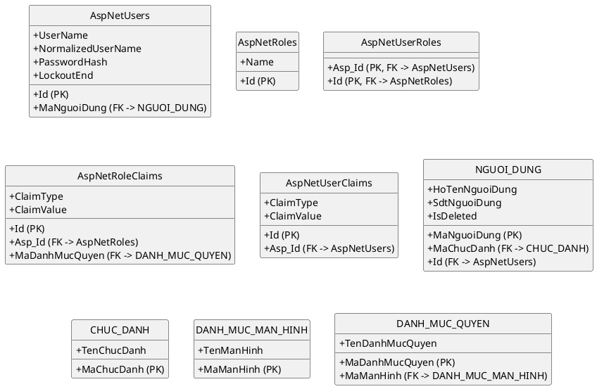

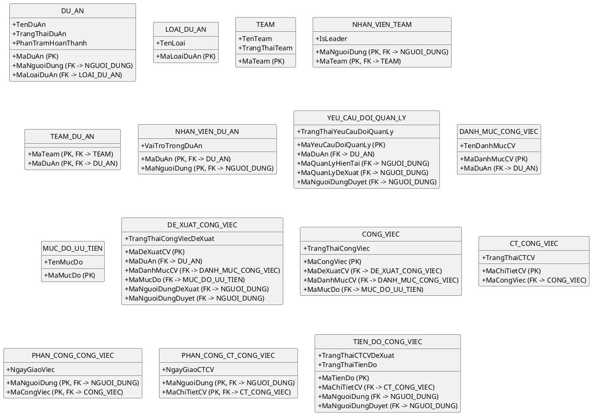

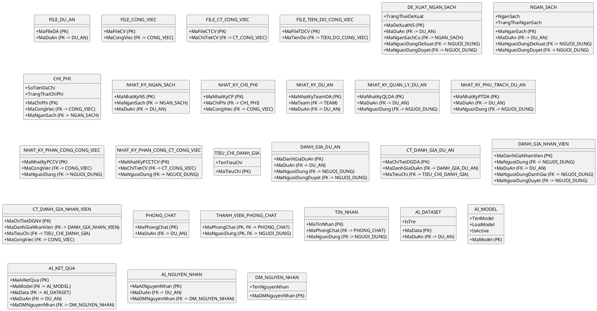

## 3.3 Sơ đồ phụ thuộc workflow
```plantuml
@startuml
left to right direction

rectangle "Workflow đề xuất cĂ´ng việc" {
  [DE_XUAT_CONG_VIEC: ChoDuyet] --> [DuyetDeXuatCongViecService.Approve]
  [DuyetDeXuatCongViecService.Approve] --> [CONG_VIEC: ChuaBatDau]
  [DuyetDeXuatCongViecService.Approve] --> [CHI_PHI: DaDuyet]
}

rectangle "Workflow tiến độ" {
  [TIEN_DO_CONG_VIEC: ChoDuyet] --> [TienDoCongViecService.DuyetBaoCaoTienDoAsync]
  [TienDoCongViecService.DuyetBaoCaoTienDoAsync] --> [CT_CONG_VIEC: TrangThaiCTCV]
  [CT_CONG_VIEC: TrangThaiCTCV] --> [TrangThaiWorkflowService.DongBoTrangThaiCongViecTheoChiTietAsync]
  [CONG_VIEC: TrangThaiCongViec] --> [TrangThaiWorkflowService.DongBoTrangThaiDuAnTheoCongViecAsync]
  [DU_AN: DangThucHien/ChoXacNhanHoanThanh] --> [DuAnService.XacNhanHoanThanhAsync]
}

rectangle "Workflow đề xuất ngĂ¢n sĂ¡ch" {
  [DE_XUAT_NGAN_SACH: ChoDuyet] --> [DuyetDeXuatNganSachService.Approve]
  [DuyetDeXuatNganSachService.Approve] --> [NGAN_SACH version má»›i: DaDuyet + IsActive]
  [NGAN_SACH version cũ] --> [DaThayThe + IsActive=false]
}

rectangle "Workflow đổi quản lĂ½" {
  [YEU_CAU_DOI_QUAN_LY: ChoDuyet] --> [DuyetYeuCauDoiQuanLyService.Approve]
  [DuyetYeuCauDoiQuanLyService.Approve] --> [DU_AN.MaNguoiDung cập nhật]
}

rectangle "Workflow AI" {
  [AiDatasetService.TongHop] --> [AI_DATASET]
  [AiService.TrainAsync] --> [AI_MODEL]
  [AiService.DuDoanDuAnAsync] --> [AI_KET_QUA]
  [AiService.XacNhanNguyenNhanAsync] --> [AI_NGUYEN_NHAN]
}
@enduml
```

# CHƯƠNG 4: SEQUENCE DIAGRAM


## 4.1 Đăng nhập hệ thống
- Mô tả: Người dùng đăng nhập qua `AccountController.Login`, xác thực bằng `AccountService.AuthenticateAsync`, nạp role + permission claim để cấp quyền truy cập các module.
- Actor: Người dùng
```plantuml
@startuml
actor "Người dùng" as ND
participant "AccountController" as ACC
participant "AccountService" as ACS
database "Database" as DB

ND -> ACC : POST /Account/Login(userName,password)
ACC -> ACC : Validate ModelState
alt ModelState không hợp lệ
  ACC --> ND : Trả lại form + lỗi validate
else Hợp lệ
  ACC -> ACS : AuthenticateAsync(userName,password)
  ACS -> DB : Tìm AspNetUsers + kiểm tra IsActive
  DB --> ACS : Bản ghi người dùng
  alt Không tồn tại / bị khóa / sai mật khẩu
    ACS --> ACC : Throw Exception
    ACC --> ND : Thông báo đăng nhập thất bại
  else Hợp lệ
    par Nạp role và claim
      ACS -> DB : Load AspNetUserRoles + AspNetRoles
      ACS -> DB : Load AspNetRoleClaims(type=permission)
    and Tạo principal
      ACS -> ACS : Build ClaimsIdentity + permission claim
    end
    ACS --> ACC : ClaimsPrincipal
    ACC -> ACC : HttpContext.SignInAsync(cookie)
    ACC --> ND : Redirect returnUrl/Home/Index
  end
end
@enduml
```

## 4.2 Phân quyền hệ thống
- Mô tả: Admin mở trang phân quyền và lưu danh sách permission cho role qua `PhanQuyenService`, ghi vào `AspNetRoleClaims` theo transaction.
- Actor: Quản trị viên
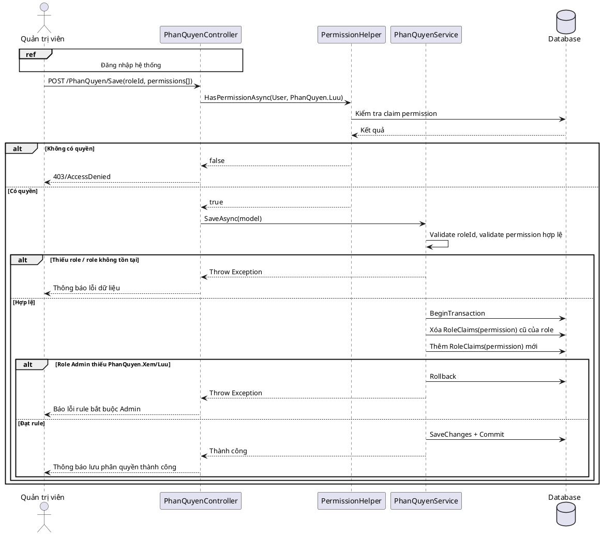

## 4.3 Tạo dự án
- Mô tả: Manager/Admin tạo mới dự án qua `DuAnController.LuuDuAn` và `DuAnService.SaveAsync`, kiểm tra quyền, validate dữ liệu ngày, loại dự án và trạng thái khởi tạo.
- Actor: Quản lý dự án
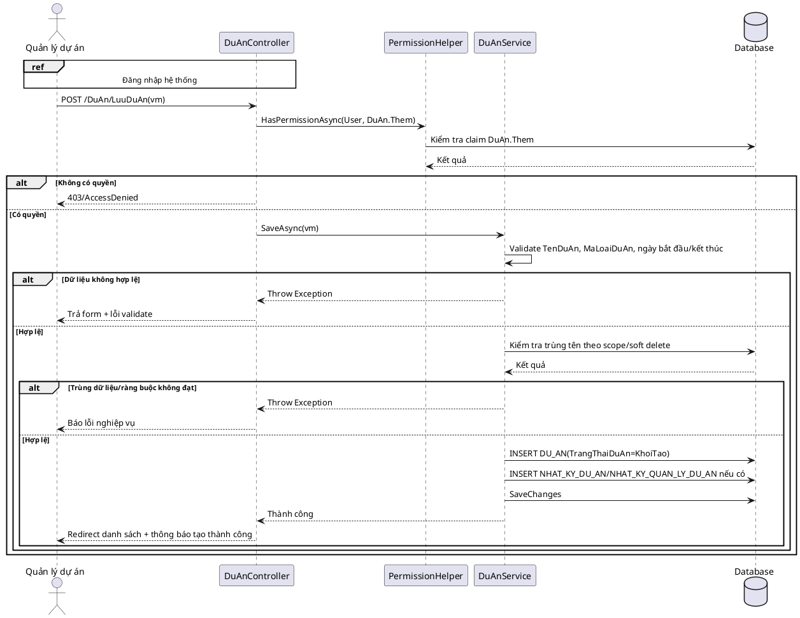

## 4.4 Chuyển trạng thái dự án
- Mô tả: Chuyển trạng thái dự án qua các action `BatDauDuAn`, `YeuCauHoanThanh`, `XacNhanHoanThanh`, `MoLaiDuAn`, `TamDungDuAn`; service kiểm tra workflow và đồng bộ trạng thái.
- Actor: Quản lý dự án
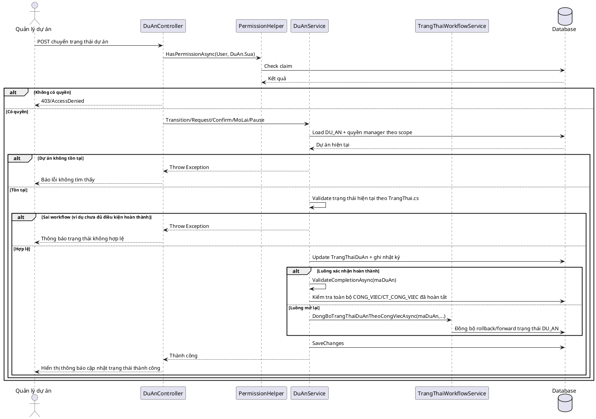

## 4.5 Yêu cầu đổi quản lý dự án
- Mô tả: Manager tạo yêu cầu đổi quản lý qua `YeuCauDoiQuanLyService.CreateAsync`, kiểm tra pending request và ứng viên quản lý mới.
- Actor: Quản lý dự án hiện tại
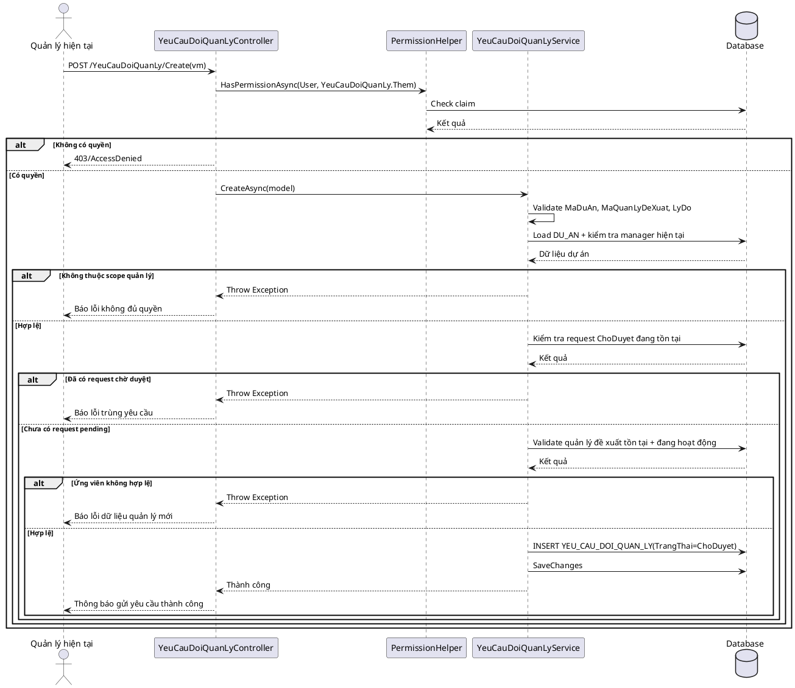

## 4.6 Duyệt yêu cầu đổi quản lý
- Mô tả: Người có quyền `DuyetYeuCauDoiQuanLy.Duyet` phê duyệt hoặc từ chối; khi duyệt sẽ đổi `DU_AN.MaNguoiDung` và cập nhật nhật ký trong transaction.
- Actor: Quản trị viên/Manager có quyền duyệt
```plantuml
@startuml
actor "Người duyệt" as DD
participant "DuyetYeuCauDoiQuanLyController" as DYC
participant "PermissionHelper" as PH
participant "DuyetYeuCauDoiQuanLyService" as DYS
database "Database" as DB

DD -> DYC : POST /DuyetYeuCauDoiQuanLy/Approve(id) hoặc Reject(id)
DYC -> PH : HasPermissionAsync(User, DuyetYeuCauDoiQuanLy.Duyet)
PH -> DB : Check claim
DB --> PH : Kết quả
alt Không có quyền
  DYC --> DD : 403/AccessDenied
else Có quyền
  DYC -> DYS : ApproveAsync(id) / RejectAsync(id,lyDo)
  DYS -> DB : Load YEU_CAU_DOI_QUAN_LY + DU_AN
  DB --> DYS : Bản ghi yêu cầu
  alt Không tồn tại hoặc không ở ChoDuyet
    DYS --> DYC : Throw Exception
    DYC --> DD : Báo lỗi trạng thái duyệt
  else Hợp lệ
    alt Reject
      DYS -> DB : Update TrangThai=TuChoi + LyDo + MaNguoiDungDuyet
      DYS -> DB : SaveChanges
      DYS --> DYC : Thành công
      DYC --> DD : Thông báo từ chối thành công
    else Approve
      DYS -> DB : BeginTransaction
      DYS -> DB : Update DU_AN.MaNguoiDung = MaQuanLyDeXuat
      DYS -> DB : Update YEU_CAU_DOI_QUAN_LY.TrangThai=DaDuyet
      par Ghi lịch sử
        DYS -> DB : INSERT NHAT_KY_QUAN_LY_DU_AN
      and Đồng bộ nhật ký dự án
        DYS -> DB : INSERT NHAT_KY_DU_AN
      end
      alt Lỗi khi cập nhật
        DYS -> DB : Rollback
        DYS --> DYC : Throw Exception
        DYC --> DD : Báo lỗi duyệt
      else Thành công
        DYS -> DB : Commit
        DYS --> DYC : Thành công
        DYC --> DD : Thông báo duyệt thành công
      end
    end
  end
end
@enduml
```

## 4.7 Thêm thành viên dự án
- Mô tả: `NhanVienDuAnService.AddAsync` thêm thành viên vào `NHAN_VIEN_DU_AN`, kiểm tra trạng thái dự án, trùng dữ liệu và đồng bộ room chat dự án.
- Actor: Quản lý dự án
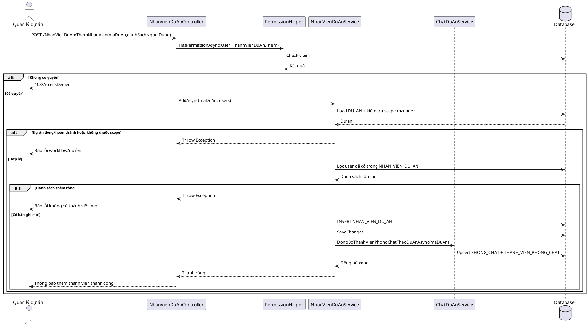

## 4.8 Phân công công việc
- Mô tả: `PhanCongCongViecService.AddAsync` gán người thực hiện cho `CONG_VIEC`, có kiểm tra quyền `PhanCongCongViec.ThucHien`, trạng thái công việc và thành viên dự án.
- Actor: Trưởng nhóm/Leader dự án
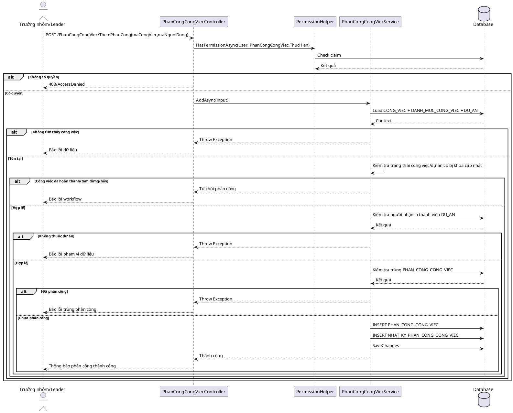

## 4.9 Phân công chi tiết công việc
- Mô tả: `PhanCongChiTietCongViecService.AddAsync` phân công trên `CT_CONG_VIEC`, bắt buộc người được gán đã có phân công ở cấp công việc cha.
- Actor: Trưởng nhóm/Leader dự án
```plantuml
@startuml
actor "Trưởng nhóm/Leader" as TL
participant "PhanCongChiTietCongViecController" as PCTC
participant "PermissionHelper" as PH
participant "PhanCongChiTietCongViecService" as PCTS
database "Database" as DB

TL -> PCTC : POST /PhanCongChiTietCongViec/ThemPhanCong(maChiTietCv,maNguoiDung)
PCTC -> PH : HasPermissionAsync(User, PhanCongChiTietCongViec.ThucHien)
PH -> DB : Check claim
DB --> PH : Kết quả
alt Không có quyền
  PCTC --> TL : 403/AccessDenied
else Có quyền
  PCTC -> PCTS : AddAsync(input)
  PCTS -> DB : Load CT_CONG_VIEC + CONG_VIEC + DU_AN
  DB --> PCTS : Context
  alt Không tìm thấy chi tiết
    PCTS --> PCTC : Throw Exception
    PCTC --> TL : Báo lỗi dữ liệu
  else Tồn tại
    PCTS -> PCTS : Validate trạng thái công việc cha/chi tiết
    alt Workflow không cho phép cập nhật
      PCTS --> PCTC : Từ chối phân công
      PCTC --> TL : Báo lỗi trạng thái
    else Hợp lệ
      PCTS -> DB : Kiểm tra user đã được phân công ở PHAN_CONG_CONG_VIEC
      DB --> PCTS : Kết quả
      alt Chưa có phân công cha
        PCTS --> PCTC : Throw Exception
        PCTC --> TL : Báo lỗi "chưa phân công công việc cha"
      else Đủ điều kiện
        PCTS -> DB : Kiểm tra trùng PHAN_CONG_CT_CONG_VIEC
        DB --> PCTS : Kết quả
        alt Đã tồn tại
          PCTS --> PCTC : Throw Exception
          PCTC --> TL : Báo lỗi trùng dữ liệu
        else Chưa tồn tại
          PCTS -> DB : INSERT PHAN_CONG_CT_CONG_VIEC
          PCTS -> DB : INSERT NHAT_KY_PHAN_CONG_CT_CONG_VIEC
          PCTS -> DB : SaveChanges
          PCTS --> PCTC : Thành công
          PCTC --> TL : Thông báo phân công chi tiết thành công
        end
      end
    end
  end
end
@enduml
```

## 4.10 Tạo công việc
- Mô tả: Công việc được tạo theo workflow duyệt đề xuất công việc; `DyetDeXuatCongViecService.ApproveAsync` sinh `CONG_VIEC` và nghiệp vụ chi phí.
- Actor: Người duyệt đề xuất công việc
```plantuml
@startuml
actor "Người duyệt" as DD
participant "DuyetDeXuatCongViecController" as DXC
participant "PermissionHelper" as PH
participant "DyetDeXuatCongViecService" as DXS
participant "TrangThaiWorkflowService" as WFS
database "Database" as DB

ref over DD,DXC
Đề xuất công việc đã ở trạng thái ChoDuyet
end ref

DD -> DXC : POST /DuyetDeXuatCongViec/Duyet(maDeXuatCv)
DXC -> PH : HasPermissionAsync(User, DuyetDeXuatCongViec.Duyet)
PH -> DB : Check claim
DB --> PH : Kết quả
alt Không có quyền
  DXC --> DD : 403/AccessDenied
else Có quyền
  DXC -> DXS : ApproveAsync(maDeXuatCv)
  DXS -> DB : Load DE_XUAT_CONG_VIEC + DU_AN + danh mục
  DB --> DXS : Bản ghi đề xuất
  alt Không tồn tại/không ở ChoDuyet
    DXS --> DXC : Throw Exception
    DXC --> DD : Báo lỗi không thể tạo công việc
  else Hợp lệ
    DXS -> DB : BeginTransaction
    DXS -> DB : INSERT CONG_VIEC(TrangThai=ChuaBatDau)
    par Nghiệp vụ chi phí
      DXS -> DB : INSERT CHI_PHI/NHAT_KY_CHI_PHI nếu có ChiPhiDeXuat
    and Cập nhật đề xuất
      DXS -> DB : UPDATE DE_XUAT_CONG_VIEC(TrangThai=DaDuyet,NgayDuyet,MaNguoiDungDuyet)
    end
    DXS -> WFS : DongBoTrangThaiDuAnTheoCongViecAsync(maDuAn,...)
    WFS -> DB : Đồng bộ DU_AN nếu cần rollback/forward
    alt Lỗi trong transaction
      DXS -> DB : Rollback
      DXS --> DXC : Throw Exception
      DXC --> DD : Báo lỗi tạo công việc
    else Thành công
      DXS -> DB : Commit
      DXS --> DXC : Thành công
      DXC --> DD : Thông báo tạo công việc thành công
    end
  end
end
@enduml
```

## 4.11 Tạo chi tiết công việc
- Mô tả: `ChiTietCongViecService.AddAsync` thêm `CT_CONG_VIEC`, validate dữ liệu ngày/trạng thái và đồng bộ chuỗi trạng thái cha-con.
- Actor: Trưởng nhóm/Leader dự án
```plantuml
@startuml
actor "Trưởng nhóm/Leader" as TL
participant "ChiTietCongViecController" as CTC
participant "PermissionHelper" as PH
participant "ChiTietCongViecService" as CTS
participant "TrangThaiWorkflowService" as WFS
database "Database" as DB

TL -> CTC : POST /ChiTietCongViec/Them(form)
CTC -> PH : HasPermissionAsync(User, ChiTietCongViec.Them)
PH -> DB : Check claim
DB --> PH : Kết quả
alt Không có quyền
  CTC --> TL : 403/AccessDenied
else Có quyền
  CTC -> CTS : AddAsync(form)
  CTS -> DB : Load CONG_VIEC + DU_AN theo MaCongViec
  DB --> CTS : Context
  alt Không tìm thấy công việc
    CTS --> CTC : Throw Exception
    CTC --> TL : Báo lỗi dữ liệu
  else Tồn tại
    CTS -> CTS : Validate TenCTCV/NoiDung/NgayBatDau/TrangThaiCTCV
    CTS -> CTS : KiemTraQuyenCapNhatAsync + KiemTraTrangThaiCongViecTruocKhiThemAsync
    alt Không hợp lệ hoặc không đủ quyền
      CTS --> CTC : Throw Exception
      CTC --> TL : Hiển thị lỗi validate/quyền/workflow
    else Hợp lệ
      CTS -> DB : INSERT CT_CONG_VIEC
      CTS -> DB : SaveChanges
      CTS -> WFS : DongBoChuoiTrangThaiTuCongViecAsync(maCongViec,...)
      par Đồng bộ công việc
        WFS -> DB : UPDATE CONG_VIEC theo tổng hợp CT_CONG_VIEC
      and Đồng bộ dự án
        WFS -> DB : UPDATE DU_AN theo tổng hợp CONG_VIEC
      end
      CTS -> DB : SaveChanges
      CTS --> CTC : Thành công
      CTC --> TL : Thông báo thêm chi tiết thành công
    end
  end
end
@enduml
```

## 4.12 Cập nhật tiến độ công việc
- Mô tả: `TienDoCongViecService.CapNhatTienDoAsync` tạo bản ghi `TIEN_DO_CONG_VIEC` trạng thái `ChoDuyet`, kiểm tra chống lùi trạng thái và bắt buộc minh chứng cho trạng thái hoàn thành.
- Actor: Nhân viên thực hiện
```plantuml
@startuml
actor "Nhân viên" as NV
participant "TienDoCongViecController" as TDC
participant "PermissionHelper" as PH
participant "TienDoCongViecService" as TDS
database "Database" as DB

ref over NV,TDC
Đăng nhập + đã được phân công CT_CONG_VIEC
end ref

NV -> TDC : POST /TienDoCongViec/CapNhatTienDo(form, files)
TDC -> PH : HasPermissionAsync(User, TienDo.CapNhat)
PH -> DB : Check claim
DB --> PH : Kết quả
alt Không có quyền
  TDC --> NV : 403/AccessDenied
else Có quyền
  TDC -> TDS : CapNhatTienDoAsync(form)
  TDS -> DB : Load CT_CONG_VIEC + CONG_VIEC + DU_AN
  DB --> TDS : Context
  TDS -> TDS : CoTheTacNghiepTienDoChiTietAsync(scope + trạng thái)
  alt Bị khóa do workflow/scope
    TDS --> TDC : Throw Exception
    TDC --> NV : Báo lỗi không được cập nhật
  else Được cập nhật
    TDS -> TDS : Validate trạng thái đề xuất không lùi
    TDS -> TDS : Validate nội dung báo cáo + file minh chứng
    alt Không hợp lệ
      TDS --> TDC : Throw Exception
      TDC --> NV : Hiển thị lỗi validate cụ thể
    else Hợp lệ
      TDS -> DB : BeginTransaction
      TDS -> DB : INSERT TIEN_DO_CONG_VIEC(TrangThaiTienDo=ChoDuyet)
      alt Có file minh chứng
        TDS -> DB : INSERT FILE_TIEN_DO_CONG_VIEC
      else Không có file nhưng trạng thái yêu cầu minh chứng
        TDS -> DB : Rollback
        TDS --> TDC : Throw Exception
        TDC --> NV : Báo lỗi bắt buộc minh chứng
      end
      TDS -> DB : Commit
      TDS --> TDC : Thành công
      TDC --> NV : Thông báo gửi báo cáo chờ duyệt
    end
  end
end
@enduml
```

## 4.13 Duyệt báo cáo tiến độ
- Mô tả: `TienDoCongViecService.DuyetBaoCaoTienDoAsync` / `YeuCauBoSungBaoCaoTienDoAsync` / `TuChoiBaoCaoTienDoAsync`; khi duyệt sẽ cập nhật `CT_CONG_VIEC` và đồng bộ `CT_CONG_VIEC -> CONG_VIEC -> DU_AN`.
- Actor: Manager/Leader duyệt tiến độ
```plantuml
@startuml
actor "Người duyệt tiến độ" as DD
participant "TienDoCongViecController" as TDC
participant "PermissionHelper" as PH
participant "TienDoCongViecService" as TDS
participant "TrangThaiWorkflowService" as WFS
database "Database" as DB

DD -> TDC : POST DuyetBaoCaoTienDo/YeuCauBoSung/TuChoi(form)
TDC -> PH : HasPermissionAsync(User, TienDo.Duyet)
PH -> DB : Check claim
DB --> PH : Kết quả
alt Không có quyền
  TDC --> DD : 403/AccessDenied
else Có quyền
  TDC -> TDS : XuLyDuyetBaoCaoTienDoAsync(form,trangThaiDich)
  TDS -> DB : Load TIEN_DO_CONG_VIEC + context dự án
  DB --> TDS : Bản ghi báo cáo
  alt Không tồn tại/không ở ChoDuyet
    TDS --> TDC : Throw Exception
    TDC --> DD : Báo lỗi trạng thái duyệt
  else Hợp lệ
    TDS -> TDS : CoTheDuyetBaoCaoTheoScopeAsync(maDuAn,currentUser)
    alt Không đủ scope duyệt
      TDS --> TDC : Throw Exception
      TDC --> DD : Báo lỗi quyền duyệt
    else Đủ quyền
      TDS -> DB : BeginTransaction
      alt Duyệt (DaDuyet)
        TDS -> DB : UPDATE TIEN_DO_CONG_VIEC(TrangThai=DaDuyet,NguoiDuyet,ThoiGianDuyet)
        TDS -> DB : UPDATE CT_CONG_VIEC theo TrangThaiCTCVDeXuat
        TDS -> DB : SaveChanges
        TDS -> WFS : DongBoChuoiTrangThaiTuCongViecAsync(maCongViec,...)
        par Đồng bộ CÔNG_VIỆC
          WFS -> DB : UPDATE CONG_VIEC
        and Đồng bộ DỰ_ÁN
          WFS -> DB : UPDATE DU_AN
        end
      else Yêu cầu bổ sung
        TDS -> DB : UPDATE TIEN_DO_CONG_VIEC(TrangThai=YeuCauBoSung)
      else Từ chối
        TDS -> DB : UPDATE TIEN_DO_CONG_VIEC(TrangThai=TuChoi)
      end
      alt Lỗi transaction
        TDS -> DB : Rollback
        TDS --> TDC : Throw Exception
        TDC --> DD : Báo lỗi xử lý duyệt
      else Thành công
        TDS -> DB : Commit
        TDS --> TDC : Thành công
        TDC --> DD : Thông báo xử lý báo cáo thành công
      end
    end
  end
end
@enduml
```

## 4.14 Đề xuất công việc
- Mô tả: `DeXuatCongViecService.CreateAsync` tạo đề xuất công việc ở trạng thái `ChoDuyet`, kiểm tra dự án, danh mục, ngân sách và workflow.
- Actor: Nhân viên/Leader dự án
```plantuml
@startuml
actor "Người đề xuất" as DX
participant "DeXuatCongViecController" as DXC
participant "PermissionHelper" as PH
participant "DeXuatCongViecService" as DXS
database "Database" as DB

DX -> DXC : POST /DeXuatCongViec/TaoDeXuat(vm)
DXC -> PH : HasPermissionAsync(User, DeXuatCongViec.Them)
PH -> DB : Check claim
DB --> PH : Kết quả
alt Không có quyền
  DXC --> DX : 403/AccessDenied
else Có quyền
  DXC -> DXS : CreateAsync(model)
  DXS -> DXS : Validate bắt buộc, ngày bắt đầu/kết thúc, chi phí
  DXS -> DB : Load DU_AN + DANH_MUC_CONG_VIEC + NGAN_SACH đang dùng
  DB --> DXS : Context
  alt Dự án không hợp lệ hoặc ngoài scope
    DXS --> DXC : Throw Exception
    DXC --> DX : Báo lỗi quyền/scope
  else Hợp lệ
    DXS -> DXS : Kiểm tra trạng thái dự án có cho phép đề xuất
    alt Dự án đã đóng/khóa workflow
      DXS --> DXC : Throw Exception
      DXC --> DX : Báo lỗi trạng thái dự án
    else Hợp lệ
      DXS -> DB : INSERT DE_XUAT_CONG_VIEC(TrangThai=ChoDuyet)
      DXS -> DB : SaveChanges
      DXS --> DXC : Thành công
      DXC --> DX : Thông báo gửi đề xuất công việc thành công
    end
  end
end
@enduml
```

## 4.15 Duyệt đề xuất công việc
- Mô tả: `DyetDeXuatCongViecService.ApproveAsync/RejectAsync`; nhánh duyệt tạo `CONG_VIEC` + ghi `CHI_PHI`, nhánh từ chối cập nhật trạng thái và lý do.
- Actor: Manager/Người có quyền duyệt đề xuất công việc
```plantuml
@startuml
actor "Người duyệt" as DD
participant "DuyetDeXuatCongViecController" as DYC
participant "PermissionHelper" as PH
participant "DyetDeXuatCongViecService" as DXS
participant "TrangThaiWorkflowService" as WFS
database "Database" as DB

DD -> DYC : POST Duyet(maDeXuatCv) / TuChoi(maDeXuatCv,lyDo)
DYC -> PH : HasPermissionAsync(User, DuyetDeXuatCongViec.Duyet)
PH -> DB : Check claim
DB --> PH : Kết quả
alt Không có quyền
  DYC --> DD : 403/AccessDenied
else Có quyền
  alt Từ chối
    DYC -> DXS : RejectAsync(maDeXuatCv,lyDo)
    DXS -> DB : Load DE_XUAT_CONG_VIEC
    DB --> DXS : Bản ghi đề xuất
    alt Không ở ChoDuyet
      DXS --> DYC : Throw Exception
      DYC --> DD : Báo lỗi trạng thái
    else Hợp lệ
      DXS -> DB : UPDATE DE_XUAT_CONG_VIEC(TrangThai=TuChoi, LyDo, NguoiDuyet)
      DXS -> DB : SaveChanges
      DXS --> DYC : Thành công
      DYC --> DD : Thông báo từ chối thành công
    end
  else Duyệt
    DYC -> DXS : ApproveAsync(maDeXuatCv)
    DXS -> DB : Load DE_XUAT_CONG_VIEC + DU_AN + ngân sách
    DB --> DXS : Context
    alt Không hợp lệ (không pending/không đủ ngân sách)
      DXS --> DYC : Throw Exception
      DYC --> DD : Báo lỗi duyệt
    else Hợp lệ
      DXS -> DB : BeginTransaction
      DXS -> DB : UPDATE DE_XUAT_CONG_VIEC(TrangThai=DaDuyet)
      DXS -> DB : INSERT CONG_VIEC
      DXS -> DB : INSERT CHI_PHI + NHAT_KY_CHI_PHI (nếu phát sinh)
      DXS -> WFS : DongBoTrangThaiDuAnTheoCongViecAsync(maDuAn,...)
      WFS -> DB : Update DU_AN theo tổng hợp CONG_VIEC
      alt Lỗi lưu
        DXS -> DB : Rollback
        DXS --> DYC : Throw Exception
        DYC --> DD : Báo lỗi và không phát sinh dữ liệu nửa chừng
      else Thành công
        DXS -> DB : Commit
        DXS --> DYC : Thành công
        DYC --> DD : Thông báo duyệt đề xuất thành công
      end
    end
  end
end
@enduml
```

## 4.16 Đề xuất ngân sách
- Mô tả: `DeXuatNganSachService.CreateAsync` tạo `DE_XUAT_NGAN_SACH` với trạng thái `ChoDuyet`, kiểm tra ngân sách cũ và quyền theo scope dự án.
- Actor: Quản lý/Leader dự án
```plantuml
@startuml
actor "Người đề xuất ngân sách" as DX
participant "DeXuatNganSachController" as NSC
participant "PermissionHelper" as PH
participant "DeXuatNganSachService" as NSS
database "Database" as DB

DX -> NSC : POST /DeXuatNganSach/TaoDeXuat(vm)
NSC -> PH : HasPermissionAsync(User, DeXuatNganSach.Them)
PH -> DB : Check claim
DB --> PH : Kết quả
alt Không có quyền
  NSC --> DX : 403/AccessDenied
else Có quyền
  NSC -> NSS : CreateAsync(model)
  NSS -> NSS : Validate NganSachDeXuat, LyDo, MaDuAn
  NSS -> DB : Load DU_AN + NGAN_SACH active
  DB --> NSS : Context
  alt Dự án không hợp lệ/ngoài scope
    NSS --> NSC : Throw Exception
    NSC --> DX : Báo lỗi quyền dữ liệu
  else Hợp lệ
    NSS -> DB : Kiểm tra DE_XUAT_NGAN_SACH đang ChoDuyet
    DB --> NSS : Kết quả
    alt Đã có đề xuất chờ duyệt
      NSS --> NSC : Throw Exception
      NSC --> DX : Báo lỗi pending request
    else Chưa có pending
      NSS -> DB : INSERT DE_XUAT_NGAN_SACH(TrangThai=ChoDuyet)
      NSS -> DB : SaveChanges
      NSS --> NSC : Thành công
      NSC --> DX : Thông báo gửi đề xuất ngân sách thành công
    end
  end
end
@enduml
```

## 4.17 Duyệt đề xuất ngân sách
- Mô tả: `DuyetDeXuatNganSachService.ApproveAsync/RejectAsync`; nhánh duyệt thay ngân sách active cũ bằng ngân sách mới và ghi nhật ký.
- Actor: Người duyệt ngân sách
```plantuml
@startuml
actor "Người duyệt ngân sách" as DD
participant "DuyetDeXuatNganSachController" as DNC
participant "PermissionHelper" as PH
participant "DuyetDeXuatNganSachService" as DNS
database "Database" as DB

DD -> DNC : POST Duyet(maDeXuatNs) / TuChoi(maDeXuatNs,lyDo)
DNC -> PH : HasPermissionAsync(User, DuyetNganSach.Duyet)
PH -> DB : Check claim
DB --> PH : Kết quả
alt Không có quyền
  DNC --> DD : 403/AccessDenied
else Có quyền
  alt Từ chối
    DNC -> DNS : RejectAsync(maDeXuatNs,lyDo)
    DNS -> DB : Load DE_XUAT_NGAN_SACH
    DB --> DNS : Bản ghi
    alt Không ở ChoDuyet
      DNS --> DNC : Throw Exception
      DNC --> DD : Báo lỗi trạng thái
    else Hợp lệ
      DNS -> DB : UPDATE DE_XUAT_NGAN_SACH(TrangThai=TuChoi,LyDo)
      DNS -> DB : SaveChanges
      DNS --> DNC : Thành công
      DNC --> DD : Thông báo từ chối thành công
    end
  else Duyệt
    DNC -> DNS : ApproveAsync(maDeXuatNs)
    DNS -> DB : Load đề xuất + ngân sách active hiện tại
    DB --> DNS : Context
    alt Không hợp lệ (không pending/sai scope)
      DNS --> DNC : Throw Exception
      DNC --> DD : Báo lỗi duyệt
    else Hợp lệ
      DNS -> DB : BeginTransaction
      DNS -> DB : UPDATE NGAN_SACH cũ -> DaThayThe/NgungHoatDong
      DNS -> DB : INSERT NGAN_SACH mới (DangSuDung/HoatDong)
      DNS -> DB : UPDATE DE_XUAT_NGAN_SACH(TrangThai=DaDuyet)
      DNS -> DB : INSERT NHAT_KY_NGAN_SACH
      alt Lỗi transaction
        DNS -> DB : Rollback
        DNS --> DNC : Throw Exception
        DNC --> DD : Báo lỗi duyệt
      else Thành công
        DNS -> DB : Commit
        DNS --> DNC : Thành công
        DNC --> DD : Thông báo duyệt ngân sách thành công
      end
    end
  end
end
@enduml
```

## 4.18 Đánh giá nhân viên
- Mô tả: `DanhGiaNhanVienService.LuuDanhGiaAsync` và `GuiDuyetAsync`; workflow `Nhap -> ChoDuyet` trước khi duyệt chính thức.
- Actor: Quản lý/Leader đánh giá
```plantuml
@startuml
actor "Người đánh giá" as DG
participant "DanhGiaNhanVienController" as NVC
participant "PermissionHelper" as PH
participant "DanhGiaNhanVienService" as NVS
database "Database" as DB

DG -> NVC : POST /DanhGiaNhanVien/Luu(form)
NVC -> PH : HasPermissionAsync(User, DanhGiaNhanVien.DanhGia, DanhGiaNhanVien.Sua)
PH -> DB : Check claim
DB --> PH : Kết quả
alt Không có quyền
  NVC --> DG : 403/AccessDenied
else Có quyền
  NVC -> NVS : LuuDanhGiaAsync(form)
  NVS -> DB : Load DU_AN + NHAN_VIEN_DU_AN + tiêu chí
  DB --> NVS : Context
  NVS -> NVS : Validate điểm từng tiêu chí + tổng điểm + scope
  alt Không hợp lệ
    NVS --> NVC : Throw Exception
    NVC --> DG : Báo lỗi validate/scope
  else Hợp lệ
    alt Chưa có bản ghi
      NVS -> DB : INSERT DANH_GIA_NHAN_VIEN(TrangThai=Nhap)
      NVS -> DB : INSERT CT_DANH_GIA_NHAN_VIEN
    else Đã có bản ghi nháp
      NVS -> DB : UPDATE DANH_GIA_NHAN_VIEN + CT_DANH_GIA_NHAN_VIEN
    end
    NVS -> DB : SaveChanges
    NVS --> NVC : Thành công
    NVC --> DG : Thông báo lưu nháp thành công
  end
end

DG -> NVC : POST /DanhGiaNhanVien/GuiDuyet(maDanhGiaNhanVien)
NVC -> NVS : GuiDuyetAsync(maDanhGiaNhanVien)
NVS -> DB : UPDATE TrangThaiDanhGia = ChoDuyet
NVS -> DB : SaveChanges
NVS --> NVC : Thành công
NVC --> DG : Thông báo gửi duyệt thành công
@enduml
```

## 4.19 Duyệt đánh giá nhân viên
- Mô tả: `DanhGiaNhanVienService.DuyetAsync/TuChoiAsync`, kiểm tra quyền `DanhGiaNhanVien.Duyet`, trạng thái phải là `ChoDuyet`.
- Actor: Người duyệt đánh giá nhân viên
```plantuml
@startuml
actor "Người duyệt" as DD
participant "DanhGiaNhanVienController" as NVC
participant "PermissionHelper" as PH
participant "DanhGiaNhanVienService" as NVS
database "Database" as DB

DD -> NVC : POST /DanhGiaNhanVien/Duyet hoặc TuChoi
NVC -> PH : HasPermissionAsync(User, DanhGiaNhanVien.Duyet)
PH -> DB : Check claim
DB --> PH : Kết quả
alt Không có quyền
  NVC --> DD : 403/AccessDenied
else Có quyền
  alt Duyệt
    NVC -> NVS : DuyetAsync(maDanhGiaNhanVien)
    NVS -> DB : Load DANH_GIA_NHAN_VIEN
    DB --> NVS : Bản ghi
    alt Không ở ChoDuyet
      NVS --> NVC : Throw Exception
      NVC --> DD : Báo lỗi trạng thái
    else Hợp lệ
      NVS -> DB : UPDATE TrangThaiDanhGia=DaDuyet, MaNguoiDungDuyet, NgayDuyet
      NVS -> DB : SaveChanges
      NVS --> NVC : Thành công
      NVC --> DD : Thông báo duyệt thành công
    end
  else Từ chối
    NVC -> NVS : TuChoiAsync(maDanhGiaNhanVien,lyDo)
    NVS -> DB : UPDATE TrangThaiDanhGia=TuChoi, LyDoTuChoi
    NVS -> DB : SaveChanges
    NVS --> NVC : Thành công
    NVC --> DD : Thông báo từ chối thành công
  end
end
@enduml
```

## 4.20 Đánh giá dự án
- Mô tả: `DanhGiaDuAnService.LuuDanhGiaAsync` và `GuiDuyetAsync`; tích hợp dữ liệu AI tham khảo nhưng MVC vẫn là nơi quyết định lưu và workflow đánh giá.
- Actor: Manager dự án
```plantuml
@startuml
actor "Manager dự án" as MG
participant "DanhGiaDuAnController" as DAC
participant "PermissionHelper" as PH
participant "DanhGiaDuAnService" as DAS
participant "AiService" as AIS
database "Database" as DB

MG -> DAC : POST /DanhGiaDuAn/Luu(form)
DAC -> PH : HasPermissionAsync(User, DanhGiaDuAn.DanhGia, DanhGiaDuAn.Sua)
PH -> DB : Check claim
DB --> PH : Kết quả
alt Không có quyền
  DAC --> MG : 403/AccessDenied
else Có quyền
  DAC -> DAS : LuuDanhGiaAsync(form)
  DAS -> DB : Load DU_AN + tiêu chí đánh giá
  DB --> DAS : Context
  DAS -> DAS : Validate trạng thái dự án cho phép đánh giá
  alt Không hợp lệ
    DAS --> DAC : Throw Exception
    DAC --> MG : Báo lỗi workflow/validate
  else Hợp lệ
    par Nạp AI tham khảo gần nhất
      DAS -> AIS : NapDuLieuAiThamKhaoAsync(maDuAn)
      AIS -> DB : Read AI_KET_QUA mới nhất + AI_NGUYEN_NHAN
      DB --> AIS : Dữ liệu tham khảo
      AIS --> DAS : Gợi ý AI (read-only)
    and Lưu nghiệp vụ đánh giá
      DAS -> DB : INSERT/UPDATE DANH_GIA_DU_AN + CT_DANH_GIA_DU_AN(TrangThai=Nhap)
    end
    DAS -> DB : SaveChanges
    DAS --> DAC : Thành công
    DAC --> MG : Thông báo lưu đánh giá dự án thành công
  end
end

MG -> DAC : POST /DanhGiaDuAn/GuiDuyet(maDanhGiaDuAn)
DAC -> DAS : GuiDuyetAsync(maDanhGiaDuAn)
DAS -> DB : UPDATE TrangThaiDanhGia=ChoDuyet
DAS -> DB : SaveChanges
DAS --> DAC : Thành công
DAC --> MG : Thông báo gửi duyệt thành công
@enduml
```

## 4.21 Duyệt đánh giá dự án
- Mô tả: `DanhGiaDuAnService.DuyetAsync/TuChoiAsync`; áp dụng workflow `ChoDuyet -> DaDuyet/TuChoi`.
- Actor: Người duyệt đánh giá dự án
```plantuml
@startuml
actor "Người duyệt" as DD
participant "DanhGiaDuAnController" as DAC
participant "PermissionHelper" as PH
participant "DanhGiaDuAnService" as DAS
database "Database" as DB

DD -> DAC : POST /DanhGiaDuAn/Duyet hoặc TuChoi
DAC -> PH : HasPermissionAsync(User, DanhGiaDuAn.Duyet)
PH -> DB : Check claim
DB --> PH : Kết quả
alt Không có quyền
  DAC --> DD : 403/AccessDenied
else Có quyền
  alt Duyệt
    DAC -> DAS : DuyetAsync(maDanhGiaDuAn)
    DAS -> DB : Load DANH_GIA_DU_AN
    DB --> DAS : Bản ghi
    alt Không ở ChoDuyet
      DAS --> DAC : Throw Exception
      DAC --> DD : Báo lỗi trạng thái duyệt
    else Hợp lệ
      DAS -> DB : UPDATE TrangThaiDanhGia=DaDuyet + metadata duyệt
      DAS -> DB : SaveChanges
      DAS --> DAC : Thành công
      DAC --> DD : Thông báo duyệt đánh giá dự án thành công
    end
  else Từ chối
    DAC -> DAS : TuChoiAsync(maDanhGiaDuAn,lyDo)
    DAS -> DB : UPDATE TrangThaiDanhGia=TuChoi + LyDoTuChoi
    DAS -> DB : SaveChanges
    DAS --> DAC : Thành công
    DAC --> DD : Thông báo từ chối đánh giá dự án
  end
end
@enduml
```

## 4.22 Chat dự án
- Mô tả: `ChatDuAnService.GuiTinNhanAsync` chỉ cho thành viên dự án gửi tin; tự đồng bộ phòng chat và thành viên trước khi ghi `TIN_NHAN`.
- Actor: Thành viên dự án
```plantuml
@startuml
actor "Thành viên dự án" as TV
participant "ChatDuAnController" as CDC
participant "PermissionHelper" as PH
participant "ChatDuAnService" as CDS
database "Database" as DB

ref over TV,CDC
Đăng nhập + mở màn hình chat dự án
end ref

TV -> CDC : POST /ChatDuAn/GuiTinNhan(form)
CDC -> PH : HasPermissionAsync(User, Chat.Gui)
PH -> DB : Check claim
DB --> PH : Kết quả
alt Không có quyền
  CDC --> TV : 403/AccessDenied
else Có quyền
  CDC -> CDS : GuiTinNhanAsync(maDuAn,noiDung)
  CDS -> DB : Load DU_AN + kiểm tra user thuộc NHAN_VIEN_DU_AN
  DB --> CDS : Context
  alt Không thuộc dự án
    CDS --> CDC : Throw Exception
    CDC --> TV : Báo lỗi không có quyền chat dự án này
  else Thuộc phạm vi
    CDS -> CDS : DamBaoPhongChatDuAnAsync(maDuAn)
    CDS -> DB : Upsert PHONG_CHAT + THANH_VIEN_PHONG_CHAT
    alt Dự án ở trạng thái khóa chat (đã đóng)
      CDS --> CDC : Throw Exception
      CDC --> TV : Báo lỗi không thể gửi tin
    else Được gửi
      CDS -> DB : INSERT TIN_NHAN
      CDS -> DB : SaveChanges
      CDS --> CDC : Thành công
      CDC --> TV : Trả lại màn hình chat + tin nhắn mới
    end
  end
end
@enduml
```

## 4.23 Tổng hợp AI_DATASET
- Mô tả: `AiDatasetService.TongHopDatasetAsync/TongHopDatasetChoDuAnAsync` tổng hợp feature từ dữ liệu thực (DU_AN, CONG_VIEC, TIEN_DO, NGAN_SACH...) vào `AI_DATASET`.
- Actor: Người vận hành AI
```plantuml
@startuml
actor "Người vận hành AI" as AIU
participant "AiDatasetController" as ADC
participant "PermissionHelper" as PH
participant "AiDatasetService" as ADS
database "Database" as DB

AIU -> ADC : POST /AiDataset/TongHopDataset hoặc TongHopDatasetChoDuAn
ADC -> PH : HasPermissionAsync(User, AI.Dataset)
PH -> DB : Check claim
DB --> PH : Kết quả
alt Không có quyền
  ADC --> AIU : 403/AccessDenied
else Có quyền
  ADC -> ADS : TongHopDataset...Async()
  ADS -> DB : Load DU_AN active cần tổng hợp
  ADS -> DB : Load CONG_VIEC, CT_CONG_VIEC, TIEN_DO_CONG_VIEC
  ADS -> DB : Load NGAN_SACH/CHI_PHI, NHAN_VIEN_DU_AN, NHAT_KY_QUAN_LY
  DB --> ADS : Dữ liệu nguồn
  ADS -> ADS : Tính 10 feature + rule gán IsTre (không tự gán bừa)
  alt Không có dự án hợp lệ
    ADS --> ADC : Result thất bại + lý do
    ADC --> AIU : Hiển thị cảnh báo thiếu dữ liệu
  else Có dữ liệu
    ADS -> DB : UPSERT AI_DATASET theo MaDuAn
    par Đếm thống kê
      ADS -> ADS : SoDuAnTaoMoi / SoDuAnCapNhat / SoDuAnLoi
    and Ghi log ứng dụng
      ADS -> ADS : logger.LogInformation
    end
    ADS -> DB : SaveChanges
    ADS --> ADC : Result thành công + thống kê
    ADC --> AIU : Thông báo tổng hợp dataset thành công
  end
end
@enduml
```

## 4.24 Train model AI
- Mô tả: `AiService.TrainAsync` tách rõ `TreHan` và `NguyenNhan`, kiểm tra chất lượng dataset (`MIN_TRAIN_ROWS`), gọi FastAPI train compute-only, sau đó MVC lưu metadata model.
- Actor: Người vận hành AI
```plantuml
@startuml
actor "Người vận hành AI" as AIU
participant "AiController" as AIC
participant "PermissionHelper" as PH
participant "AiService" as AIS
participant "AiDatasetService" as ADS
participant "AiApiService" as API
participant "FastAPI AI" as FAPI
database "Database" as DB

AIU -> AIC : POST /Ai/Train(modelType,activateAfterTrain)
AIC -> PH : HasPermissionAsync(User, AI.Train)
PH -> DB : Check claim
DB --> PH : Kết quả
alt Không có quyền
  AIC --> AIU : 403/AccessDenied
else Có quyền
  AIC -> AIS : TrainAsync(modelType,activateAfterTrain,...)
  alt modelType = TreHan
    AIS -> ADS : KiemTraChatLuongDatasetAsync()
    ADS -> DB : Read AI_DATASET
    DB --> ADS : Dataset
  else modelType = NguyenNhan
    AIS -> ADS : KiemTraChatLuongDatasetNguyenNhanAsync()
    ADS -> DB : Read AI_DATASET + AI_NGUYEN_NHAN xác nhận
    DB --> ADS : Dataset train nguyên nhân
  end
  ADS --> AIS : Summary chất lượng
  alt Không đủ điều kiện train (ít dòng, thiếu lớp, thiếu nhãn)
    AIS --> AIC : Result thất bại + lý do chi tiết
    AIC --> AIU : Hiển thị lỗi quality gate
  else Đủ điều kiện
    AIS -> ADS : LayDataset...HopLeDeTrainAsync()
    ADS --> AIS : Rows hợp lệ
    AIS -> API : TrainModelAsync(payload)
    API -> FAPI : POST /model/train
    FAPI --> API : train result(model_file,metrics)
    alt FastAPI lỗi/timeout/422
      API --> AIS : ThanhCong=false + detail.loc/msg/type
      AIS --> AIC : Result thất bại
      AIC --> AIU : Hiển thị lỗi train cụ thể
    else Train thành công
      API --> AIS : ThanhCong=true
      AIS -> DB : INSERT/UPDATE AI_MODEL(metadata, modelType)
      alt activateAfterTrain=true
        AIS -> API : DatModelHoatDongAsync(modelFile,modelType)
        API -> FAPI : POST /admin/model/activate
        FAPI --> API : kết quả activate
        API --> AIS : trạng thái active
      end
      AIS -> DB : SaveChanges
      AIS --> AIC : Result thành công
      AIC --> AIU : Thông báo train thành công
    end
  end
end
@enduml
```

## 4.25 Kích hoạt model AI
- Mô tả: `AiService.DatModelHoatDongAsync` kích hoạt model theo từng loại (`TreHan` hoặc `NguyenNhan`), đồng bộ trạng thái active ở FastAPI và DB MVC.
- Actor: Người vận hành AI
```plantuml
@startuml
actor "Người vận hành AI" as AIU
participant "AiController" as AIC
participant "PermissionHelper" as PH
participant "AiService" as AIS
participant "AiApiService" as API
participant "FastAPI AI" as FAPI
database "Database" as DB

AIU -> AIC : POST /Ai/SetActiveModel(modelFile,modelType)
AIC -> PH : HasPermissionAsync(User, AI.Train)
PH -> DB : Check claim
DB --> PH : Kết quả
alt Không có quyền
  AIC --> AIU : 403/AccessDenied
else Có quyền
  AIC -> AIS : DatModelHoatDongAsync(modelFile,modelType)
  AIS -> DB : Kiểm tra AI_MODEL tồn tại theo modelType
  DB --> AIS : Metadata model
  alt Không tồn tại/không đúng loại
    AIS --> AIC : Result thất bại
    AIC --> AIU : Báo lỗi model không hợp lệ
  else Hợp lệ
    AIS -> API : DatModelHoatDongAsync(modelFile,modelType)
    API -> FAPI : POST /admin/model/activate
    FAPI --> API : Kết quả kích hoạt
    alt FastAPI trả lỗi
      API --> AIS : ThanhCong=false
      AIS --> AIC : Thất bại
      AIC --> AIU : Hiển thị lỗi kích hoạt
    else Thành công
      AIS -> DB : UPDATE AI_MODEL cùng loại (model mới=active, model cũ=inactive)
      AIS -> DB : SaveChanges
      AIS --> AIC : Thành công
      AIC --> AIU : Thông báo kích hoạt model thành công
    end
  end
end
@enduml
```

## 4.26 Dự đoán dự án trễ hạn
- Mô tả: `AiService.DuDoanDuAnAsync` bổ sung feature từ `AI_DATASET` nếu thiếu, gọi FastAPI dự đoán `TreHan` + `NguyenNhan`, rồi lưu kết quả vào `AI_KET_QUA` (MVC ghi DB, FastAPI compute-only).
- Actor: Manager/Người dùng AI có quyền dự đoán
```plantuml
@startuml
actor "Người dùng AI" as AIU
participant "AiController" as AIC
participant "PermissionHelper" as PH
participant "AiService" as AIS
participant "AiApiService" as API
participant "FastAPI AI" as FAPI
database "Database" as DB

AIU -> AIC : POST /Ai/Predict(form)
AIC -> PH : HasPermissionAsync(User, AI.DuDoan)
PH -> DB : Check claim
DB --> PH : Kết quả
alt Không có quyền
  AIC --> AIU : 403/AccessDenied
else Có quyền
  AIC -> AIS : DuDoanDuAnAsync(input)
  AIS -> AIS : Validate MaDuAn > 0
  alt MaDuAn không hợp lệ
    AIS --> AIC : Result thất bại
    AIC --> AIU : Báo lỗi chọn dự án
  else Hợp lệ
    AIS -> DB : Load AI_DATASET mới nhất theo MaDuAn
    DB --> AIS : Dataset
    alt Thiếu feature
      AIS -> AIS : BoSungFeatureTuDatasetNeuCanAsync
    else Đã đủ feature
      AIS -> AIS : MapPredictFeature(10 features)
    end
    AIS -> API : DuDoanDuAnAsync(payload)
    API -> FAPI : POST /predict/project
    FAPI --> API : Envelope(success/data/errors)
    alt FastAPI lỗi 422/schema
      API --> AIS : Message + Parse detail.loc/msg/type
      AIS --> AIC : Result thất bại + hướng dẫn 10 feature chuẩn
      AIC --> AIU : Hiển thị lỗi request schema
    else FastAPI timeout/5xx
      API --> AIS : Result lỗi + retry exhausted
      AIS --> AIC : Result thất bại
      AIC --> AIU : Thông báo AI tạm thời không sẵn sàng
    else Dự đoán thành công
      API --> AIS : DuLieu(duAnBiTre,doTinCay,nguyenNhan...)
      AIS -> AIS : RuleFallback nguyên nhân nếu model reason không khả dụng/độ tin cậy thấp
      AIS -> DB : INSERT AI_KET_QUA + map DM_NGUYEN_NHAN
      AIS -> DB : SaveChanges
      AIS --> AIC : Result thành công
      AIC --> AIU : Hiển thị kết quả dự đoán trễ hạn
    end
  end
end
@enduml
```

## 4.27 AI phân tích nguyên nhân trễ
- Mô tả: `DanhGiaDuAnService.PhanTichAiDuAnAsync` chỉ cho Manager theo scope; nếu dự án đúng hạn thì trả thông báo không cần phân tích, nếu trễ sẽ gọi AI dự đoán và cập nhật insight.
- Actor: Manager dự án
```plantuml
@startuml
actor "Manager dự án" as MG
participant "DanhGiaDuAnController" as DGC
participant "PermissionHelper" as PH
participant "DanhGiaDuAnService" as DGS
participant "AiDatasetService" as ADS
participant "AiService" as AIS
database "Database" as DB

MG -> DGC : POST /DanhGiaDuAn/PhanTichAiDuAn(maDuAn)
DGC -> PH : HasPermissionAsync(User, DanhGiaDuAn.DanhGia)
PH -> DB : Check claim
DB --> PH : Kết quả
alt Không có quyền
  DGC --> MG : 403/AccessDenied
else Có quyền
  DGC -> DGS : PhanTichAiDuAnAsync(maDuAn)
  DGS -> DB : Load DU_AN + kiểm tra manager scope
  DB --> DGS : Dự án
  alt Không thuộc scope manager
    DGS --> DGC : Throw Exception
    DGC --> MG : Báo lỗi không đủ quyền phân tích
  else Hợp lệ
    DGS -> DGS : XayDungThongKeDuAnAsync + XacDinhTrangThaiThucTeTienDo
    alt Dự án hoàn thành đúng hạn
      DGS --> DGC : Insight "không cần phân tích AI"
      DGC --> MG : Hiển thị trạng thái không trễ
    else Dự án có rủi ro trễ
      DGS -> DB : Load AI_DATASET mới nhất
      DB --> DGS : Dataset
      alt Chưa có dataset
        DGS -> ADS : TongHopDatasetChoDuAnAsync(maDuAn)
        ADS -> DB : UPSERT AI_DATASET
        ADS --> DGS : Kết quả tổng hợp
      end
      DGS -> AIS : DuDoanDuAnAsync(request từ dataset)
      AIS -> DB : Lưu AI_KET_QUA nếu dự đoán thành công
      AIS --> DGS : Predict result
      alt Predict thất bại
        DGS --> DGC : Throw Exception(thông báo chi tiết)
        DGC --> MG : Báo lỗi gọi AI
      else Predict thành công
        DGS -> DGS : BuildAiInsightViewModelAsync
        DGS --> DGC : Insight mới (TreHan + NguyenNhan + confidence)
        DGC --> MG : Hiển thị phân tích nguyên nhân trễ
      end
    end
  end
end
@enduml
```

## 4.28 Manager xác nhận nguyên nhân AI
- Mô tả: Manager xác nhận nguyên nhân cuối cùng qua `DanhGiaDuAnService.XacNhanNguyenNhanAsync`/`AiService.XacNhanNguyenNhanAsync`, ghi `AI_NGUYEN_NHAN` tại MVC.
- Actor: Manager dự án
```plantuml
@startuml
actor "Manager dự án" as MG
participant "DanhGiaDuAnController" as DGC
participant "PermissionHelper" as PH
participant "DanhGiaDuAnService" as DGS
database "Database" as DB

MG -> DGC : POST /DanhGiaDuAn/XacNhanNguyenNhan(maDuAn,maDmNguyenNhan,doTinCay)
DGC -> PH : HasPermissionAsync(User, AI.XacNhan)
PH -> DB : Check claim
DB --> PH : Kết quả
alt Không có quyền AI.XacNhan
  DGC --> MG : 403/AccessDenied
else Có quyền
  DGC -> DGS : XacNhanNguyenNhanAsync(maDuAn,maDmNguyenNhan,doTinCay)
  DGS -> DB : Load DU_AN + kiểm tra scope manager
  DB --> DGS : Context
  alt Không thuộc scope/du án không tồn tại
    DGS --> DGC : Throw Exception
    DGC --> MG : Báo lỗi quyền dữ liệu
  else Hợp lệ
    DGS -> DB : Kiểm tra DM_NGUYEN_NHAN tồn tại
    DGS -> DGS : XayDungThongKeDuAnAsync để xác nhận dự án có trễ
    alt Dự án không trễ
      DGS --> DGC : Throw Exception("không cần xác nhận nguyên nhân")
      DGC --> MG : Hiển thị cảnh báo
    else Dự án trễ
      DGS -> DB : Load AI_NGUYEN_NHAN mới nhất theo MaDuAn
      DB --> DGS : Bản ghi cũ hoặc null
      alt Chưa có bản ghi
        DGS -> DB : INSERT AI_NGUYEN_NHAN
      else Đã có bản ghi
        DGS -> DB : UPDATE AI_NGUYEN_NHAN
      end
      DGS -> DB : SaveChanges
      DGS --> DGC : Thành công
      DGC --> MG : Thông báo xác nhận nguyên nhân thành công
    end
  end
end
@enduml
```

## 4.29 Dashboard thống kê
- Mô tả: `DashboardService.GetDashboardAsync` tổng hợp số liệu trạng thái dự án/công việc/đề xuất/AI theo `TrangThai.cs` để hiển thị trang tổng quan.
- Actor: Người dùng đã đăng nhập
```plantuml
@startuml
actor "Người dùng" as ND
participant "DashboardController" as DBC
participant "DashboardService" as DBS
database "Database" as DB

ref over ND,DBC
Đăng nhập hệ thống
end ref

ND -> DBC : GET /Dashboard/Index
DBC -> DBS : GetDashboardAsync()
DBS -> DB : Query DU_AN theo trạng thái (KhoiTao,DangThucHien,ChoXacNhanHoanThanh,HoanThanh,...)
DBS -> DB : Query CONG_VIEC/CT_CONG_VIEC/TIEN_DO_CONG_VIEC
DBS -> DB : Query DE_XUAT_CONG_VIEC, DE_XUAT_NGAN_SACH, YEU_CAU_DOI_QUAN_LY
DBS -> DB : Query AI_KET_QUA, AI_MODEL khi cần
DB --> DBS : Dữ liệu thô
DBS -> DBS : Chuẩn hóa bằng TrangThai.EqualsValue/GetCommonStatusVariants
par Tổng hợp số liệu
  DBS -> DBS : Tính KPI tổng hợp
and Tổng hợp biểu đồ
  DBS -> DBS : Tính thống kê theo nhóm/trạng thái
end
DBS --> DBC : DashboardViewModel
DBC --> ND : Render dashboard thống kê
@enduml
```

## 4.30 Upload file tiến độ
- Mô tả: `TienDoCongViecController.ThemFileTienDo` gọi `FileTienDoCongViecService.UploadAsync`; kiểm tra quyền cập nhật tiến độ, validate file, lưu vật lý và ghi `FILE_TIEN_DO_CONG_VIEC`.
- Actor: Nhân viên thực hiện
```plantuml
@startuml
actor "Nhân viên" as NV
participant "TienDoCongViecController" as TDC
participant "PermissionHelper" as PH
participant "TienDoCongViecService" as TDS
participant "FileTienDoCongViecService" as FTS
database "Database" as DB

NV -> TDC : POST /TienDoCongViec/ThemFileTienDo(maChiTietCv,file)
TDC -> PH : HasPermissionAsync(User, TienDo.CapNhat)
PH -> DB : Check claim
DB --> PH : Kết quả
alt Không có quyền
  TDC --> NV : 403/AccessDenied
else Có quyền
  TDC -> TDS : CoTheTacNghiepTienDoChiTietAsync(maChiTietCv,currentUser)
  TDS -> DB : Kiểm tra scope + trạng thái DU_AN/CONG_VIEC/CT_CONG_VIEC
  DB --> TDS : Kết quả
  alt Không được thao tác
    TDS --> TDC : false/Exception
    TDC --> NV : Báo lỗi không thể upload
  else Được thao tác
    TDC -> FTS : UploadAsync(maChiTietCv,file)
    FTS -> FTS : Validate tên file, dung lượng, định dạng
    alt File rỗng/sai định dạng/quá dung lượng
      FTS --> TDC : Throw Exception
      TDC --> NV : Hiển thị lỗi validate file
    else Hợp lệ
      FTS -> DB : Kiểm tra CT_CONG_VIEC tồn tại
      DB --> FTS : Context
      FTS -> FTS : Lưu file vật lý vào /uploads/tiendocongviec
      FTS -> DB : INSERT FILE_TIEN_DO_CONG_VIEC
      FTS -> DB : SaveChanges
      FTS --> TDC : Thành công
      TDC --> NV : Thông báo upload file tiến độ thành công
    end
  end
end
@enduml
```
